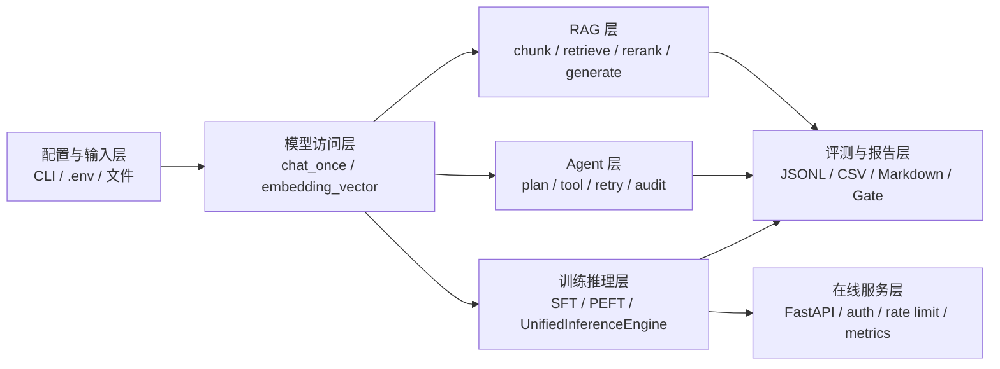
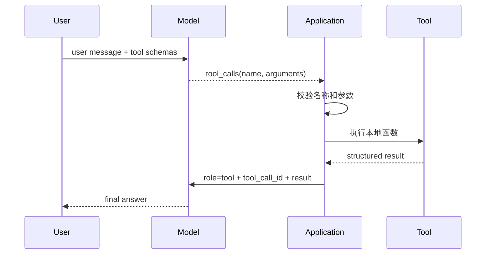
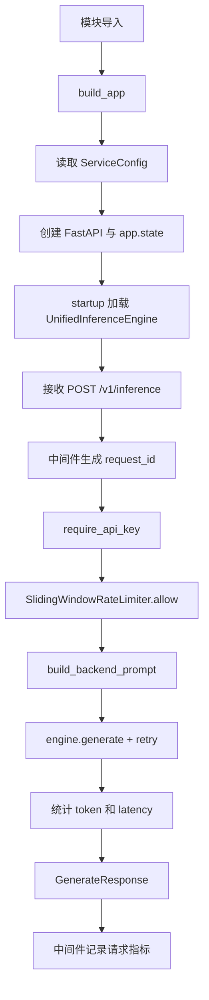

# Day1-Day42 学习总结与 LLM 工程化工具手册

## 1. 文档定位

这份文档的目标不是“照着 README 复述一遍”，而是把整个学习过程中的“知识点、代码结构、实验思路、关键指标、常见坑点”整理成一份可直接复习和作为 LLM 参考手册使用的材料。

适合场景：
- 复习 Day1 到 Day42 的学习主线
- 面试前快速回顾项目脉络
- 后续继续做 RAG / Agent / 微调 / 服务化时查阅
- 当作 LLM 的“工程化工具书”使用

---

## 2. 项目主线：从“会调用模型”到“会做工程闭环”

这个项目整体不是单纯“调用 OpenAI API”，而是把 LLM 能力拆成一条完整链路：

1. 先学会如何调用模型并记录实验结果
2. 再学会如何做结构化输出、评测和质量门禁
3. 再进入 RAG：切片、向量检索、重排、评测、成本优化
4. 再进入 Agent：工具调用、任务编排、失败重试、审计日志
5. 再进入微调与服务化：LoRA / QLoRA、固定评测、统一推理引擎、FastAPI 服务

一句话总结：
> 从“模型调用”走向“可评测、可追踪、可服务化、可演示”的 LLM 工程系统。

---

## 3. 代码地图：当前项目里最值得记住的文件

### 3.1 基础能力层

- [chat_cli.py](chat_cli.py)
  - 最小可运行 LLM CLI
  - 负责：读取系统提示词、发起模型请求、记录 JSONL 日志、处理异常
  - 这是整个项目最基础的“请求-日志-复盘”模板

- [run_day1_experiments.py](run_day1_experiments.py)
  - 让 Day1 不只是手工调用，而是自动做三组对比实验
  - 适合理解“实验脚本”的基本写法

### 3.2 RAG 与检索增强层

- [run_day8_chunking_experiment.py](run_day8_chunking_experiment.py)
  - 文本切分实验
  - 关注 chunk size、overlap、语义连续性、冗余率

- [run_day9_local_vector_search.py](run_day9_local_vector_search.py)
  - 本地向量检索
  - 负责 embedding、FAISS 索引、top-k 检索

- [run_day10_kb_qa_v1.py](run_day10_kb_qa_v1.py)
  - RAG V1：召回 -> 生成
  - 没有 rerank，适合理解最基础检索增强问答流程

- [run_day11_kb_qa_with_citations.py](run_day11_kb_qa_with_citations.py)
  - 引入引用来源，回答必须有可追溯证据

- [run_day12_chunking_strategy_tuning.py](run_day12_chunking_strategy_tuning.py)
  - 对 chunk 策略进行调优

- [run_day13_reranker_comparison.py](run_day13_reranker_comparison.py)
  - 对比无重排 vs 有重排

- [run_day14_rag_v1_demo.py](run_day14_rag_v1_demo.py)
  - 形成可演示的 RAG V1 demo

- [run_day16_offline_eval.py](run_day16_offline_eval.py)
  - 离线评测脚本
  - 评估检索命中率、引用正确率、拒答正确率

- [run_day17_query_rewrite_comparison.py](run_day17_query_rewrite_comparison.py)
  - 比较 Query Rewrite 的效果

- [run_day18_hybrid_retrieval_comparison.py](run_day18_hybrid_retrieval_comparison.py)
  - 关键词 + 向量混合检索对比

- [run_day19_cache_dedup_comparison.py](run_day19_cache_dedup_comparison.py)
  - 缓存和去重优化

- [run_day20_latency_cost_analysis.py](run_day20_latency_cost_analysis.py)
  - 延迟和成本统计

- [run_day21_rag_v2_release.py](run_day21_rag_v2_release.py)
  - 把前几天实验汇总成发布级指标面板

### 3.3 Agent 与工具调用层

- [run_day22_function_calling_basics.py](run_day22_function_calling_basics.py)
  - 最小函数调用闭环

- [run_day23_database_query_assistant.py](run_day23_database_query_assistant.py)
  - 自然语言转 SQL，带只读安全限制

- [run_day24_http_integration_assistant.py](run_day24_http_integration_assistant.py)
  - HTTP 工具调用与联调助手

- [run_day25_task_orchestration.py](run_day25_task_orchestration.py)
  - 三阶段编排：分析 -> 工具执行 -> 总结

- [run_day25_day28_langchain_demo.py](run_day25_day28_langchain_demo.py)
  - LangChain 版 Agent demo

- [run_day26_day28_agent_demo.py](run_day26_day28_agent_demo.py)
  - 增加重试、审计日志、兜底总结的完整 agent demo

### 3.4 微调与服务化层

- [run_day29_lora_qlora_notes.py](run_day29_lora_qlora_notes.py)
  - 介绍 LoRA / QLoRA 概念

- [run_day30_build_instruction_dataset.py](run_day30_build_instruction_dataset.py)
  - 构造后端任务指令数据

- [run_day31_sft_lora_light.py](run_day31_sft_lora_light.py)
  - 小规模 SFT 训练

- [run_day32_sft_before_after_eval.py](run_day32_sft_before_after_eval.py)
  - 固定评测集对比微调前后效果

- [run_day33_inference_acceleration_comparison.py](run_day33_inference_acceleration_comparison.py)
  - 推理加速对比：批处理、并发、量化

- [run_day34_unified_inference_api.py](run_day34_unified_inference_api.py)
  - 统一推理引擎

- [run_day35_sft_experiment_report.py](run_day35_sft_experiment_report.py)
  - 汇总训练 / 评测 / 推理速度结果

- [run_day36_day38_unified_service.py](run_day36_day38_unified_service.py)
  - FastAPI 服务，包含鉴权、限流、重试、监控

---

## 4. 每天学习的核心知识点

### Day1：最小可运行 LLM CLI

核心目标：
- 让模型请求链路真正跑通
- 学会把每次结果写入日志，形成可比较实验

你需要掌握的内容：
- 如何用 Python 调 OpenAI-compatible 接口
- `temperature` / `max_tokens` 的基本作用
- 日志落盘的意义
- 为什么实验要固定问题、固定条件

代码对应：
- [chat_cli.py](chat_cli.py)
- [run_day1_experiments.py](run_day1_experiments.py)

重点记忆：
- `build_client()`：统一初始化 HTTP 客户端和环境变量
- `chat_once()`：封装模型调用、重试、异常处理
- `append_jsonl()`：日志落盘，后续分析与复盘

---

### Day2：参数实验与调参思维

核心目标：
- 理解参数对回答质量和成本的影响

重点知识：
- `temperature` 越低越稳定，越高越发散
- `max_tokens` 越大越完整，但更贵且更容易发散
- 不是“越长越好”，而是“够完整且稳定”最重要

建议复盘方式：
- 观察回答稳定性、结构化程度、可执行性、延迟

---

### Day3-Day4：后端助手与回归评测

Day3：
- 从“聊天”升级到“业务场景助手”
- 一个助手同时支持日志分析和代码解释

Day4：
- 引入评测集与质量门禁
- 把“主观感觉”升级成“可复现测试”

重点知识：
- 评测与实验的可复现性
- 质量门禁的意义
- 能把“是否有用”变成“能否量化”

---

### Day5-Day6：结构化输出与文档生成

Day5：
- 从自由文本回答，切换到“生成 API 文档草稿”

Day6：
- 强制输出 JSON
- 利用校验失败重试，提升输出可用性

重点知识：
- 结构化输出的重要性
- JSON schema 校验思路
- 输出格式错误时如何重试和纠正

---

### Day7：项目包装与展示

核心目标：
- 把前几天的成果整理成可展示、可传播的 demo 包

重点知识：
- 作品集组织方式
- 演示材料的结构化表达

---

### Day8-Day9：Embedding 与向量检索基础

Day8：
- 了解 embedding 的基本意义
- 理解 chunking 对检索效果的影响

Day9：
- 重点开始做本地向量检索
- 建立 FAISS 索引

重点知识：
- 文本切分的必要性
- 向量检索的基本逻辑：编码 -> 索引 -> 检索
- chunk_size 与 overlap 的取舍

关键代码思路：
- `tokenize_words()` + `build_chunks()` + `embedding_vector()` + `IndexFlatIP`

---

### Day10-Day11：RAG V1 与引用来源

Day10：
- 只做召回，不做 rerank
- 将检索片段注入 LLM prompt，生成回答

Day11：
- 强制要求回答带引用来源
- 这是 RAG 的一个关键工程约束：回答必须可追溯

重点知识：
- 检索增强问答的基本流水线：
  1. Query -> Embedding
  2. Top-k 检索
  3. 拼接上下文
  4. LLM 生成回答
- 为什么引用来源很重要：
  - 降低幻觉
  - 提高可信度
  - 便于人工审查

---

### Day12-Day14：切分策略、重排与 RAG demo

Day12：
- 研究 chunk size / overlap 的组合策略

Day13：
- 增加 reranker，让检索更精准

Day14：
- 把前面的能力整合成一个可运行 demo

重点知识：
- 检索质量与上下文长度之间的权衡
- 重排通常比纯向量召回更有效，但成本更高
- RAG 的根本问题不是“能不能回答”，而是“回答是否基于正确证据”

---

### Day15-Day21：评测体系与 RAG 工程化

这部分是整个项目最“工程化”的部分。

Day15：
- 构造离线评测集

Day16：
- 跑离线评测，计算检索命中率、引用正确率、拒答正确率

Day17：
- 比较 Query Rewrite 对检索质量的影响

Day18：
- 研究混合检索（关键词 + 向量）

Day19：
- 引入缓存与去重，优化成本和吞吐

Day20：
- 统计 token、延迟、耗时

Day21：
- 形成发布级指标面板和上线判定标准

重点知识：
- 评测集是可比性的前提
- 离线评测比“看起来好”更重要
- 评测不只是“质量”，还包括成本和延迟
- 生产级 RAG 要同时考虑：
  - 召回质量
  - 引用正确性
  - 失败拒答率
  - 成本
  - 延迟

常见指标：
- `retrieval_hit_rate`
- `citation_correct_rate`
- `insufficient_correct_rate`
- `cache_hit_rate`
- `avg_elapsed_ms`
- `qa_total_tokens_avg`

---

### Day22-Day28：函数调用与 Agent 基础

Day22：
- 学会“模型调用工具”
- 不是只生成文本，而是能够调用本地工具

Day23：
- 把工具调用扩展到 SQL 场景
- 强调“只读 SQL 安全限制”

Day24：
- 让 Agent 能调用 HTTP 接口
- 从“纯聊天”升级为“能联调接口”

Day25：
- 引入任务编排：分析 -> 调工具 -> 汇总

Day26-Day28：
- 增加重试、超时、审计日志、兜底总结

重点知识：
- Agent 的关键不是“多轮聊天”，而是“可执行任务闭环”
- 工具调用的三个关键点：
  1. 规划
  2. 执行
  3. 汇总
- 失败恢复能力是 Agent 工程化的关键

你应当理解的模式：
- `build_plan()`：先规划
- `execute_step_with_retry()`：执行并容错
- `append_audit_event()`：记录审计流
- `summarize_results()`：最后总结

---

### Day29-Day31：LoRA / QLoRA 与小规模 SFT

Day29：
- 理解 LoRA 和 QLoRA 的思想

Day30：
- 采样构造 instruction 数据

Day31：
- 真正做微调，得到 adapter

重点知识：
- LoRA 不需要重训整模型，而是在原模型基础上增加少量低秩增量参数
- QLoRA 是量化版 LoRA，适合资源有限环境
- 微调的意义是“让模型更贴合业务场景及输出格式”

关键术语：
- `adapter/`
- `tokenizer/`
- `checkpoint-XX/`
- `LoRA(r/alpha/dropout)`

---

### Day32-Day35：评测、推理优化与汇总报告

Day32：
- 用固定评测集对比微调前后效果

Day33：
- 在本地对比推理速度策略：
  - fp32
  - batch
  - dynamic_int8
  - concurrency

Day34：
- 把模型推理封装成统一引擎

Day35：
- 把训练、评测、推理速度结果汇总成一份完整实验报告

重点知识：
- 微调前后的效果不能只看主观感觉，要看固定评测集
- 推理性能要同时看：
  - 延迟
  - 吞吐
  - 精度损失
- 一个工程化项目必须把“结果”和“证据”落盘

---

### Day36-Day38：统一服务化

这三天从实验脚本走向服务端能力，重点是把模型能力封装成一个可调用的 API 服务。

重点知识：
- FastAPI 服务结构
- API Key 鉴权
- 滑动窗口限流
- 指数退避重试
- 请求级 metrics
- request_id / 日志链路追踪

对应文件：
- [run_day36_day38_unified_service.py](run_day36_day38_unified_service.py)

核心设计点：
- `ServiceConfig`：统一从环境变量读取配置
- `SlidingWindowRateLimiter`：内存版限流器
- `ServiceMetrics`：聚合监控指标
- `GenerateRequest` / `GenerateResponse`：接口契约
- `ApiError`：统一错误码

---

### Day39-Day42：部署、展示与面试表达

Day39：
- 讲部署方案：隧道、Docker、云主机

Day40：
- 做演示视频与展示稿

Day41：
- 形成项目亮点与技术决策说明

Day42：
- 归纳面试题和简历表达

重点知识：
- 项目不是“写代码”，而是“讲清楚为什么这么做”
- 面试时要讲清楚：
  - 你做了什么
  - 为什么这样做
  - 你的结果是什么
  - 你如何验证效果

---

## 5. 当前项目中最值得反复使用的代码模板

### 5.1 环境变量与路径处理

这是整个项目里非常重要的一个模式：

```python
PROJECT_DIR = Path(__file__).resolve().parent


def resolve_project_path(path_str: str) -> Path:
    path = Path(path_str)
    if path.is_absolute():
        return path
    return PROJECT_DIR / path
```

用途：
- 避免不同工作目录运行时报相对路径错误
- 适合脚本、实验、调试、部署环境切换

### 5.2 JSONL 日志模板

```python
def append_jsonl(path: Path, record: dict) -> None:
    path.parent.mkdir(parents=True, exist_ok=True)
    with path.open("a", encoding="utf-8") as f:
        f.write(json.dumps(record, ensure_ascii=False) + "\n")
```

用途：
- 适合记录实验、调用轨迹、评测样本、审计事件
- 后续很容易做分析、聚合和回溯

### 5.3 CLI 参数模板

```python
parser = argparse.ArgumentParser(description="...")
parser.add_argument("--model", default="...", help="...")
args = parser.parse_args()
```

用途：
- 让脚本可复用、可调参、可自动化

### 5.4 模型调用模板（带重试）

```python
for attempt in range(3):
    try:
        resp = client.post(url, headers=headers, json=payload)
    except Exception:
        ...
```

用途：
- 适合对抗网络抖动和热点模型服务问题

### 5.5 RAG 流水线模板

```text
Query -> Embedding -> Top-k Retrieval -> Context Assembly -> LLM Generation -> Report/Log
```

这是后续要自己做 RAG 时最应该记住的逻辑骨架。

### 5.6 Agent 任务编排模板

```text
Plan -> Tool Execution -> Result Aggregation -> Final Summary
```

这是后续完成多步骤任务时的通用框架。

---

## 6. 项目中最常见的坑与解决思路

### 6.1 缺少 API Key

表现：
- `OPENAI_API_KEY is missing`

解决：
- 检查 [.env](.env) 是否存在
- 若使用本地 Ollama，使用兼容网关并配置占位 key

### 6.2 FAISS 未安装

表现：
- `faiss is not installed`

解决：
- 安装 `faiss-cpu`

### 6.3 overlap >= chunk_size

表现：
- `overlap must be smaller than chunk_size`

解决：
- 保证 `overlap < chunk_size`

### 6.4 Adapter 路径不存在

表现：
- `adapter dir not found`

解决：
- 检查 Day31 训练输出目录是否存在

### 6.5 返回格式不满足预期

表现：
- JSON 解析失败/输出格式无效

解决：
- 使用结构化输出提示词
- 加入重试和校验逻辑

### 6.6 限流或超时

表现：
- 429、timeout、502/503/504

解决：
- 加退避重试
- 设置 timeout
- 将错误码统一下沉到稳定接口

---

## 7. 关键指标速查表

### 7.1 Prompt / 输出相关

- `temperature`
  - 越低越稳定
  - 越高越发散

- `max_tokens`
  - 越大越完整，但更贵、更容易冗长

### 7.2 RAG 相关

- `retrieval_hit_rate`
  - 检索是否命中了正确证据

- `citation_correct_rate`
  - 引用是否正确、是否可追溯

- `insufficient_correct_rate`
  - 在信息不足时，模型是否正确拒答

### 7.3 微调相关

- `train_loss`
  - 训练拟合情况

- `eval_loss`
  - 泛化情况

- `eval_mean_token_accuracy`
  - token 级预测质量

### 7.4 服务化相关

- `success_rate`
- `avg_latency_ms`
- `prompt_tokens`
- `completion_tokens`
- `failure_reasons`

---

## 8. 这套学习路线的“最小闭环”理解

如果你要把整个学习内容压缩成一句话，就记这个闭环：

1. 先会调用模型
2. 再让模型有结构化输出
3. 再让模型能基于外部知识回答
4. 再让模型能调用工具做任务
5. 再让模型变成可评测、可观测、可服务化的系统

这就是从“Prompt 工程”到“LLM 工程”的演进路径。

---

## 9. 面试与简历可直接使用的表达

### 9.1 一句话项目介绍

“构建并交付了一个面向后端场景的 LLM 工程化系统，覆盖了 RAG、Agent、LoRA 微调、固定评测与统一服务化能力。”

### 9.2 适合简历的项目亮点

- 完成从基础模型调用到 RAG 检索增强问答的完整链路
- 构建了离线评测体系，包括命中率、引用正确率、成本与延迟指标
- 实现了工具调用与任务编排 Agent Demo，支持重试和审计日志
- 完成 LoRA / QLoRA 微调实验，并通过固定评测集验证效果
- 把模型能力封装为 FastAPI 服务，具备鉴权、限流、重试与监控

### 9.3 面试高频问题

- 为什么 RAG 需要评测集？
- 为什么引用来源对 RAG 很重要？
- Agent 和普通工具调用有什么区别？
- LoRA 和全量微调的差异是什么？
- 为什么服务层需要做统一错误码和 request_id？

---

## 10. 复习建议：如何高效回看这套内容

建议按下面顺序复习：

1. 先看项目主线图：从调用模型 -> RAG -> Agent -> 微调 -> 服务化
2. 再看关键代码文件：chat_cli、run_day10、run_day22、run_day31、run_day36
3. 再看每一阶段的指标和实验结论
4. 最后把“为什么这么做”写成自己的口头说明

如果你要做“面试前 30 分钟速刷”，优先记这几个文件：
- [chat_cli.py](chat_cli.py)
- [run_day10_kb_qa_v1.py](run_day10_kb_qa_v1.py)
- [run_day22_function_calling_basics.py](run_day22_function_calling_basics.py)
- [run_day31_sft_lora_light.py](run_day31_sft_lora_light.py)
- [run_day36_day38_unified_service.py](run_day36_day38_unified_service.py)

---

## 11. 最后一句话总结

这套 Day1-Day42 的学习，不只是“学会用了一个模型”，而是把 LLM 从“聊天工具”逐步提升为“可验证、可追踪、可服务化、可交付”的工程能力。

---

# 深度工具书篇：原理、代码与工程实践

## 12. 全局架构与数据流

### 12.1 六层架构

当前项目可以按职责分为六层：



| 层次 | 主要输入 | 主要处理 | 主要输出 | 当前代码入口 |
|---|---|---|---|---|
| 配置与输入 | `.env`、CLI、语料、JSON/JSONL | 参数解析、路径解析、文件读取 | Python 对象 | `parse_args()`、`resolve_project_path()` |
| 模型访问 | prompt、model、解码参数 | HTTP 请求、重试、usage 归一化 | 回答、token 用量 | `chat_once()` |
| RAG | corpus、query | 切分、向量化、召回、融合、重排 | hits、answer、citations | Day8-Day21 |
| Agent | 用户目标、工具定义 | 规划、工具执行、重试、总结 | plan、tool result、summary | Day22-Day28 |
| 训练推理 | instruction 数据、base model | LoRA/QLoRA SFT、加载 adapter、生成 | adapter、回答 | Day29-Day35 |
| 在线服务 | HTTP 请求 | 鉴权、限流、推理、监控 | HTTP JSON 响应 | Day36-Day38 |

### 12.2 项目中统一使用的产物格式

| 格式 | 面向对象 | 适合用途 | 项目中的例子 |
|---|---|---|---|
| JSONL | 程序 | 增量写入、逐样本分析、审计 | `logs/*.jsonl` |
| CSV | 表格/脚本 | 横向比较参数和指标 | Day2、Day12、Day16-Day20 |
| Markdown | 人 | 阅读实验结论、展示 | `experiments/*.md` |
| JSON | 程序/API | 严格结构、配置、发布摘要 | Day6、Day15、Day21 |
| FAISS index | 检索器 | 持久化向量索引 | `data/day9_faiss.index` |
| safetensors | 推理引擎 | 保存 LoRA 增量权重 | `outputs/day31_sft_lora/adapter/` |

### 12.3 为什么日志使用 JSONL

`append_jsonl()` 在多个脚本中反复出现：

```python
def append_jsonl(path: Path, record: dict) -> None:
  path.parent.mkdir(parents=True, exist_ok=True)
  with path.open("a", encoding="utf-8") as file:
    file.write(json.dumps(record, ensure_ascii=False) + "\n")
```

逐行解释：

1. `mkdir(parents=True, exist_ok=True)`：父目录不存在时递归创建，已存在时不报错。
2. `open("a")`：追加模式，不覆盖历史实验。
3. `ensure_ascii=False`：中文直接保存，不转成 `\uXXXX`。
4. 每条记录后写 `\n`：形成“一行一个 JSON 对象”的 JSONL。

与普通 JSON 数组相比，JSONL 在程序中途失败时通常仍保留之前成功写入的行，也适合日志流和大数据逐行处理。

---

## 13. Day1-Day7：模型调用、实验与结构化输出详解

### 13.1 Day1 请求链路

[chat_cli.py](chat_cli.py) 的真实调用链：

```text
main
  -> load_dotenv
  -> parse_args
  -> load_system_prompt
  -> build_client
  -> Prompt.ask
  -> chat_once
  -> normalize_usage
  -> append_jsonl
```

`chat_once()` 请求体的核心结构：

```python
payload = {
  "model": model,
  "temperature": temperature,
  "max_tokens": max_tokens,
  "messages": [
    {"role": "system", "content": system_prompt},
    {"role": "user", "content": user_text},
  ],
}
```

字段解释：

- `system`：定义模型角色、边界和回答格式，作用于当前请求。
- `user`：本轮实际问题。
- `temperature`：控制采样分布的平滑程度，不等于严格的“创造力开关”。
- `max_tokens`：限制新增输出 token，不限制输入 token。
- `usage`：服务端返回的输入、输出和总 token，用于成本核算。

代码中的重试只覆盖网络异常和 `502/503/504`，不会盲目重试所有 `4xx`。原因是鉴权失败、参数错误等客户端问题通常重试也不会恢复。

### 13.2 Day2 参数网格实验

Day2 将温度列表与 token 上限列表做组合实验。若温度有 $m$ 个、token 配置有 $n$ 个，则总运行数为：

$$
N = m \times n
$$

实验必须固定问题、模型和 system prompt，否则无法把输出差异归因于待测参数。

建议观察：

| 维度 | 判断问题 |
|---|---|
| 稳定性 | 多次回答是否保持同一结论和结构 |
| 完整性 | 是否覆盖用户要求的关键步骤 |
| 可执行性 | 是否给出命令、顺序、预期现象 |
| 延迟 | 增加输出长度是否带来明显等待 |
| 成本 | 额外 token 是否产生等比例质量收益 |

### 13.3 Day3 业务助手如何构造 prompt

Day3 的 `build_system_prompt(mode)` 根据 `log-analysis` 和 `code-explain` 切换角色，`build_user_text()` 再组合原始输入与补充问题。这体现了两个原则：

1. 稳定规则放 system prompt。
2. 每次变化的数据放 user prompt。

不要把日志内容直接拼进 system prompt，否则角色规则和业务数据混杂，不利于安全控制和复用。

### 13.4 Day4 回归评测与质量门禁

Day4 使用两类启发式检查：

- `section_score()`：检查回答是否包含规定章节。
- `keyword_score()`：检查关键技术词是否覆盖。

通过率公式：

$$
PassRate = \frac{PassCount}{CaseCount}
$$

`--min-pass-rate` 将评测结果转成进程退出码，因此可以接入 CI。低于阈值时返回非零，阻止质量退化的 prompt 或模型进入后续阶段。

局限：关键词出现不等于语义正确；因此这是低成本第一版评测器，不应代替人工评审或语义评测器。

### 13.5 Day5 API 文档生成

Day5 的关键不是“让模型写 Markdown”，而是要求模型区分：

- 已从代码确认的信息。
- 无法从函数签名确认的信息。

未确认内容应进入“待确认信息”，不能由模型猜测。这个模式可以迁移到配置文档、数据库字典和接口迁移说明。

### 13.6 Day6 JSON 提取、校验与重试

Day6 的链路：

```text
模型文本 -> extract_json_payload -> json.loads -> validate_output
                  | 失败
                  v
                构造纠错提示并重试
```

结构化输出要分两层验证：

1. 语法层：能否被 `json.loads()` 解析。
2. 业务层：字段是否存在、类型是否正确、字符串是否非空。

“能解析”不代表“可用”。例如 `{"severity": 123}` 语法正确，但如果 schema 要求字符串，业务校验必须拒绝。

### 13.7 Day7 交付意识

Day7 将代码、输入样例、输出样例和运行说明放进 showcase。工程价值在于别人不需要理解整个仓库，就可以按最短路径复现核心能力。

---

## 14. Day8-Day14：RAG 原理与代码详解

### 14.1 文本切分算法

Day8 的 `build_chunks()` 使用滑动窗口：

```python
step = chunk_size - overlap
start = 0
while start < len(tokens):
  chunk = tokens[start:start + chunk_size]
  chunks.append(chunk)
  start += step
```

例如 `chunk_size=80`、`overlap=20`：

$$
step = 80 - 20 = 60
$$

第一个 chunk 覆盖 token `0..79`，第二个覆盖 `60..139`，相邻块共享 20 个 token。

参数影响：

- chunk 太小：语义被切断，检索粒度细但上下文不足。
- chunk 太大：单块信息过杂，召回噪声和 prompt 成本增加。
- overlap 太小：边界信息容易丢失。
- overlap 太大：索引和上下文重复，成本增加。

代码用 Jaccard 风格的相邻集合重叠统计冗余率：

$$
Redundancy = \frac{\sum_i |C_i \cap C_{i+1}|}{\sum_i |C_i \cup C_{i+1}|}
$$

`lexical_cohesion()` 则把相邻 chunk 看成词频向量，计算余弦相似度：

$$
cos(a,b)=\frac{a\cdot b}{\|a\|_2\|b\|_2}
$$

### 14.2 Embedding 兼容处理

`embedding_vector()` 优先请求 OpenAI-compatible `/embeddings`，本地 Ollama 返回 404 时依次回退：

1. `/api/embeddings`
2. `/api/embed`

这段实现说明“OpenAI-compatible”不保证所有厂商接口完全一致。工程上要验证状态码和响应结构，不能只替换 base URL。

### 14.3 Day9 FAISS 检索

向量先做 L2 归一化：

$$
\hat{x}=\frac{x}{\|x\|_2}
$$

归一化后使用 `faiss.IndexFlatIP` 做内积检索，此时内积等价于余弦相似度：

$$
\hat{x}\cdot\hat{y}=cos(x,y)
$$

`IndexFlatIP` 是精确检索，没有训练阶段，适合当前小语料实验。大规模生产数据可考虑 IVF、HNSW 或外部向量数据库。

### 14.4 Day10 完整 RAG 数据流

[run_day10_kb_qa_v1.py](run_day10_kb_qa_v1.py) 的核心函数：

| 函数 | 输入 | 输出 | 职责 |
|---|---|---|---|
| `chunk_text()` | 原始语料、切分参数 | `list[str]` | 生成检索单元 |
| `retrieve_hits()` | index、query、top_k | 命中列表 | query 向量化并检索 |
| `build_user_text()` | query、hits | prompt 文本 | 将证据注入模型上下文 |
| `chat_once()` | system + user prompt | answer、usage | 基于证据生成答案 |
| `write_report()` | 参数、逐题结果 | Markdown | 形成可读实验报告 |

`retrieve_hits()` 返回的每条命中包含：

```python
{
  "rank": 1,
  "score": 0.71,
  "chunk_id": 5,
  "text": "命中的语料片段"
}
```

`chunk_id` 是证据追踪的关键。只记录文本而不记录稳定 ID，会让引用验证和结果复现变困难。

### 14.5 Day11 引用验证

Day11 的 `validate_answer_with_citations()` 不只检查是否出现“引用来源”字样，还要检查引用片段是否确实是命中 chunk 的连续原文。这样可以防止模型伪造一个格式正确但内容不存在的引用。

重试逻辑不是重新检索，而是将格式错误原因反馈给模型，让同一组证据重新生成合规答案。这避免因候选变化干扰输出校验。

### 14.6 Day12 切分参数选择

Day12 同时提供两种推荐：

- 质量优先：引用合法、信息充分优先。
- 成本优先：在冗余率约束内减少 token。

这体现多目标优化：不存在对所有场景都最优的 chunk 配置。客服知识库、代码检索、长文档问答的最优参数可能不同。

### 14.7 Day13 重排公式

当前实现不是外部 cross-encoder，而是轻量启发式重排：

$$
Score = \alpha S_{semantic}+\beta S_{lexical}+\gamma S_{position}
$$

默认含义：

- `semantic_norm`：向量得分做 min-max 归一化。
- `lexical_overlap`：query 与 chunk token 集的 Jaccard 相似度。
- `position_prior = 1/rank`：保留原始召回顺序的弱先验。

代码将候选集扩大到 `candidate_top_n`，重排后再截取 `top_k`。若一开始只取 top-k，重排没有足够候选空间，价值有限。

### 14.8 Day14 Demo 与生产 RAG 的差距

Day14 已形成可运行闭环，但仍是本地演示：

- 索引每次运行重新构建。
- 语料规模较小。
- 没有租户隔离和文档权限过滤。
- 没有增量索引更新。
- 评测依赖固定小型基准集。

生产化时需要补充持久化索引、文档版本、权限过滤、在线监控和反馈闭环。

---

## 15. Day15-Day21：RAG 评测、优化与发布门禁

### 15.1 Day15 评测集字段为什么这样设计

每条评测样本包含：

| 字段 | 用途 |
|---|---|
| `question` | 固定模型输入 |
| `answerable` | 区分应该回答还是拒答 |
| `reference_answer` | 人工参考，不必要求逐字一致 |
| `answer_keypoints` | 拆解业务要点 |
| `expected_source_keywords` | 低成本验证检索证据 |
| `category` | 分主题分析退化 |
| `difficulty` | 分难度分析能力边界 |

评测集必须包含不可回答样本，否则模型“什么都回答”也可能获得虚假的高覆盖率。

### 15.2 Day16 三个核心指标

可回答样本检索命中率：

$$
RetrievalHitRate=\frac{命中期望关键词的可回答样本数}{可回答样本总数}
$$

引用正确率：

$$
CitationCorrectRate=\frac{引用格式合法且证据正确的样本数}{可回答样本总数}
$$

拒答正确率：

$$
InsufficientCorrectRate=\frac{正确输出信息不足的样本数}{不可回答样本总数}
$$

三者分别定位不同问题：召回失败、生成引用失败、幻觉拒答失败。

### 15.3 Day17 Query Rewrite

Query Rewrite 先把口语化、含糊或上下文依赖的问题改写为检索查询，再进入相同检索链路。对比时必须保留 baseline 分支，只替换检索 query，最终回答仍针对原问题。

风险：改写模型可能改变原意，因此应记录原 query、改写 query 和 `rewrite_changed_rate`，并按样本检查负向案例。

### 15.4 Day18 混合检索与 RRF

关键词检索使用 IDF 加权：

$$
IDF(t)=\log\frac{N+1}{df(t)+1}+1
$$

关键词得分是 query 中命中词的 IDF 权重占比。向量和关键词得分空间不同，因此代码不直接相加原始分数，而采用 RRF：

$$
RRF(d)=w_v\frac{1}{k+rank_v(d)}+w_k\frac{1}{k+rank_k(d)}
$$

RRF 只依赖排名，对不同检索器的分数标度更稳健。

### 15.5 Day19 缓存与去重

缓存 key 通过 `normalize_query_key()` 规范化，减少空白和大小写差异造成的重复计算。缓存适合：

- 相同 query embedding。
- 相同 query 的关键词命中。
- 重复评测中的融合候选。

去重发生在生成前，减少重复 chunk 占用上下文。必须在日志中记录 `avg_dedup_removed`，否则无法证明优化是否真实生效。

注意：本地字典缓存只在单进程内有效，多实例服务需要 Redis 等共享缓存，并增加 TTL、版本号和容量淘汰策略。

### 15.6 Day20 延迟分解与百分位数

平均值容易被少量极慢请求影响，因此同时记录 P50 和 P95：

- P50：一半请求不超过该值，代表典型体验。
- P95：95% 请求不超过该值，代表尾延迟。

端到端耗时应拆成 embedding、retrieval、QA、validation 等阶段。只有分阶段计时，才能判断应优化模型、网络还是检索。

### 15.7 Day21 发布门禁

Day21 从 Day18-Day20 的 CSV 读取指标，通过 `bool_gate()` 和 `gate_line()` 逐项判断阈值，最后给出 `GO/NO-GO`。

门禁应同时包含：

- 下限指标：命中率、引用正确率、拒答正确率。
- 上限指标：平均 token、平均延迟、P95 延迟。

只有质量门禁会导致“效果好但成本失控”；只有成本门禁会导致“便宜但不可用”。

---

## 16. Day22-Day28：Tool Calling 与 Agent 代码详解

### 16.1 Function Calling 的消息闭环



模型只“建议调用”，真正执行工具的是应用程序。应用程序必须验证工具名和参数，不能把模型输出直接当作可信代码执行。

### 16.2 Day22 工具注册与分发

Day22 内置三个工具：

- `add_numbers()`：确定性计算。
- `lookup_service_owner()`：结构化信息查询。
- `search_incident_playbook()`：小型知识查询。

`execute_tool_call()` 是安全边界：解析模型给出的 JSON 参数，通过显式白名单分发到本地函数。未知工具应返回错误，不能动态 `eval()`。

### 16.3 Day23 SQL 安全层

数据库助手的安全措施是叠加的：

1. `validate_readonly_sql()` 只允许 `SELECT/WITH`。
2. 拒绝写操作关键字。
3. SQLite 使用只读连接。
4. `run_readonly_sql()` 限制返回行数。

只靠 prompt 写“不要删除数据”不构成安全控制。真正的约束必须在执行层实施。

生产环境还应使用只读数据库账号、SQL parser、查询超时和扫描行数限制。

### 16.4 Day24 HTTP 工具安全

`ensure_allowed_url()` 校验协议和 host 白名单，避免模型发起任意网络请求。这是在防御 SSRF：攻击者可能诱导 Agent 访问内网管理地址或云元数据地址。

此外还要：

- 设置请求超时。
- 裁剪响应长度。
- 不记录敏感 header。
- 按工具定义允许的方法和参数。

### 16.5 Day25 Planner-Executor-Summarizer

Day25 将 Agent 拆成三部分：

| 阶段 | 函数 | 失败影响 | 降级方式 |
|---|---|---|---|
| 规划 | `build_plan()` | 无法形成执行步骤 | 默认计划 |
| 执行 | `execute_step()` | 某一步无结果 | 记录错误并继续/中断 |
| 总结 | `summarize_results()` | 无法生成自然语言 | 本地模板总结 |

分层的价值是：可以分别测试规划质量、工具正确性和总结质量，而不是把所有逻辑塞进一次模型调用。

### 16.6 Day26-Day28 重试与审计

三天各自的增量职责：

- Day26：为 LLM 调用和工具执行增加超时、最大尝试次数、可重试错误判断与退避。
- Day27：通过 `append_audit_event()` 和统一 `trace_id` 记录规划、每次工具尝试、重试、总结与兜底事件。
- Day28：把计划、执行、审计、兜底和 Markdown 报告包装成可直接演示的统一 CLI 入口。

重试适用于瞬时错误，不适用于参数错误和权限错误。指数退避的一般形式：

$$
delay_n = base \times 2^{n-1}
$$

审计日志至少应包含：

- `trace_id`
- 阶段和事件名
- 工具名与参数摘要
- attempt 编号
- 成功/失败状态
- 错误类型
- 时间戳和耗时

`trace_id` 将规划、工具执行、总结串成同一条链路；`request_id` 通常对应一次 HTTP 请求，两者语义接近但作用域可以不同。

### 16.7 手写 Agent 与 LangChain 的映射

| 手写能力 | LangChain 版实现 |
|---|---|
| plan JSON 解析 | `with_structured_output(Plan)` |
| 工具定义 | `@tool` |
| 工具参数模型 | Pydantic schema |
| 链路审计 | `BaseCallbackHandler` |
| LLM 接入 | `ChatOpenAI` |
| 外围容错 | `retry_call()` |

先手写再使用框架的价值是理解控制流和安全边界，不会把框架 API 误认为 Agent 原理本身。

---

## 17. Day29-Day35：LoRA、SFT、评测与统一推理

### 17.1 LoRA 原理

对原权重矩阵 $W_0$ 不直接更新，而学习低秩增量：

$$
W = W_0 + \Delta W, \quad \Delta W = BA
$$

若原矩阵尺寸为 $d\times k$，低秩矩阵 $A\in\mathbb{R}^{r\times k}$、$B\in\mathbb{R}^{d\times r}$，且 $r\ll min(d,k)$，可训练参数从 $dk$ 降到：

$$
r(d+k)
$$

项目中的 `LoraConfig`：

```python
peft_config = LoraConfig(
  r=args.lora_r,
  lora_alpha=args.lora_alpha,
  lora_dropout=args.lora_dropout,
  bias="none",
  task_type="CAUSAL_LM",
  target_modules="all-linear",
)
```

- `r`：容量与参数量的主要控制项。
- `alpha`：LoRA 更新的缩放系数。
- `dropout`：降低过拟合风险。
- `target_modules`：将 adapter 注入哪些层。

### 17.2 QLoRA

QLoRA 使用 4-bit 量化加载基础模型，同时训练 LoRA adapter。当前代码配置 NF4、double quantization 和计算 dtype。

macOS 无 CUDA 时脚本自动回退 LoRA，这是显式的环境兼容策略，不代表 QLoRA 已在本机执行。

### 17.3 Day30 数据结构

每条指令数据的核心字段：

```json
{
  "instruction": "任务要求",
  "input": "补充上下文",
  "output": "期望回答",
  "tags": ["timeout", "database"]
}
```

训练集与评测集必须在训练前拆分。若同一模板的近重复样本跨集合泄漏，会导致评测结果虚高。

模板合成数据适合验证流程，但真实项目还需要脱敏生产样本、人工审校、去重和类别均衡。

### 17.4 Day31 数据如何进入训练器

`format_example()` 将结构化样本拼成监督文本：

```text
### Instruction
任务要求

### Input
补充上下文

### Response
期望回答
```

随后转换为 Hugging Face `Dataset`，`SFTTrainer` 从 `text` 字段 tokenize 并计算 causal language modeling loss。

关键配置：

- `per_device_train_batch_size`：设备上的实际微批大小。
- `gradient_accumulation_steps`：累计多次梯度再更新。
- 有效 batch size 近似为：

$$
EffectiveBatch = DeviceBatch \times GradAccum \times DeviceCount
$$

- `learning_rate`：每次更新步幅。
- `max_steps`：硬性训练步数上限，可能早于 epoch 结束。
- `max_seq_length`：训练序列上限，越大越耗内存。

### 17.5 Day32 固定评测与质量分

当前启发式质量分：

$$
Quality = 0.6\times SectionScore + 0.4\times KeywordHitRatio
$$

`section_score()` 检查“结论、分析、操作步骤、风险”四个章节；`keyword_hit_ratio()` 检查样本 tags 在回答中的覆盖比例。

它更偏格式遵循和关键词覆盖，不评价事实是否完全正确。报告结论应表述为“在当前启发式指标上提升”，不能扩大为“模型整体能力提升”。

### 17.6 Day33 性能对比

吞吐量：

$$
Throughput = \frac{SampleCount}{ElapsedSeconds}
$$

相对加速比：

$$
Speedup = \frac{BaselineAvgLatency}{CandidateAvgLatency}
$$

四种模式的适用范围：

| 模式 | 适用场景 | 风险/限制 |
|---|---|---|
| 串行 FP32 | 稳定基线 | 慢、内存高 |
| 批处理 FP32 | 离线评测、高吞吐 | 单请求等待可能增加 |
| dynamic INT8 | CPU 内存/速度实验 | 可能有精度损失，adapter 暂不支持 |
| 多 engine 并发 | 多请求模拟 | CPU 资源竞争，内存占用增加 |

### 17.7 Day34 UnifiedInferenceEngine

统一引擎解决三类重复：模型加载、adapter 挂载、生成参数处理。

`load()` 的顺序：

1. 加载 tokenizer，并补齐 `pad_token`。
2. 设置 `padding_side="left"`，适配 decoder-only 批量生成。
3. 加载 FP32 base model。
4. 可选挂载 `PeftModel` adapter。
5. 可选做 dynamic INT8。
6. 切换 `eval()` 并记录 device。

`generate()` 只解码新增 token，而不是将输入 prompt 一并返回：

```python
new_tokens = outputs[index][prompt_length:]
text = tokenizer.decode(new_tokens, skip_special_tokens=True)
```

这是本地 causal model 推理中常见的关键细节。

### 17.8 Day35 汇总层

Day35 不再训练或推理，只消费 Day31、Day32、Day33 日志，分别汇总训练、质量和性能。它体现“计算层”和“报告层”分离：原始日志可以重复生成不同报告，无需重新运行昂贵实验。

---

## 18. Day36-Day38：FastAPI 服务逐段解释

### 18.1 服务启动与请求链路



### 18.2 ServiceConfig

`ServiceConfig` 是配置边界，默认值允许本地演示，`from_env()` 支持部署时覆盖。配置分为：

- Day36：host、port、模型、adapter、推理模式。
- Day37：API keys、限流、重试。
- Day38：日志级别和监控。

生产环境不应保留默认 `dev-api-key`，并应通过密钥管理服务注入，而不是提交到仓库。

### 18.3 SlidingWindowRateLimiter 逐行解释

当前选中的类：

```python
class SlidingWindowRateLimiter:
  def __init__(self, max_requests: int, window_sec: int) -> None:
    self.max_requests = max_requests
    self.window_sec = window_sec
    self._events: dict[str, deque[float]] = defaultdict(deque)
    self._lock = threading.Lock()
```

字段含义：

- `max_requests`：一个窗口内最多允许多少次请求。
- `window_sec`：窗口长度。
- `_events`：按 API key 保存已接受请求的时间戳队列。
- `defaultdict(deque)`：首次出现 key 时自动创建双端队列。
- `_lock`：保护“清理、判断、追加”成为一个原子临界区，避免并发超发。

`allow()` 的执行过程：

```python
now = time.time()
with self._lock:
  queue = self._events[key]
  cutoff = now - self.window_sec
  while queue and queue[0] < cutoff:
    queue.popleft()
  if len(queue) >= self.max_requests:
    return False, 0
  queue.append(now)
  return True, self.max_requests - len(queue)
```

假设限制为 `3 requests / 10 seconds`：

| 当前时间 | 清理后的队列 | 结果 |
|---:|---|---|
| 100 | `[]` | 接受，队列 `[100]` |
| 103 | `[100]` | 接受，队列 `[100,103]` |
| 108 | `[100,103]` | 接受，队列 `[100,103,108]` |
| 109 | `[100,103,108]` | 拒绝 |
| 111 | `[103,108]`，100 已过期 | 接受 |

时间复杂度：每个已接收时间戳最多入队、出队各一次，摊销清理成本为 $O(1)$；单个 key 的空间复杂度上界约为 $O(max\_requests)$。

为什么使用 `deque`：队首过期时间戳可用 `popleft()` 在 $O(1)$ 删除；普通 list 删除首元素是 $O(n)$。

为什么锁住整个流程：若只分别锁 `len()` 和 `append()`，两个线程可能同时看到“还剩一个额度”，然后都追加，导致超过限制。

当前实现边界：

1. 仅单进程内有效，多个 worker/实例各有独立计数。
2. 服务重启后计数清空。
3. 长时间不再使用的 API key 会残留空队列，可能形成 key 空间增长。
4. `time.time()` 可能受系统时钟调整影响；间隔计时更适合 `time.monotonic()`。
5. 返回了 `remaining`，但没有返回精确 `Retry-After`。

生产升级方向：Redis sorted set/Lua 脚本、API gateway 限流、token bucket，或按“用户 + 模型 + 成本权重”限额。

### 18.4 ServiceMetrics

`ServiceMetrics` 同样使用锁，因为 `+=` 和字典更新不是完整业务原子操作。它记录：

- 请求总数、成功和失败数。
- 累计延迟，用于计算平均延迟。
- prompt/completion token。
- 按稳定错误码聚合失败原因。

当前 `/metrics` 是 JSON 快照，适合 demo。生产环境可导出 Prometheus counter/histogram，尤其需要延迟直方图才能计算 P95/P99，而仅有累计延迟只能算平均值。

### 18.5 Pydantic 请求与响应契约

`GenerateRequest` 在进入业务函数前完成参数校验：

- `instruction`：1 到 3000 字符。
- `user_input`：最多 6000 字符。
- `max_new_tokens`：1 到 1024。
- `temperature`：0 到 2。
- `top_p`：0 到 1。

这能防止异常参数直接进入模型，但字符长度不等于 token 长度，因此生产环境仍应在 tokenizer 后检查最大上下文。

### 18.6 ApiError 与异常处理器

统一错误体包含：

```json
{
  "request_id": "...",
  "timestamp_utc": "...",
  "error": {
  "code": "RATE_LIMITED",
  "message": "Too many requests. Please retry later.",
  "retryable": true,
  "details": {}
  }
}
```

HTTP status 面向通用协议，稳定 `code` 面向业务分支。调用方不应解析错误 message 判断逻辑。

未处理异常只返回异常类型，不返回 traceback，避免暴露服务内部路径和实现细节；完整 traceback 只写服务端日志。

### 18.7 中间件与 request_id

中间件为每个请求生成 UUID，记录方法、路径、状态码和延迟，并在响应 header 返回 `x-request-id`。发生问题时，客户端提供 request ID，服务端即可关联日志。

当前实现中 `response = await call_next(request)` 若在异常处理链之外出现异常，后续统计可能不能执行。更稳健的生产实现通常使用 `try/finally` 保证计时，并确认异常中间件顺序。

### 18.8 鉴权、限流和推理顺序

顺序是：

1. 先鉴权，避免匿名请求占用限流状态。
2. 再限流，避免超额请求消耗昂贵模型资源。
3. 再构造 prompt 和统计 token。
4. 最后执行推理。

这是“便宜检查在前、昂贵操作在后”的通用服务设计原则。

### 18.9 推理重试

代码只对文本中含 timeout、temporary、busy、resource 等瞬时错误进行重试。第 $n$ 次失败后的等待：

$$
Backoff_n = retry\_backoff\_ms \times 2^{n-1}
$$

限制：同步路由里使用 `time.sleep()` 会占用执行线程；在高并发异步链路中应使用异步等待或将模型调用放入专用执行池/队列。

### 18.10 健康检查的语义

当前 `/healthz` 返回服务配置，但没有实时调用模型。它更接近 liveness，而不是完整 readiness。

建议生产拆分：

- `/livez`：进程是否活着。
- `/readyz`：模型和 adapter 是否已加载、服务是否可接流量。
- 深度诊断接口：受保护地执行小型推理，仅供运维。

---

## 19. Day39-Day42：部署、展示与面试复盘

### 19.1 三种部署方案取舍

| 方案 | 优点 | 缺点 | 适用场景 |
|---|---|---|---|
| 本地 + Tunnel | 最快获得公网地址 | 依赖本机在线 | Demo、录视频 |
| Docker + 云主机 | 环境可重复、接近生产 | 运维和模型资源成本 | 长期展示、测试环境 |
| PaaS | 部署简单 | 冷启动、资源和文件限制 | CPU 小模型/API 转发 |

### 19.2 上线前验证矩阵

| 测试 | 输入 | 预期 |
|---|---|---|
| 存活检查 | `GET /healthz` | 200 |
| 正常推理 | 合法 key + 合法 body | 200 + answer |
| 缺少鉴权 | 无 `x-api-key` | 401 + `AUTH_MISSING` |
| 错误鉴权 | 错误 key | 401 + `AUTH_INVALID` |
| 参数越界 | `top_p=2` | 422 |
| 限流 | 窗口内超额请求 | 429 + `RATE_LIMITED` |
| 监控 | `GET /metrics` | 计数和 token 有变化 |

### 19.3 面试回答结构

使用 STAR 的工程化变体：

1. 场景：为什么要解决这个问题。
2. 约束：数据、资源、延迟、安全限制是什么。
3. 决策：为什么选择当前技术方案。
4. 实现：关键代码链路是什么。
5. 验证：用什么固定指标证明有效。
6. 局限：当前版本还不能解决什么。
7. 演进：生产化下一步怎么做。

不要只说“用了 RAG、LangChain、LoRA”。应说明可验证结果和技术取舍。

---

## 20. 调试与排错手册

### 20.1 模型 API 故障

| 现象 | 先检查 | 进一步定位 |
|---|---|---|
| 401 | API key、Authorization header | key 是否属于当前 endpoint |
| 404 | base URL 和路由 | Ollama 是否需要 native fallback |
| 429 | 配额、服务限流 | 查看错误体是 quota 还是 rate limit |
| 502/503/504 | 上游状态、模型冷启动 | 使用有限次数退避重试 |
| timeout | 网络、模型大小、生成长度 | 分开测连接和推理耗时 |

### 20.2 RAG 质量故障树

```text
回答错误
├── 检索结果不包含正确证据
│   ├── 语料缺失
│   ├── chunk 边界不合理
│   ├── embedding 不适合语言/领域
│   ├── query 表达不适合检索
│   └── top-k / 混合权重不合理
└── 检索已有正确证据但回答错误
  ├── prompt 未限制基于证据回答
  ├── 上下文过长或重复
  ├── 模型能力不足
  ├── 引用格式不稳定
  └── 解码参数过于发散
```

调试时先看 hits，再看 answer。若 hits 错误，调生成参数没有根治作用。

### 20.3 SFT 故障

| 现象 | 可能原因 | 处理 |
|---|---|---|
| CUDA OOM | batch/序列过大 | 降 batch、max seq，增 grad accumulation |
| loss 不降 | 学习率、数据格式、标签有问题 | 检查格式化样本和少量过拟合测试 |
| train 好 eval 差 | 过拟合或分布不一致 | 增数据、降训练强度、检查拆分 |
| adapter 加载失败 | base model 不一致、路径错误 | 核对 model ID 和 adapter config |
| QLoRA 回退 | 无 CUDA | 在兼容 NVIDIA 环境运行 |

### 20.4 服务故障

按以下顺序定位：

1. `/healthz` 是否正常。
2. startup 日志是否显示模型加载成功。
3. HTTP status 和稳定错误码是什么。
4. 使用 `x-request-id` 查服务日志。
5. `/metrics` 的失败原因是否累积。
6. 判断是鉴权、限流、参数校验还是推理故障。

---

## 21. 测试策略与建议补强

当前项目以实验脚本为主，进一步工程化建议增加以下测试：

### 21.1 单元测试

- `build_chunks()`：边界、空输入、非法 overlap。
- `l2_normalize()`：零向量和普通向量。
- `parse_citations()`：合法、缺失、伪造引用。
- `validate_readonly_sql()`：SELECT、CTE、写操作、注释绕过。
- `SlidingWindowRateLimiter.allow()`：窗口边界与并发请求。
- `quality_score()`：章节和关键词组合。

### 21.2 集成测试

- 使用本地 mock OpenAI-compatible server 验证请求和重试。
- 用临时 SQLite 验证 SQL 助手只读约束。
- 用 FastAPI TestClient 验证鉴权、限流、错误体和 metrics。
- 用固定微型语料验证 RAG 命中和引用。

### 21.3 回归测试原则

1. 固定输入、模型版本、prompt 版本和参数。
2. 原始逐样本结果必须保存。
3. 指标阈值进入自动门禁。
4. 不只测平均分，也检查分类和失败样本。
5. 任何缓存实验都要先验证输出等价性，再比较性能。

---

## 22. LLM 使用本项目时的检索提示模板

可以把下面模板发给 LLM，让它基于当前项目回答问题：

```text
你正在分析 llm-day1 项目。请遵守：
1. 先指出问题属于 Day1-Day42 的哪个阶段。
2. 引用当前脚本中的具体类或函数，不要只讲通用概念。
3. 按“输入 -> 处理 -> 输出 -> 指标 -> 边界”解释。
4. 若建议修改代码，说明对现有日志、报告和下游脚本的兼容影响。
5. 区分当前 demo 实现与生产实现，不夸大能力。
```

针对服务代码：

```text
请解释 run_day36_day38_unified_service.py 中的指定代码。
按以下结构回答：职责、调用位置、状态变化、并发安全、失败路径、时间/空间复杂度、生产局限、测试用例。
```

针对 RAG：

```text
请先检查检索 hits，再分析生成 answer。明确问题属于语料、chunk、embedding、召回、融合、rerank、prompt 或模型中的哪一层，并给出能证伪结论的最小实验。
```

---

## 23. 最终复习清单

下面每个答案都可以作为 60-90 秒面试口述版本。回答时建议先说结论，再结合当前代码说明，最后补充局限。

### 23.1 为什么 `chat_once()` 只重试部分错误？

**标准答案：**

重试只应该处理具有恢复可能性的瞬时故障。当前 [chat_cli.py](chat_cli.py) 对网络异常和 `502/503/504` 最多重试三次，因为它们可能来自临时网络抖动、上游过载或模型冷启动。`401`、`403`、普通 `400` 等通常是 API key、权限或请求参数错误，重复发送相同请求不会恢复，反而增加延迟和负载。因此代码遇到这些错误会直接失败。

生产环境还应增加随机抖动、总时间预算、幂等性判断，并优先按异常类型和状态码分类，而不是只匹配错误文本。

### 23.2 JSON 语法校验和业务 schema 校验有什么区别？

**标准答案：**

语法校验只判断文本是否符合 JSON 文法，例如能否被 `json.loads()` 解析；业务 schema 校验还要判断字段是否存在、类型是否正确、值域是否合法以及字符串是否非空。`{"severity": 123}` 是合法 JSON，但若业务要求 `severity` 为枚举字符串，它仍然不可用。

Day6 先通过 `extract_json_payload()` 和 `json.loads()` 完成语法层校验，再由 `validate_output()` 完成业务层校验，失败后把具体错误反馈给模型重试。生产中可以使用 Pydantic 或 JSON Schema 统一表达约束。

### 23.3 chunk size 和 overlap 如何影响质量与成本？

**标准答案：**

`chunk_size` 决定检索单元的语义范围。过小会切断完整语义，过大则把多个主题混在一起，降低检索精度并增加 prompt token。`overlap` 用于保留边界上下文，过小可能丢失跨边界信息，过大则造成索引、召回上下文和 embedding 成本重复。

Day8 的步长是 $step=chunk\_size-overlap$，并通过冗余率和相邻块 cohesion 比较不同组合；Day12 再结合引用合法率、信息不足率和 token 成本选择质量优先或成本优先方案。参数必须基于真实评测集调优，不能依赖固定经验值。

### 23.4 为什么归一化后内积等价于余弦相似度？

**标准答案：**

余弦相似度定义为：

$$
cos(x,y)=\frac{x\cdot y}{\|x\|_2\|y\|_2}
$$

如果先做 L2 归一化，得到 $\hat{x}=x/\|x\|_2$ 和 $\hat{y}=y/\|y\|_2$，那么：

$$
\hat{x}\cdot\hat{y}=\frac{x\cdot y}{\|x\|_2\|y\|_2}=cos(x,y)
$$

Day9 和 Day10 先调用 `l2_normalize()`，再使用 `faiss.IndexFlatIP` 做最大内积检索，因此排序等价于按余弦相似度排序。零向量必须特殊处理，避免除零。

### 23.5 rerank 为什么要先扩大候选集？

**标准答案：**

召回负责提高 recall，重排负责提高 precision。若向量检索一开始只返回最终的 top-k，真正相关但排在第 $k+1$ 之后的文档已经丢失，重排无法把它救回来。因此 Day13 先召回 `candidate_top_n` 个候选，再结合语义分、词法重叠和位置先验重排，最后截取 top-k。

候选集也不能无限扩大，否则重排成本和噪声上升。生产中应基于评测集比较 recall@N、最终质量和重排延迟。

### 23.6 RRF 为什么比直接相加异构检索分数稳健？

**标准答案：**

向量检索分数、BM25/关键词分数的范围和分布不同，直接相加会让数值尺度较大的检索器支配结果。RRF 使用各检索器内部排名而不是原始分数：

$$
RRF(d)=\sum_i w_i\frac{1}{k+rank_i(d)}
$$

这样不同检索器无需复杂分数校准。Day18 的 `fuse_candidates_rrf()` 分别读取 vector rank 和 keyword rank，再按权重融合。RRF 的局限是丢失了原始分数差距信息，权重和 $k$ 仍需通过评测调优。

### 23.7 为什么评测集必须有不可回答样本？

**标准答案：**

如果评测集只有可回答问题，模型对所有问题都强行回答也可能获得较高覆盖率，却无法测量幻觉和拒答能力。加入 `answerable=false` 样本，可以计算 `insufficient_correct_rate`，验证系统在语料无证据时是否输出“当前信息不足”而不是编造答案。

Day15 显式设计了可回答和不可回答样本，Day16 分别计算检索命中、引用正确和正确拒答。生产评测还应覆盖部分可回答、冲突证据和过期知识。

### 23.8 Agent 工具执行为什么必须有应用层白名单？

**标准答案：**

模型输出是不可信建议，模型不会直接执行函数。应用必须在 `execute_tool_call()` 中验证工具名、参数 schema、权限和调用次数，再通过显式白名单分发。否则攻击者可以通过 prompt injection 诱导模型调用未授权能力，动态执行任意代码或访问敏感资源。

Day22 只允许三个已注册工具，未知工具返回错误；代码没有使用 `eval()`。生产中还要增加用户授权、工具级配额、参数脱敏、人工确认和审计日志。

### 23.9 SQL/HTTP 工具分别有哪些安全边界？

**标准答案：**

SQL 工具在 Day23 中采用多层防护：仅允许 `SELECT/WITH`、拒绝写操作关键字、使用 SQLite 只读连接、限制返回行数。生产中还需要只读数据库账号、SQL AST parser、查询超时、扫描量限制和表/列权限。

HTTP 工具在 Day24 中要求 HTTPS 和 host 白名单、设置 timeout、裁剪响应体。生产中还要防 SSRF、禁止重定向绕过、过滤私网 IP、限制方法和 header，并避免日志记录 token。两类工具共同原则是：安全约束必须在执行层实现，不能只写在 prompt 中。

### 23.10 LoRA 为什么能显著减少可训练参数？

**标准答案：**

LoRA 冻结原权重 $W_0$，只学习低秩增量 $\Delta W=BA$。原矩阵参数量为 $dk$，LoRA 参数量约为 $r(d+k)$；当 $r\ll d,k$ 时，可训练参数和优化器状态显著下降。

Day31 的 `LoraConfig` 使用 `r`、`alpha`、`dropout` 并注入 linear 层，最终只保存 adapter 而不是完整基础模型。代价是容量受低秩假设限制，adapter 加载时必须匹配正确的 base model。

### 23.11 训练 loss 为什么不能代表业务效果？

**标准答案：**

训练 loss 衡量模型对训练 token 分布的拟合程度，降低可能只是记住模板或训练数据，并不保证事实正确、格式符合业务要求或对新问题泛化。过拟合时训练 loss 继续下降，线上效果反而可能变差。

本项目 Day31 看训练和 eval loss 判断训练是否正常；Day32 再用固定业务评测集比较章节遵循和关键词覆盖；Day35 汇总两类证据。更完整的生产评测还要加入人工评分、事实性、安全性和线上反馈。

### 23.12 batch、并发和量化分别解决什么性能问题？

**标准答案：**

- Batch 将多个样本一次送入模型，提高硬件利用率和整体吞吐，适合离线任务，但可能增加单请求排队时间。
- 并发让多个独立请求同时推进，改善多用户吞吐，但会争用 CPU/GPU 和内存，不保证线性加速。
- 量化降低权重精度，从而减少内存和部分硬件上的计算成本，但可能损失精度，并受设备和算子支持限制。

Day33 用同一批固定 prompt 对比串行 FP32、batch FP32、dynamic INT8 和多 engine 并发，使用平均耗时、吞吐和 speedup，而不是预设某种方案一定更快。

### 23.13 `UnifiedInferenceEngine` 隔离了哪些底层细节？

**标准答案：**

它隔离了 tokenizer 初始化、pad token 和左填充配置、基础模型加载、LoRA adapter 挂载、动态量化、device 推断、batch 切分、生成参数以及只解码新增 token。调用方只需要指定模型、adapter 和推理模式，然后调用 `generate()`。

因此 Day33 benchmark、Day34 CLI demo 和 Day36-Day38 FastAPI 服务可以复用同一推理实现，避免三处模型加载逻辑漂移。当前限制是主要面向本地 Hugging Face causal model，尚未抽象流式输出、异步推理和远程后端。

### 23.14 `SlidingWindowRateLimiter` 为什么需要 `deque` 和锁？

**标准答案：**

每个 API key 的请求时间戳按时间递增保存。滑动窗口每次从队首删除过期时间戳，`deque.popleft()` 是 $O(1)$；若使用 list 删除首元素则为 $O(n)$。

锁保证“清理过期记录、检查长度、追加当前时间”是一个原子临界区。没有锁时，两个线程可能同时看到只剩一个额度并都放行，造成超发。当前代码用 `defaultdict(deque)` 管理每个 key 的独立队列，用一个全局锁保证线程安全。

### 23.15 当前限流器为什么不能直接用于多实例生产环境？

**标准答案：**

它把状态保存在当前 Python 进程内存中。多个 Uvicorn worker、容器或主机各自维护独立 `_events`，同一 API key 可以在每个实例分别获得完整额度；服务重启后状态也会丢失。此外还有空 key 残留、系统时钟调整和缺少 `Retry-After` 等问题。

生产环境应将限流放到 API gateway，或使用 Redis + Lua 实现跨实例原子计数，并考虑 token bucket、TTL、租户维度和模型成本权重。

### 23.16 request ID、稳定错误码和 metrics 如何共同定位故障？

**标准答案：**

三者分别解决单请求追踪、程序化分类和整体趋势分析。中间件生成 `request_id` 并返回给客户端，运维可据此查到该请求的完整日志；`ApiError.code` 让客户端和监控稳定地区分 `AUTH_INVALID`、`RATE_LIMITED`、`UPSTREAM_INFERENCE_FAILED`，不依赖易变化的错误文案；`ServiceMetrics` 聚合成功率、延迟、token 和失败原因，发现系统性异常。

典型定位过程是：先从 metrics 看到某类错误激增，再用错误码筛选日志，最后用用户提供的 request ID 还原单次链路。生产中还可接 OpenTelemetry trace、Prometheus 和集中日志平台。

如果这些问题都能结合当前代码回答，而不是只背定义，就已经掌握了这 42 天学习计划的核心工程能力。

---

## 24. Day1-Day42 模拟面试题库

### 24.1 使用方式

每道题建议按以下结构口述：

1. 先用一句话给结论。
2. 说明当前项目如何实现。
3. 给出指标或验证方法。
4. 主动说明局限和生产演进。

### 24.2 Day1：基础模型调用

**面试官：你是如何封装一次 LLM 请求的？为什么不在每个脚本里直接写 HTTP 调用？**

**参考答案：**

我在 `chat_cli.py` 中用 `build_client()` 统一读取 API key、base URL、代理和 timeout，用 `chat_once()` 统一构造 OpenAI-compatible messages、处理状态码、瞬时错误重试和 usage 归一化。后续 Day1-Day28 多个脚本直接复用它，避免鉴权、异常处理和 token 字段在不同脚本里出现不一致。当前是同步 HTTP 客户端，生产高并发场景可以升级为异步客户端、连接池配置和统一熔断器。

### 24.3 Day2：解码参数实验

**面试官：temperature 和 max_tokens 分别影响什么？你如何公平比较？**

**参考答案：**

`temperature` 影响采样分布和输出稳定性，`max_tokens` 限制新增输出长度并影响延迟与成本。公平比较时固定模型、问题和 system prompt，只改变一个或一组待测参数，并将回答、耗时和 token 写入 JSONL/CSV。不能用不同问题比较参数，因为问题难度会成为混杂变量。对故障排查和结构化输出通常使用低温度，但最终值仍应通过任务评测确定。

### 24.4 Day3：后端助手设计

**面试官：如何让同一个助手支持日志分析和代码解释，又避免 prompt 混乱？**

**参考答案：**

我将稳定角色规则和动态业务输入分离。Day3 的 `build_system_prompt(mode)` 按模式选择日志分析或代码解释规范，`build_user_text()` 再注入日志、代码和本次问题。这样模式边界清晰，也方便分别评测。若场景继续增多，我会把每个能力拆成独立 prompt 模板和评测集，而不是在一个 prompt 里堆积大量 if/else 规则。

### 24.5 Day4：回归评测

**面试官：你如何判断修改 prompt 后质量没有退化？**

**参考答案：**

我使用固定 case 集，对每个回答检查规定章节和关键技术词，计算通过率，并通过 `--min-pass-rate` 将阈值映射为非零退出码，适合接入 CI。除了总通过率，还保留逐样本 JSONL，定位是哪一类问题退化。当前是启发式评测器，能做快速回归，但不能替代语义和人工质量评审。

### 24.6 Day5：API 文档生成

**面试官：用 LLM 从代码生成 API 文档时，如何避免它猜测不存在的信息？**

**参考答案：**

关键是明确证据边界：只允许从函数签名和路由定义提取 method、path、参数等已知信息，不能确认的响应码或业务规则放入“待确认信息”。同时保留原始输入和生成报告供审查。生产中还可以用 AST/OpenAPI parser 先结构化提取，再让 LLM 只负责组织语言，减少纯文本推断。

### 24.7 Day6：结构化输出

**面试官：模型经常返回 Markdown 包裹的 JSON，你怎么处理？**

**参考答案：**

Day6 先用 `extract_json_payload()` 提取 JSON 区域，再用 `json.loads()` 做语法校验，之后用 `validate_output()` 做字段、类型和值校验。如果失败，将具体错误作为纠错提示重试，并限制最大次数。更好的生产方案是优先使用服务端原生 structured output 或 function calling，并仍保留应用层 schema 校验，因为模型约束不能代替业务验证。

### 24.8 Day7：Demo 交付

**面试官：一个 LLM 实验怎样才算可交付，而不只是你本机能运行？**

**参考答案：**

至少需要运行说明、依赖、样例输入、预期输出、原始日志和可读报告。Day7 将 Day5-Day6 的输入输出整理到 `showcase/week1_demo`，让别人按最短路径复现。进一步还应固定模型版本、配置快照、随机种子和环境信息，并提供自动验证命令。

### 24.9 Day8：Embedding 与切分

**面试官：你如何选择 chunk size 和 overlap？**

**参考答案：**

我不会只采用经验值，而是用 Day8 的切分脚本比较 chunk 数、平均长度、冗余率、词法 cohesion 和可选 embedding cohesion，再在 Day12 用最终引用率、拒答率和 token 成本验证。选择本质是语义完整性、检索粒度和成本的多目标权衡。还应针对标题、段落、代码函数等文档结构考虑语义切分，而不只使用固定窗口。

### 24.10 Day9：FAISS 检索

**面试官：为什么使用 `IndexFlatIP`，它适合什么规模？**

**参考答案：**

当前语料规模小，`IndexFlatIP` 无需训练且执行精确内积搜索，配合 L2 归一化后等价于余弦相似度，结果容易解释和复现。它的搜索复杂度随向量数线性增长，大规模数据时内存和延迟会成为问题，需要考虑 HNSW、IVF 或向量数据库，并评估 recall 与延迟的取舍。

### 24.11 Day10：RAG V1

**面试官：请描述你实现的最小 RAG 链路。**

**参考答案：**

Day10 先读取语料并用 `chunk_text()` 切分，对每个 chunk 生成 embedding 并加入 FAISS；查询到来后由 `retrieve_hits()` 生成 query embedding，召回 top-k；`build_user_text()` 将 query 和带 `chunk_id` 的证据拼入 prompt；最后用 `chat_once()` 生成回答并写入 JSONL 和 Markdown。V1 的局限是每次重建索引、没有重排和引用强校验。

### 24.12 Day11：引用可追溯

**面试官：回答中出现 `[chunk-3]` 就算引用正确吗？**

**参考答案：**

不算。格式正确不等于证据真实。Day11 的 `validate_answer_with_citations()` 还会检查 chunk ID 是否属于本次 hits，以及引用文本是否是对应 chunk 的连续原文。失败后基于同一组证据重新生成。生产中还要保存文档 ID、版本、页码或 URL，避免 chunk ID 在重建索引后失去稳定含义。

### 24.13 Day12：RAG 参数调优

**面试官：为什么你的切分调优同时给出质量优先和成本优先推荐？**

**参考答案：**

因为 RAG 是多目标优化，不存在唯一最优参数。较大 chunk 和 overlap 可能提高信息完整性，但增加冗余和 token 成本。Day12 的 `choose_recommendations()` 分别按引用合法、信息充分等质量指标，以及冗余约束下的 token 成本排序。业务上线前应根据 SLA 和错误成本决定使用哪一组目标。

### 24.14 Day13：Reranker

**面试官：你的 reranker 是模型重排吗？公式是什么？**

**参考答案：**

当前不是 cross-encoder，而是轻量启发式重排。`rerank_hits()` 将归一化向量得分、query-chunk 词法 Jaccard 重叠和原排名倒数按 $\alpha,\beta,\gamma$ 加权。它成本低、可解释，适合教学和小型实验，但语义交互能力弱。生产可比较 cross-encoder 或 LLM reranker，同时衡量质量收益和额外延迟。

### 24.15 Day14：RAG Demo

**面试官：你的 RAG demo 距离生产系统还有哪些差距？**

**参考答案：**

当前 demo 已支持检索、可选重排、引用和 REPL，但索引每次重建、语料单一、没有增量更新、权限过滤、租户隔离和在线反馈。生产化还需要文档解析与版本管理、持久化向量库、检索缓存、权限前置过滤、监控和评测门禁。

### 24.16 Day15：评测集设计

**面试官：一个好的 RAG 评测样本应包含哪些字段？**

**参考答案：**

本项目包含 question、answerable、reference answer、answer keypoints、expected source keywords、category 和 difficulty。这些字段分别支持固定输入、拒答测试、答案参考、要点覆盖、检索验证和分组分析。还要保证样本来自真实任务分布、没有数据泄漏，并加入难例、冲突证据和不可回答问题。

### 24.17 Day16：离线评测

**面试官：如何区分 RAG 是检索错了还是生成错了？**

**参考答案：**

分层记录指标。先用 `retrieval_hit_rate` 判断 top-k 是否含期望证据；若命中，再看 `citation_correct_rate` 和回答；对不可回答样本看 `insufficient_correct_rate`。hits 未命中时优先排查语料、切分、embedding 和召回；hits 正确而回答错误时再排查 prompt、上下文和模型。不能只看最终答案总分。

### 24.18 Day17：Query Rewrite

**面试官：Query Rewrite 一定能提高召回率吗？**

**参考答案：**

不一定。它可以补全简称、消除口语噪声，但也可能改变原意或丢失关键实体。Day17 对同一评测集同时跑 baseline 和 rewrite，记录改写前后 query、`rewrite_changed_rate` 和下游质量指标。判断依据是逐样本净收益，而不是改写率越高越好。高风险实体查询还应保留原始 query 做多路召回。

### 24.19 Day18：混合检索

**面试官：关键词检索和向量检索各自擅长什么？如何融合？**

**参考答案：**

关键词检索擅长错误码、服务名、专有名词等精确匹配；向量检索擅长同义表达和自然语言语义。Day18 用 IDF 加权关键词匹配和向量召回产生两路排名，再用 RRF 按排名融合，避免直接相加不同尺度分数。权重需要按领域评测，不能默认向量检索始终占主导。

### 24.20 Day19：缓存与去重

**面试官：RAG 缓存时最容易忽略什么？**

**参考答案：**

最容易忽略缓存失效和结果等价性。cache key 除规范化 query 外，还应包含语料/索引版本、embedding 模型、检索参数和权限上下文，否则知识更新或用户权限变化后可能返回旧数据。Day19 当前是单进程实验缓存，并记录命中率与去重数量；生产需使用 TTL、容量淘汰、共享缓存和租户隔离。

### 24.21 Day20：延迟与成本

**面试官：为什么不能只看平均延迟？**

**参考答案：**

平均值会掩盖尾部慢请求。P50 表示典型体验，P95/P99 更能反映用户遇到的长尾。Day20 同时记录端到端、QA、embedding 阶段耗时以及 token 分布，通过分阶段数据定位瓶颈。生产监控还需按模型、输入长度、状态码和租户分组，并使用直方图而不是只累计平均值。

### 24.22 Day21：发布门禁

**面试官：RAG 上线门禁应该包含哪些维度？**

**参考答案：**

必须同时包含质量和资源约束。Day21 对 retrieval hit、citation correctness、citation format、insufficient correctness 设置下限，对平均 token、平均延迟和 P95 设置上限，最后给出 GO/NO-GO。阈值应来自业务风险与基线，不应随意设置；门禁失败还要保留具体失败项，方便针对性修复。

### 24.23 Day22：Function Calling

**面试官：模型调用工具的完整协议是什么？**

**参考答案：**

应用先把工具 schema 和消息发给模型；模型返回 tool call 的名称和 JSON 参数；应用验证并执行本地函数；再把带 `tool_call_id` 的 tool result 回填给模型；模型结合工具结果生成最终回答。模型本身不执行函数。Day22 用显式 `execute_tool_call()` 白名单完成分发，并限制最大工具轮数防止循环。

### 24.24 Day23：数据库助手

**面试官：只在 system prompt 里要求“只读 SQL”够安全吗？**

**参考答案：**

不够，prompt 不是安全边界。Day23 在执行层用 `validate_readonly_sql()` 限制 `SELECT/WITH`、拒绝写关键字，再使用 SQLite 只读连接和返回行数限制。生产中应增加只读数据库账号、AST 解析、超时、扫描成本限制和字段脱敏，形成纵深防御。

### 24.25 Day24：HTTP Agent

**面试官：让 Agent 调 HTTP 接口有什么主要安全风险？**

**参考答案：**

主要风险是 SSRF、敏感数据泄漏、无限响应和长时间阻塞。Day24 用 `ensure_allowed_url()` 限制 HTTPS 和 host 白名单，配置 timeout，并用 `trim_text()` 裁剪响应。生产还要解析并阻止私网 IP、限制重定向和 header、按用户授权工具，并对请求和响应日志脱敏。

### 24.26 Day25：任务编排

**面试官：为什么把 Agent 拆成 Planner、Executor 和 Summarizer？**

**参考答案：**

拆分后职责和失败边界清晰：Planner 只生成结构化步骤，Executor 只执行白名单工具，Summarizer 只消费事实结果生成回答。Day25 因此能分别记录 analysis、tool execution 和 summary，也可以单独为总结失败提供本地 fallback。复杂工作流还可增加状态机、依赖图和人工审批节点。

### 24.27 Day26：重试与超时

**面试官：Agent 中哪些错误应该重试，哪些不应该？**

**参考答案：**

网络超时、临时 5xx、上游 busy 等瞬时错误可有限重试；参数 schema 错误、权限拒绝、未知工具和确定性业务错误不应原样重试。Day26 用可重试错误判断、最大尝试次数和 backoff 包装 LLM 与工具调用。还应设置整个任务的总时间预算，避免每一层重试叠加造成重试风暴。

### 24.28 Day27：审计日志

**面试官：Agent 审计日志和普通应用日志有什么区别？**

**参考答案：**

审计日志强调可追溯的决策和动作，需要记录 trace ID、规划来源、工具名、参数摘要、每次尝试、结果状态、重试与 fallback，而不仅是异常文本。Day27 的 `append_audit_event()` 把一次任务的计划、工具执行和总结串起来。生产还要防篡改、控制保留周期、脱敏并限制访问权限。

### 24.29 Day28：Agent Demo 化

**面试官：为什么 Agent 需要 fallback summary？会不会掩盖错误？**

**参考答案：**

fallback 的目标是在总结模型失败时仍返回已执行步骤和事实结果，避免整个 demo 无输出，但必须明确标记 `summary_source=fallback` 和错误原因，不能伪装成正常模型总结。Day28 同时输出报告、普通日志和审计日志。对高风险操作，fallback 不能替代失败处理，更不能自动继续副作用操作。

### 24.30 Day29：LoRA 与 QLoRA

**面试官：LoRA 和 QLoRA 的核心区别是什么？**

**参考答案：**

两者都训练低秩 adapter；QLoRA 额外以 4-bit 量化形式加载冻结的基础模型，从而进一步降低显存占用，计算通常仍使用更高精度。Day31 在 CUDA 可用时配置 NF4、double quantization 和计算 dtype，无 CUDA 时回退普通 LoRA。QLoRA 的工程复杂度和硬件依赖更高，最终质量和速度必须实测。

### 24.31 Day30：指令数据构造

**面试官：模板合成训练数据有什么风险？**

**参考答案：**

模板数据容易出现表达单一、标签泄漏、近重复和与真实流量分布不一致，模型可能只学会固定格式。Day30 用随机种子生成并拆分 train/eval，适合验证训练链路，但报告明确承认不等价于生产数据。下一步应加入脱敏真实样本、去重、人工审校、类别平衡和困难负例。

### 24.32 Day31：SFT 训练

**面试官：gradient accumulation 解决什么问题？**

**参考答案：**

它在显存只能容纳小 micro-batch 时，累计多次前向/反向梯度后再更新参数，从而模拟更大的有效 batch。有效 batch 约为设备 batch × accumulation steps × 设备数。Day31 将它作为 CLI 参数。它降低瞬时显存压力，但不会减少总计算量，更新间隔变长，学习率也可能需要随有效 batch 调整。

### 24.33 Day32：微调前后评测

**面试官：你如何证明 LoRA adapter 有收益？**

**参考答案：**

在相同 base model、tokenizer、固定评测集和生成参数下，分别运行基础模型和挂载 adapter 的模型，逐样本比较。Day32 的质量分由 60% 章节结构和 40% 标签关键词覆盖组成，并记录 tuned win count。这个结果只能证明当前启发式业务指标上的变化，还需要事实性人工评估和更大真实评测集才能得出更强结论。

### 24.34 Day33：推理加速

**面试官：为什么 CPU 并发可能反而更慢？**

**参考答案：**

多个 engine 会竞争 CPU 核、内存带宽和底层线程池，并增加模型副本内存；如果每个推理本身已使用多线程，外层并发会过度订阅。因此 Day33 不预设并发更快，而是对固定 prompt 实测总耗时和吞吐。生产 benchmark 还应包含预热、重复运行、内存峰值和不同并发度。

### 24.35 Day34：统一推理引擎

**面试官：为什么 tokenizer 对 decoder-only 模型批量生成要设置左填充？**

**参考答案：**

批量序列长度不同，需要 padding。decoder-only 模型通常从序列右端继续生成，如果右填充，较短样本的最后位置可能是 pad，影响生成起点和位置对齐。Day34 设置 `padding_side="left"`，让每个样本的真实最后 token 对齐到右侧，并结合 attention mask 忽略 padding。具体行为仍应遵循模型文档和 chat template。

### 24.36 Day35：实验报告聚合

**面试官：为什么报告脚本不直接重新训练和推理？**

**参考答案：**

训练和推理昂贵，报告属于纯聚合层，应消费已保存的结构化日志。Day35 读取 Day31 训练摘要、Day32 逐样本质量和 Day33 性能指标，生成 Markdown 和摘要 JSONL。这样可以反复调整报告而无需重跑实验，也保证结论可追溯。前提是日志包含版本、参数和运行 ID，避免混入历史结果。

### 24.37 Day36：统一服务层

**面试官：为什么服务启动时预加载模型？**

**参考答案：**

模型加载是高延迟、高内存操作。Day36 在 FastAPI startup 阶段创建并加载 `UnifiedInferenceEngine`，让首个业务请求不承担冷启动，并且加载失败时服务可以尽早暴露问题。代价是启动时间变长，因此 Kubernetes 等环境应区分 liveness 和 readiness，并给模型加载足够启动预算。

### 24.38 Day37：鉴权、限流与重试

**面试官：为什么接口处理顺序是鉴权、限流、再推理？**

**参考答案：**

这是便宜检查在前、昂贵操作在后的原则。先鉴权阻止匿名请求进入业务状态，再按 API key 限流保护有限模型资源，最后才 tokenize 和推理。Day37 的 `require_api_key()`、`SlidingWindowRateLimiter.allow()` 和推理重试按这个顺序执行。生产还应把鉴权和全局限流部分前移到 gateway，并针对不同模型成本设置加权配额。

### 24.39 Day38：可观测性

**面试官：当前 `/metrics` 能计算 P95 延迟吗？为什么？**

**参考答案：**

不能。当前 `ServiceMetrics` 只保存总延迟和请求数，因此只能计算平均值，没有保存延迟分布。计算 P95 需要保存样本或使用 histogram/sketch。生产中我会用 Prometheus Histogram 记录不同 bucket，并按 endpoint、状态码和模型打低基数标签；request ID 放日志或 trace，不应作为 metrics label，否则会造成高基数。

### 24.40 Day39：部署

**面试官：Tunnel、Docker 云主机和 PaaS 怎么选？**

**参考答案：**

Tunnel 启动最快，适合临时演示，但依赖本机；Docker 云主机环境可重复、控制力强，适合长期测试，但需要运维和资源；PaaS 部署简单，但受冷启动、模型下载和 CPU/GPU 限制。Day39 为作品展示优先推荐本地服务加 tunnel；若长期运行，则选择容器化并增加 TLS、密钥管理、探针和集中监控。

### 24.41 Day40：演示视频

**面试官：3-5 分钟内如何展示这个项目，而不是变成代码走读？**

**参考答案：**

先用一句话说明业务问题和完整闭环，再展示三个可验证场景：健康检查、带鉴权推理、metrics 或限流错误；随后用一张架构图说明 RAG/Agent/微调如何进入统一服务；最后展示固定评测或性能数据和局限。代码只打开关键抽象，不逐行念。演示前准备固定输入和 fallback，保证可重复。

### 24.42 Day41：技术决策

**面试官：为什么先做统一推理层，再做 FastAPI 服务？**

**参考答案：**

如果 API 层直接处理 tokenizer、adapter 和量化，模型细节会污染 HTTP 逻辑，benchmark、CLI 和服务还会重复实现。Day34 先用 `UnifiedInferenceEngine` 隔离模型加载和生成，Day36 服务只关注鉴权、限流、错误和监控。这符合关注点分离，也便于单独测试和替换推理后端。

### 24.43 Day42：项目总结与面试表达

**面试官：请用 90 秒介绍这个项目。**

**参考答案：**

这是一个面向后端场景的 LLM 工程化项目。我先从 OpenAI-compatible 模型调用和 JSONL 实验记录开始，随后实现了文本切分、FAISS 向量检索、引用验证、重排、混合检索以及固定评测和发布门禁；然后实现了带 SQL/HTTP 安全限制的工具调用 Agent，并加入规划、重试和审计；最后构造指令数据完成 LoRA SFT，用固定评测集比较微调前后效果，并通过统一推理引擎封装成 FastAPI 服务，加入 API key、滑动窗口限流、稳定错误码、重试和 metrics。项目的重点不是单个模型效果，而是建立了从实验、评测、优化到服务化的可复现闭环。当前局限是数据和评测规模较小、限流与监控仍为单机 demo，下一步会升级共享基础设施和真实业务评测。

### 24.44 通用追问：项目最大的技术不足是什么？

**面试官：你认为这个项目目前最大的技术不足是什么？**

**参考答案：**

我会主动区分 demo 和生产能力。当前主要不足包括：RAG 语料和评测集较小；启发式评测不能完全代表事实质量；Agent 工具范围有限；微调使用模板合成数据和小模型；服务限流、metrics、缓存都是单进程内存实现；没有分布式追踪、持久化队列和线上 A/B。优点是这些边界在报告中明确记录，而且现有代码已经按检索、工具、推理和服务分层，方便逐步替换为生产组件。
