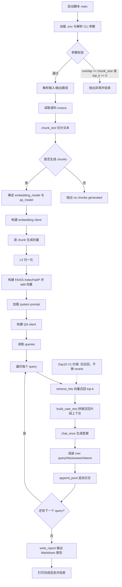
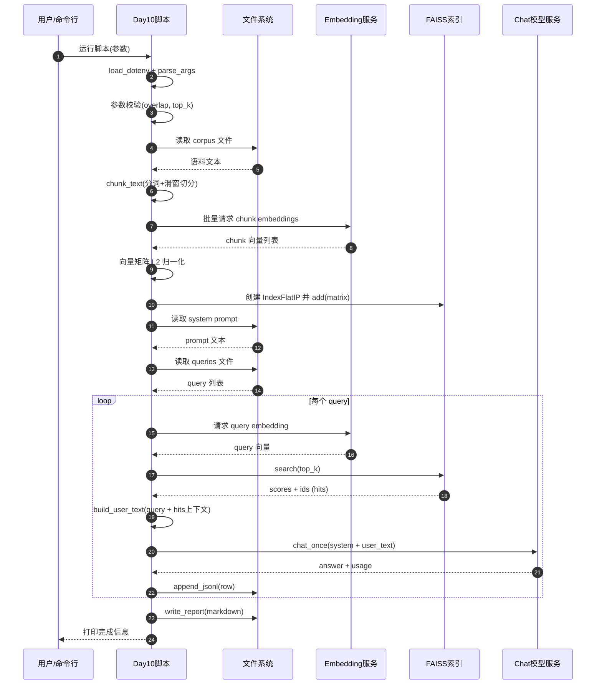

# Day 1 - LLM Hands-on (2 hours)

中文说明：这是 Day 1 的最小实战项目，用 2 小时完成“能跑、能记录、能对比”。

This mini project gives you a runnable LLM CLI + experiment logging template.

## 1) Setup (15-20 min)

中文注释：创建虚拟环境并安装依赖，避免污染全局 Python。

```bash
cd /Users/zhaoyonggng/work/llm-day1
python3 -m venv .venv
source .venv/bin/activate
pip install -r requirements.txt
cp .env.example .env
```

Edit `.env` and fill `OPENAI_API_KEY`.

中文注释：如果你使用兼容网关（非官方端点），可同时配置 `OPENAI_BASE_URL`。

## 2) Run the CLI (15 min)

中文注释：先用默认参数跑通，确认“提问 -> 回复 -> 日志落盘”链路正常。

```bash
python chat_cli.py
```

Optional params:

中文注释：`temperature` 越低越稳定，越高越发散；Day 1 重点是对比差异。

```bash
python chat_cli.py --model gpt-4.1-mini --temperature 0.2 --max-tokens 400
```

## 3) Day 1 experiments (60-70 min)

中文注释：固定同一问题做多组实验，结论才有可比性。

Use one fixed question and run 3 comparisons.

Suggested baseline question:

"给我一个 Go HTTP 服务的错误日志排查清单，按优先级输出，并说明每一步预期现象。"

Try 3 variants:
1. Default system prompt + temperature 0.2
2. Default system prompt + temperature 0.7
3. Rewrite system prompt in `prompts/system_prompt_v1.txt`, then run again

中文注释：建议至少记录“准确性、结构化程度、可执行性”三项打分。

Fill notes in `experiments/experiment_template.md`.

## 4) Output requirements (10-15 min)

中文注释：这 3 个产出是 Day 1 完成标准，缺一项都不算完整闭环。

By end of Day 1, make sure you have:
1. Runnable CLI
2. JSONL logs in `logs/chat_history.jsonl`
3. Completed experiment notes in `experiments/experiment_template.md`

## 5) Troubleshooting

中文注释：先看鉴权和模型名，再看网络与代理配置，能覆盖 90% 启动问题。

- If API auth error: check `OPENAI_API_KEY`.
- If model not found: pass an available model via `--model`.
- If network error: verify your `OPENAI_BASE_URL` or internet/proxy settings.

## 6) Free model option (Ollama)

If your OpenAI account has no quota, you can run a free local model.

1. Install Ollama (https://ollama.com)
2. Pull a small model:

```bash
ollama pull qwen2.5:3b
```

3. Update `.env`:

```dotenv
OPENAI_API_KEY=ollama
OPENAI_BASE_URL=http://127.0.0.1:11434/v1
OPENAI_MODEL=qwen2.5:3b
OPENAI_HTTP_PROXY=
```

4. Run:

```bash
python chat_cli.py
```

Note: local free models are usually weaker than cloud models, but good enough for Day 1 experiments.

## 7) One-command Day 1 experiment runner

You can run all 3 Day 1 comparisons in one command:

```bash
python run_day1_experiments.py
```

Generated files:
- `experiments/day1_run_results.md` (readable report)
- `logs/day1_experiments.jsonl` (raw records)

## 8) Day 2 - Parameter Sweep

Day 2 focuses on one thing: compare how `temperature` and `max_tokens` change output quality, length, and latency.

Run the Day 2 script:

```bash
python run_day2_parameter_sweep.py
```

Optional parameters:

```bash
python run_day2_parameter_sweep.py \
	--temperatures 0.1,0.3,0.7 \
	--max-tokens-list 150,300,450
```

Generated files:
- `experiments/day2_parameter_sweep.md` (readable report)
- `experiments/day2_parameter_sweep.csv` (summary table)
- `logs/day2_parameter_sweep.jsonl` (raw records)

What to observe:
1. Lower `temperature` usually makes answers more stable.
2. Higher `temperature` usually makes answers more diverse but easier to drift.
3. Larger `max_tokens` may improve completeness, but may also increase noise and latency.

## 9) Day 2 Notes - What `temperature` and `max_tokens` mean

### `temperature`

`temperature` controls how conservative or random the model is when choosing the next token.

- Lower `temperature` (for example `0.1` or `0.2`)
	- more stable
	- more deterministic
	- better for troubleshooting checklists, fixed formats, and structured answers

- Higher `temperature` (for example `0.7` or `1.0`)
	- more diverse
	- more creative
	- easier to drift away from the task

Practical recommendation for backend work:
- log analysis / troubleshooting: `0.2 ~ 0.3`
- structured output / checklist: `0.1 ~ 0.2`
- brainstorming: `0.7`

### `max_tokens`

`max_tokens` controls the maximum length of the generated answer.

- Smaller `max_tokens`
	- lower latency
	- lower cost
	- easier to truncate useful content

- Larger `max_tokens`
	- more complete output
	- higher latency
	- easier to become verbose or noisy

Practical recommendation for backend work:
- short answer / quick check: `100 ~ 200`
- checklist / explanation: `200 ~ 400`
- long comparison / detailed reasoning: `400+`

### How to read Day 2 results

When reading `experiments/day2_parameter_sweep.md`, compare each run from 3 angles:

1. Stability: does the answer stay on topic and follow the requested format?
2. Completeness: is the answer too short, or does it cover enough useful steps?
3. Cost-performance: is the extra latency worth the extra content?

Typical pattern:
- increasing `temperature` changes style and stability
- increasing `max_tokens` changes length and latency
- the best setting is usually not the longest answer, but the most stable answer that is still complete enough

## 10) Day 3 - Backend Assistant (Log + Code)

Day 3 goal: build one practical backend assistant with 2 modes.

### Mode A: Log Analysis

```bash
python run_day3_backend_assistant.py \
	--mode log-analysis \
	--input-file inputs/day3_sample.log
```

### Mode B: Code Explain

```bash
python run_day3_backend_assistant.py \
	--mode code-explain \
	--input-file inputs/day3_sample_code.go
```

Optional parameters:

```bash
python run_day3_backend_assistant.py \
	--mode log-analysis \
	--input-file inputs/day3_sample.log \
	--question "优先给最小修复方案" \
	--temperature 0.2 \
	--max-tokens 700
```

Generated files:
- `experiments/day3_backend_assistant.md` (readable report)
- `logs/day3_backend_assistant.jsonl` (raw records)

## 11) Day 4 - Regression Eval (Prompt + Quality Gate)

Day 4 goal: build a lightweight regression benchmark for backend Q&A quality.

Run Day 4 script:

```bash
python run_day4_regression_eval.py
```

Optional parameters:

```bash
python run_day4_regression_eval.py \
	--cases-file inputs/day4_eval_cases.json \
	--temperature 0.2 \
	--max-tokens 700
```

Generated files:
- `experiments/day4_regression_eval.md` (readable report)
- `experiments/day4_regression_eval.csv` (summary table)
- `logs/day4_regression_eval.jsonl` (raw records)

What to observe:
1. Section compliance: whether output follows required backend incident template.
2. Keyword coverage: whether key technical evidence appears in the answer.
3. Stability over reruns: whether pass rate changes when prompt/model changes.

Advanced options:

```bash
# 失败用例自动重试 2 次（会在报告里保留 attempt 对比）
python run_day4_regression_eval.py --retry-failed 2

# 多模型对比（同一套 case 同时评测）
python run_day4_regression_eval.py --models qwen2.5:0.5b,qwen2.5:3b

# 质量门禁：通过率低于 80% 时脚本返回非 0（适合 CI）
python run_day4_regression_eval.py --min-pass-rate 0.8
```

## 12) Day 5 - 接口文档生成器（根据函数签名产出 API 文档草稿）

Day 5 goal: generate API documentation draft from function signatures and route definitions.

Run Day 5 script:

```bash
python run_day5_api_doc_generator.py
```

Optional parameters:

```bash
python run_day5_api_doc_generator.py \
	--input-file inputs/day5_function_signatures.txt \
	--temperature 0.2 \
	--max-tokens 900
```

Generated files:
- `experiments/day5_api_doc_draft.md` (generated API doc draft)
- `logs/day5_api_doc_generator.jsonl` (run metadata)

What to observe:
1. Whether each API includes method/path/params/response/error codes.
2. Whether uncertain fields are listed under "待确认信息" instead of being guessed.

## 13) Day 6 - 输出控制（固定 JSON + 校验失败重试）

Day 6 goal: force the model to return strict JSON, validate schema, and retry on validation failure.

Run Day 6 script:

```bash
python run_day6_json_output_control.py
```

Optional parameters:

```bash
python run_day6_json_output_control.py \
	--input-file inputs/day6_sample_incident.log \
	--max-attempts 3 \
	--temperature 0.0 \
	--max-tokens 800
```

Generated files:
- `experiments/day6_structured_output.json` (final validated JSON)
- `experiments/day6_json_output_control.md` (attempt report)
- `logs/day6_json_output_control.jsonl` (raw per-attempt logs)

What to observe:
1. Whether the output is strict JSON (no extra markdown/text).
2. Whether schema validation passes at attempt 1.
3. If retry was triggered, whether the second/third attempt fixed validation errors.

## 14) Day 7 - 周总结与展示包整理

Day 7 goal: prepare a shareable Week 1 demo package with summary + sample inputs/outputs.

Key deliverables:
- `experiments/day7_weekly_summary.md` (weekly summary)
- `showcase/week1_demo/README.md` (demo guide)
- `showcase/week1_demo/inputs/*` (sample inputs)
- `showcase/week1_demo/outputs/*` (sample outputs)

Quick start:

```bash
cd /Users/zhaoyonggng/work/llm-day1
source .venv/bin/activate
python run_day5_api_doc_generator.py --input-file inputs/day5_function_signatures.txt
python run_day6_json_output_control.py --input-file inputs/day6_sample_incident.log --max-attempts 3
```

## 15) Day 8 - Embedding 原理 + 文本切分实验

Day 8 goal: understand embedding basics and run chunking parameter experiments for RAG preparation.

Study note:
- `experiments/day8_embedding_principles.md`

Run Day 8 script:

```bash
python run_day8_chunking_experiment.py
```

Optional parameters:

```bash
python run_day8_chunking_experiment.py \
	--input-file inputs/day8_corpus_backend_notes.txt \
	--chunk-sizes 80,120,160 \
	--overlaps 10,20,40
```

Optional embedding probe (if your endpoint supports embeddings):

```bash
python run_day8_chunking_experiment.py \
	--enable-embedding-probe \
	--embedding-model text-embedding-3-small
```

Auto recommendation tuning:

```bash
# 成本优先推荐时，限制冗余率上限（默认 0.30）
python run_day8_chunking_experiment.py \
	--enable-embedding-probe \
	--embedding-model nomic-embed-text \
	--max-redundancy-for-cost 0.28
```

If you use Ollama locally, prepare an embedding model first:

```bash
ollama pull nomic-embed-text
```

Then set in `.env`:

```dotenv
OPENAI_BASE_URL=http://127.0.0.1:11434/v1
OPENAI_EMBEDDING_MODEL=nomic-embed-text
```

Note: the Day8 script will auto-fallback to Ollama native `/api/embeddings` if `/v1/embeddings` returns 404.

Generated files:
- `experiments/day8_chunking_experiment.md` (readable report)
- `experiments/day8_chunking_experiment.csv` (summary table)
- `logs/day8_chunking_experiment.jsonl` (raw records)

What to observe:
1. Chunk count vs average chunk length.
2. Redundancy ratio: overlap too high may duplicate too much context.
3. Cohesion score: adjacent chunks should still keep semantic continuity.

## 16) Day 9 - 搭建本地向量检索（FAISS）

Day 9 goal: build a local FAISS index and run semantic retrieval on your backend notes corpus.

Install dependency:

```bash
pip install faiss-cpu numpy
```

Run Day 9 script:

```bash
python run_day9_local_vector_search.py
```

Optional parameters:

```bash
python run_day9_local_vector_search.py \
	--corpus-file inputs/day8_corpus_backend_notes.txt \
	--queries-file inputs/day9_queries.txt \
	--chunk-size 80 \
	--overlap 20 \
	--top-k 3 \
	--embedding-model nomic-embed-text
```

Generated files:
- `data/day9_faiss.index` (FAISS index)
- `data/day9_faiss_meta.json` (index metadata/chunks)
- `experiments/day9_vector_search.md` (retrieval report)
- `logs/day9_vector_search.jsonl` (raw query-hit logs)

What to observe:
1. Top-k results are semantically relevant (not only keyword matching).
2. Different chunk_size/overlap settings change retrieval ranking quality.
3. This is the base for Day10 QA (retrieve first, then answer).

## 17) Day 10 - 知识库问答 V1（仅召回，不重排）

Day 10 goal: generate answers from retrieved chunks only (no reranker in V1).

Run Day 10 script:

```bash
python run_day10_kb_qa_v1.py
```

Optional parameters:

```bash
python run_day10_kb_qa_v1.py \
	--corpus-file inputs/day8_corpus_backend_notes.txt \
	--queries-file inputs/day9_queries.txt \
	--chunk-size 80 \
	--overlap 20 \
	--top-k 3 \
	--embedding-model nomic-embed-text \
	--model qwen2.5:0.5b
```

Generated files:
- `experiments/day10_kb_qa_v1.md` (retrieval + answer report)
- `logs/day10_kb_qa_v1.jsonl` (raw records)

What to observe:
1. 回答是否主要基于召回片段，不出现明显幻觉。
2. top-k 变化是否影响回答完整性。
3. 这是 Day11“加引用来源”的基础版本。

### Day10 业务流程图（Mermaid）



### Day10 时序图（Mermaid）



## 18) Day 11 - 知识库问答 V2（必须附引用来源）

Day 11 goal: answers must include original citation snippets from retrieved chunks.

Run Day 11 script:

```bash
python run_day11_kb_qa_with_citations.py
```

Optional parameters:

```bash
python run_day11_kb_qa_with_citations.py \
	--corpus-file inputs/day8_corpus_backend_notes.txt \
	--queries-file inputs/day9_queries.txt \
	--chunk-size 80 \
	--overlap 20 \
	--top-k 3 \
	--max-attempts 3 \
	--embedding-model nomic-embed-text \
	--model qwen2.5:0.5b
```

Generated files:
- `experiments/day11_kb_qa_with_citations.md` (retrieval + answer + citation validation)
- `logs/day11_kb_qa_with_citations.jsonl` (raw records)

What to observe:
1. 回答是否包含“回答：”与“引用来源：”两个小节。
2. 引用是否使用 `- [chunk-<id>] <原文片段>` 格式。
3. 引用内容是否是对应 chunk 的原文连续子串。
4. 若首次不合规，重试是否修复输出格式。

## 19) Day 12 - 优化切分策略（chunk size、overlap）

Day 12 goal: grid-search chunking parameters and recommend better chunk size / overlap settings.

Run Day 12 script:

```bash
python run_day12_chunking_strategy_tuning.py
```

Optional parameters:

```bash
python run_day12_chunking_strategy_tuning.py \
	--corpus-file inputs/day8_corpus_backend_notes.txt \
	--queries-file inputs/day9_queries.txt \
	--chunk-sizes 60,80,120,160 \
	--overlaps 10,20,40 \
	--top-k 3 \
	--max-attempts 2 \
	--embedding-model nomic-embed-text \
	--model qwen2.5:0.5b
```

Generated files:
- `experiments/day12_chunking_strategy_tuning.md` (推荐结果 + 汇总表)
- `experiments/day12_chunking_strategy_tuning.csv` (结构化汇总)
- `logs/day12_chunking_strategy_tuning.jsonl` (每个参数组合下每个 query 的明细)

What to observe:
1. `citation_valid_rate` 是否稳定接近 1.0。
2. `info_insufficient_rate` 是否随 chunk 策略变化而下降。
3. `avg_total_tokens` 与 `redundancy_ratio` 是否过高，避免成本失控。
4. 比较“质量优先”和“成本优先”推荐是否一致。

## 20) Day 13 - 加入重排（Reranker）并对比效果

Day 13 goal: compare no-rerank vs rerank in the same citation-required QA pipeline.

Run Day 13 script:

```bash
python run_day13_reranker_comparison.py
```

Optional parameters:

```bash
python run_day13_reranker_comparison.py \
	--corpus-file inputs/day8_corpus_backend_notes.txt \
	--queries-file inputs/day9_queries.txt \
	--chunk-size 80 \
	--overlap 20 \
	--top-k 3 \
	--candidate-top-n 8 \
	--rerank-alpha 0.70 \
	--rerank-beta 0.25 \
	--rerank-gamma 0.05 \
	--max-attempts 2 \
	--embedding-model nomic-embed-text \
	--model qwen2.5:0.5b
```

Generated files:
- `experiments/day13_reranker_comparison.md` (无重排 vs 重排的汇总与逐 query 对比)
- `experiments/day13_reranker_comparison.csv` (两种模式汇总指标)
- `logs/day13_reranker_comparison.jsonl` (逐 query 明细，含两种模式)

What to observe:
1. 重排后 `citation_valid_rate` 是否提升。
2. 重排后 `info_insufficient_rate` 是否下降。
3. `avg_attempt_count` 与 `avg_total_tokens` 是否可接受。
4. 每个 query 的 top-k chunk_id 是否发生有意义变化。

## 21) Day 14 - RAG V1 演示版（可回答熟悉的后端文档）

Day 14 goal: complete a runnable RAG V1 demo that can answer your backend documentation.

Run Day 14 script (demo questions):

```bash
python run_day14_rag_v1_demo.py --use-rerank
```

Run with your own questions:

```bash
python run_day14_rag_v1_demo.py \
	--use-rerank \
	--query "如何排查数据库连接池超时？" \
	--query "缓存穿透怎么定位？"
```

Run interactive mode:

```bash
python run_day14_rag_v1_demo.py --use-rerank --repl
```

Optional parameters:

```bash
python run_day14_rag_v1_demo.py \
	--corpus-file inputs/day8_corpus_backend_notes.txt \
	--chunk-size 80 \
	--overlap 20 \
	--top-k 3 \
	--candidate-top-n 8 \
	--rerank-alpha 0.70 \
	--rerank-beta 0.25 \
	--rerank-gamma 0.05 \
	--max-attempts 2 \
	--embedding-model nomic-embed-text \
	--model qwen2.5:0.5b
```

Generated files:
- `experiments/day14_rag_v1_demo.md` (演示问答报告)
- `logs/day14_rag_v1_demo.jsonl` (逐次问答明细)

What to observe:
1. 每次回答是否都包含“引用来源”且引用可追溯。
2. 开启重排后，top-k 片段是否更贴合问题。
3. 对熟悉的后端问题，回答是否更稳定、可执行。

Technical Mermaid diagrams:
- `experiments/day8_day14_technical_mermaid.md` (Day8-Day14 技术细节版流程图/时序图/参数指标图)
