# Day 1 - LLM Hands-on (2 hours)

中文说明：这是 Day 1 的最小实战项目，用 2 小时完成“能跑、能记录、能对比”。

This mini project gives you a runnable LLM CLI + experiment logging template.

## 1) Setup (15-20 min)

中文注释：创建虚拟环境并安装依赖，避免污染全局 Python。

```bash
cd /Users/zhaoyonggng/work/llm-day1
python3 -m venv .venv
source .venv/bin/activate
pip install -r requirements.txt
cp .env.example .env
```

Edit `.env` and fill `OPENAI_API_KEY`.

中文注释：如果你使用兼容网关（非官方端点），可同时配置 `OPENAI_BASE_URL`。

## 2) Run the CLI (15 min)

中文注释：先用默认参数跑通，确认“提问 -> 回复 -> 日志落盘”链路正常。

```bash
python chat_cli.py
```

Optional params:

中文注释：`temperature` 越低越稳定，越高越发散；Day 1 重点是对比差异。

```bash
python chat_cli.py --model gpt-4.1-mini --temperature 0.2 --max-tokens 400
```

## 3) Day 1 experiments (60-70 min)

中文注释：固定同一问题做多组实验，结论才有可比性。

Use one fixed question and run 3 comparisons.

Suggested baseline question:

"给我一个 Go HTTP 服务的错误日志排查清单，按优先级输出，并说明每一步预期现象。"

Try 3 variants:
1. Default system prompt + temperature 0.2
2. Default system prompt + temperature 0.7
3. Rewrite system prompt in `prompts/system_prompt_v1.txt`, then run again

中文注释：建议至少记录“准确性、结构化程度、可执行性”三项打分。

Fill notes in `experiments/experiment_template.md`.

## 4) Output requirements (10-15 min)

中文注释：这 3 个产出是 Day 1 完成标准，缺一项都不算完整闭环。

By end of Day 1, make sure you have:
1. Runnable CLI
2. JSONL logs in `logs/chat_history.jsonl`
3. Completed experiment notes in `experiments/experiment_template.md`

## 5) Troubleshooting

中文注释：先看鉴权和模型名，再看网络与代理配置，能覆盖 90% 启动问题。

- If API auth error: check `OPENAI_API_KEY`.
- If model not found: pass an available model via `--model`.
- If network error: verify your `OPENAI_BASE_URL` or internet/proxy settings.

## 6) Free model option (Ollama)

If your OpenAI account has no quota, you can run a free local model.

1. Install Ollama (https://ollama.com)
2. Pull a small model:

```bash
ollama pull qwen2.5:3b
```

3. Update `.env`:

```dotenv
OPENAI_API_KEY=ollama
OPENAI_BASE_URL=http://127.0.0.1:11434/v1
OPENAI_MODEL=qwen2.5:3b
OPENAI_HTTP_PROXY=
```

4. Run:

```bash
python chat_cli.py
```

Note: local free models are usually weaker than cloud models, but good enough for Day 1 experiments.

## 7) One-command Day 1 experiment runner

You can run all 3 Day 1 comparisons in one command:

```bash
python run_day1_experiments.py
```

Generated files:
- `experiments/day1_run_results.md` (readable report)
- `logs/day1_experiments.jsonl` (raw records)

## 8) Day 2 - Parameter Sweep

Day 2 focuses on one thing: compare how `temperature` and `max_tokens` change output quality, length, and latency.

Run the Day 2 script:

```bash
python run_day2_parameter_sweep.py
```

Optional parameters:

```bash
python run_day2_parameter_sweep.py \
	--temperatures 0.1,0.3,0.7 \
	--max-tokens-list 150,300,450
```

Generated files:
- `experiments/day2_parameter_sweep.md` (readable report)
- `experiments/day2_parameter_sweep.csv` (summary table)
- `logs/day2_parameter_sweep.jsonl` (raw records)

What to observe:
1. Lower `temperature` usually makes answers more stable.
2. Higher `temperature` usually makes answers more diverse but easier to drift.
3. Larger `max_tokens` may improve completeness, but may also increase noise and latency.

## 9) Day 2 Notes - What `temperature` and `max_tokens` mean

### `temperature`

`temperature` controls how conservative or random the model is when choosing the next token.

- Lower `temperature` (for example `0.1` or `0.2`)
	- more stable
	- more deterministic
	- better for troubleshooting checklists, fixed formats, and structured answers

- Higher `temperature` (for example `0.7` or `1.0`)
	- more diverse
	- more creative
	- easier to drift away from the task

Practical recommendation for backend work:
- log analysis / troubleshooting: `0.2 ~ 0.3`
- structured output / checklist: `0.1 ~ 0.2`
- brainstorming: `0.7`

### `max_tokens`

`max_tokens` controls the maximum length of the generated answer.

- Smaller `max_tokens`
	- lower latency
	- lower cost
	- easier to truncate useful content

- Larger `max_tokens`
	- more complete output
	- higher latency
	- easier to become verbose or noisy

Practical recommendation for backend work:
- short answer / quick check: `100 ~ 200`
- checklist / explanation: `200 ~ 400`
- long comparison / detailed reasoning: `400+`

### How to read Day 2 results

When reading `experiments/day2_parameter_sweep.md`, compare each run from 3 angles:

1. Stability: does the answer stay on topic and follow the requested format?
2. Completeness: is the answer too short, or does it cover enough useful steps?
3. Cost-performance: is the extra latency worth the extra content?

Typical pattern:
- increasing `temperature` changes style and stability
- increasing `max_tokens` changes length and latency
- the best setting is usually not the longest answer, but the most stable answer that is still complete enough

## 10) Day 3 - Backend Assistant (Log + Code)

Day 3 goal: build one practical backend assistant with 2 modes.

### Mode A: Log Analysis

```bash
python run_day3_backend_assistant.py \
	--mode log-analysis \
	--input-file inputs/day3_sample.log
```

### Mode B: Code Explain

```bash
python run_day3_backend_assistant.py \
	--mode code-explain \
	--input-file inputs/day3_sample_code.go
```

Optional parameters:

```bash
python run_day3_backend_assistant.py \
	--mode log-analysis \
	--input-file inputs/day3_sample.log \
	--question "优先给最小修复方案" \
	--temperature 0.2 \
	--max-tokens 700
```

Generated files:
- `experiments/day3_backend_assistant.md` (readable report)
- `logs/day3_backend_assistant.jsonl` (raw records)

## 11) Day 4 - Regression Eval (Prompt + Quality Gate)

Day 4 goal: build a lightweight regression benchmark for backend Q&A quality.

Run Day 4 script:

```bash
python run_day4_regression_eval.py
```

Optional parameters:

```bash
python run_day4_regression_eval.py \
	--cases-file inputs/day4_eval_cases.json \
	--temperature 0.2 \
	--max-tokens 700
```

Generated files:
- `experiments/day4_regression_eval.md` (readable report)
- `experiments/day4_regression_eval.csv` (summary table)
- `logs/day4_regression_eval.jsonl` (raw records)

What to observe:
1. Section compliance: whether output follows required backend incident template.
2. Keyword coverage: whether key technical evidence appears in the answer.
3. Stability over reruns: whether pass rate changes when prompt/model changes.

Advanced options:

```bash
# 失败用例自动重试 2 次（会在报告里保留 attempt 对比）
python run_day4_regression_eval.py --retry-failed 2

# 多模型对比（同一套 case 同时评测）
python run_day4_regression_eval.py --models qwen2.5:0.5b,qwen2.5:3b

# 质量门禁：通过率低于 80% 时脚本返回非 0（适合 CI）
python run_day4_regression_eval.py --min-pass-rate 0.8
```

## 12) Day 5 - 接口文档生成器（根据函数签名产出 API 文档草稿）

Day 5 goal: generate API documentation draft from function signatures and route definitions.

Run Day 5 script:

```bash
python run_day5_api_doc_generator.py
```

Optional parameters:

```bash
python run_day5_api_doc_generator.py \
	--input-file inputs/day5_function_signatures.txt \
	--temperature 0.2 \
	--max-tokens 900
```

Generated files:
- `experiments/day5_api_doc_draft.md` (generated API doc draft)
- `logs/day5_api_doc_generator.jsonl` (run metadata)

What to observe:
1. Whether each API includes method/path/params/response/error codes.
2. Whether uncertain fields are listed under "待确认信息" instead of being guessed.

## 13) Day 6 - 输出控制（固定 JSON + 校验失败重试）

Day 6 goal: force the model to return strict JSON, validate schema, and retry on validation failure.

Run Day 6 script:

```bash
python run_day6_json_output_control.py
```

Optional parameters:

```bash
python run_day6_json_output_control.py \
	--input-file inputs/day6_sample_incident.log \
	--max-attempts 3 \
	--temperature 0.0 \
	--max-tokens 800
```

Generated files:
- `experiments/day6_structured_output.json` (final validated JSON)
- `experiments/day6_json_output_control.md` (attempt report)
- `logs/day6_json_output_control.jsonl` (raw per-attempt logs)

What to observe:
1. Whether the output is strict JSON (no extra markdown/text).
2. Whether schema validation passes at attempt 1.
3. If retry was triggered, whether the second/third attempt fixed validation errors.

## 14) Day 7 - 周总结与展示包整理

Day 7 goal: prepare a shareable Week 1 demo package with summary + sample inputs/outputs.

Key deliverables:
- `experiments/day7_weekly_summary.md` (weekly summary)
- `showcase/week1_demo/README.md` (demo guide)
- `showcase/week1_demo/inputs/*` (sample inputs)
- `showcase/week1_demo/outputs/*` (sample outputs)

Quick start:

```bash
cd /Users/zhaoyonggng/work/llm-day1
source .venv/bin/activate
python run_day5_api_doc_generator.py --input-file inputs/day5_function_signatures.txt
python run_day6_json_output_control.py --input-file inputs/day6_sample_incident.log --max-attempts 3
```

## 15) Day 8 - Embedding 原理 + 文本切分实验

Day 8 goal: understand embedding basics and run chunking parameter experiments for RAG preparation.

Study note:
- `experiments/day8_embedding_principles.md`

Run Day 8 script:

```bash
python run_day8_chunking_experiment.py
```

Optional parameters:

```bash
python run_day8_chunking_experiment.py \
	--input-file inputs/day8_corpus_backend_notes.txt \
	--chunk-sizes 80,120,160 \
	--overlaps 10,20,40
```

Optional embedding probe (if your endpoint supports embeddings):

```bash
python run_day8_chunking_experiment.py \
	--enable-embedding-probe \
	--embedding-model text-embedding-3-small
```

Auto recommendation tuning:

```bash
# 成本优先推荐时，限制冗余率上限（默认 0.30）
python run_day8_chunking_experiment.py \
	--enable-embedding-probe \
	--embedding-model nomic-embed-text \
	--max-redundancy-for-cost 0.28
```

If you use Ollama locally, prepare an embedding model first:

```bash
ollama pull nomic-embed-text
```

Then set in `.env`:

```dotenv
OPENAI_BASE_URL=http://127.0.0.1:11434/v1
OPENAI_EMBEDDING_MODEL=nomic-embed-text
```

Note: the Day8 script will auto-fallback to Ollama native `/api/embeddings` if `/v1/embeddings` returns 404.

Generated files:
- `experiments/day8_chunking_experiment.md` (readable report)
- `experiments/day8_chunking_experiment.csv` (summary table)
- `logs/day8_chunking_experiment.jsonl` (raw records)

What to observe:
1. Chunk count vs average chunk length.
2. Redundancy ratio: overlap too high may duplicate too much context.
3. Cohesion score: adjacent chunks should still keep semantic continuity.

## 16) Day 9 - 搭建本地向量检索（FAISS）

Day 9 goal: build a local FAISS index and run semantic retrieval on your backend notes corpus.

Install dependency:

```bash
pip install faiss-cpu numpy
```

Run Day 9 script:

```bash
python run_day9_local_vector_search.py
```

Optional parameters:

```bash
python run_day9_local_vector_search.py \
	--corpus-file inputs/day8_corpus_backend_notes.txt \
	--queries-file inputs/day9_queries.txt \
	--chunk-size 80 \
	--overlap 20 \
	--top-k 3 \
	--embedding-model nomic-embed-text
```

Generated files:
- `data/day9_faiss.index` (FAISS index)
- `data/day9_faiss_meta.json` (index metadata/chunks)
- `experiments/day9_vector_search.md` (retrieval report)
- `logs/day9_vector_search.jsonl` (raw query-hit logs)

What to observe:
1. Top-k results are semantically relevant (not only keyword matching).
2. Different chunk_size/overlap settings change retrieval ranking quality.
3. This is the base for Day10 QA (retrieve first, then answer).

## 17) Day 10 - 知识库问答 V1（仅召回，不重排）

Day 10 goal: generate answers from retrieved chunks only (no reranker in V1).

Run Day 10 script:

```bash
python run_day10_kb_qa_v1.py
```

Optional parameters:

```bash
python run_day10_kb_qa_v1.py \
	--corpus-file inputs/day8_corpus_backend_notes.txt \
	--queries-file inputs/day9_queries.txt \
	--chunk-size 80 \
	--overlap 20 \
	--top-k 3 \
	--embedding-model nomic-embed-text \
	--model qwen2.5:0.5b
```

Generated files:
- `experiments/day10_kb_qa_v1.md` (retrieval + answer report)
- `logs/day10_kb_qa_v1.jsonl` (raw records)

What to observe:
1. 回答是否主要基于召回片段，不出现明显幻觉。
2. top-k 变化是否影响回答完整性。
3. 这是 Day11“加引用来源”的基础版本。

### Day10 业务流程图（Mermaid）

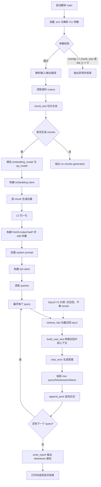
```mermaid
flowchart TD
	A[启动脚本 main] --> B[加载 .env 与解析 CLI 参数]
	B --> C{参数校验}
	C -->|overlap >= chunk_size 或 top_k <= 0| X[抛出异常并结束]
	C -->|通过| D[解析输入/输出路径]
	D --> E[读取语料 corpus]
	E --> F[chunk_text 切分文本]
	F --> G{是否生成 chunks}
	G -->|否| Y[抛出 no chunks generated]
	G -->|是| H[确定 embedding_model 与 qa_model]
	H --> I[构建 embedding client]
	I --> J[逐 chunk 生成向量]
	J --> K[L2 归一化]
	K --> L[构建 FAISS IndexFlatIP 并 add 向量]
	L --> M[加载 system prompt]
	M --> N[构建 QA client]
	N --> O[读取 queries]
	O --> P[遍历每个 query]

	P --> Q[retrieve_hits 向量召回 top-k]
	Q --> R[build_user_text 拼接召回片段上下文]
	R --> S[chat_once 生成答案]
	S --> T[组装 row: query/hits/answer/tokens]
	T --> U[append_jsonl 追加日志]
	U --> V{还有下一个 query?}
	V -->|是| P
	V -->|否| W[write_report 输出 Markdown 报告]
	W --> Z[打印完成信息并结束]

	note1[Day10 V1 约束: 仅召回，不做 rerank] -.-> Q
```

### Day10 时序图（Mermaid）

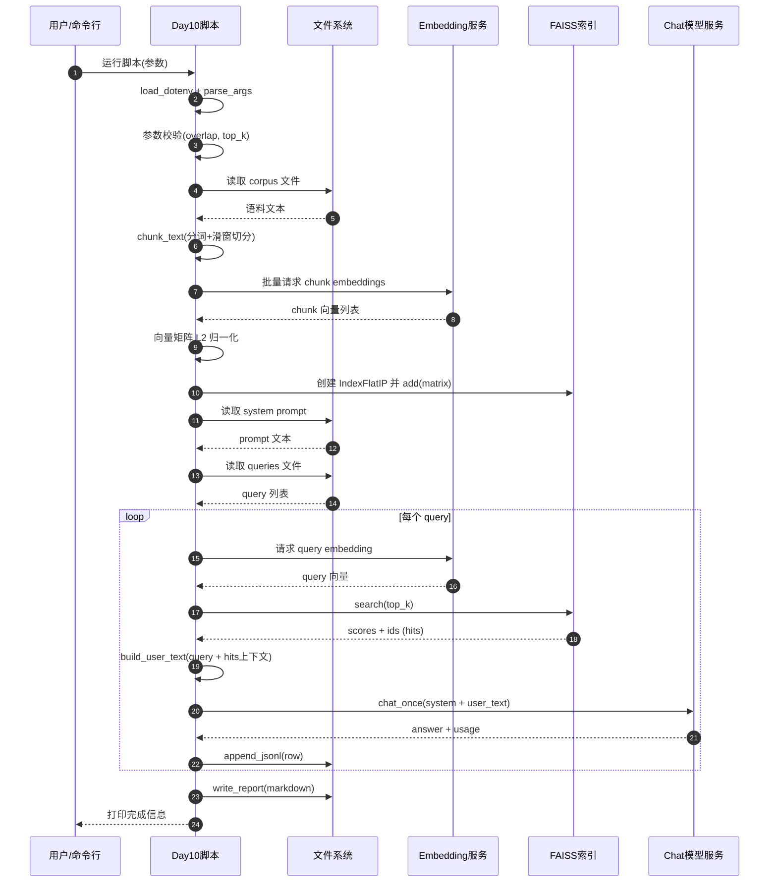
```mermaid
sequenceDiagram
	autonumber
	participant U as 用户/命令行
	participant S as Day10脚本
	participant FS as 文件系统
	participant EMB as Embedding服务
	participant F as FAISS索引
	participant QA as Chat模型服务

	U->>S: 运行脚本(参数)
	S->>S: load_dotenv + parse_args
	S->>S: 参数校验(overlap, top_k)

	S->>FS: 读取 corpus 文件
	FS-->>S: 语料文本
	S->>S: chunk_text(分词+滑窗切分)

	S->>EMB: 批量请求 chunk embeddings
	EMB-->>S: chunk 向量列表
	S->>S: 向量矩阵 L2 归一化
	S->>F: 创建 IndexFlatIP 并 add(matrix)

	S->>FS: 读取 system prompt
	FS-->>S: prompt 文本
	S->>FS: 读取 queries 文件
	FS-->>S: query 列表

	loop 每个 query
		S->>EMB: 请求 query embedding
		EMB-->>S: query 向量
		S->>F: search(top_k)
		F-->>S: scores + ids (hits)
		S->>S: build_user_text(query + hits上下文)
		S->>QA: chat_once(system + user_text)
		QA-->>S: answer + usage
		S->>FS: append_jsonl(row)
	end

	S->>FS: write_report(markdown)
	S-->>U: 打印完成信息
```

## 18) Day 11 - 知识库问答 V2（必须附引用来源）

Day 11 goal: answers must include original citation snippets from retrieved chunks.

Run Day 11 script:

```bash
python run_day11_kb_qa_with_citations.py
```

Optional parameters:

```bash
python run_day11_kb_qa_with_citations.py \
	--corpus-file inputs/day8_corpus_backend_notes.txt \
	--queries-file inputs/day9_queries.txt \
	--chunk-size 80 \
	--overlap 20 \
	--top-k 3 \
	--max-attempts 3 \
	--embedding-model nomic-embed-text \
	--model qwen2.5:0.5b
```

Generated files:
- `experiments/day11_kb_qa_with_citations.md` (retrieval + answer + citation validation)
- `logs/day11_kb_qa_with_citations.jsonl` (raw records)

What to observe:
1. 回答是否包含“回答：”与“引用来源：”两个小节。
2. 引用是否使用 `- [chunk-<id>] <原文片段>` 格式。
3. 引用内容是否是对应 chunk 的原文连续子串。
4. 若首次不合规，重试是否修复输出格式。

## 19) Day 12 - 优化切分策略（chunk size、overlap）

Day 12 goal: grid-search chunking parameters and recommend better chunk size / overlap settings.

Run Day 12 script:

```bash
python run_day12_chunking_strategy_tuning.py
```

Optional parameters:

```bash
python run_day12_chunking_strategy_tuning.py \
	--corpus-file inputs/day8_corpus_backend_notes.txt \
	--queries-file inputs/day9_queries.txt \
	--chunk-sizes 60,80,120,160 \
	--overlaps 10,20,40 \
	--top-k 3 \
	--max-attempts 2 \
	--embedding-model nomic-embed-text \
	--model qwen2.5:0.5b
```

Generated files:
- `experiments/day12_chunking_strategy_tuning.md` (推荐结果 + 汇总表)
- `experiments/day12_chunking_strategy_tuning.csv` (结构化汇总)
- `logs/day12_chunking_strategy_tuning.jsonl` (每个参数组合下每个 query 的明细)

What to observe:
1. `citation_valid_rate` 是否稳定接近 1.0。
2. `info_insufficient_rate` 是否随 chunk 策略变化而下降。
3. `avg_total_tokens` 与 `redundancy_ratio` 是否过高，避免成本失控。
4. 比较“质量优先”和“成本优先”推荐是否一致。

## 20) Day 13 - 加入重排（Reranker）并对比效果

Day 13 goal: compare no-rerank vs rerank in the same citation-required QA pipeline.

Run Day 13 script:

```bash
python run_day13_reranker_comparison.py
```

Optional parameters:

```bash
python run_day13_reranker_comparison.py \
	--corpus-file inputs/day8_corpus_backend_notes.txt \
	--queries-file inputs/day9_queries.txt \
	--chunk-size 80 \
	--overlap 20 \
	--top-k 3 \
	--candidate-top-n 8 \
	--rerank-alpha 0.70 \
	--rerank-beta 0.25 \
	--rerank-gamma 0.05 \
	--max-attempts 2 \
	--embedding-model nomic-embed-text \
	--model qwen2.5:0.5b
```

Generated files:
- `experiments/day13_reranker_comparison.md` (无重排 vs 重排的汇总与逐 query 对比)
- `experiments/day13_reranker_comparison.csv` (两种模式汇总指标)
- `logs/day13_reranker_comparison.jsonl` (逐 query 明细，含两种模式)

What to observe:
1. 重排后 `citation_valid_rate` 是否提升。
2. 重排后 `info_insufficient_rate` 是否下降。
3. `avg_attempt_count` 与 `avg_total_tokens` 是否可接受。
4. 每个 query 的 top-k chunk_id 是否发生有意义变化。

## 21) Day 14 - RAG V1 演示版（可回答熟悉的后端文档）

Day 14 goal: complete a runnable RAG V1 demo that can answer your backend documentation.

Run Day 14 script (demo questions):

```bash
python run_day14_rag_v1_demo.py --use-rerank
```

Run with your own questions:

```bash
python run_day14_rag_v1_demo.py \
	--use-rerank \
	--query "如何排查数据库连接池超时？" \
	--query "缓存穿透怎么定位？"
```

Run interactive mode:

```bash
python run_day14_rag_v1_demo.py --use-rerank --repl
```

Optional parameters:

```bash
python run_day14_rag_v1_demo.py \
	--corpus-file inputs/day8_corpus_backend_notes.txt \
	--chunk-size 80 \
	--overlap 20 \
	--top-k 3 \
	--candidate-top-n 8 \
	--rerank-alpha 0.70 \
	--rerank-beta 0.25 \
	--rerank-gamma 0.05 \
	--max-attempts 2 \
	--embedding-model nomic-embed-text \
	--model qwen2.5:0.5b
```

Generated files:
- `experiments/day14_rag_v1_demo.md` (演示问答报告)
- `logs/day14_rag_v1_demo.jsonl` (逐次问答明细)

What to observe:
1. 每次回答是否都包含“引用来源”且引用可追溯。
2. 开启重排后，top-k 片段是否更贴合问题。
3. 对熟悉的后端问题，回答是否更稳定、可执行。

Technical Mermaid diagrams:
- `experiments/day8_day14_technical_mermaid.md` (Day8-Day14 技术细节版流程图/时序图/参数指标图)

Business/Report Mermaid diagrams:
- `experiments/day15_evalset_design.md` (Day15 业务流程图/时序图)
- `experiments/day16_offline_eval.md` (Day16 业务流程图/时序图)
- `experiments/day17_query_rewrite_comparison.md` (Day17 业务流程图/时序图)
- `experiments/day18_hybrid_retrieval_comparison.md` (Day18 业务流程图/时序图 + 技术图解)
- `experiments/day19_cache_dedup_comparison_full_20260706.md` (Day19 业务流程图/时序图 + 技术图解)
- `experiments/day20_latency_cost_analysis_full_20260706.md` (Day20 业务流程图/时序图)
- `experiments/day21_rag_v2_release_report.md` (Day21 业务流程图/时序图)
- `experiments/day22_function_calling_basics.md` (Day22 业务流程图/时序图)

## 22) Day 15 - 设计评测集（20-30 条问答基准）

Day 15 goal: build a reusable eval set for offline RAG benchmarking.

Generated files:
- `inputs/day15_evalset_qa.json` (24 条问答基准，含可回答与信息不足样本)
- `experiments/day15_evalset_design.md` (字段定义、样本分布、Day16 对接建议)

Eval set structure (per case):
- `id`: 样本 ID
- `question`: 测试问题
- `answerable`: 是否可由语料回答
- `reference_answer`: 参考答案
- `answer_keypoints`: 关键要点
- `expected_source_keywords`: 期望命中的语料关键词
- `category`: 主题分类
- `difficulty`: 难度

How Day16 can directly use this:
1. 检索命中率：对 `answerable=true` 样本，Top-K 命中任一 `expected_source_keywords` 记为命中。
2. 引用正确率：回答引用格式合法且引用片段命中关键词，记为正确。
3. 信息不足正确率：对 `answerable=false` 样本，模型输出“当前信息不足”且不编造细节，记为正确拒答。

## 23) Day 16 - 实现离线评测脚本（命中率、引用正确率）

Day 16 goal: run offline evaluation on Day15 eval set and output reproducible metrics.

Run Day 16 script:

```bash
python run_day16_offline_eval.py --use-rerank
```

Optional parameters:

```bash
python run_day16_offline_eval.py \
	--corpus-file inputs/day8_corpus_backend_notes.txt \
	--evalset-file inputs/day15_evalset_qa.json \
	--chunk-size 80 \
	--overlap 20 \
	--top-k 3 \
	--candidate-top-n 8 \
	--use-rerank \
	--max-attempts 2 \
	--embedding-model nomic-embed-text \
	--model qwen2.5:0.5b
```

Generated files:
- `experiments/day16_offline_eval.md` (评测报告)
- `experiments/day16_offline_eval_summary.csv` (结构化汇总指标)
- `logs/day16_offline_eval.jsonl` (逐样本明细)

Metrics:
1. `retrieval_hit_rate`：可回答样本中，Top-K 是否命中期望关键词。
2. `citation_correct_rate`：可回答样本中，引用格式合规且引用 chunk 命中期望关键词。
3. `insufficient_correct_rate`：不可回答样本中，是否正确输出“当前信息不足”。

## 24) Day 17 - 加查询改写（Query Rewrite）并对比效果

Day 17 goal: compare no-rewrite vs rewrite retrieval queries on the same offline eval set.

Run Day 17 script:

```bash
python run_day17_query_rewrite_comparison.py --use-rerank
```

Optional parameters:

```bash
python run_day17_query_rewrite_comparison.py \
	--corpus-file inputs/day8_corpus_backend_notes.txt \
	--evalset-file inputs/day15_evalset_qa.json \
	--chunk-size 80 \
	--overlap 20 \
	--top-k 3 \
	--candidate-top-n 8 \
	--use-rerank \
	--max-attempts 1 \
	--embedding-model nomic-embed-text \
	--model qwen2.5:0.5b
```

Generated files:
- `experiments/day17_query_rewrite_comparison.md`（无改写 vs 改写对比报告）
- `experiments/day17_query_rewrite_comparison.csv`（结构化汇总）
- `logs/day17_query_rewrite_comparison.jsonl`（逐样本双模式明细）

Metrics:
1. `retrieval_hit_rate`：可回答样本命中率。
2. `citation_correct_rate`：引用正确率（格式合法 + 证据命中）。
3. `insufficient_correct_rate`：不可回答样本正确拒答率。
4. `rewrite_changed_rate`：改写后查询与原查询不同的比例。

## 25) Day 18 - 加多路召回（关键词 + 向量）并对比效果

Day 18 goal: compare vector-only retrieval vs hybrid retrieval (keyword + vector fusion).

Run Day 18 script:

```bash
python run_day18_hybrid_retrieval_comparison.py --use-rerank
```

Optional parameters:

```bash
python run_day18_hybrid_retrieval_comparison.py \
	--corpus-file inputs/day8_corpus_backend_notes.txt \
	--evalset-file inputs/day15_evalset_qa.json \
	--chunk-size 80 \
	--overlap 20 \
	--top-k 3 \
	--candidate-top-n 8 \
	--use-rerank \
	--hybrid-vector-weight 0.70 \
	--hybrid-keyword-weight 0.30 \
	--rrf-k 60 \
	--max-attempts 1 \
	--embedding-model nomic-embed-text \
	--model qwen2.5:0.5b
```

Generated files:
- `experiments/day18_hybrid_retrieval_comparison.md`（vector_only vs hybrid 对比报告）
- `experiments/day18_hybrid_retrieval_comparison.csv`（结构化汇总）
- `logs/day18_hybrid_retrieval_comparison.jsonl`（逐样本双模式明细）

Metrics:
1. `retrieval_hit_rate`：可回答样本命中率。
2. `citation_correct_rate`：引用正确率（格式合法 + 证据命中）。
3. `insufficient_correct_rate`：不可回答样本正确拒答率。
4. `citation_format_valid_rate`：引用格式与可追溯合规率。

## 26) Day 19 - 加缓存与去重并对比效果

Day 19 goal: compare baseline hybrid retrieval vs cache+dedup optimization on the same offline eval set.

Run Day 19 script:

```bash
python run_day19_cache_dedup_comparison.py --use-rerank
```

Optional parameters:

```bash
python run_day19_cache_dedup_comparison.py \
	--corpus-file inputs/day8_corpus_backend_notes.txt \
	--evalset-file inputs/day15_evalset_qa.json \
	--chunk-size 80 \
	--overlap 20 \
	--top-k 3 \
	--candidate-top-n 8 \
	--use-rerank \
	--hybrid-vector-weight 0.70 \
	--hybrid-keyword-weight 0.30 \
	--rrf-k 60 \
	--max-attempts 1 \
	--eval-retries 2 \
	--eval-retry-backoff 1.5 \
	--qa-timeout-seconds 90 \
	--embedding-model nomic-embed-text \
	--model qwen2.5:0.5b
```

Generated files:
- `experiments/day19_cache_dedup_comparison.md`（baseline vs cache_dedup 对比报告）
- `experiments/day19_cache_dedup_comparison.csv`（结构化汇总）
- `logs/day19_cache_dedup_comparison.jsonl`（逐样本双模式明细）

Metrics:
1. `retrieval_hit_rate`：可回答样本命中率。
2. `citation_correct_rate`：引用正确率（格式合法 + 证据命中）。
3. `insufficient_correct_rate`：不可回答样本正确拒答率。
4. `citation_format_valid_rate`：引用格式与可追溯合规率。
5. `cache_hit_rate`：缓存查找命中率（仅 cache_dedup 模式有效）。
6. `avg_dedup_removed`：单样本平均去重移除数量（仅 cache_dedup 模式有效）。
7. `avg_elapsed_ms`：单样本平均端到端耗时（检索 + QA + 校验）。

## 27) Day 20 - 延迟与成本统计（每次请求 token 与耗时）

Day 20 goal: profile per-request QA token cost and stage latency on the same offline eval set.

Run Day 20 script:

```bash
python run_day20_latency_cost_analysis.py --use-rerank
```

Optional parameters:

```bash
python run_day20_latency_cost_analysis.py \
	--corpus-file inputs/day8_corpus_backend_notes.txt \
	--evalset-file inputs/day15_evalset_qa.json \
	--chunk-size 80 \
	--overlap 20 \
	--top-k 3 \
	--candidate-top-n 8 \
	--use-rerank \
	--hybrid-vector-weight 0.70 \
	--hybrid-keyword-weight 0.30 \
	--rrf-k 60 \
	--max-attempts 1 \
	--eval-retries 1 \
	--eval-retry-backoff 1.0 \
	--qa-timeout-seconds 45 \
	--embedding-model nomic-embed-text \
	--model qwen2.5:0.5b
```

Generated files:
- `experiments/day20_latency_cost_analysis.md`（token 与延迟统计报告）
- `experiments/day20_latency_cost_analysis.csv`（结构化汇总）
- `logs/day20_latency_cost_analysis.jsonl`（逐样本明细）

Metrics:
1. `qa_total_tokens_avg / p50 / p95`：每次 QA 请求 token 成本分布。
2. `end_to_end_ms_avg / p50 / p95`：单样本端到端耗时分布。
3. `qa_ms_avg / p50 / p95`：问答阶段耗时分布。
4. `embedding_ms_avg`：向量召回阶段平均耗时。
5. `avg_embedding_request_count`：单样本平均 embedding 请求次数。
6. `cache_hit_rate`：缓存查找命中率（仅 cache_dedup 模式有效）。
7. `avg_dedup_removed`：单样本平均去重移除数量（仅 cache_dedup 模式有效）。

Notes:
1. QA token 取自接口 `usage`，是精确值。
2. embedding 接口当前不返回 usage，因此 Day20 仅统计 embedding 请求次数与耗时，不统计 embedding token。

## 28) Day 21 - RAG V2 发布（带指标面板/评测报告）

Day 21 goal: generate a release-ready KPI panel and gate decision from Day18/Day19/Day20 results.

Run Day 21 script:

```bash
python run_day21_rag_v2_release.py
```

Optional parameters:

```bash
python run_day21_rag_v2_release.py \
	--day18-csv experiments/day18_hybrid_retrieval_comparison.csv \
	--day19-csv experiments/day19_cache_dedup_comparison_full_20260706.csv \
	--day20-csv experiments/day20_latency_cost_analysis_full_20260706.csv \
	--target-mode cache_dedup \
	--min-retrieval-hit-rate 0.85 \
	--min-citation-correct-rate 0.60 \
	--min-citation-format-valid-rate 0.65 \
	--min-insufficient-correct-rate 0.50 \
	--max-qa-total-tokens-avg 680 \
	--max-end-to-end-ms-avg 10000 \
	--max-end-to-end-ms-p95 17000
```

Generated files:
- `experiments/day21_rag_v2_release_report.md`（发布评测报告 + 指标面板）
- `logs/day21_rag_v2_release_summary.json`（发布门禁摘要）

Release output:
1. KPI panel: Day18/Day19/Day20 key metrics side-by-side.
2. Gate checks: quality and cost/latency threshold checks.
3. Release decision: `GO` / `NO-GO`.

## 29) Day 22 - 学习函数调用机制，定义 2-3 个工具

Day 22 goal: build a minimal function-calling demo with 3 local tools on top of the OpenAI-compatible chat API.

Run Day 22 script:

```bash
python run_day22_function_calling_basics.py
```

Optional parameters:

```bash
python run_day22_function_calling_basics.py \
	--question "payment 服务现在应该联系谁？顺便帮我算一下 12 + 30" \
	--system-prompt prompts/day22_tool_calling_assistant_cn.txt \
	--temperature 0 \
	--max-tokens 600 \
	--max-tool-rounds 4 \
	--model qwen2.5:0.5b
```

Generated files:
- `experiments/day22_function_calling_basics.md`（函数调用报告）
- `logs/day22_function_calling_basics.jsonl`（逐步调用日志）

Built-in tools:
1. `add_numbers(a, b)`：计算两个数之和。
2. `lookup_service_owner(service)`：查询服务负责人和值班渠道。
3. `search_incident_playbook(topic)`：查询内置故障处理手册片段。

Business Mermaid diagrams:

### 业务流程图（Day22 函数调用基础版）

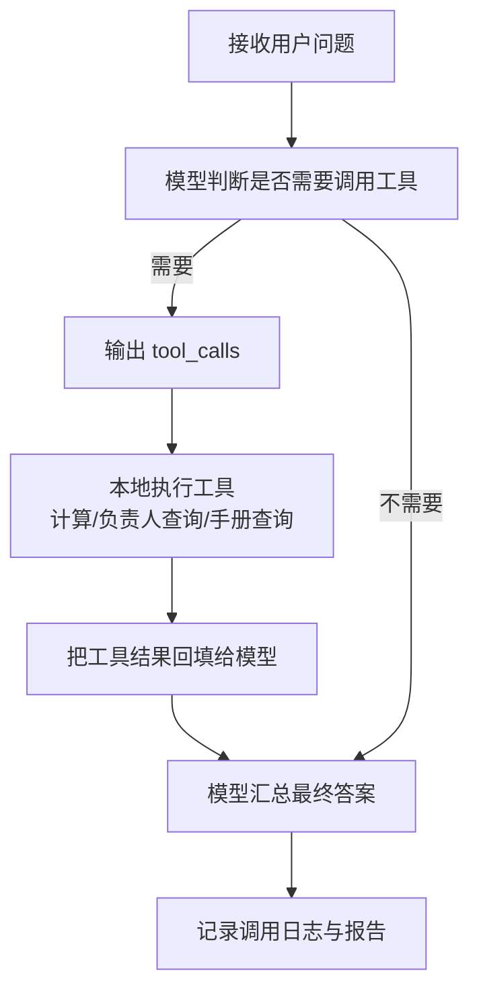
```mermaid
flowchart TD
	A[接收用户问题] --> B[模型判断是否需要调用工具]
	B -->|需要| C[输出 tool_calls]
	C --> D[本地执行工具\n计算/负责人查询/手册查询]
	D --> E[把工具结果回填给模型]
	E --> F[模型汇总最终答案]
	B -->|不需要| F
	F --> G[记录调用日志与报告]
```

### 业务时序图（Day22 工具调用闭环）

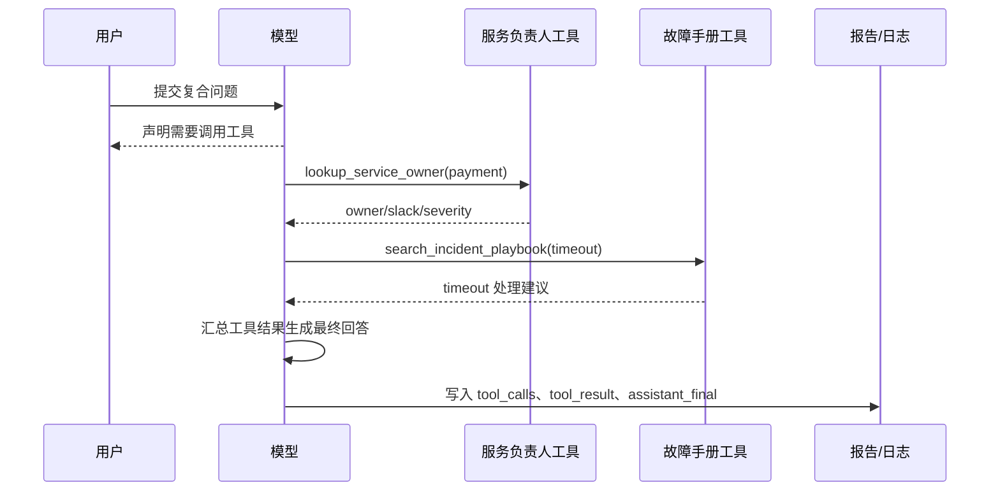
```mermaid
sequenceDiagram
	participant U as 用户
	participant M as 模型
	participant T1 as 服务负责人工具
	participant T2 as 故障手册工具
	participant R as 报告/日志

	U->>M: 提交复合问题
	M-->>U: 声明需要调用工具
	M->>T1: lookup_service_owner(payment)
	T1-->>M: owner/slack/severity
	M->>T2: search_incident_playbook(timeout)
	T2-->>M: timeout 处理建议
	M->>M: 汇总工具结果生成最终回答
	M->>R: 写入 tool_calls、tool_result、assistant_final
```

## 30) Day 23 - 做“数据库查询助手”（自然语言转 SQL，带安全限制）

Day 23 goal: build a read-only database assistant that converts natural language to SQL through tool calling and enforces safety restrictions.

Run Day 23 script:

```bash
python run_day23_database_query_assistant.py
```

Optional parameters:

```bash
python run_day23_database_query_assistant.py \
	--question "找出最近已支付订单金额最高的 3 位客户" \
	--system-prompt prompts/day23_database_query_assistant_cn.txt \
	--database data/day23_demo.sqlite3 \
	--temperature 0 \
	--max-tokens 700 \
	--max-tool-rounds 6 \
	--row-limit 20 \
	--model qwen2.5:0.5b
```

Generated files:
- `experiments/day23_database_query_assistant.md`（SQL 助手报告）
- `logs/day23_database_query_assistant.jsonl`（逐步调用日志）

Built-in tools:
1. `list_tables()`：查看当前数据库有哪些表。
2. `describe_table(table_name)`：查看某张表的字段定义。
3. `run_readonly_sql(sql, limit)`：执行只读 SQL，自动限制最大返回行数。

Safety restrictions:
1. 仅允许 `SELECT` / `WITH` 查询。
2. 拒绝 `INSERT` / `UPDATE` / `DELETE` / `DROP` / `ALTER` / `CREATE` 等写操作。
3. 只以 SQLite 只读连接执行 SQL。
4. 对结果行数设置上限，避免一次返回过多数据。

Business Mermaid diagrams:

### 业务流程图（Day23 数据库查询助手）

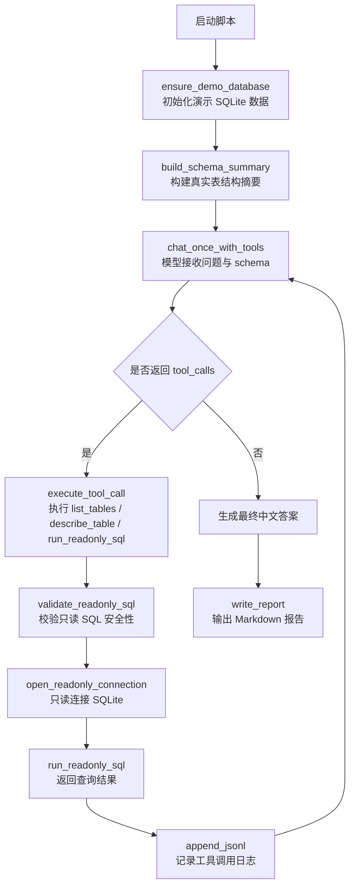
```mermaid
flowchart TD
	A[启动脚本] --> B[ensure_demo_database\n初始化演示 SQLite 数据]
	B --> C[build_schema_summary\n构建真实表结构摘要]
	C --> D[chat_once_with_tools\n模型接收问题与 schema]
	D --> E{是否返回 tool_calls}
	E -->|是| F[execute_tool_call\n执行 list_tables / describe_table / run_readonly_sql]
	F --> G[validate_readonly_sql\n校验只读 SQL 安全性]
	G --> H[open_readonly_connection\n只读连接 SQLite]
	H --> I[run_readonly_sql\n返回查询结果]
	I --> J[append_jsonl\n记录工具调用日志]
	J --> D
	E -->|否| K[生成最终中文答案]
	K --> L[write_report\n输出 Markdown 报告]
```

### 业务时序图（Day23 自然语言转 SQL 闭环）

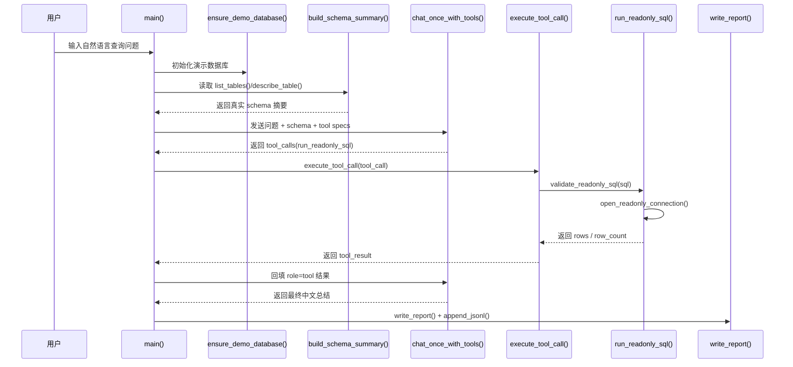
```mermaid
sequenceDiagram
	participant U as 用户
	participant Main as main()
	participant DB as ensure_demo_database()
	participant Schema as build_schema_summary()
	participant LLM as chat_once_with_tools()
	participant Tool as execute_tool_call()
	participant SQL as run_readonly_sql()
	participant Report as write_report()

	U->>Main: 输入自然语言查询问题
	Main->>DB: 初始化演示数据库
	Main->>Schema: 读取 list_tables()/describe_table()
	Schema-->>Main: 返回真实 schema 摘要
	Main->>LLM: 发送问题 + schema + tool specs
	LLM-->>Main: 返回 tool_calls(run_readonly_sql)
	Main->>Tool: execute_tool_call(tool_call)
	Tool->>SQL: validate_readonly_sql(sql)
	SQL->>SQL: open_readonly_connection()
	SQL-->>Tool: 返回 rows / row_count
	Tool-->>Main: 返回 tool_result
	Main->>LLM: 回填 role=tool 结果
	LLM-->>Main: 返回最终中文总结
	Main->>Report: write_report() + append_jsonl()
```

## 31) Day 24 - 做“接口联调助手”（可调用 HTTP 工具）

Day 24 goal: build an HTTP integration assistant that can call API-like tools and summarize integration results.

Run Day 24 script:

```bash
python run_day24_http_integration_assistant.py
```

Optional parameters:

```bash
python run_day24_http_integration_assistant.py \
	--question "请联调订单查询接口：检查 order_id=1001 是否存在并返回状态" \
	--system-prompt prompts/day24_http_integration_assistant_cn.txt \
	--temperature 0 \
	--max-tokens 700 \
	--max-tool-rounds 6 \
	--timeout-seconds 15 \
	--model qwen2.5:0.5b
```

Generated files:
- `experiments/day24_http_integration_assistant.md`（HTTP 联调助手报告）
- `logs/day24_http_integration_assistant.jsonl`（逐步调用日志）

Built-in tools:
1. `list_mock_endpoints()`：查看可联调的 mock API 列表。
2. `http_get(url, params)`：执行 GET 请求（带 URL 白名单）。
3. `http_post(url, json_body)`：执行 POST 请求（带 URL 白名单）。

Safety restrictions:
1. 只允许访问白名单域名（默认 `https://httpbin.org`）。
2. 请求超时可配置，避免接口长时间阻塞。
3. 返回内容长度裁剪，避免日志过大。

Business Mermaid diagrams:

### 业务流程图（Day24 接口联调助手）

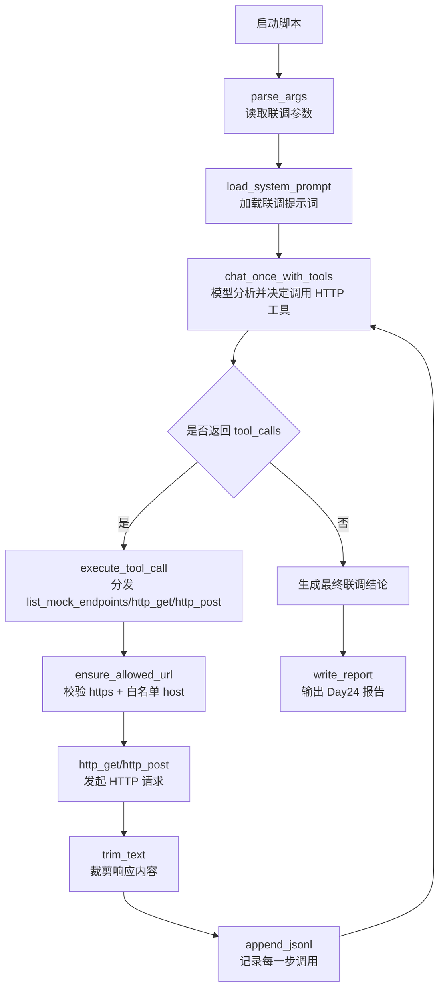
```mermaid
flowchart TD
	A[启动脚本] --> B[parse_args\n读取联调参数]
	B --> C[load_system_prompt\n加载联调提示词]
	C --> D[chat_once_with_tools\n模型分析并决定调用 HTTP 工具]
	D --> E{是否返回 tool_calls}
	E -->|是| F[execute_tool_call\n分发 list_mock_endpoints/http_get/http_post]
	F --> G[ensure_allowed_url\n校验 https + 白名单 host]
	G --> H[http_get/http_post\n发起 HTTP 请求]
	H --> I[trim_text\n裁剪响应内容]
	I --> J[append_jsonl\n记录每一步调用]
	J --> D
	E -->|否| K[生成最终联调结论]
	K --> L[write_report\n输出 Day24 报告]
```

### 业务时序图（Day24 模型-工具-HTTP 闭环）

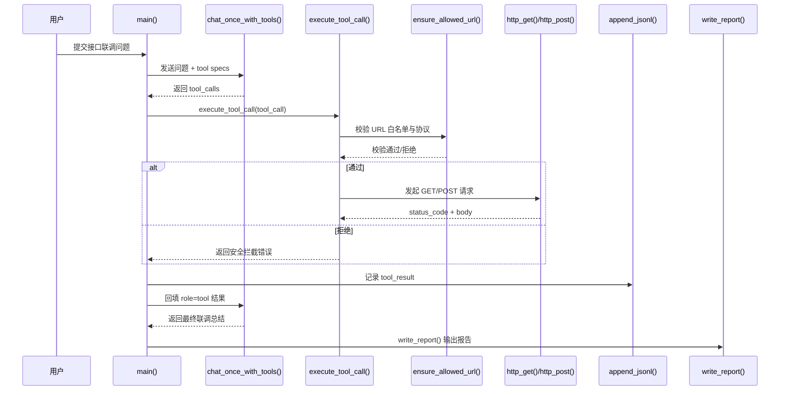
```mermaid
sequenceDiagram
	participant U as 用户
	participant Main as main()
	participant LLM as chat_once_with_tools()
	participant Tool as execute_tool_call()
	participant Check as ensure_allowed_url()
	participant HTTP as http_get()/http_post()
	participant Log as append_jsonl()
	participant Report as write_report()

	U->>Main: 提交接口联调问题
	Main->>LLM: 发送问题 + tool specs
	LLM-->>Main: 返回 tool_calls
	Main->>Tool: execute_tool_call(tool_call)
	Tool->>Check: 校验 URL 白名单与协议
	Check-->>Tool: 校验通过/拒绝
	alt 通过
		Tool->>HTTP: 发起 GET/POST 请求
		HTTP-->>Tool: status_code + body
	else 拒绝
		Tool-->>Main: 返回安全拦截错误
	end
	Main->>Log: 记录 tool_result
	Main->>LLM: 回填 role=tool 结果
	LLM-->>Main: 返回最终联调总结
	Main->>Report: write_report() 输出报告
```

## 32) Day 25 - 加入任务编排（多步：分析 -> 调工具 -> 汇总）

Day 25 goal: orchestrate a multi-step workflow with explicit phases: analysis, tool execution, and summary.

Run Day 25 script:

```bash
python run_day25_task_orchestration.py
```

Optional parameters:

```bash
python run_day25_task_orchestration.py \
	--question "请完成接口联调：先识别可用 endpoint，再请求 order_id=1001，最后总结联调结果" \
	--planner-prompt prompts/day25_task_orchestrator_cn.txt \
	--temperature 0 \
	--max-tokens 700 \
	--max-steps 6 \
	--timeout-seconds 15 \
	--model qwen2.5:0.5b
```

Generated files:
- `experiments/day25_task_orchestration.md`（任务编排报告）
- `logs/day25_task_orchestration.jsonl`（编排步骤日志）

Orchestration phases:
1. Analysis：模型先产出执行计划（JSON step plan）。
2. Tool Execution：脚本按计划逐步调用工具并记录结果。
3. Summary：模型基于计划+执行结果生成最终联调总结。

Built-in tools:
1. `list_mock_endpoints()`
2. `http_get(url, params)`
3. `http_post(url, json_body)`

## 33) Day 26-28 - 合并版 Agent Demo（失败重试 / 审计日志 / 演示版）

Day 26 goal: add failure retry and timeout handling for both tool execution and LLM calls.

Day 27 goal: add an audit trail so every tool attempt can be traced.

Day 28 goal: package the whole flow into a demo-ready agent entrypoint.

Run the merged demo script:

```bash
python run_day26_day28_agent_demo.py
```

Optional parameters:

```bash
python run_day26_day28_agent_demo.py \
	--question "请完成接口联调：先识别可用 endpoint，再请求 order_id=1001，最后总结联调结果" \
	--planner-prompt prompts/day26_day28_agent_demo_cn.txt \
	--temperature 0 \
	--max-tokens 700 \
	--max-steps 6 \
	--max-tool-attempts 3 \
	--retry-backoff-seconds 0.5 \
	--timeout-seconds 15 \
	--model qwen2.5:0.5b
```

Generated files:
- `experiments/day26_day28_agent_demo.md`（合并版 Agent Demo 报告）
- `logs/day26_day28_agent_demo.jsonl`（编排步骤日志）
- `logs/day26_day28_agent_demo.audit.jsonl`（审计日志）

Built-in methods:
1. `build_plan()`：生成执行计划，失败时回退到默认计划。
2. `execute_step_with_retry()`：执行工具并对超时/瞬时错误重试。
3. `append_audit_event()`：写入每一步可追踪的审计记录。
4. `summarize_results()`：生成最终总结，失败时回退到本地兜底总结。
5. `write_report()`：输出适合演示的 Markdown 报告。

Business Mermaid diagrams:

### 业务流程图（Day26-28 合并版 Agent Demo）

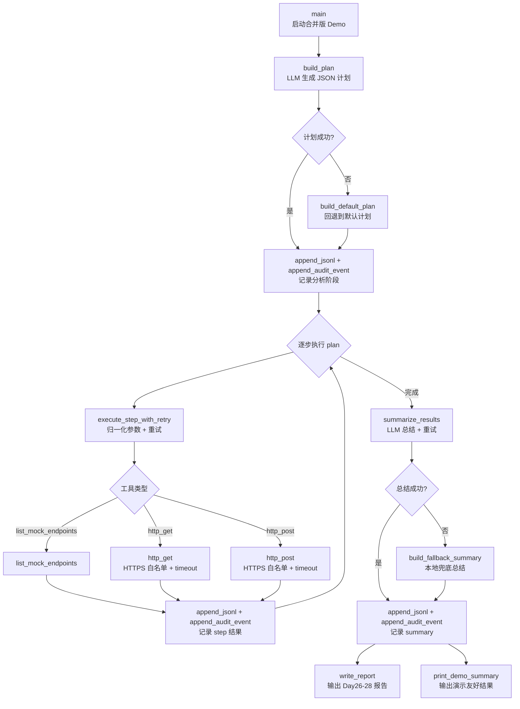
```mermaid
flowchart TD
	A[main\n启动合并版 Demo] --> B[build_plan\nLLM 生成 JSON 计划]
	B --> C{计划成功?}
	C -->|是| D[append_jsonl + append_audit_event\n记录分析阶段]
	C -->|否| E[build_default_plan\n回退到默认计划]
	E --> D
	D --> F{逐步执行 plan}
	F --> G[execute_step_with_retry\n归一化参数 + 重试]
	G --> H{工具类型}
	H -->|list_mock_endpoints| I[list_mock_endpoints]
	H -->|http_get| J[http_get\nHTTPS 白名单 + timeout]
	H -->|http_post| K[http_post\nHTTPS 白名单 + timeout]
	I --> L[append_jsonl + append_audit_event\n记录 step 结果]
	J --> L
	K --> L
	L --> F
	F -->|完成| M[summarize_results\nLLM 总结 + 重试]
	M --> N{总结成功?}
	N -->|是| O[append_jsonl + append_audit_event\n记录 summary]
	N -->|否| P[build_fallback_summary\n本地兜底总结]
	P --> O
	O --> Q[write_report\n输出 Day26-28 报告]
	O --> R[print_demo_summary\n输出演示友好结果]
```

### 业务时序图（Day26-28 方法级闭环）

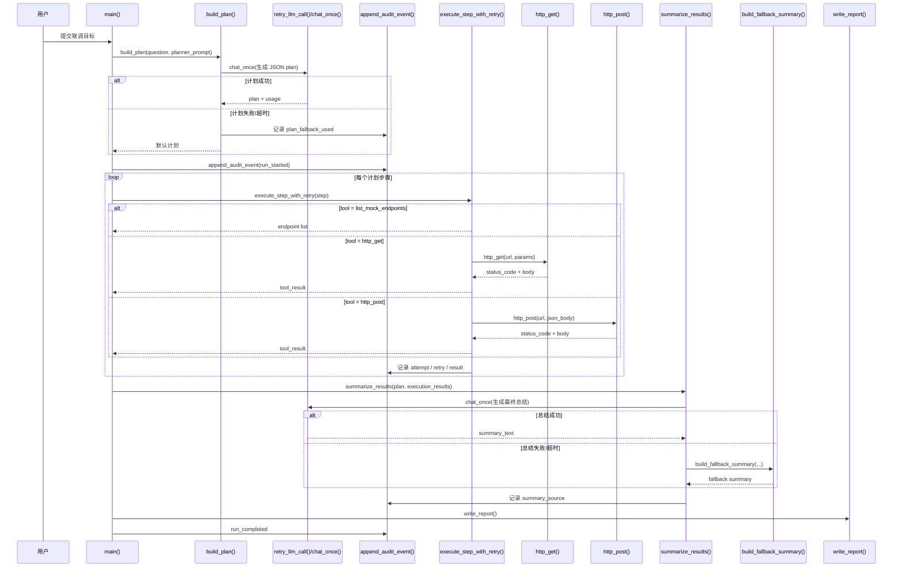
```mermaid
sequenceDiagram
	participant U as 用户
	participant Main as main()
	participant Planner as build_plan()
	participant LLM as retry_llm_call()/chat_once()
	participant Audit as append_audit_event()
	participant Step as execute_step_with_retry()
	participant GET as http_get()
	participant POST as http_post()
	participant Summary as summarize_results()
	participant Fallback as build_fallback_summary()
	participant Report as write_report()

	U->>Main: 提交联调目标
	Main->>Planner: build_plan(question, planner_prompt)
	Planner->>LLM: chat_once(生成 JSON plan)
	alt 计划成功
		LLM-->>Planner: plan + usage
	else 计划失败/超时
		Planner->>Audit: 记录 plan_fallback_used
		Planner-->>Main: 默认计划
	end
	Main->>Audit: append_audit_event(run_started)

	loop 每个计划步骤
		Main->>Step: execute_step_with_retry(step)
		alt tool = list_mock_endpoints
			Step-->>Main: endpoint list
		else tool = http_get
			Step->>GET: http_get(url, params)
			GET-->>Step: status_code + body
			Step-->>Main: tool_result
		else tool = http_post
			Step->>POST: http_post(url, json_body)
			POST-->>Step: status_code + body
			Step-->>Main: tool_result
		end
		Step->>Audit: 记录 attempt / retry / result
	end

	Main->>Summary: summarize_results(plan, execution_results)
	Summary->>LLM: chat_once(生成最终总结)
	alt 总结成功
		LLM-->>Summary: summary_text
	else 总结失败/超时
		Summary->>Fallback: build_fallback_summary(...)
		Fallback-->>Summary: fallback summary
	end
	Summary->>Audit: 记录 summary_source
	Main->>Report: write_report()
	Main->>Audit: run_completed
```

### 和 LangChain 的关系

Day25 到 Day28 这一组脚本，先是手写实现了一个轻量版的 LangChain 风格 agent；现在又新增了一个真正基于 LangChain 的合并版 demo：`run_day25_day28_langchain_demo.py`。

- 新版 `run_day25_day28_langchain_demo.py` 使用了 `ChatOpenAI`、`@tool`、`BaseCallbackHandler`、`with_structured_output()`，把 Day25-28 的结构直接映射成 LangChain 里的 planner、tools、callbacks、retry 和 demo wrapper。
- Day25 的 `build_plan()` 对应 LangChain 的结构化输出规划。
- Day26 的 `retry_call()` 对应 LangChain 里的重试与容错包装。
- Day27 的 `AuditCallbackHandler` 对应 LangChain callback / tracing。
- Day28 的 `write_report()` + CLI 入口对应一个可以直接演示的 Agent demo。

一句话总结：这些天的内容先是手写实现了一个轻量版的 LangChain 风格 agent 架构，随后又补了一个真正基于 LangChain 的版本，重点是把“规划、工具调用、重试、审计、总结”这些核心能力拆开、串起来。

### LangChain 版实现

```bash
python run_day25_day28_langchain_demo.py
```

Optional parameters:

```bash
python run_day25_day28_langchain_demo.py \
	--question "请完成接口联调：先识别可用 endpoint，再请求 order_id=1001，最后总结联调结果" \
	--prompt prompts/day25_day28_langchain_demo_cn.txt \
	--temperature 0 \
	--max-tokens 700 \
	--max-steps 6 \
	--max-attempts 3 \
	--retry-backoff-seconds 0.5 \
	--timeout-seconds 15 \
	--model qwen2.5:0.5b
```

Generated files:
- `experiments/day25_day28_langchain_demo.md`
- `logs/day25_day28_langchain_demo.jsonl`
- `logs/day25_day28_langchain_demo.audit.jsonl`

LangChain official docs:
- https://python.langchain.com/

LangChain version features used here:
1. `ChatOpenAI`：连接 OpenAI-compatible 模型服务。
2. `with_structured_output()`：把计划输出约束成 `Plan` / `PlanStep`。
3. `@tool`：把函数注册成 LangChain 工具。
4. `BaseCallbackHandler`：记录链路、LLM 和工具调用审计。
5. `retry_call()`：在 LangChain 外围包一层重试和退避。

### LangChain 版业务流程图（方法级）

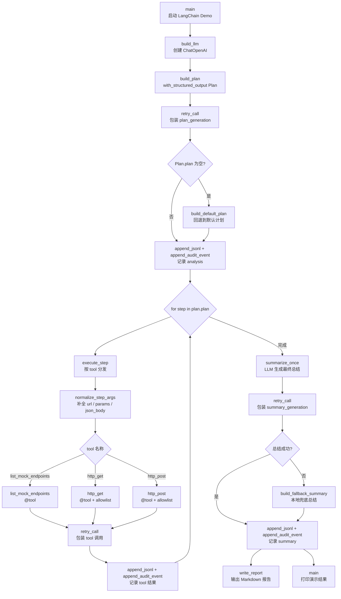
```mermaid
flowchart TD
	A["main\n启动 LangChain Demo"] --> B["build_llm\n创建 ChatOpenAI"]
	B --> C["build_plan\nwith_structured_output Plan"]
	C --> D["retry_call\n包装 plan_generation"]
	D --> E{"Plan.plan 为空?"}
	E -->|是| F["build_default_plan\n回退到默认计划"]
	E -->|否| G["append_jsonl + append_audit_event\n记录 analysis"]
	F --> G
	G --> H{"for step in plan.plan"}
	H --> I["execute_step\n按 tool 分发"]
	I --> J["normalize_step_args\n补全 url / params / json_body"]
	J --> K{"tool 名称"}
	K -->|list_mock_endpoints| L["list_mock_endpoints\n@tool"]
	K -->|http_get| M["http_get\n@tool + allowlist"]
	K -->|http_post| N["http_post\n@tool + allowlist"]
	L --> O["retry_call\n包装 tool 调用"]
	M --> O
	N --> O
	O --> P["append_jsonl + append_audit_event\n记录 tool 结果"]
	P --> H
	H -->|完成| Q["summarize_once\nLLM 生成最终总结"]
	Q --> R["retry_call\n包装 summary_generation"]
	R --> S{"总结成功?"}
	S -->|是| T["append_jsonl + append_audit_event\n记录 summary"]
	S -->|否| U["build_fallback_summary\n本地兜底总结"]
	U --> T
	T --> V["write_report\n输出 Markdown 报告"]
	T --> W["main\n打印演示结果"]
```

### LangChain 版业务时序图（方法级）

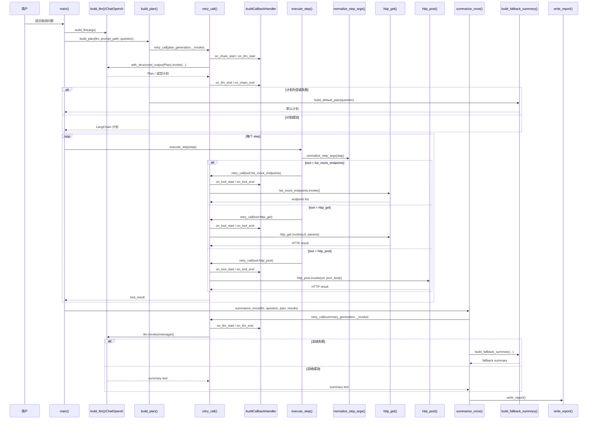
```mermaid
sequenceDiagram
	participant U as 用户
	participant Main as main()
	participant LLM as build_llm()/ChatOpenAI
	participant Planner as build_plan()
	participant Retry as retry_call()
	participant CB as AuditCallbackHandler
	participant Step as execute_step()
	participant Norm as normalize_step_args()
	participant GET as http_get()
	participant POST as http_post()
	participant Sum as summarize_once()
	participant FB as build_fallback_summary()
	participant Report as write_report()

	U->>Main: 提交联调问题
	Main->>LLM: build_llm(args)
	Main->>Planner: build_plan(llm, prompt_path, question)
	Planner->>Retry: retry_call(plan_generation, _invoke)
	Retry->>CB: on_chain_start / on_llm_start
	Retry->>LLM: with_structured_output(Plan).invoke(...)
	LLM-->>Retry: Plan / 或空计划
	Retry->>CB: on_llm_end / on_chain_end
	alt 计划为空或失败
		Planner->>FB: build_default_plan(question)
		FB-->>Main: 默认计划
	else 计划成功
		Planner-->>Main: LangChain 计划
	end
	loop 每个 step
		Main->>Step: execute_step(step)
		Step->>Norm: normalize_step_args(step)
		alt tool = list_mock_endpoints
			Step->>Retry: retry_call(tool:list_mock_endpoints)
			Retry->>CB: on_tool_start / on_tool_end
			Retry->>GET: list_mock_endpoints.invoke()
			GET-->>Retry: endpoint list
		else tool = http_get
			Step->>Retry: retry_call(tool:http_get)
			Retry->>CB: on_tool_start / on_tool_end
			Retry->>GET: http_get.invoke(url, params)
			GET-->>Retry: HTTP result
		else tool = http_post
			Step->>Retry: retry_call(tool:http_post)
			Retry->>CB: on_tool_start / on_tool_end
			Retry->>POST: http_post.invoke(url, json_body)
			POST-->>Retry: HTTP result
		end
		Retry-->>Main: tool_result
	end
	Main->>Sum: summarize_once(llm, question, plan, results)
	Sum->>Retry: retry_call(summary_generation, _invoke)
	Retry->>CB: on_llm_start / on_llm_end
	Retry->>LLM: llm.invoke(messages)
	alt 总结失败
		Sum->>FB: build_fallback_summary(...)
		FB-->>Sum: fallback summary
	else 总结成功
		LLM-->>Retry: summary text
		Retry-->>Sum: summary text
	end
	Sum->>Report: write_report()
```

Business Mermaid diagrams:

### 业务流程图（Day25 任务编排三阶段）

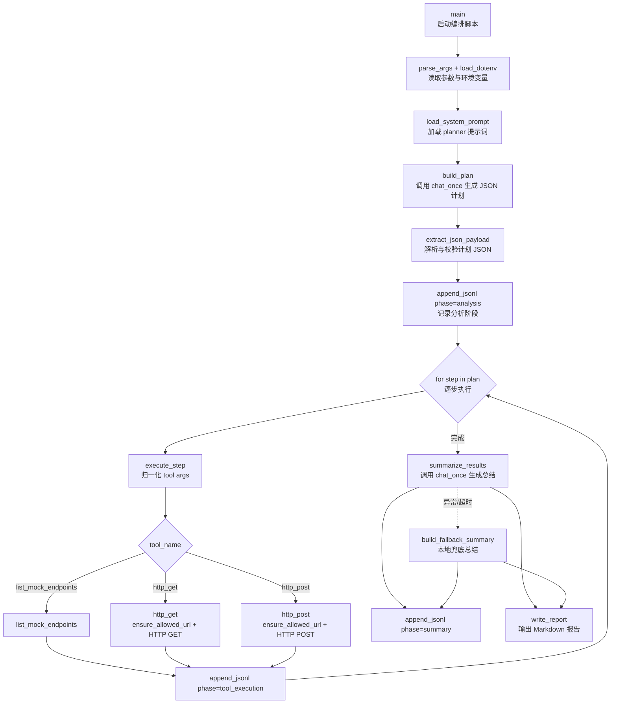
```mermaid
flowchart TD
	A[main\n启动编排脚本] --> B[parse_args + load_dotenv\n读取参数与环境变量]
	B --> C[load_system_prompt\n加载 planner 提示词]
	C --> D[build_plan\n调用 chat_once 生成 JSON 计划]
	D --> E[extract_json_payload\n解析与校验计划 JSON]
	E --> F[append_jsonl phase=analysis\n记录分析阶段]
	F --> G{for step in plan\n逐步执行}
	G --> H[execute_step\n归一化 tool args]
	H --> I{tool_name}
	I -->|list_mock_endpoints| J[list_mock_endpoints]
	I -->|http_get| K[http_get\nensure_allowed_url + HTTP GET]
	I -->|http_post| L[http_post\nensure_allowed_url + HTTP POST]
	J --> M[append_jsonl phase=tool_execution]
	K --> M
	L --> M
	M --> G
	G -->|完成| N[summarize_results\n调用 chat_once 生成总结]
	N --> O[append_jsonl phase=summary]
	N --> P[write_report\n输出 Markdown 报告]
	N -.异常/超时.-> Q[build_fallback_summary\n本地兜底总结]
	Q --> O
	Q --> P
```

### 业务时序图（Day25 方法级编排闭环）

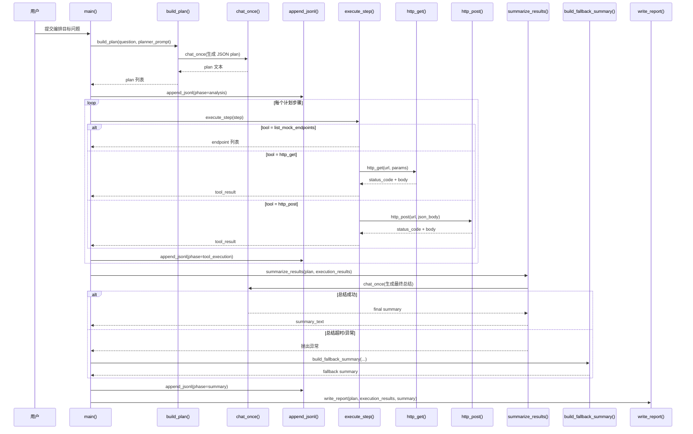
```mermaid
sequenceDiagram
	participant U as 用户
	participant Main as main()
	participant Planner as build_plan()
	participant LLM as chat_once()
	participant Log as append_jsonl()
	participant Exec as execute_step()
	participant GET as http_get()
	participant POST as http_post()
	participant Summary as summarize_results()
	participant Fallback as build_fallback_summary()
	participant Report as write_report()

	U->>Main: 提交编排目标问题
	Main->>Planner: build_plan(question, planner_prompt)
	Planner->>LLM: chat_once(生成 JSON plan)
	LLM-->>Planner: plan 文本
	Planner-->>Main: plan 列表
	Main->>Log: append_jsonl(phase=analysis)

	loop 每个计划步骤
		Main->>Exec: execute_step(step)
		alt tool = list_mock_endpoints
			Exec-->>Main: endpoint 列表
		else tool = http_get
			Exec->>GET: http_get(url, params)
			GET-->>Exec: status_code + body
			Exec-->>Main: tool_result
		else tool = http_post
			Exec->>POST: http_post(url, json_body)
			POST-->>Exec: status_code + body
			Exec-->>Main: tool_result
		end
		Main->>Log: append_jsonl(phase=tool_execution)
	end

	Main->>Summary: summarize_results(plan, execution_results)
	Summary->>LLM: chat_once(生成最终总结)
	alt 总结成功
		LLM-->>Summary: final summary
		Summary-->>Main: summary_text
	else 总结超时/异常
		Summary-->>Main: 抛出异常
		Main->>Fallback: build_fallback_summary(...)
		Fallback-->>Main: fallback summary
	end

	Main->>Log: append_jsonl(phase=summary)
	Main->>Report: write_report(plan, execution_results, summary)
```

## 34) Day22-Day28 总结（阶段演进）

Day22 到 Day28 的主线是把一个“可调用模型”逐步打磨成“可执行、可恢复、可追踪、可演示”的 Agent 闭环。

1. Day22：函数调用基础，建立工具调用最小闭环。
2. Day23：数据库查询助手，把自然语言映射到 SQL，并加入安全限制。
3. Day24：HTTP 联调助手，把工具能力扩展到接口调试场景。
4. Day25：三阶段任务编排（分析 -> 工具执行 -> 总结）。
5. Day26：失败重试和超时退避，提升稳定性与成功率。
6. Day27：审计日志全链路记录，提升可观测性和可追溯性。
7. Day28：Demo 化交付，输出报告与日志，支持兜底总结不断流。

### Day22-Day28 能力演进图

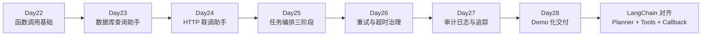
```mermaid
flowchart LR
    D22["Day22\n函数调用基础"] --> D23["Day23\n数据库查询助手"]
    D23 --> D24["Day24\nHTTP 联调助手"]
    D24 --> D25["Day25\n任务编排三阶段"]
    D25 --> D26["Day26\n重试与超时治理"]
    D26 --> D27["Day27\n审计日志与追踪"]
    D27 --> D28["Day28\nDemo 化交付"]
    D28 --> LC["LangChain 对齐\nPlanner + Tools + Callback"]
```

### Day22-Day28 统一执行时序图

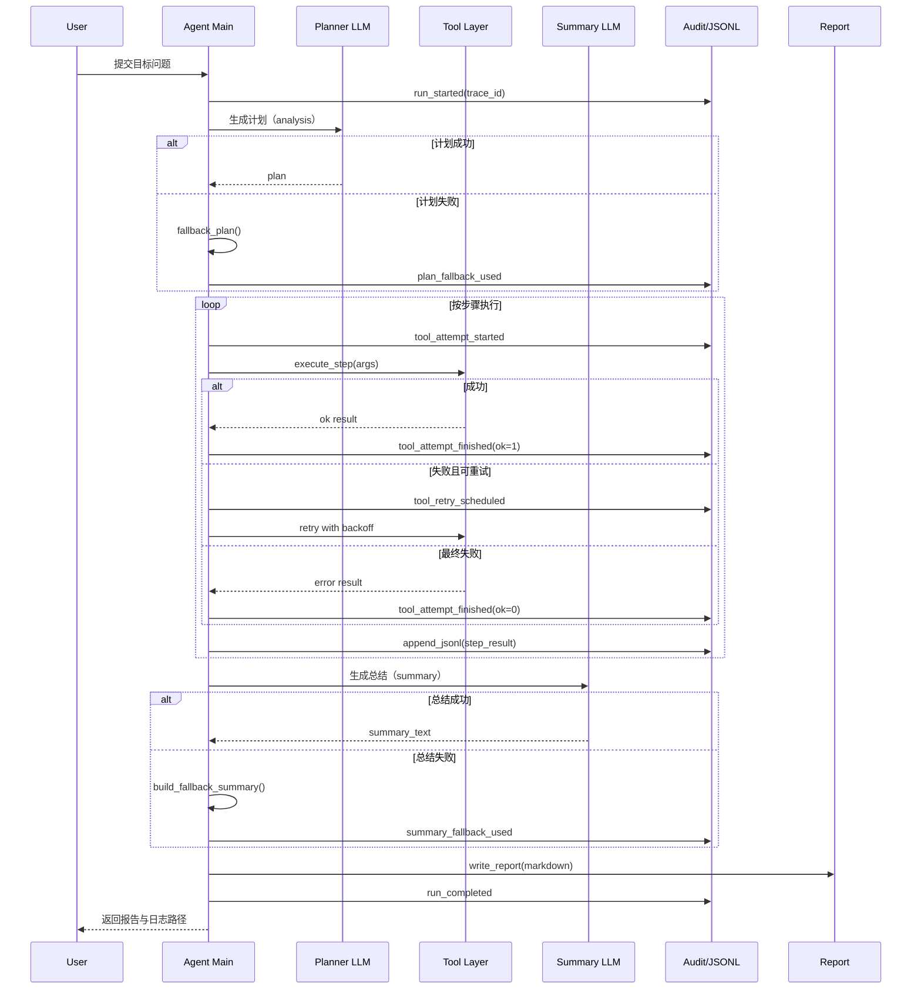
```mermaid
sequenceDiagram
    participant U as User
    participant A as Agent Main
    participant P as Planner LLM
    participant T as Tool Layer
    participant S as Summary LLM
    participant L as Audit/JSONL
    participant R as Report

    U->>A: 提交目标问题
    A->>L: run_started(trace_id)
    A->>P: 生成计划（analysis）
    alt 计划成功
        P-->>A: plan
    else 计划失败
        A->>A: fallback_plan()
        A->>L: plan_fallback_used
    end

    loop 按步骤执行
        A->>L: tool_attempt_started
        A->>T: execute_step(args)
        alt 成功
            T-->>A: ok result
            A->>L: tool_attempt_finished(ok=1)
        else 失败且可重试
            A->>L: tool_retry_scheduled
            A->>T: retry with backoff
        else 最终失败
            T-->>A: error result
            A->>L: tool_attempt_finished(ok=0)
        end
        A->>L: append_jsonl(step_result)
    end

    A->>S: 生成总结（summary）
    alt 总结成功
        S-->>A: summary_text
    else 总结失败
        A->>A: build_fallback_summary()
        A->>L: summary_fallback_used
    end

    A->>R: write_report(markdown)
    A->>L: run_completed
    A-->>U: 返回报告与日志路径
```

### Day22-Day28 与 LangChain API 映射表

| 阶段能力 | 当前手写实现 | LangChain 对应能力 | 说明 |
|---|---|---|---|
| Day22 函数调用起步 | `chat_once` + 本地工具分发 | `ChatOpenAI.invoke` + `@tool` | 从手工路由升级到标准工具抽象 |
| Day23 SQL 助手 | 工具白名单 + SQL 安全约束 | `@tool` + 参数 schema + guardrail | 约束和调用边界可统一治理 |
| Day24 HTTP 联调 | `http_get/http_post` + allowlist | `@tool` + callback 观测 | 工具调用可被追踪并复用 |
| Day25 任务编排 | `build_plan` -> `execute_step` -> `summarize_results` | Planner chain -> tool chain -> summary chain | 三阶段工作流与 LangChain 结构天然对齐 |
| Day26 重试与退避 | `retry_llm_call`、`execute_step_with_retry` | runnable 外层重试策略 | 把瞬时错误转为可恢复流程 |
| Day27 审计日志 | `append_audit_event` + JSONL | `BaseCallbackHandler` tracing | 事件级追踪可串联全链路 |
| Day28 演示交付 | `write_report` + CLI 入口 + fallback | chain 包装 + artifact 输出 | 形成可运行、可解释、可展示的 demo |

补充：在 `run_day26_day28_agent_demo.py` 中，`build_plan_once` 和 `summarize_results_once` 仍是直接通过 `chat_once` 调用模型；在 LangChain 版脚本中对应为 `ChatOpenAI.invoke`/结构化输出调用。

## 35) Week 5 启动：Day29-Day31 合并项目（LoRA/QLoRA + 数据构造 + 小规模 SFT）

目标：用一个连续项目覆盖 Day29-Day31 的关键知识点与可运行流程。

### Day29：LoRA/QLoRA 概念学习

运行：

```bash
python run_day29_lora_qlora_notes.py
```

输出：
- `experiments/day29_lora_qlora_notes.md`
- `logs/day29_lora_qlora_notes.jsonl`

### Day30：构造后端指令数据（50-200 条）

运行（默认 120 条，20 条留作评测集）：

```bash
python run_day30_build_instruction_dataset.py
```

自定义样本规模：

```bash
python run_day30_build_instruction_dataset.py --samples 150 --eval-size 30 --seed 42
```

输出：
- `data/day30_backend_sft_train.jsonl`
- `data/day30_backend_sft_eval.jsonl`
- `experiments/day30_instruction_dataset_report.md`
- `logs/day30_instruction_dataset.jsonl`

### Day31：小规模 SFT（LoRA / QLoRA）

先安装 Day29-Day31 依赖：

```bash
pip install -r requirements_day29_day31.txt
```

运行 LoRA 训练（轻量默认）：

```bash
python run_day31_sft_lora_light.py
```

尝试 QLoRA（需要 CUDA 环境，macOS 通常会自动回退 LoRA）：

```bash
python run_day31_sft_lora_light.py --qlora
```

输出：
- `outputs/day31_sft_lora/adapter/`（LoRA adapter）
- `outputs/day31_sft_lora/tokenizer/`
- `experiments/day31_sft_lora_report.md`
- `logs/day31_sft_lora.jsonl`

### Day29-Day31 一体化流程图

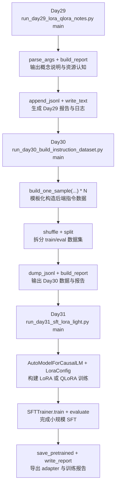
```mermaid
flowchart TD
	A["Day29<br/>run_day29_lora_qlora_notes.py main"] --> B["parse_args + build_report<br/>输出概念说明与资源认知"]
	B --> C["append_jsonl + write_text<br/>生成 Day29 报告与日志"]
	C --> D["Day30<br/>run_day30_build_instruction_dataset.py main"]
	D --> E["build_one_sample(...) * N<br/>模板化构造后端指令数据"]
	E --> F["shuffle + split<br/>拆分 train/eval 数据集"]
	F --> G["dump_jsonl + build_report<br/>输出 Day30 数据与报告"]
	G --> H["Day31<br/>run_day31_sft_lora_light.py main"]
	H --> I["AutoModelForCausalLM + LoraConfig<br/>构建 LoRA 或 QLoRA 训练"]
	I --> J["SFTTrainer.train + evaluate<br/>完成小规模 SFT"]
	J --> K["save_pretrained + write_report<br/>导出 adapter 与训练报告"]
```

实践建议：
1. 先跑通 LoRA，再切 QLoRA，定位问题更清晰。
2. Day32 对比时务必固定评测集（`day30_backend_sft_eval.jsonl`）。
3. 如果机器资源有限，优先降低 `--max-steps` 与 `--max-seq-len`。

调试说明（QLoRA）：
1. 已提供 `Debug Day31 SFT QLoRA Attempt` 启动项用于快速验证量化分支。
2. 在 macOS 或无 CUDA 环境下，脚本会打印告警并自动回退到 LoRA，这是预期行为。
3. 若希望真正启用 QLoRA，建议在 Linux + NVIDIA CUDA 环境运行，并确保量化依赖可用。

### Day29-Day31 代码流程图（方法级）

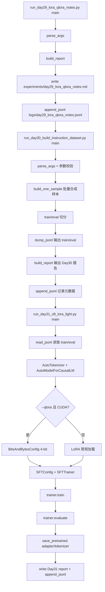
```mermaid
flowchart TD
	A[run_day29_lora_qlora_notes.py main] --> B[parse_args]
	B --> C[build_report]
	C --> D[write experiments/day29_lora_qlora_notes.md]
	D --> E[append_jsonl logs/day29_lora_qlora_notes.jsonl]

	E --> F[run_day30_build_instruction_dataset.py main]
	F --> G[parse_args + 参数校验]
	G --> H[build_one_sample 批量合成样本]
	H --> I[train/eval 切分]
	I --> J[dump_jsonl 输出 train/eval]
	J --> K[build_report 输出 Day30 报告]
	K --> L[append_jsonl 记录元数据]

	L --> M[run_day31_sft_lora_light.py main]
	M --> N[read_jsonl 读取 train/eval]
	N --> O[AutoTokenizer + AutoModelForCausalLM]
	O --> P{--qlora 且 CUDA?}
	P -->|是| Q[BitsAndBytesConfig 4-bit]
	P -->|否| R[LoRA 常规加载]
	Q --> S[SFTConfig + SFTTrainer]
	R --> S
	S --> T[trainer.train]
	T --> U[trainer.evaluate]
	U --> V[save_pretrained adapter/tokenizer]
	V --> W[write Day31 report + append_jsonl]
```

### Day29-Day31 代码时序图（执行链路）

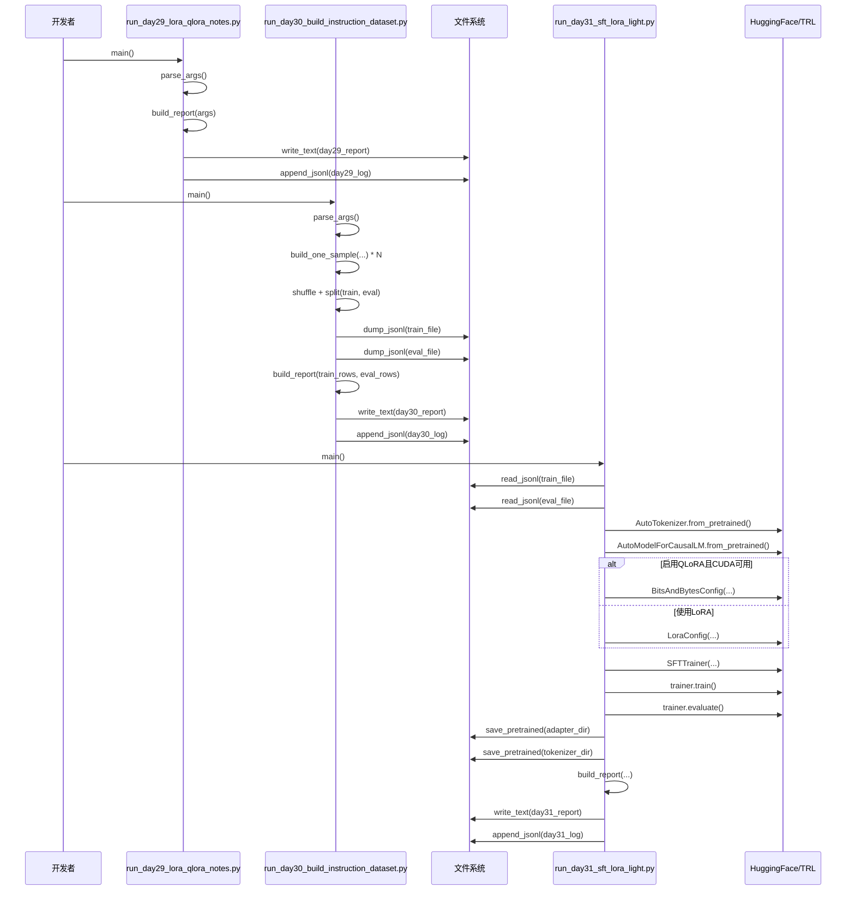
```mermaid
sequenceDiagram
	participant U as 开发者
	participant S29 as run_day29_lora_qlora_notes.py
	participant S30 as run_day30_build_instruction_dataset.py
	participant FS as 文件系统
	participant S31 as run_day31_sft_lora_light.py
	participant HF as HuggingFace/TRL

	U->>S29: main()
	S29->>S29: parse_args()
	S29->>S29: build_report(args)
	S29->>FS: write_text(day29_report)
	S29->>FS: append_jsonl(day29_log)

	U->>S30: main()
	S30->>S30: parse_args()
	S30->>S30: build_one_sample(...) * N
	S30->>S30: shuffle + split(train, eval)
	S30->>FS: dump_jsonl(train_file)
	S30->>FS: dump_jsonl(eval_file)
	S30->>S30: build_report(train_rows, eval_rows)
	S30->>FS: write_text(day30_report)
	S30->>FS: append_jsonl(day30_log)

	U->>S31: main()
	S31->>FS: read_jsonl(train_file)
	S31->>FS: read_jsonl(eval_file)
	S31->>HF: AutoTokenizer.from_pretrained()
	S31->>HF: AutoModelForCausalLM.from_pretrained()
	alt 启用QLoRA且CUDA可用
		S31->>HF: BitsAndBytesConfig(...)
	else 使用LoRA
		S31->>HF: LoraConfig(...)
	end
	S31->>HF: SFTTrainer(...)
	S31->>HF: trainer.train()
	S31->>HF: trainer.evaluate()
	S31->>FS: save_pretrained(adapter_dir)
	S31->>FS: save_pretrained(tokenizer_dir)
	S31->>S31: build_report(...)
	S31->>FS: write_text(day31_report)
	S31->>FS: append_jsonl(day31_log)
```

### Day29-Day31 总结

1. Day29 完成了 LoRA/QLoRA 的概念建模，明确了“低资源微调”的技术边界和目标。
2. Day30 完成了后端场景指令数据生产，形成了可复现的 train/eval 数据资产。
3. Day31 跑通了小规模 SFT（LoRA）训练闭环，完成了从数据到 adapter 的端到端验证。
4. 当前阶段结论是：轻量微调流程已可运行，下一步重点应转向 Day32 的固定评测集前后对比。

## 36) Day32 - 对比微调前后效果（固定评测集）

Day32 goal: use one fixed eval set to compare base model vs LoRA-adapted model under the same generation settings.

运行：

```bash
python run_day32_sft_before_after_eval.py
```

可选参数示例：

```bash
python run_day32_sft_before_after_eval.py \
  --eval-file data/day30_backend_sft_eval.jsonl \
  --base-model-id HuggingFaceTB/SmolLM2-135M-Instruct \
  --adapter-dir outputs/day31_sft_lora/adapter \
  --max-eval-samples 20
```

输出：
- `experiments/day32_sft_before_after_eval.md`
- `logs/day32_sft_before_after_eval.jsonl`

评分说明：
1. `section_score`：回答是否包含“结论/分析/操作步骤/风险”四个结构。
2. `keyword_hit_ratio`：回答是否覆盖样本 tags 中的关键字。
3. `quality`：`0.6 * section_score + 0.4 * keyword_hit_ratio`。

### Day32 业务流程图

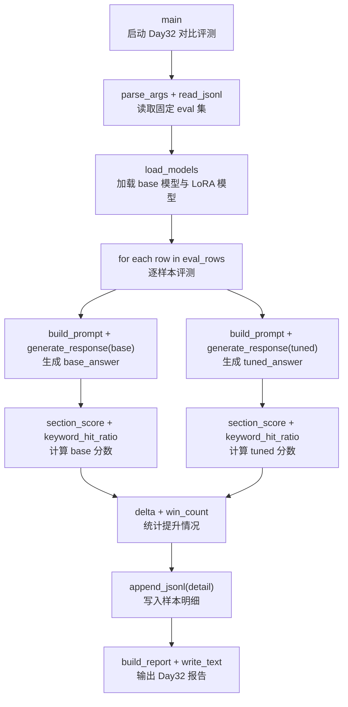
```mermaid
flowchart TD
	A["main<br/>启动 Day32 对比评测"] --> B["parse_args + read_jsonl<br/>读取固定 eval 集"]
	B --> C["load_models<br/>加载 base 模型与 LoRA 模型"]
	C --> D["for each row in eval_rows<br/>逐样本评测"]
	D --> E["build_prompt + generate_response(base)<br/>生成 base_answer"]
	D --> F["build_prompt + generate_response(tuned)<br/>生成 tuned_answer"]
	E --> G["section_score + keyword_hit_ratio<br/>计算 base 分数"]
	F --> H["section_score + keyword_hit_ratio<br/>计算 tuned 分数"]
	G --> I["delta + win_count<br/>统计提升情况"]
	H --> I
	I --> J["append_jsonl(detail)<br/>写入样本明细"]
	J --> K["build_report + write_text<br/>输出 Day32 报告"]
```

### Day32 时序图

```mermaid
sequenceDiagram
	participant U as 开发者
	participant S32 as run_day32_sft_before_after_eval.py
	participant FS as 文件系统
	participant BM as 基础模型
	participant TM as 微调模型(LoRA)

	U->>S32: main()
	S32->>S32: parse_args()
	S32->>FS: read_jsonl(eval_file)
	S32->>S32: load_models(base_model_id, adapter_dir)
	S32->>BM: AutoModelForCausalLM.from_pretrained()
	S32->>TM: PeftModel.from_pretrained()

	loop 每个 eval 样本
		S32->>S32: build_prompt(row)
		S32->>BM: generate_response(base_model, tokenizer, row, args)
		BM-->>S32: base_answer
		S32->>TM: generate_response(tuned_model, tokenizer, row, args)
		TM-->>S32: tuned_answer
		S32->>S32: section_score()/keyword_hit_ratio()/quality
		S32->>FS: append_jsonl(detail)
	end

	S32->>S32: build_report(...)
	S32->>FS: write_text(day32_report)
	S32-->>U: 返回报告路径
```

### Day29-Day32 理论说明（通俗版）

#### 1. SFT 是什么

SFT（Supervised Fine-Tuning，监督微调）可以理解成：
给模型一批“题目 + 标准答案”，让模型学会按你希望的方式回答。

如果把模型类比成一个刚入组、基础很强但不熟悉你们团队风格的后端工程师，那么：
1. 预训练模型已经“知道很多知识”。
2. SFT 不是重新培养他上大学，而是做一次岗位培训。
3. 培训的目标不是让他变得无所不知，而是让他回答问题更像你们团队的标准方式。

例如：
1. 微调前，模型回答“订单接口超时怎么排查”时，可能内容发散、结构不稳定。
2. 微调后，模型更可能按“结论 -> 分析 -> 操作步骤 -> 风险”这种结构回答。

#### 2. LoRA / QLoRA 是什么

LoRA 可以理解成“不给大模型整体动手术，而是给它加一个小插件”。

核心思想：
1. 冻结原始大模型参数。
2. 只训练很小的一部分增量参数。
3. 训练结束后，保存的是 adapter，而不是重新保存整个模型。

QLoRA 则是在 LoRA 基础上进一步省资源：
1. 原模型权重先量化到 4-bit。
2. 再在这个更省显存的基础上做 LoRA 微调。
3. 所以 QLoRA 通常比普通 LoRA 更节省显存，但也更依赖量化后端和 CUDA 环境。

在 [run_day29_lora_qlora_notes.py](/Users/zhaoyonggng/work/llm-day1/run_day29_lora_qlora_notes.py) 里，`build_report()` 不是训练模型，而是在做三件事：
1. 解释 LoRA、QLoRA、SFT 概念。
2. 对比 LoRA 和 QLoRA 的资源差异。
3. 用粗略计算帮助建立“为什么全参数训练贵、LoRA/QLoRA 更轻量”的直觉。

#### 3. 指令数据是什么

指令数据就是“模型训练用的标准问答样本”。

在你这个项目里，一条典型数据大致包含：
1. `instruction`：用户问题。
2. `input`：补充输入。
3. `output`：期望答案。
4. `tags`：关键字，用于后续评测。

在 [run_day30_build_instruction_dataset.py](/Users/zhaoyonggng/work/llm-day1/run_day30_build_instruction_dataset.py) 里，`build_one_sample()` 会：
1. 从 `SERVICES` 里抽一个服务，比如“订单服务”。
2. 从 `PROBLEMS` 里抽一个问题，比如“接口超时”。
3. 从 `COMPONENTS` 里抽一个组件，比如“Redis”。
4. 用 `INSTRUCTION_TEMPLATES` 拼成一条 instruction。
5. 用 `OUTPUT_SKELETON` 生成统一结构的标准答案。

例如可能构造出这样一条样本：
1. instruction：请针对订单服务的接口超时给出可执行排查步骤。
2. output：按“结论 / 分析 / 操作步骤 / 风险与回滚”给出完整回答。

这一步本质上是在定义：
“以后我希望模型怎么回答后端问题。”

#### 4. Day31 的 SFT 训练到底在做什么

在 [run_day31_sft_lora_light.py](/Users/zhaoyonggng/work/llm-day1/run_day31_sft_lora_light.py) 里，训练流程可以通俗理解成：
1. 读取 Day30 产出的 train/eval 数据。
2. 用 `format_example()` 把每条样本整理成统一文本格式。
3. 加载基础模型和 tokenizer。
4. 根据参数决定走 LoRA 还是 QLoRA 分支。
5. 用 `LoraConfig` 定义 adapter 训练方式。
6. 用 `SFTTrainer` 执行训练和评测。
7. 保存 adapter 和 tokenizer。

这里最关键的一点是：
训练后保存的主要是 adapter，而不是重新保存整个基础模型。

所以 Day31 的本质是：
用 Day30 的标准问答样本，把基础模型微调成“更像你团队回答方式”的版本。

#### 5. Day32 在干什么

Day32 不是继续训练，而是在做“考试”。

在 [run_day32_sft_before_after_eval.py](/Users/zhaoyonggng/work/llm-day1/run_day32_sft_before_after_eval.py) 里，流程是：
1. 读取固定评测集 `day30_backend_sft_eval.jsonl`。
2. 同时加载基础模型和“基础模型 + LoRA adapter”。
3. 对同一条题目分别生成 `base_answer` 和 `tuned_answer`。
4. 计算结构分 `section_score`。
5. 计算关键字命中率 `keyword_hit_ratio`。
6. 汇总出综合质量分 `quality`。

这里的核心思想是：
只有使用同一套固定评测题，才能公平比较“微调前后到底有没有提升”。

例如：
1. 基础模型可能只给出零散建议，没有“结论/分析/步骤/风险”的完整结构。
2. 微调后模型更容易按你指定的结构回答。
3. 如果它还更频繁地命中业务关键词，Day32 的评分就会更高。

#### 6. 怎么整体理解 Day29-Day32

可以把它当成一个完整闭环：
1. Day29：决定方法。为什么不用全参数训练，而选 LoRA/QLoRA。
2. Day30：准备教材。构造你希望模型学习的后端问答样本。
3. Day31：实施培训。把这些样本喂给模型，训练出 adapter。
4. Day32：统一考试。验证训练后模型是否真的比原模型更符合预期。

再换一个更生活化的比喻：
1. Day29 是决定“培训方案”。
2. Day30 是编写“培训教材和标准答案”。
3. Day31 是安排“集中培训”。
4. Day32 是组织“统一考试”。

#### 7. 结合当前项目的一个具体例子

假设目标是让模型更擅长回答“后端故障排查”。

那么这四天就是：
1. Day29：先明确，用 LoRA/QLoRA 这种低成本方式来做定向能力增强。
2. Day30：构造类似“订单服务接口超时怎么排查”的标准样本，并要求输出固定结构。
3. Day31：训练模型，让它更容易学会这种后端答题风格。
4. Day32：拿固定题目比较训练前后，验证它是否更结构化、更贴近业务关键词。

如果 Day32 报告里：
1. `tuned_avg_quality` 高于 `base_avg_quality`。
2. `section_score` 提升明显。
3. `keyword_hit_ratio` 也有提升。

那就说明这次微调不是“只跑通了流程”，而是真的让模型输出更符合目标场景。

## 37) Day33 - 推理加速（量化、批处理、并发）

Day33 goal: compare several lightweight inference acceleration strategies on the same fixed prompt set.

运行：

```bash
python run_day33_inference_acceleration_comparison.py
```

输出：
- `experiments/day33_inference_acceleration_report.md`
- `logs/day33_inference_acceleration.jsonl`

说明：
1. `base_serial_fp32`：基础模型串行生成。
2. `base_batch_fp32`：基础模型批处理生成。
3. `base_serial_dynamic_int8`：CPU 动态量化实验。
4. `base_concurrent_fp32_xN`：多 worker 并发实验。
5. `tuned_serial_fp32`：带 LoRA adapter 的串行生成。

### Day33 业务流程图

```mermaid
flowchart TD
	A["main<br/>启动 Day33 benchmark"] --> B["parse_args<br/>解析 benchmark 参数"]
	B --> C["read_jsonl<br/>读取固定 eval 集"]
	C --> D["build_prompts<br/>构造 prompts"]
	D --> E["UnifiedInferenceEngine.load<br/>加载 base fp32 engine"]
	E --> F["benchmark_engine<br/>base_serial_fp32"]
	F --> G["benchmark_engine<br/>base_batch_fp32"]
	G --> H["UnifiedInferenceEngine.load<br/>dynamic_int8 engine"]
	H --> I["benchmark_engine<br/>base_serial_dynamic_int8"]
	I --> J["benchmark_concurrent<br/>base_concurrent_fp32_xN"]
	J --> K["UnifiedInferenceEngine.load<br/>tuned fp32 engine"]
	K --> L["benchmark_engine<br/>tuned_serial_fp32"]
	L --> M["build_report<br/>汇总 total avg throughput"]
	M --> N["append_jsonl / write_text<br/>输出 Day33 报告与日志"]
```

### Day33 时序图

```mermaid
sequenceDiagram
	participant U as 开发者
	participant S33 as run_day33_inference_acceleration_comparison.py
	participant API as UnifiedInferenceEngine
	participant FS as 文件系统

	U->>S33: main()
	S33->>S33: parse_args()
	S33->>FS: read_jsonl(eval_file)
	S33->>S33: build_prompts(rows)
	S33->>API: load(base fp32)
	S33->>S33: benchmark_engine(base_serial_fp32)
	S33->>API: generate(prompts, batch_size=1)
	S33->>S33: benchmark_engine(base_batch_fp32)
	S33->>API: generate(prompts, batch_size=batch_size)
	S33->>API: load(dynamic_int8)
	S33->>S33: benchmark_engine(base_serial_dynamic_int8)
	S33->>S33: benchmark_concurrent(worker_count)
	S33->>API: load(tuned fp32)
	S33->>S33: benchmark_engine(tuned_serial_fp32)
	S33->>S33: build_report(results)
	S33->>FS: write_text(day33_report)
	S33->>FS: append_jsonl(day33_log)
```

### Day33 函数调用关系图

```mermaid
flowchart TD
	A["main"] --> B["parse_args"]
	A --> C["resolve_project_path(eval_file/report/jsonl)"]
	A --> D["read_jsonl"]
	D --> E["json.loads"]
	A --> F["build_prompts"]
	F --> G["build_backend_prompt"]
	A --> H["UnifiedInferenceEngine.load(base fp32)"]
	A --> I["benchmark_engine(base_serial_fp32)"]
	I --> J["engine.generate"]
	A --> K["benchmark_engine(base_batch_fp32)"]
	K --> J
	A --> L["UnifiedInferenceEngine.load(dynamic_int8)"]
	A --> M["benchmark_engine(base_serial_dynamic_int8)"]
	M --> J
	A --> N["benchmark_concurrent"]
	N --> O["ThreadPoolExecutor.submit(engine.generate)"]
	A --> P["benchmark_engine(tuned_serial_fp32)"]
	P --> J
	A --> Q["build_report"]
	Q --> R["utc_now_iso"]
	A --> S["append_jsonl(each result)"]
	S --> R
	S --> T["json.dumps"]
```

## 38) Day34 - 统一推理 API（便于替换模型）

Day34 goal: encapsulate one reusable local inference API for base model, LoRA adapter, and multiple inference modes.

运行：

```bash
python run_day34_unified_inference_api.py
```

输出：
- `experiments/day34_unified_inference_api.md`
- `logs/day34_unified_inference_api.jsonl`

说明：
1. `UnifiedInferenceEngine` 统一管理模型加载。
2. 支持基础模型与 `adapter_dir` 挂载。
3. 支持 `fp32` 与 `dynamic_int8` 两种推理模式。
4. 支持单条或 batch 生成。

### Day34 业务流程图

```mermaid
flowchart TD
	A["main<br/>启动 Day34 demo"] --> B["parse_args<br/>解析 base_model_id adapter_dir inference_mode"]
	B --> C["UnifiedInferenceEngine.__init__<br/>保存模型与模式配置"]
	C --> D["UnifiedInferenceEngine.load<br/>加载 tokenizer"]
	D --> E["AutoModelForCausalLM.from_pretrained<br/>加载 base model"]
	E --> F{"adapter_dir 是否存在"}
	F -->|是| G["PeftModel.from_pretrained<br/>挂载 LoRA adapter"]
	F -->|否| H["继续使用 base model"]
	G --> I{"inference_mode"}
	H --> I
	I -->|fp32| J["保持 fp32 推理路径"]
	I -->|dynamic_int8| K["torch.quantization.quantize_dynamic<br/>应用 CPU 动态量化"]
	J --> L["build_backend_prompt<br/>构造请求 prompt"]
	K --> L
	L --> M["UnifiedInferenceEngine.generate<br/>tokenizer(batch) + model.generate"]
	M --> N["build_report / append_jsonl<br/>输出响应 报告 日志"]
```

### Day34 时序图

```mermaid
sequenceDiagram
	participant U as 开发者
	participant API as UnifiedInferenceEngine
	participant HF as Transformers/Peft
	participant FS as 文件系统

	U->>API: __init__(base_model_id, adapter_dir, inference_mode)
	U->>API: load()
	API->>HF: AutoTokenizer.from_pretrained()
	API->>HF: AutoModelForCausalLM.from_pretrained()
	alt 提供 adapter_dir
		API->>HF: PeftModel.from_pretrained()
	end
	alt inference_mode = dynamic_int8
		API->>HF: quantize_dynamic()
	end
	U->>API: generate(prompts, batch_size, max_new_tokens)
	API->>HF: tokenizer(prompts, padding=True)
	API->>HF: model.generate(...)
	HF-->>API: generated tokens
	API->>HF: tokenizer.decode(new_tokens)
	API-->>U: decoded responses
	U->>FS: 写 Day34 report + jsonl
```

### Day34 函数调用关系图

```mermaid
flowchart TD
	A["main"] --> B["parse_args"]
	A --> C["resolve_project_path(report/jsonl/adapter)"]
	A --> D["UnifiedInferenceEngine.__init__"]
	A --> E["UnifiedInferenceEngine.load"]
	E --> F["AutoTokenizer.from_pretrained"]
	E --> G["AutoModelForCausalLM.from_pretrained"]
	E --> H{"adapter_dir?"}
	H -->|yes| I["PeftModel.from_pretrained"]
	E --> J{"inference_mode == dynamic_int8?"}
	J -->|yes| K["torch.quantization.quantize_dynamic"]
	E --> L["_infer_device"]
	A --> M["build_backend_prompt"]
	A --> N["UnifiedInferenceEngine.generate"]
	N --> O["tokenizer(batch, padding/truncation)"]
	N --> P["model.generate"]
	N --> Q["tokenizer.decode(new_tokens)"]
	A --> R["build_report"]
	R --> S["utc_now_iso"]
	A --> T["append_jsonl"]
	T --> S
	T --> U["json.dumps"]
```

## 39) Day35 - 微调实验报告（结论 + 局限）

Day35 goal: aggregate training, before/after evaluation, and inference acceleration into one final experiment report.

运行：

```bash
python run_day35_sft_experiment_report.py
```

输出：
- `experiments/day35_sft_experiment_report.md`
- `logs/day35_sft_experiment_report.jsonl`

### Day35 业务流程图

```mermaid
flowchart TD
	A["main<br/>启动 Day35 report"] --> B["parse_args<br/>解析 Day31 Day32 Day33 输入"]
	B --> C["read_jsonl<br/>读取 Day31 日志"]
	C --> D["read_jsonl<br/>读取 Day32 日志"]
	D --> E["read_jsonl<br/>读取 Day33 日志"]
	E --> F["summarize_day32<br/>只汇总最后一次 Day32 运行"]
	F --> G["summarize_day33<br/>只保留每个 mode 最后一次结果"]
	G --> H["build_report<br/>聚合训练 质量 速度 结论 局限"]
	H --> I["append_jsonl / write_text<br/>输出 Day35 总报告"]
```

### Day35 时序图

```mermaid
sequenceDiagram
	participant U as 开发者
	participant S35 as run_day35_sft_experiment_report.py
	participant L31 as Day31日志
	participant L32 as Day32日志
	participant L33 as Day33日志
	participant FS as 文件系统

	U->>S35: main()
	S35->>S35: parse_args()
	S35->>L31: read_jsonl(day31_jsonl)
	S35->>L32: read_jsonl(day32_jsonl)
	S35->>L33: read_jsonl(day33_jsonl)
	S35->>S35: summarize_day32(rows)
	S35->>S35: summarize_day33(rows)
	S35->>S35: build_report(...)
	S35->>FS: write_text(day35_report)
	S35->>FS: append_jsonl(day35_log)
	S35-->>U: 返回最终实验报告路径
```

### Day35 函数调用关系图

```mermaid
flowchart TD
	A["main"] --> B["parse_args"]
	A --> C["resolve_project_path(day31/day32/day33/report/jsonl)"]
	A --> D["read_jsonl(day31)"]
	A --> E["read_jsonl(day32)"]
	A --> F["read_jsonl(day33)"]
	D --> G["json.loads"]
	E --> G
	F --> G
	A --> H["summarize_day32"]
	H --> I["按 index=1 截取最后一次运行"]
	A --> J["summarize_day33"]
	J --> K["latest_by_mode 去重"]
	J --> L["best_row(min avg_seconds_per_sample)"]
	A --> M["build_report"]
	M --> N["utc_now_iso"]
	A --> O["report_path.write_text"]
	A --> P["append_jsonl"]
	P --> N
	P --> Q["json.dumps"]
```

## 40) Day29-Day35 总结

### Day29-Day35 总览图

```mermaid
flowchart LR
	D29["Day29<br/>LoRA QLoRA 概念与资源认知"] --> D30["Day30<br/>构造指令数据 train eval"]
	D30 --> D31["Day31<br/>SFT 训练产出 LoRA adapter"]
	D31 --> D32["Day32<br/>固定评测集前后对比"]
	D32 --> D33["Day33<br/>量化 批处理 并发加速实验"]
	D33 --> D34["Day34<br/>统一推理 API 封装"]
	D34 --> D35["Day35<br/>训练 质量 速度总报告"]
```

### Day29-Day35 总时序图

```mermaid
sequenceDiagram
	participant U as 开发者
	participant S29 as Day29脚本
	participant S30 as Day30脚本
	participant S31 as Day31脚本
	participant S32 as Day32脚本
	participant S33 as Day33脚本
	participant S34 as Day34脚本/统一API
	participant S35 as Day35脚本
	participant FS as 文件系统

	U->>S29: main()
	S29->>S29: parse_args() / build_report()
	S29->>FS: 写 Day29 report + log

	U->>S30: main()
	S30->>S30: build_one_sample(...) * N
	S30->>FS: 写 train/eval 数据 + Day30 report

	U->>S31: main()
	S31->>FS: 读 train/eval 数据
	S31->>S31: SFTTrainer.train() / evaluate()
	S31->>FS: 写 adapter + Day31 report

	U->>S32: main()
	S32->>FS: 读固定 eval + adapter
	S32->>S32: generate_response(base/tuned)
	S32->>S32: 计算 quality 与 delta
	S32->>FS: 写 Day32 detail log + report

	U->>S33: main()
	S33->>S34: UnifiedInferenceEngine.load()/generate()
	S33->>S33: benchmark_engine()/benchmark_concurrent()
	S33->>FS: 写 Day33 report + log

	U->>S34: main()
	S34->>S34: __init__()/load()/generate()
	S34->>FS: 写 Day34 report + log

	U->>S35: main()
	S35->>FS: 读 Day31/Day32/Day33 日志
	S35->>S35: summarize_day32()/summarize_day33()/build_report()
	S35->>FS: 写 Day35 final report + log
```

Day29-Day35 可以整体理解为一条完整的“轻量微调实验链路”：

1. Day29：先搞清楚 LoRA / QLoRA 为什么能低成本做模型定向增强。
2. Day30：构造后端场景指令数据，把希望模型学到的回答方式显式写出来。
3. Day31：执行 SFT 训练，产出 LoRA adapter。
4. Day32：用固定评测集比较“微调前 vs 微调后”，判断训练是否真的带来收益。
5. Day33：围绕实际部署再看推理速度，比较量化、批处理、并发等策略。
6. Day34：把推理流程统一封装成 API，降低后续替换模型或切换模式的成本。
7. Day35：把训练效果、评测结果、推理效率三部分合并成最终实验报告。

如果再用一句话概括：
Day29-Day35 不是单点实验，而是在搭建一个从“概念 -> 数据 -> 训练 -> 评测 -> 推理优化 -> 报告沉淀”的完整微调工程闭环。
