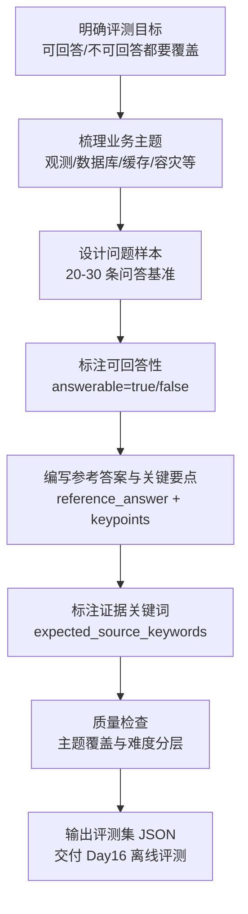
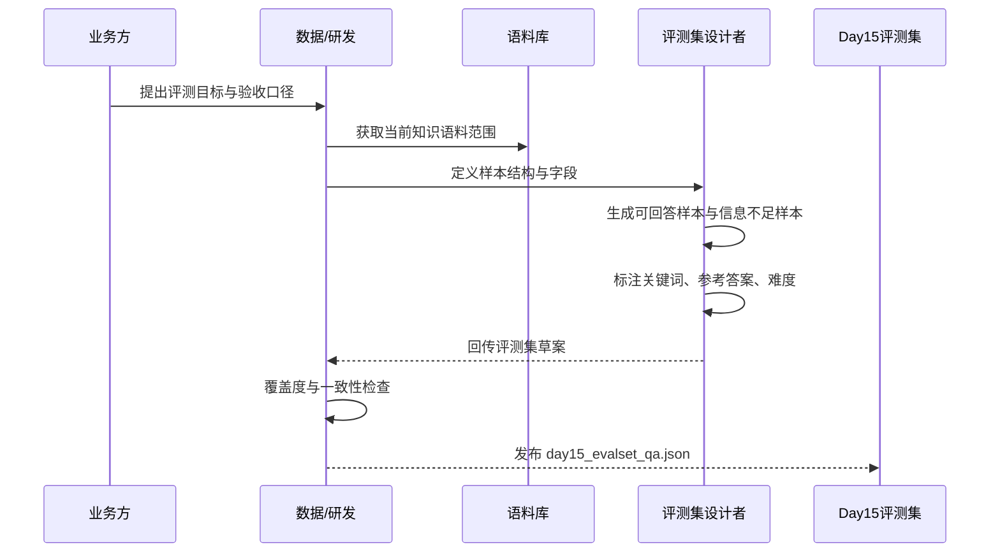

# Day 15 评测集设计说明（20-30 条问答基准）

## 1) 目标

Day15 的目标是产出一份可复用、可扩展的 RAG 基准评测集，直接支撑 Day16 离线评测脚本。

本评测集文件：
- `inputs/day15_evalset_qa.json`

## 2) 规模与构成

- 总样本数：24
- 可回答样本（answerable=true）：19
- 信息不足样本（answerable=false）：5

主题覆盖：
- observability
- database
- cache
- microservice
- container
- api-design
- resilience
- rag-chunking
- cross-topic
- insufficient-info

难度分层：
- easy：基础事实与枚举
- medium：多要点融合与因果解释
- hard：跨段综合与防幻觉边界

## 3) 字段定义

每条 case 包含：
- `id`：样本唯一 ID（如 D15-001）
- `question`：评测问题
- `answerable`：是否可由语料直接回答
- `reference_answer`：参考答案（用于人工比对或自动语义比对）
- `answer_keypoints`：关键要点（用于简单覆盖率打分）
- `expected_source_keywords`：期望命中的语料关键词（用于检索命中率/引用正确率近似评估）
- `category`：主题类别
- `difficulty`：难度
- `notes`：备注

## 4) Day16 对接建议

离线评测可先实现一个轻量版本：

1. 命中率（retrieval_hit_rate）
- 仅统计 `answerable=true` 的样本
- 若 Top-K 引用片段文本中包含任一 `expected_source_keywords`，记为命中

2. 引用正确率（citation_valid_rate）
- 若回答满足引用格式校验（你当前 Day11-Day14 已有）且命中关键词，记为引用正确
- 也可拆分成：
  - `citation_format_valid_rate`
  - `citation_grounded_rate`

3. 信息不足正确率（insufficient_precision）
- 对 `answerable=false` 样本，若回答出现“当前信息不足”且不编造具体细节，记为正确拒答

## 5) 评测集迭代建议

- 后续可把 `expected_source_keywords` 升级为更稳定的证据标注：
  - 段落 ID
  - 字符区间（start/end）
  - 可接受证据集合（support sets）
- 当语料规模增大后，可补齐：
  - 多跳问题
  - 同义改写对抗样本
  - 时间变化与版本漂移样本

## 6) 业务图解（Mermaid）

### 业务流程图（Day15 评测集设计）

### 业务时序图（Day15 评测集产出）

