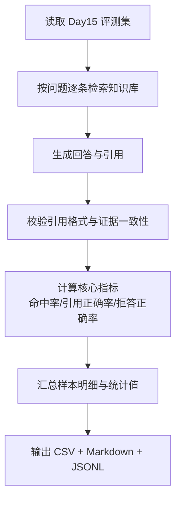
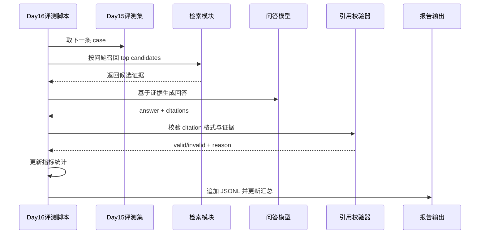

# Day 16 离线评测报告（命中率、引用正确率）

- 生成时间（UTC）：2026-07-05T03:57:28.932522+00:00
- 评测集：inputs/day15_evalset_qa.json
- 语料文件：inputs/day8_corpus_backend_notes.txt
- chunk_size / overlap：80 / 20
- top-k：3
- candidate_top_n：8
- use_rerank：True
- embedding 模型：nomic-embed-text
- QA 模型：qwen2.5:0.5b

## 汇总指标

| metric | value |
|---|---:|
| total_cases | 24 |
| answerable_cases | 19 |
| unanswerable_cases | 5 |
| retrieval_hit_rate | 0.632 |
| citation_correct_rate | 0.526 |
| insufficient_correct_rate | 0.400 |
| citation_format_valid_rate | 0.792 |
| avg_attempt_count | 1.00 |
| avg_total_tokens | 617.5 |

## 指标口径

- retrieval_hit_rate：仅对可回答样本统计；Top-K 片段命中 expected_source_keywords 即记为命中。
- citation_correct_rate：仅对可回答样本统计；要求 citation_valid=true 且引用 chunk 命中 expected_source_keywords。
- insufficient_correct_rate：仅对不可回答样本统计；回答包含“当前信息不足”即记为正确拒答。

## 样本明细（前 12 条）

| id | answerable | retrieval_hit | citation_valid | citation_correct | insufficient_correct | attempts | total_tokens |
|---|---:|---:|---:|---:|---:|---:|---:|
| D15-001 | 1 | 1 | 0 | 0 | 0 | 1 | 622 |
| D15-002 | 1 | 1 | 1 | 1 | 0 | 1 | 662 |
| D15-003 | 1 | 0 | 0 | 0 | 0 | 1 | 619 |
| D15-004 | 1 | 0 | 1 | 0 | 0 | 1 | 596 |
| D15-005 | 1 | 1 | 1 | 1 | 0 | 1 | 611 |
| D15-006 | 1 | 1 | 1 | 1 | 0 | 1 | 675 |
| D15-007 | 1 | 0 | 1 | 0 | 0 | 1 | 656 |
| D15-008 | 1 | 1 | 0 | 0 | 0 | 1 | 676 |
| D15-009 | 1 | 1 | 1 | 1 | 0 | 1 | 683 |
| D15-010 | 1 | 0 | 1 | 0 | 0 | 1 | 584 |
| D15-011 | 1 | 1 | 1 | 1 | 0 | 1 | 629 |
| D15-012 | 1 | 0 | 1 | 0 | 0 | 1 | 567 |

## 业务图解（Mermaid）

### 业务流程图（Day16 离线评测）

### 业务时序图（Day16 单条样本评测）

