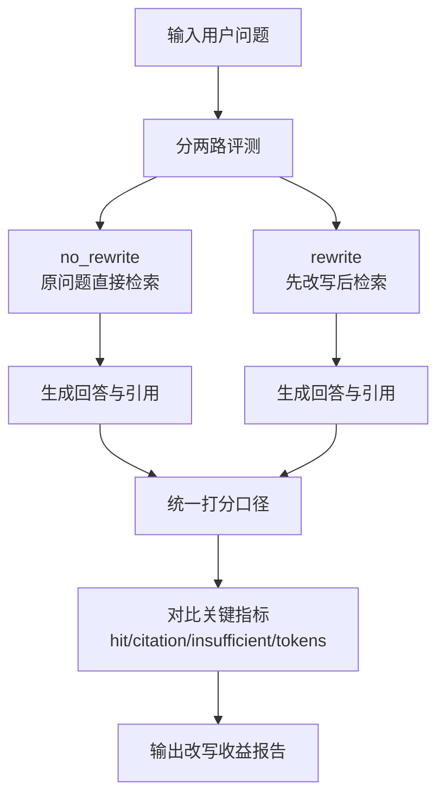
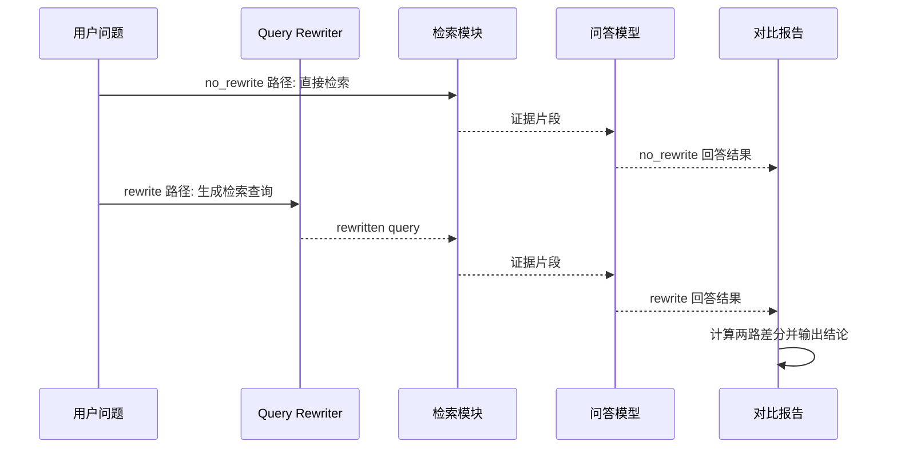

# Day 17 查询改写对比报告（No-Rewrite vs Rewrite）

- 生成时间（UTC）：2026-07-05T08:07:35.466804+00:00
- 评测集：inputs/day15_evalset_qa.json
- 语料文件：inputs/day8_corpus_backend_notes.txt
- chunk_size / overlap：80 / 20
- top-k：3
- candidate_top_n：8
- use_rerank：True
- embedding 模型：nomic-embed-text
- QA 模型：qwen2.5:0.5b
- Rewrite 模型：qwen2.5:0.5b

## 汇总对比

| mode | query_count | retrieval_hit_rate | citation_correct_rate | insufficient_correct_rate | citation_format_valid_rate | avg_total_tokens | rewrite_changed_rate | avg_rewrite_tokens |
|---|---:|---:|---:|---:|---:|---:|---:|---:|
| no_rewrite | 6 | 0.667 | 0.500 | 0.000 | 0.833 | 645.3 | 0.000 | 0.0 |
| rewrite | 6 | 0.667 | 0.500 | 0.000 | 0.667 | 640.2 | 0.667 | 219.0 |

## 指标变化（rewrite - no_rewrite）

- retrieval_hit_rate: +0.000
- citation_correct_rate: +0.000
- insufficient_correct_rate: +0.000
- citation_format_valid_rate: -0.167
- avg_total_tokens: -5.2

## 业务图解（Mermaid）

### 业务流程图（Day17 查询改写对比）

### 业务时序图（Day17 改写链路）

