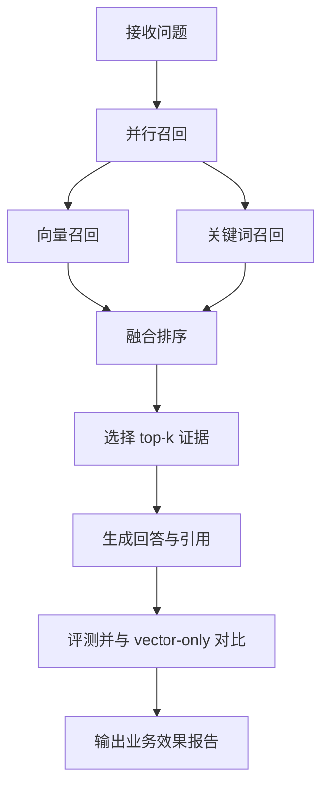
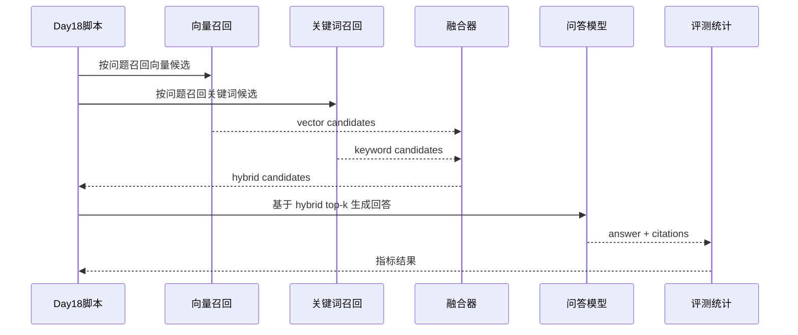
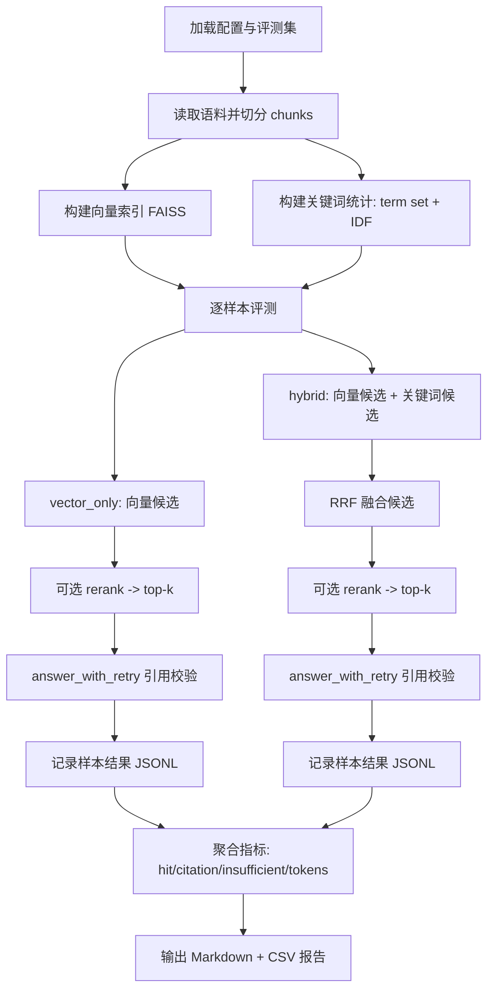
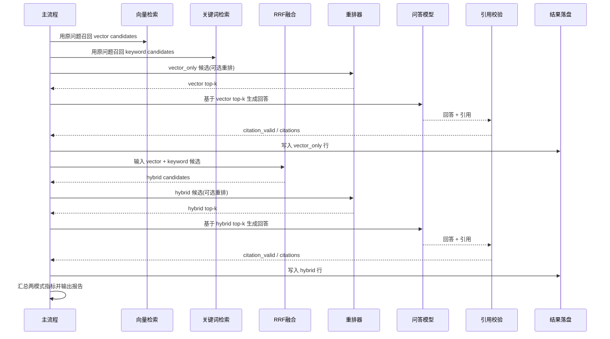

# Day 18 多路召回对比报告（Vector-Only vs Hybrid）

- 生成时间（UTC）：2026-07-05T09:59:55.180069+00:00
- 评测集：inputs/day15_evalset_qa.json
- 语料文件：inputs/day8_corpus_backend_notes.txt
- chunk_size / overlap：80 / 20
- top-k：3
- candidate_top_n：8
- use_rerank：True
- embedding 模型：nomic-embed-text
- QA 模型：qwen2.5:0.5b
- hybrid vector/keyword weight：0.7/0.3

## 汇总对比

| mode | query_count | retrieval_hit_rate | citation_correct_rate | insufficient_correct_rate | citation_format_valid_rate | avg_total_tokens |
|---|---:|---:|---:|---:|---:|---:|
| vector_only | 24 | 0.632 | 0.474 | 0.600 | 0.667 | 637.5 |
| hybrid | 24 | 0.895 | 0.579 | 0.600 | 0.625 | 621.2 |

## 指标变化（hybrid - vector_only）

- retrieval_hit_rate: +0.263
- citation_correct_rate: +0.105
- insufficient_correct_rate: +0.000
- citation_format_valid_rate: -0.042
- avg_total_tokens: -16.3

## 业务图解（Mermaid）

### 业务流程图（Day18 多路召回）

### 业务时序图（Day18 双路融合）

## 技术图解（Mermaid）

### 流程图（Day18 多路召回评测流程）

### 时序图（单样本双模式对比）

