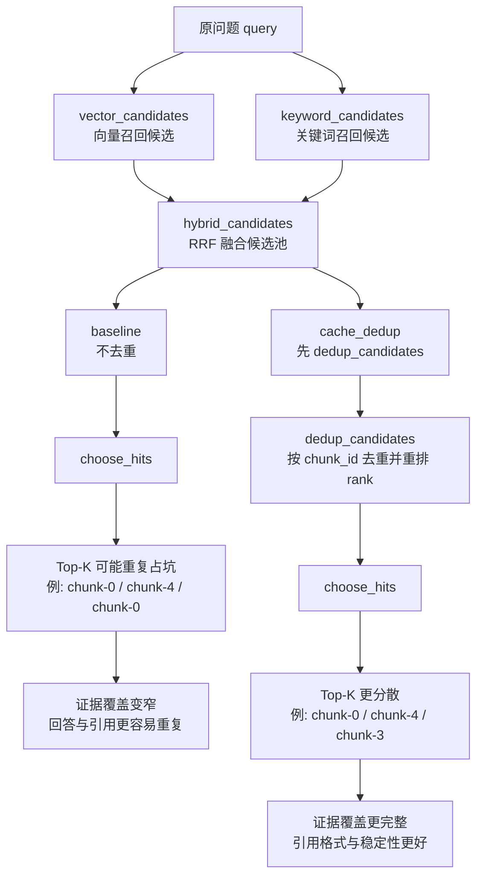
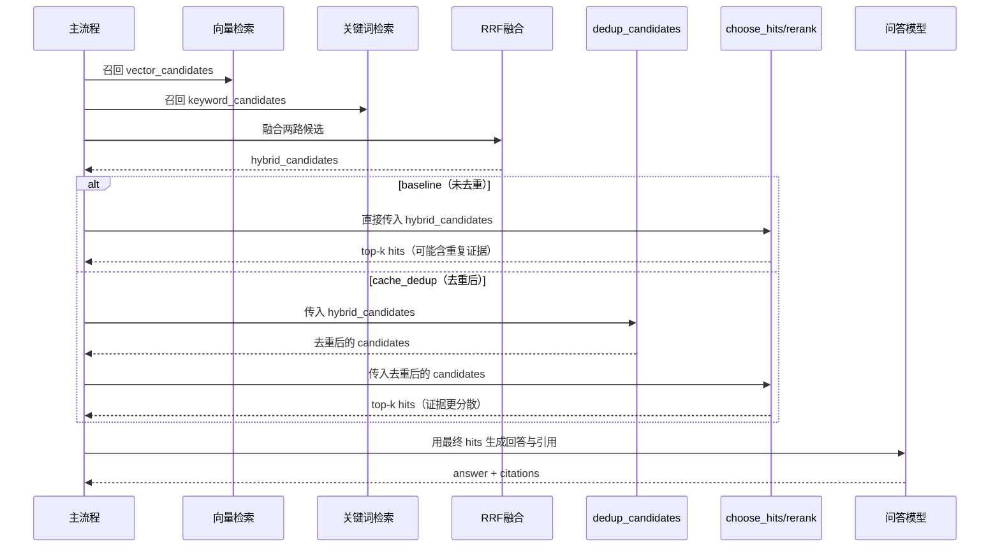

# Day 19 缓存与去重对比报告（Baseline vs Cache+Dedup）

- 生成时间（UTC）：2026-07-06T01:56:25.184944+00:00
- 评测集：inputs/day15_evalset_qa.json
- 语料文件：inputs/day8_corpus_backend_notes.txt
- chunk_size / overlap：80 / 20
- top-k：3
- candidate_top_n：8
- use_rerank：True
- embedding 模型：nomic-embed-text
- QA 模型：qwen2.5:0.5b

## 汇总对比

| mode | query_count | retrieval_hit_rate | citation_correct_rate | insufficient_correct_rate | citation_format_valid_rate | avg_total_tokens | avg_elapsed_ms | cache_hit_rate | avg_dedup_removed |
|---|---:|---:|---:|---:|---:|---:|---:|---:|---:|
| baseline | 2 | 1.000 | 0.500 | 0.000 | 0.500 | 615.5 | 12888.3 | 0.000 | 0.00 |
| cache_dedup | 2 | 1.000 | 1.000 | 0.000 | 1.000 | 600.0 | 9937.1 | 0.000 | 0.00 |

## 指标变化（cache_dedup - baseline）

- retrieval_hit_rate: +0.000
- citation_correct_rate: +0.500
- insufficient_correct_rate: +0.000
- citation_format_valid_rate: +0.500
- avg_total_tokens: -15.5
- avg_elapsed_ms: -2951.2
- cache_hit_rate(cache_dedup): 0.000
- dedup_total_removed(cache_dedup): 0

## 技术图解（Mermaid）

### 流程图（Day19 未去重 vs 去重后）

### 时序图（hybrid_candidates -> dedup_candidates -> choose_hits）

