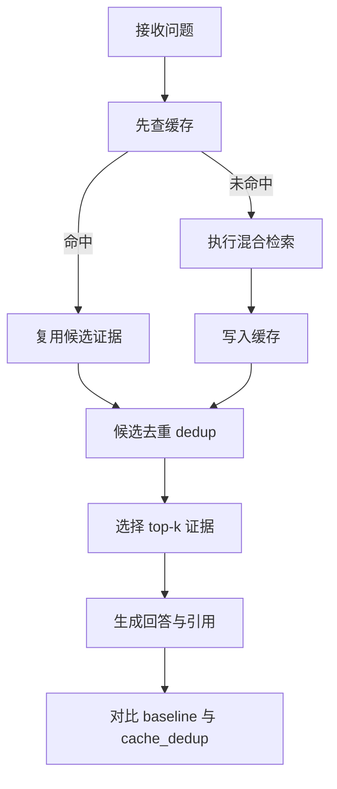
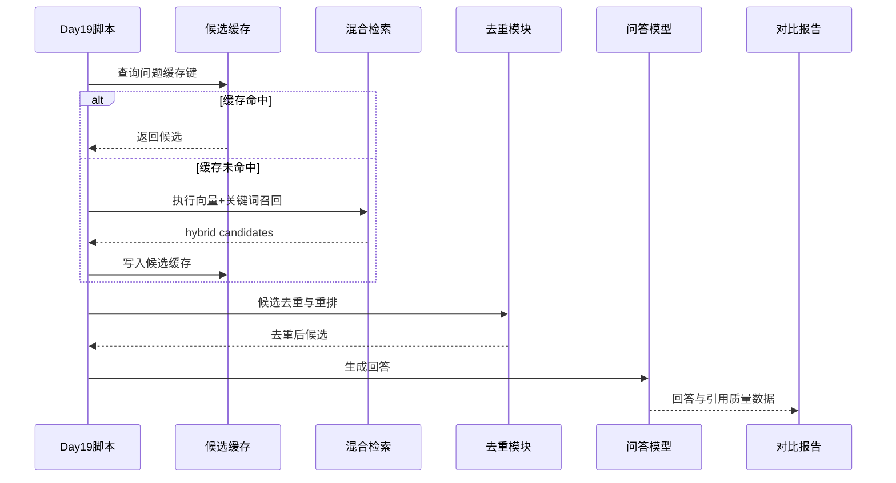
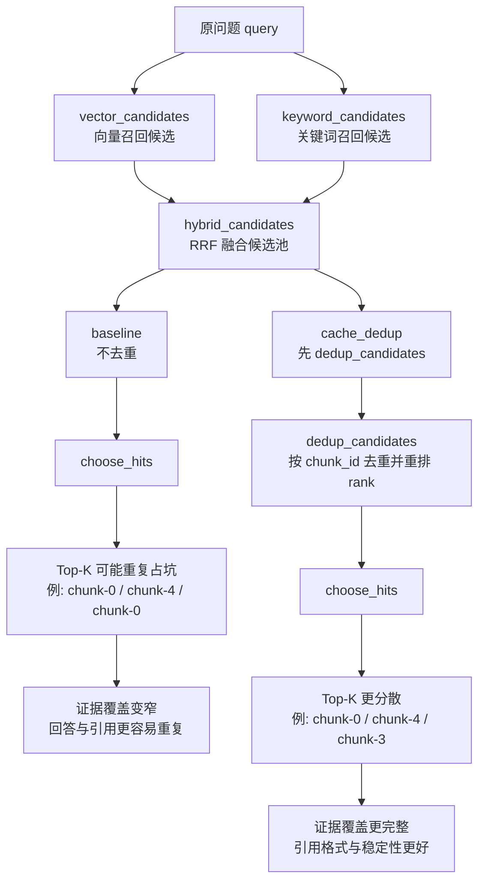
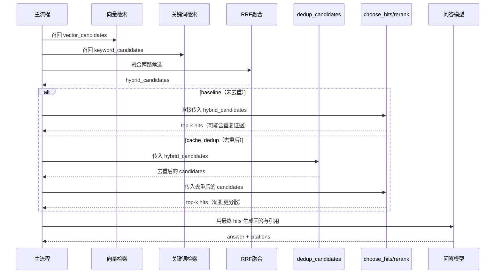

# Day 19 缓存与去重对比报告（Baseline vs Cache+Dedup）

- 生成时间（UTC）：2026-07-06T02:31:42.732244+00:00
- 评测集：inputs/day15_evalset_qa.json
- 语料文件：inputs/day8_corpus_backend_notes.txt
- chunk_size / overlap：80 / 20
- top-k：3
- candidate_top_n：8
- use_rerank：True
- embedding 模型：nomic-embed-text
- QA 模型：qwen2.5:0.5b

## 汇总对比

| mode | query_count | retrieval_hit_rate | citation_correct_rate | insufficient_correct_rate | citation_format_valid_rate | avg_total_tokens | avg_elapsed_ms | cache_hit_rate | avg_dedup_removed |
|---|---:|---:|---:|---:|---:|---:|---:|---:|---:|
| baseline | 24 | 0.895 | 0.474 | 0.600 | 0.625 | 640.3 | 8475.6 | 0.000 | 0.00 |
| cache_dedup | 24 | 0.895 | 0.632 | 0.600 | 0.750 | 625.5 | 7461.2 | 0.000 | 0.00 |

## 指标变化（cache_dedup - baseline）

- retrieval_hit_rate: +0.000
- citation_correct_rate: +0.158
- insufficient_correct_rate: +0.000
- citation_format_valid_rate: +0.125
- avg_total_tokens: -14.8
- avg_elapsed_ms: -1014.4
- cache_hit_rate(cache_dedup): 0.000
- dedup_total_removed(cache_dedup): 0

## 业务图解（Mermaid）

### 业务流程图（Day19 缓存与去重）

### 业务时序图（Day19 缓存命中/未命中）

## 技术图解（Mermaid）

### 流程图（Day19 未去重 vs 去重后）

### 时序图（hybrid_candidates -> dedup_candidates -> choose_hits）

