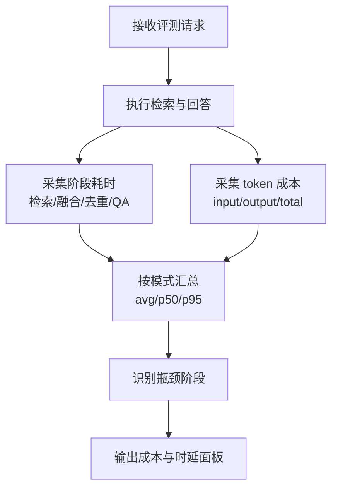
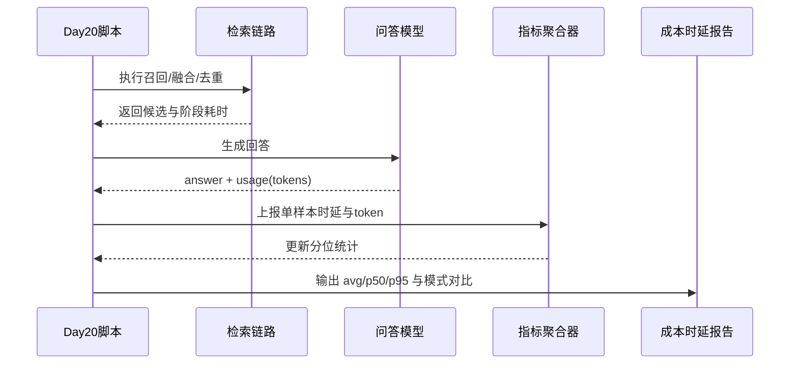

# Day 20 延迟与成本统计报告（Per-Request Token + Latency）

- 生成时间（UTC）：2026-07-06T08:15:38.307180+00:00
- 评测集：inputs/day15_evalset_qa.json
- 语料文件：inputs/day8_corpus_backend_notes.txt
- chunk_size / overlap：80 / 20
- top-k：3
- candidate_top_n：8
- use_rerank：True
- embedding 模型：nomic-embed-text
- QA 模型：qwen2.5:0.5b

## 统计口径

- QA token：精确取自问答请求 usage（input/output/total）。
- embedding 成本：当前仅统计请求次数与耗时；不统计 token，因为 embedding 接口未返回 usage。
- 延迟拆分：vector_retrieval_ms / keyword_retrieval_ms / fusion_ms / dedup_ms / choose_hits_ms / qa_ms / end_to_end_ms。

## 汇总对比

| mode | query_count | qa_total_tokens_avg | qa_total_tokens_p95 | end_to_end_ms_avg | end_to_end_ms_p95 | qa_ms_avg | qa_ms_p95 | embedding_ms_avg | avg_embedding_request_count | cache_hit_rate | avg_dedup_removed |
|---|---:|---:|---:|---:|---:|---:|---:|---:|---:|---:|---:|
| baseline | 24 | 648.8 | 817.6 | 12136.2 | 19625.0 | 12001.5 | 19226.8 | 134.0 | 1.00 | 0.000 | 0.00 |
| cache_dedup | 24 | 627.3 | 715.3 | 9141.8 | 15405.2 | 9008.0 | 15186.4 | 133.0 | 1.00 | 0.000 | 0.00 |

## 指标变化（cache_dedup - baseline）

- qa_total_tokens_avg: -21.5
- end_to_end_ms_avg: -2994.4
- qa_ms_avg: -2993.5
- embedding_ms_avg: -1.0
- cache_hit_rate(cache_dedup): 0.000
- avg_embedding_request_count(cache_dedup): 1.00
- avg_dedup_removed(cache_dedup): 0.00

## 业务图解（Mermaid）

### 业务流程图（Day20 延迟与成本统计）

### 业务时序图（Day20 指标采集闭环）

