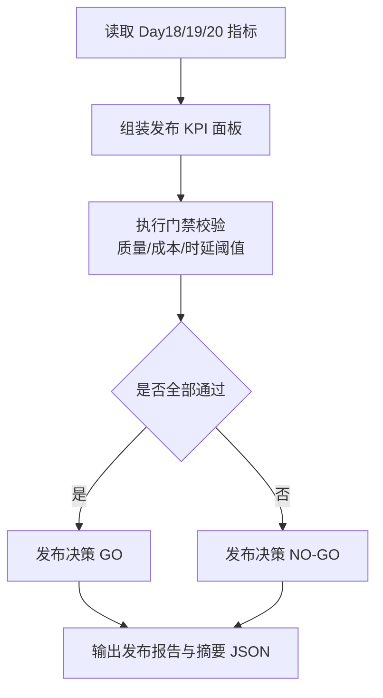
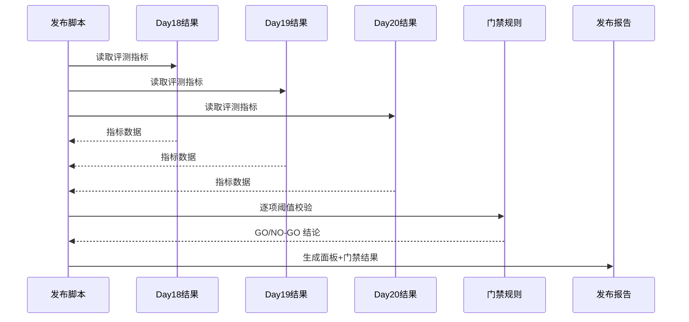

# Day 21 RAG V2 发布报告（指标面板 + 评测门禁）

- 生成时间（UTC）：2026-07-06T09:44:50.422519+00:00
- 发布候选模式：cache_dedup
- Day18 CSV：experiments/day18_hybrid_retrieval_comparison.csv
- Day19 CSV：experiments/day19_cache_dedup_comparison_full_20260706.csv
- Day20 CSV：experiments/day20_latency_cost_analysis_full_20260706.csv

## 发布结论

- 决策：**NO-GO**

## 指标面板

| 指标 | Day18 (hybrid) | Day19 (cache_dedup) | Day20 (target) |
|---|---:|---:|---:|
| retrieval_hit_rate | 0.895 | 0.895 | 0.895 |
| citation_correct_rate | 0.579 | 0.632 | 0.684 |
| citation_format_valid_rate | 0.625 | 0.750 | 0.667 |
| insufficient_correct_rate | 0.600 | 0.600 | 0.200 |
| qa_total_tokens_avg | 621.250 | 625.500 | 627.333 |
| end_to_end_ms_avg | 0.000 | 7461.248 | 9141.784 |
| end_to_end_ms_p95 | 0.000 | 0.000 | 15405.170 |

## 发布门禁

| 门禁项 | 实际值 | 目标 | 结果 |
|---|---:|---:|---|
| retrieval_hit_rate | 0.895 | >= 0.850 | PASS |
| citation_correct_rate | 0.684 | >= 0.600 | PASS |
| citation_format_valid_rate | 0.667 | >= 0.650 | PASS |
| insufficient_correct_rate | 0.200 | >= 0.500 | FAIL |
| qa_total_tokens_avg | 627.333 | <= 680.000 | PASS |
| end_to_end_ms_avg | 9141.784 | <= 10000.000 | PASS |
| end_to_end_ms_p95 | 15405.170 | <= 17000.000 | PASS |

## 备注

- Day20 的 token 为 QA usage 精确值；embedding 成本为请求次数+耗时估算。
- 当前 target mode=cache_dedup，query_count=24。
- 若 insufficient_correct_rate 低于阈值，建议先优化拒答策略再发布。

## 业务图解（Mermaid）

### 业务流程图（Day21 RAG V2 发布门禁）

### 业务时序图（Day21 发布评审）

