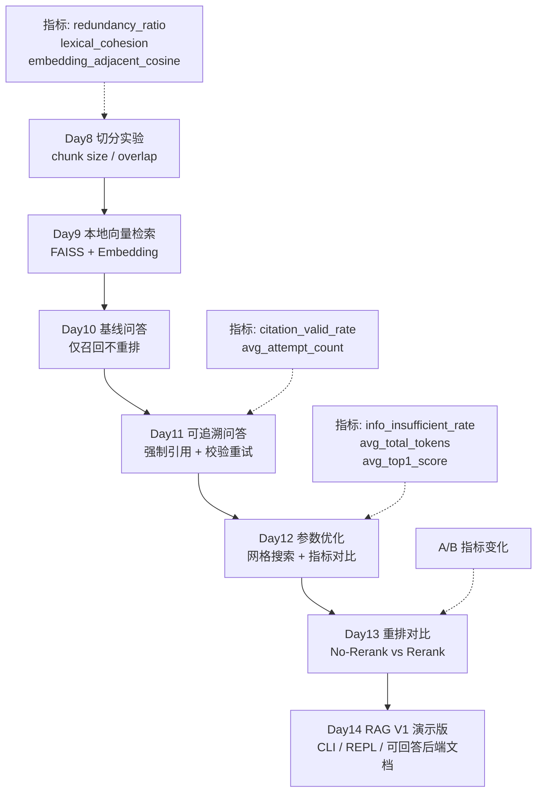
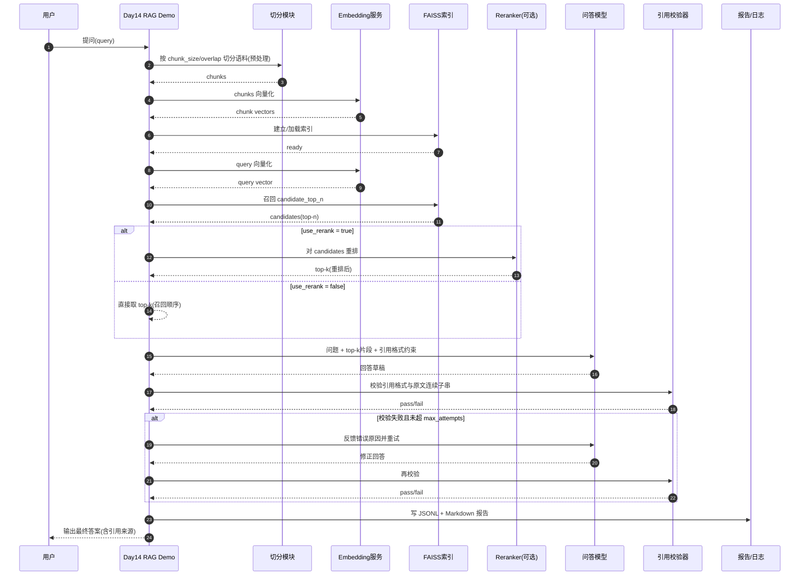
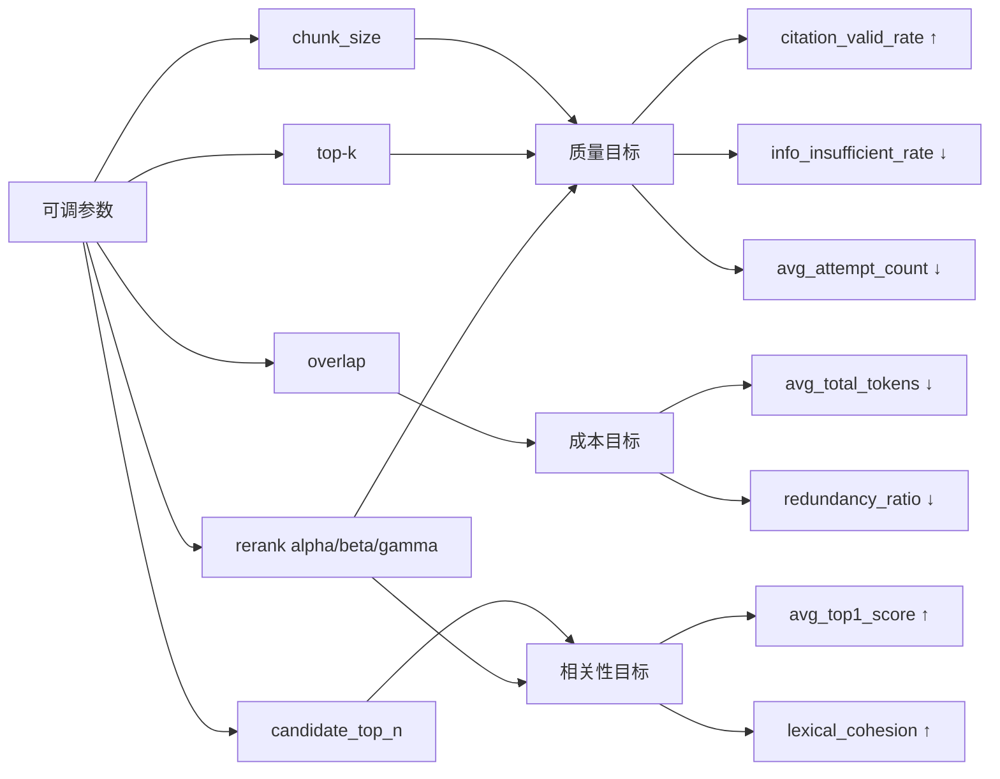

# Day8-Day14 技术细节图解（Mermaid）

## 1) 全链路演进流程图（技术细节版）

```mermaid
flowchart TD
    A[Day8 切分实验<br/>chunk size / overlap] --> B[Day9 本地向量检索<br/>FAISS + Embedding]
    B --> C[Day10 基线问答<br/>仅召回不重排]
    C --> D[Day11 可追溯问答<br/>强制引用 + 校验重试]
    D --> E[Day12 参数优化<br/>网格搜索 + 指标对比]
    E --> F[Day13 重排对比<br/>No-Rerank vs Rerank]
    F --> G[Day14 RAG V1 演示版<br/>CLI / REPL / 可回答后端文档]

    A1[指标: redundancy_ratio<br/>lexical_cohesion<br/>embedding_adjacent_cosine] -.-> A
    D1[指标: citation_valid_rate<br/>avg_attempt_count] -.-> D
    E1[指标: info_insufficient_rate<br/>avg_total_tokens<br/>avg_top1_score] -.-> E
    F1[A/B 指标变化] -.-> F
```

## 2) RAG 运行时序图（技术细节版）

```mermaid
sequenceDiagram
    autonumber
    participant User as 用户
    participant App as Day14 RAG Demo
    participant Split as 切分模块
    participant Emb as Embedding服务
    participant VDB as FAISS索引
    participant RR as Reranker(可选)
    participant LLM as 问答模型
    participant Validator as 引用校验器
    participant Log as 报告/日志

    User->>App: 提问(query)
    App->>Split: 按 chunk_size/overlap 切分语料(预处理)
    Split-->>App: chunks
    App->>Emb: chunks 向量化
    Emb-->>App: chunk vectors
    App->>VDB: 建立/加载索引
    VDB-->>App: ready

    App->>Emb: query 向量化
    Emb-->>App: query vector
    App->>VDB: 召回 candidate_top_n
    VDB-->>App: candidates(top-n)

    alt use_rerank = true
        App->>RR: 对 candidates 重排
        RR-->>App: top-k(重排后)
    else use_rerank = false
        App-->>App: 直接取 top-k(召回顺序)
    end

    App->>LLM: 问题 + top-k片段 + 引用格式约束
    LLM-->>App: 回答草稿
    App->>Validator: 校验引用格式与原文连续子串
    Validator-->>App: pass/fail

    alt 校验失败且未超 max_attempts
        App->>LLM: 反馈错误原因并重试
        LLM-->>App: 修正回答
        App->>Validator: 再校验
        Validator-->>App: pass/fail
    end

    App->>Log: 写 JSONL + Markdown 报告
    App-->>User: 输出最终答案(含引用来源)
```

## 3) 参数-指标-目标关系图（技术细节版）

```mermaid
flowchart LR
    Q[质量目标] --> Q1[citation_valid_rate ↑]
    Q --> Q2[info_insufficient_rate ↓]
    Q --> Q3[avg_attempt_count ↓]

    C[成本目标] --> C1[avg_total_tokens ↓]
    C --> C2[redundancy_ratio ↓]

    R[相关性目标] --> R1[avg_top1_score ↑]
    R --> R2[lexical_cohesion ↑]

    P[可调参数] --> P1[chunk_size]
    P --> P2[overlap]
    P --> P3[top-k]
    P --> P4[candidate_top_n]
    P --> P5[rerank alpha/beta/gamma]

    P1 --> Q
    P2 --> C
    P3 --> Q
    P4 --> R
    P5 --> Q
    P5 --> R
```
