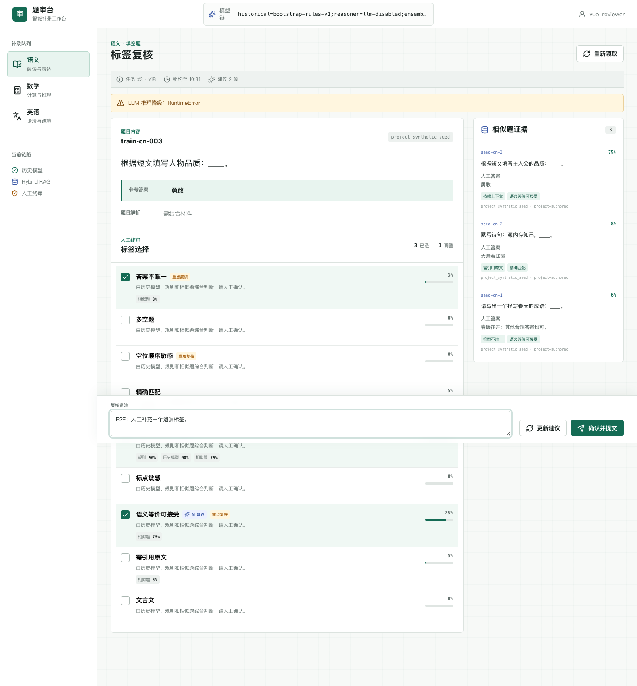
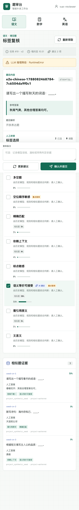
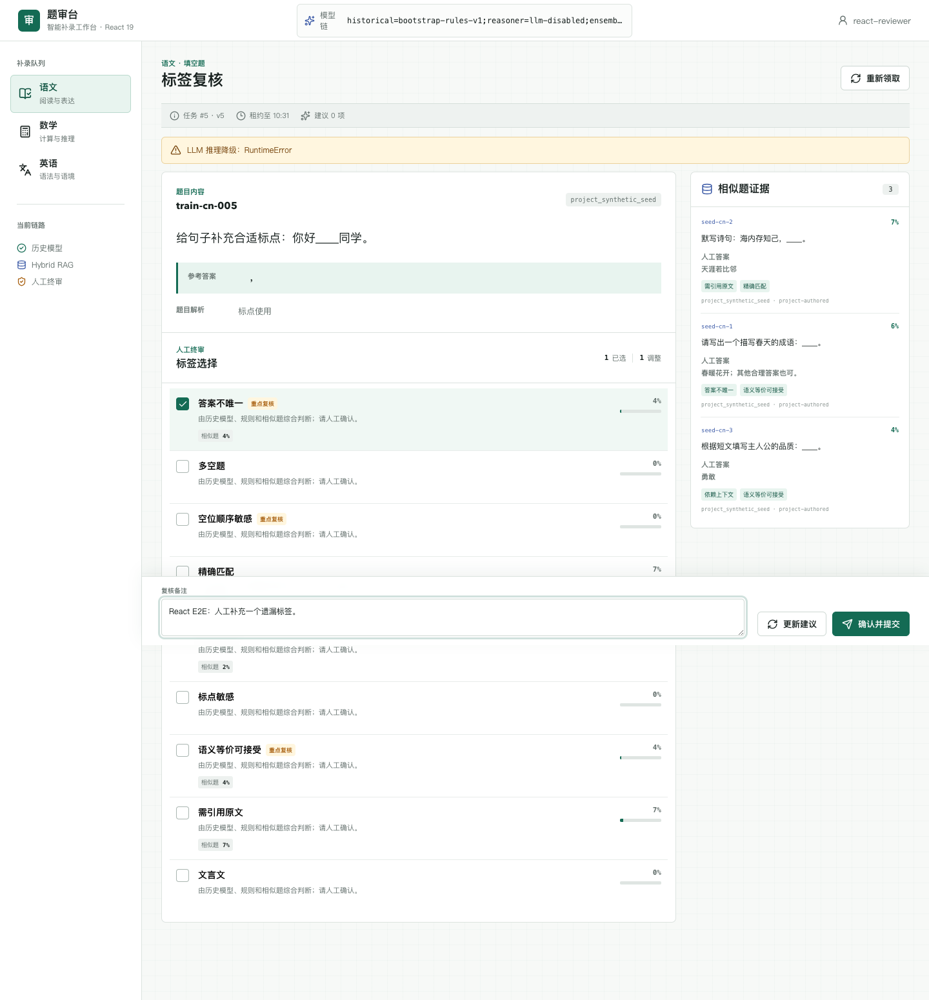
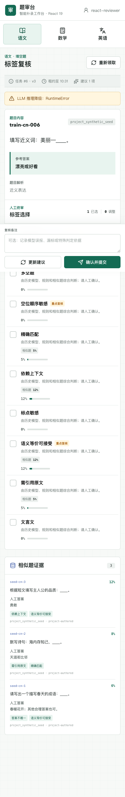

# 题审台：LLM + RAG 智能题目标注补录系统

这是一个面向线上生产场景的中小学填空题补录系统。系统处理语文、数学、英语题目，先通过“历史人工标签模型 + 规则 + Hybrid RAG + LangChain LLM”生成标签建议，再由业务人员在 Vue 或 React 工作台中核验并提交，人工结果继续进入训练和评测闭环。

项目不是让 LLM 自动改写数据库。模型只提供受控标签建议，最终业务事实始终由人工提交事务确认。

## 页面预览

Vue 3 桌面补录工作台：



Vue 3 移动端响应式布局：



React 19 桌面补录工作台：



React 19 移动端响应式布局：



两套页面复用同一个 FastAPI、接口类型、业务流程和视觉规范，便于逐项比较框架差异，而不是比较两个不同业务实现。

## 当前实现状态

| 能力 | 状态 | 主要实现 |
| --- | --- | --- |
| Vue 3 补录工作台 | 已实现并构建通过 | `frontend/src/App.vue` |
| React 19 补录工作台 | 已实现并通过桌面/移动 E2E | `frontend-react/src/App.tsx` |
| FastAPI REST API | 已实现并通过 E2E API 测试 | `backend/app/main.py` |
| LangGraph 预标注流程 | 已实现 | `backend/app/services/labeling_workflow.py` |
| LangChain 结构化 LLM | 已实现，可切换 OpenAI-compatible 服务 | `backend/app/adapters/llm_reasoner.py` |
| 100 万级历史数据训练 | 已实现流式增量训练 | `backend/app/training/train_historical_model.py` |
| Dense + Sparse Hybrid RAG | 已实现 Qdrant + MySQL FULLTEXT + RRF | `backend/app/adapters/rag.py` |
| 人工反馈与发布门禁 | 已实现 | `backend/app/evaluation/evaluate_feedback.py` |
| 异步预测 Worker | 已实现数据库租约队列 | `backend/app/worker.py` |
| JWT、幂等、乐观锁、审计 | 已实现 | `backend/app/core/auth.py`、`backend/app/db/repositories.py` |
| MySQL 数据库迁移 | 已实现并完成 SQLite 升降级验证 | `backend/migrations/` |
| Prometheus 指标 | 已实现 | `GET /metrics` |
| 容器拓扑 | 已提供 | `compose.yaml` |

## 为什么使用四路信号

| 信号 | 解决的问题 | 局限 |
| --- | --- | --- |
| 确定性规则 | 多空、单位、诗句默写等明显特征 | 不能覆盖复杂语义 |
| 历史标签模型 | 利用 100 万以上已标注数据，低延迟预测 | 容易受历史分布和标签噪声影响 |
| Hybrid RAG | 找到人工确认过的相似题和来源证据 | 召回相似不等于标签一定相同 |
| LangChain LLM | 综合题干、答案、标签定义和证据并解释 | 有成本、延迟和概率性 |

四路结果在 LangGraph 的 `ensemble` 节点中融合，前端只将达到阈值的标签默认勾选，同时展示各信号分数和相似题，最终仍由人工确认。

## 项目结构

```text
question_labeling_system/
├── backend/
│   ├── app/
│   │   ├── adapters/       # 历史模型、LangChain LLM、Dense/Sparse RAG
│   │   ├── api/            # FastAPI 请求响应和路由
│   │   ├── core/           # 配置、JWT、Prometheus
│   │   ├── db/             # SQLAlchemy 表与事务仓储
│   │   ├── domain/         # 题目、标签、预测领域契约
│   │   ├── evaluation/     # 人工反馈评测与发布门禁
│   │   ├── services/       # LangGraph 与应用用例
│   │   └── training/       # 训练、SFT 导出、Qdrant 索引、种子导入
│   ├── migrations/         # Alembic 生产迁移
│   └── tests/              # 后端与 API 自动化测试
├── frontend/
│   ├── src/                # Vue 3 + TypeScript 工作台
│   └── e2e/                # Playwright 桌面/移动测试
├── frontend-react/
│   ├── src/                # React 19 + TypeScript 工作台
│   └── e2e/                # React Playwright 桌面/移动测试
├── data/                   # 原创合成学习数据；本地数据库被忽略
├── docs/                   # 架构、Vue、运维与面试文档
├── artifacts/              # 模型和评测流水线产物，不提交仓库
└── compose.yaml            # MySQL、Qdrant、API、Worker、Vue/React Nginx
```

## 本地运行

### 1. 后端依赖

项目复用 `llm-day1/.venv`：

```bash
cd /Users/zhaoyonggng/work/llm-day1
source .venv/bin/activate
pip install -r question_labeling_system/backend/requirements.txt
```

### 2. 导入本地题目

本地数据是本项目原创合成样本，不从未知许可证网页复制题库：

```bash
cd question_labeling_system/backend
PYTHONPATH=. ../../.venv/bin/python -m app.training.seed_local
```

该命令幂等，可重复执行。默认使用 SQLite、规则冷启动模型、本地 RAG 和禁用 LLM 的明确降级模式。

### 3. 启动 FastAPI

```bash
cd question_labeling_system/backend
PYTHONPATH=. ../../.venv/bin/python -m uvicorn app.main:app \
  --host 127.0.0.1 \
  --port 8010
```

接口地址：

- API 文档：<http://127.0.0.1:8010/docs>
- 存活探针：<http://127.0.0.1:8010/healthz>
- 就绪探针：<http://127.0.0.1:8010/readyz>
- Prometheus：<http://127.0.0.1:8010/metrics>

### 4. 启动任一前端

Vue 和 React 只需启动其中一个；也可同时启动并对照同一后端数据。

Vue 开发服务器使用 5173：

如果 `node` 已在 PATH：

```bash
cd question_labeling_system/frontend
npm install
npm run dev -- --host 127.0.0.1
```

当前工作区也安装了用户级 Node 22，可使用：

```bash
PATH="$HOME/.local/node/bin:$PATH" npm run dev -- --host 127.0.0.1
```

页面地址：<http://127.0.0.1:5173/>

React 开发服务器使用 5174：

```bash
cd question_labeling_system/frontend-react
npm install
npm run dev -- --host 127.0.0.1
```

当前工作区的用户级 Node 22 运行方式：

```bash
PATH="$HOME/.local/node/bin:$PATH" npm run dev -- --host 127.0.0.1
```

React 页面地址：<http://127.0.0.1:5174/>

两套 Vite 开发服务器都把 `/api` 代理到 <http://127.0.0.1:8010>，无需复制或修改后端。

## API 主流程

| Method | Path | 作用 | 角色 |
| --- | --- | --- | --- |
| `GET` | `/api/v1/me` | 返回服务端验证后的当前主体 | 已认证用户 |
| `POST` | `/api/v1/questions` | 幂等导入新题，可同步预测 | `importer` |
| `POST` | `/api/v1/questions/{id}/predict` | 复用或强制刷新预测 | `labeler` |
| `GET` | `/api/v1/tasks/next` | 按学科租约领取下一题 | `labeler` |
| `GET` | `/api/v1/tasks/{id}` | 刷新当前任务与预测 | `labeler` |
| `GET` | `/api/v1/taxonomy` | 获取学科标签字典 | `labeler` |
| `POST` | `/api/v1/tasks/{id}/submit` | 幂等提交人工最终标签 | `labeler` |

生产使用 RS256 JWT。开发模式的 `X-Debug-User` 与 `X-Debug-Roles` 只在 `AUTH_DISABLED=true` 时生效，生产配置门禁会拒绝关闭认证。

## 标签字典

通用标签包括：

- 答案不唯一
- 多空题
- 空位顺序敏感
- 精确匹配
- 依赖上下文

语文扩展：标点敏感、语义等价、需引用原文、文言文。

数学扩展：需要计算、必须带单位、等价表达式、需填写公式。

英语扩展：大小写敏感、拼写敏感、时态考点、词性变化。

标签编码由 `backend/app/domain/taxonomy.py` 控制。模型不能创造标签，人工也不能向某学科提交不适用标签。

## 训练历史模型

从 MySQL 流式训练：

```bash
cd question_labeling_system/backend
PYTHONPATH=. ../../.venv/bin/python -m app.training.train_historical_model \
  --database-url "$DATABASE_URL" \
  --output ../artifacts/label_model.joblib \
  --epochs 2 \
  --batch-size 2048 \
  --evaluation-percent 10
```

实现选择字符 2-5 gram `HashingVectorizer` 与每标签 `SGDClassifier.partial_fit`：

- 不维护百万数据词表，峰值内存由 batch 控制。
- 中文、英文拼写、数字和数学符号都可形成特征。
- 使用稳定 `external_id` 哈希留出集，避免每次评测漂移。
- 使用正例权重缓解稀有标签不平衡。
- 原子发布 `.joblib` 和 `.manifest.json`。

这是一条可落地基线，不代表应跳过数据治理、阈值校准和与 Transformer/SFT 的真实对比。

## 构建 Hybrid RAG

Dense 索引：

```bash
PYTHONPATH=. ../../.venv/bin/python -m app.training.index_rag \
  --database-url "$DATABASE_URL" \
  --qdrant-url "$QDRANT_URL" \
  --collection labeled_questions_v1 \
  --embedding-model "$OPENAI_EMBEDDING_MODEL"
```

Sparse 索引由 Alembic 在 MySQL 上创建：

```sql
FULLTEXT INDEX ft_questions_content
  (stem, reference_answer, analysis)
  WITH PARSER ngram
```

在线检索分别得到 Dense 与 Sparse 排名，再使用 RRF 融合，不直接相加两个不可比的原始分数。

## 人工反馈和模型发布

人工提交会保存：

- 最终标签 `selected_tags`
- 人工新增标签 `added_tags`
- 人工取消标签 `removed_tags`
- 当时模型链版本
- 操作员、备注、时间、幂等键

离线评测：

```bash
PYTHONPATH=. ../../.venv/bin/python -m app.evaluation.evaluate_feedback \
  --database-url "$DATABASE_URL" \
  --model-version "候选模型链版本" \
  --min-micro-f1 0.75 \
  --min-exact-match 0.55 \
  --max-human-change-rate 0.45
```

门禁失败返回退出码 `2`，可直接阻断发布流水线。

如需 LoRA/QLoRA，可先导出与线上 Prompt 对齐的数据：

```bash
PYTHONPATH=. ../../.venv/bin/python -m app.training.export_sft_dataset \
  --database-url "$DATABASE_URL" \
  --train-output ../artifacts/sft_train.jsonl \
  --eval-output ../artifacts/sft_eval.jsonl
```

可继续复用 `llm-day1` 的 Day29-Day32 训练与前后评测思路。

## 自动化验证

后端：

```bash
cd question_labeling_system/backend
PYTHONPATH=. ../../.venv/bin/python -m unittest discover -s tests -v
```

Vue 前端：

```bash
cd question_labeling_system/frontend
npm run build
npm run test:e2e
```

React 前端：

```bash
cd question_labeling_system/frontend-react
npm run lint
npm run typecheck
npm run build
npm run test:e2e
```

## 外部题目与版权

网上题目只能在满足以下条件后进入训练或 RAG：

1. 数据集有明确许可证或已取得授权。
2. 保存 `source`、`source_uri`、`license_name` 和原始版本。
3. 清理学生姓名、账号、联系方式等个人信息。
4. 做去重、答案一致性和标签复核。
5. 训练集、评测集按题目族或来源隔离，避免近重复泄漏。

本仓库不自动抓取未知许可证网站，也不提交第三方题库原文。`data/sample_labeled_questions.jsonl` 是原创合成数据，只用于验证代码路径。

## 生产部署

`compose.yaml` 默认提供 MySQL、Qdrant、migration、API、Worker 和 Vue/Nginx 的完整集成拓扑。React/Nginx 通过 `react` profile 可选启用：

```bash
# 默认 Vue 位于 8080；同时启用 React 后，React 位于 8081。
docker compose --profile react up --build
```

生产上线前：

1. 从 `.env.production.example` 创建部署平台 Secret/Config。
2. 通过 Alembic 迁移 MySQL。
3. 训练并评测模型工件。
4. 构建版本化 Qdrant 集合。
5. 挂载 RS256 公钥和模型工件。
6. 在 TLS Ingress/API Gateway 配置 SSO、WAF、用户级限流和审计导出。
7. 使用托管 MySQL/Qdrant、多个 API/Worker 副本、备份和告警。

Compose 更适合集成验证和单机部署；高可用生产建议迁移到 Kubernetes 或公司已有容器平台。

## 文档

- [系统架构、业务流程与方法级时序](docs/ARCHITECTURE.md)
- [100 万数据、训练、RAG 与反馈闭环](docs/DATA_MODEL_AND_RAG.md)
- [Vue 3 对应用法学习指南](docs/VUE_LEARNING_GUIDE.md)
- [React 19 对应用法学习指南](docs/REACT_LEARNING_GUIDE.md)
- [Python 项目化学习指南](docs/PYTHON_LEARNING_GUIDE.md)
- [Vue 3 与 React 19 对照及选型](docs/VUE_VS_REACT.md)
- [React 前端独立运行说明](frontend-react/README.md)
- [部署、监控、回滚与安全手册](docs/OPERATIONS.md)
- [项目面试问答](docs/INTERVIEW_QA.md)

## 注释约定

Python、TypeScript、Vue、React TSX、CSS、Docker、Nginx、YAML 和迁移代码均添加了逐语句或逐逻辑行中文注释。`package.json`、`package-lock.json`、`tsconfig*.json` 与 JSONL 属于不允许注释的机器格式，其字段和用途在本文及对应专题文档中解释。
