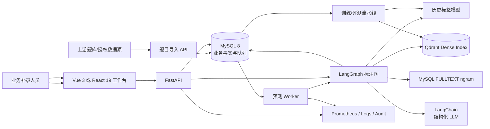
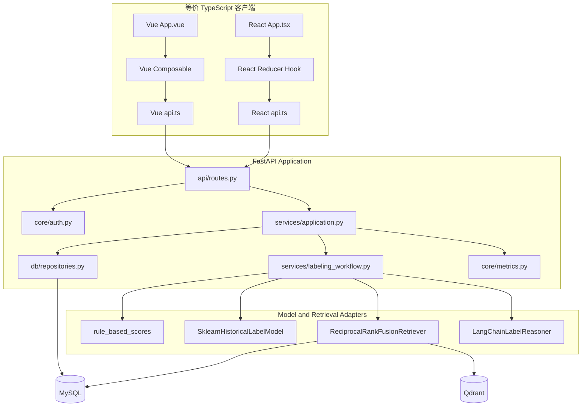
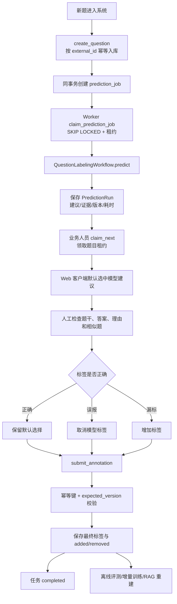
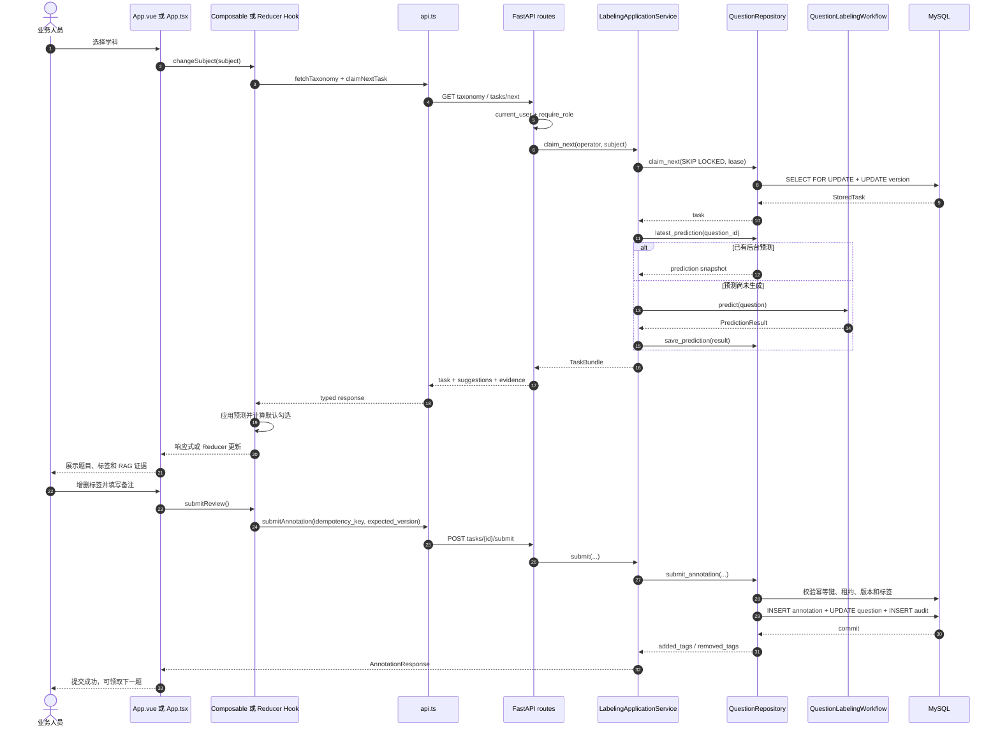
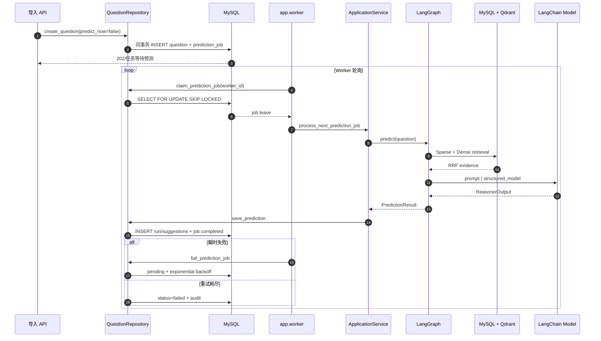
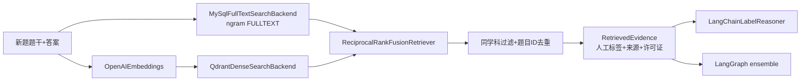
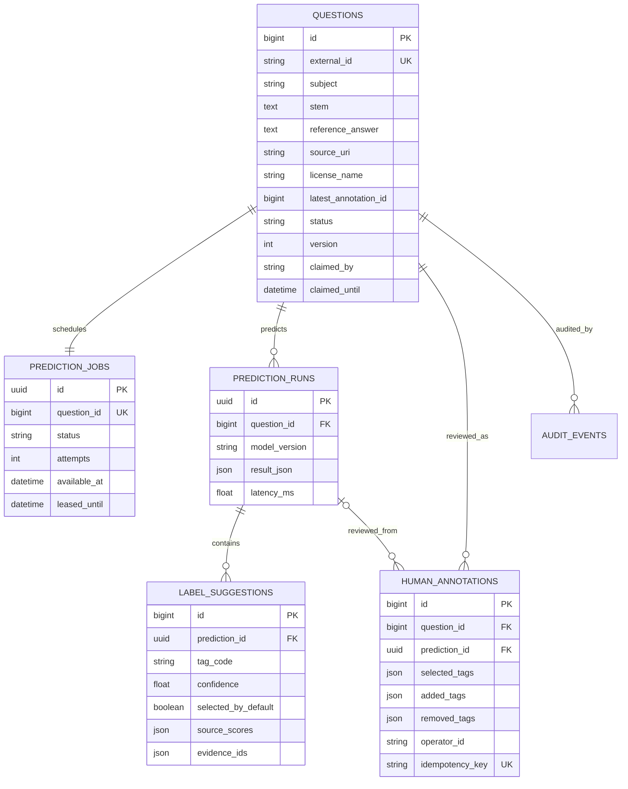

# 系统架构、业务流程与时序图

## 1. 系统上下文



### 关键边界

- MySQL 是题目状态、预测快照、人工最终标签和审计事件的事实源。
- Qdrant 是可重建的 Dense 索引，不保存最终人工业务状态。
- LLM 只能从受控标签字典选择，不能直接写数据库。
- 操作员身份来自 JWT Runtime，不作为 Prompt 参数交给模型。
- 人工提交是最终业务决策，同时也是后续训练反馈。

## 2. 组件架构



## 3. 主要业务逻辑图



## 4. LangGraph 方法级流程图

```mermaid
flowchart TD
    START([START]) --> Normalize[_normalize<br/>规范题干、答案与解析]
    Normalize --> Rules[_rules<br/>rule_based_scores]
    Rules --> Retrieve[_retrieve<br/>EvidenceRetriever.retrieve]
    Retrieve -->|成功| Historical[_historical_model<br/>predict_scores]
    Retrieve -->|异常| RagFallback[记录 RAG 降级<br/>evidence=[]]
    RagFallback --> Historical
    Historical --> Reason[_reason<br/>LabelReasoner.reason]
    Reason -->|成功| Ensemble[_ensemble<br/>四路加权融合]
    Reason -->|异常| LlmFallback[记录 LLM 降级<br/>ReasonerOutput 空结果]
    LlmFallback --> Ensemble
    Ensemble --> Result[PredictionResult<br/>完整标签+证据+警告]
    Result --> END([END])
```

### 节点职责

| 节点 | 输入 | 输出 | 是否允许降级 |
| --- | --- | --- | --- |
| `_normalize` | `QuestionInput` | `normalized_text` | 否，输入异常直接拒绝 |
| `_rules` | 题干、答案 | `rule_scores` | 否，纯函数 |
| `_retrieve` | 题目、学科 | `evidence` | 是，记录警告并返回空证据 |
| `_historical_model` | 题目 | `historical_scores` | 默认否，生产主模型异常应进入 Worker 重试 |
| `_reason` | 题目、标签、证据 | `ReasonerOutput` | 是，保留规则和历史模型结果 |
| `_ensemble` | 四路信号 | 全标签建议 | 否，未知标签被过滤 |

## 5. 人工补录时序图（方法粒度）



## 6. 异步预测时序图



## 7. Hybrid RAG 流程



RRF 计算：

$$
score(d)=\sum_{r \in \{sparse,dense\}} \frac{w_r}{k+rank_r(d)}
$$

它使用排名而非原始分数，因此不会把 MySQL FULLTEXT 的相关度直接与向量余弦相似度相加。

## 8. 数据模型



## 9. 一致性设计

### 导入幂等

`questions.external_id` 唯一。上游重试返回原任务，不创建重复题目。

### 提交幂等

前端每次用户提交动作生成 `idempotency_key`，数据库唯一约束保证网络重试返回同一人工记录。

### 乐观锁

页面读取 `task.version`，提交时回传 `expected_version`。其他操作已更新任务时返回 `STALE_TASK_VERSION`，防止旧页面覆盖新结论。

### 任务租约

人工任务和 Worker 任务都有 `claimed_until/leased_until`。进程故障后租约到期可重新领取，避免永久卡死。

### 副作用边界

模型推理没有外部业务写副作用。最终写入集中在仓储事务中，预测失败不会修改人工最终标签。

## 10. 降级与停止策略

| 故障 | 行为 |
| --- | --- |
| RAG 超时 | 记录警告，使用规则 + 历史模型 + LLM |
| LLM 超时或结构错误 | 记录警告，使用规则 + 历史模型 + RAG |
| 历史模型不可加载 | 生产启动失败，不用规则静默冒充模型 |
| MySQL 不可用 | API/Worker 不就绪，禁止接受写请求 |
| Qdrant 不可用 | Worker 有界重试，页面可人工补录已有任务 |
| Worker 崩溃 | 租约到期后其他 Worker 重领 |
| 人工页面版本过期 | 返回 409，要求刷新，不自动覆盖 |

## 11. 与 LangChain、LangGraph 和 llm-day1 的关系

| 知识点 | 本项目落点 |
| --- | --- |
| LCEL | `ChatPromptTemplate | with_structured_output` |
| Tool/结构化输出 | Pydantic `ReasonerOutput` 与受控标签合同 |
| LangGraph State/Node/Edge | 六节点 `QuestionLabelingWorkflow` |
| Dense/Sparse/RRF | Qdrant + MySQL ngram + RRF |
| Rerank/证据 | RRF 排名、人工证据和 evidence ID |
| Agent 边界 | LLM 负责判断，代码负责标签、权限、事务和停止条件 |
| Memory/Store | MySQL 保存任务状态和长期人工反馈；不把身份塞进 Prompt |
| SFT/LoRA | 人工反馈导出为固定 train/eval JSONL |
| 离线评测 | micro/macro F1、exact match、人工修改率 |
| 成本与延迟 | LLM 有界重试、RAG limit、预测 Histogram |
| 服务治理 | JWT、CORS、Nginx 限流、错误码、健康检查、审计 |
