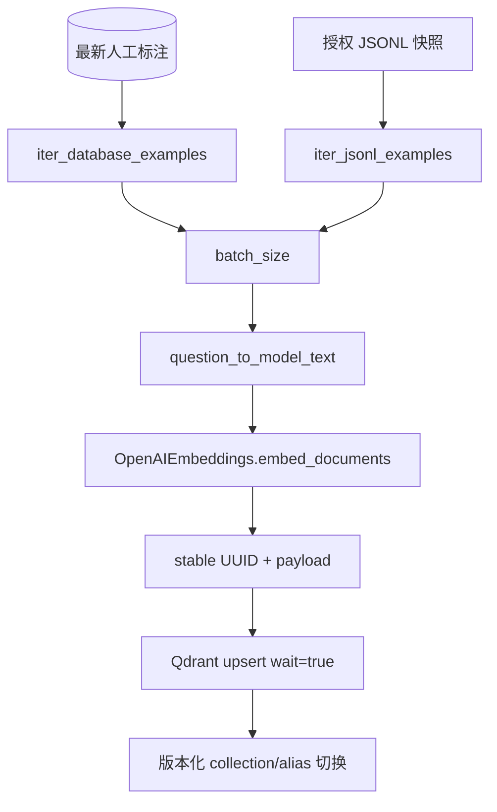
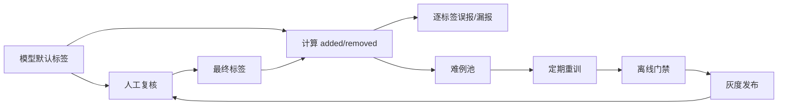

# 100 万数据、训练模型、RAG 与反馈闭环

## 1. 任务本质是多标签分类

一条题目可以同时具有多个属性。例如：

```text
题目：一个长方形长 5 厘米、宽 3 厘米，面积是____。
答案：15 平方厘米
标签：需要计算、必须带单位
```

这不是多分类任务：多分类只选一个类别，多标签分类对每个标签独立判断是否成立。

对标签 $j$，模型输出分数 $p_j$，再使用全局或逐标签阈值 $t_j$：

$$
\hat{y}_j = \mathbb{1}(p_j \ge t_j)
$$

当前在线融合先使用统一阈值 `SELECTION_THRESHOLD`。生产迭代应在固定评测集上为“答案不唯一”“单位要求”等高风险标签单独校准阈值。

## 2. 标签字典是业务合同

标签字典位于 `backend/app/domain/taxonomy.py`。每个标签包含：

- 稳定编码 `code`
- 中文名称 `name`
- 判定说明 `description`
- 适用学科 `subjects`
- 是否重点复核 `high_risk`

模型、数据库、前端和评测都使用编码。名称和说明可以迭代，但编码变更必须做数据迁移与模型版本升级。

### 标签变更流程


不要让 LLM 动态创造标签。新标签必须先进入字典、标注规范、训练数据和评测集。

## 3. 100 万人工样本如何训练

### 数据抽取

训练脚本只读取每道题最新的人工提交：

```text
questions
  JOIN latest human_annotations
  WHERE question.status = completed
```

数据库使用服务端游标和 `fetchmany(batch_size)`，不会将 100 万行一次性加载到进程内存。

### 特征方案

当前基线使用：

```text
QuestionInput
-> 学科 + 题干 + 答案 + 解析
-> HashingVectorizer(char, 2-5 grams)
-> 每个标签一个 SGDClassifier(loss=log_loss)
-> partial_fit 批量增量训练
```

选择字符 n-gram 的原因：

1. 中文不依赖额外分词词典。
2. 英文拼写和词尾变化可以形成局部特征。
3. 数字、运算符、单位和空格符号都可被捕获。
4. HashingVectorizer 无需保存不断增长的词表。
5. `partial_fit` 适合百万级流式训练。

它的局限也很明确：复杂语义、长上下文和深层数学等价关系表达能力有限，所以系统再引入 RAG 和 LLM。

### 类别不平衡

“答案不唯一”等标签可能远少于普通标签。当前训练对正例设置更高 `sample_weight`。生产还应比较：

- 每标签正负样本数量
- focal loss 或 class weight
- 欠采样常见负例
- 难负例挖掘
- 每标签阈值校准

不要只看 overall accuracy。全预测为负也可能得到很高准确率，却无法帮助补录。

## 4. 数据切分与泄漏

当前实现使用 `external_id` 的 SHA-256 稳定哈希划分固定留出集。这保证多次训练时同一道题不会在 train/eval 间漂移。

但真实题库常存在改写题、同一母题的不同空位和不同版本。生产应优先按下面的稳定组键切分：

```text
group_key = source_document_id / parent_question_id / normalized_stem_hash
```

同一题族必须整体进入一个分区，否则模型可能只是记住近重复文本，评测结果会虚高。

还建议增加时间外测试集：用较早数据训练，用最近一个月题目验证，观察真实分布漂移。

## 5. 评测指标

### Micro F1

先汇总所有标签的 TP、FP、FN：

$$
P_{micro}=\frac{TP}{TP+FP},\quad
R_{micro}=\frac{TP}{TP+FN}
$$

$$
F1_{micro}=\frac{2P_{micro}R_{micro}}{P_{micro}+R_{micro}}
$$

它更受常见标签影响。

### Macro F1

先计算每个标签 F1，再平均：

$$
F1_{macro}=\frac{1}{L}\sum_{j=1}^{L}F1_j
$$

它能暴露稀有标签表现差的问题。

### Exact Match

只有整道题的预测标签集合与人工集合完全一致才算正确。该指标严格，但最贴近“人工是否可以直接提交”。

### Human Change Rate

$$
change\_rate=\frac{需要新增或取消标签的题数}{总复核题数}
$$

这是业务效率核心指标。模型 F1 提升但人工修改率没有下降，可能只是提升了不影响实际操作的常见标签。

## 6. 为什么增加 RAG

专用模型只能把历史模式编码进参数。遇到新教材、新题型、边缘答案或标签规范更新时，参数知识可能滞后。

RAG 在预测时补充：

- 相似题及其人工最终标签
- 同一教材或知识点的判定先例
- 最新标签规范
- 答案接受范围说明
- 可追溯来源和许可证

RAG 是外部证据，不自动等于正确答案。相似题可能来自旧规范或含标注噪声，因此 LLM Prompt 明确要求不能盲从，前端也把证据展示给人工。

## 7. Dense、Sparse 与 RRF

### Sparse

MySQL `FULLTEXT ... WITH PARSER ngram` 擅长：

- 诗句、固定术语
- 数字和单位
- 英文单词
- 错误码式精确文本
- 中文局部词组

### Dense

Embedding + Qdrant 擅长：

- 同义表达
- 题干改写
- 意思相近但词面不同的题目
- 长文本整体语义

### RRF

两路原始分数不在同一尺度，系统只融合排名：

$$
RRF(d)=\frac{w_s}{k+rank_s(d)}+\frac{w_d}{k+rank_d(d)}
$$

同一道题在两路都靠前时自然获得更高分。

## 8. RAG 索引构建



稳定 UUID5 让重复索引同一道题执行 upsert，而不是产生重复 Point。

生产发布不建议直接 `--recreate` 当前在线集合。更稳妥的过程：

1. 创建新版本集合，例如 `labeled_questions_v2`。
2. 全量构建并抽样查询。
3. 运行 Recall@K 与引用正确率评测。
4. 使用配置或 Qdrant alias 原子切换。
5. 保留上一版本用于快速回滚。

## 9. 外部数据治理

每条题目至少保存：

| 字段 | 用途 |
| --- | --- |
| `source` | 数据源短名称 |
| `source_uri` | 内部记录或公开数据集页面 |
| `license_name` | 内部授权、CC BY、Apache 等 |
| `external_id` | 去重和追踪 |
| 内容哈希 | 检测重复和变更，后续可扩展 |

禁止流程：看到网页可访问就直接抓取训练。网页公开不代表允许复制、再分发或用于模型训练。

建议数据源优先级：

1. 公司内部已有授权题库和历史人工标签。
2. 官方发布、许可证明确的开放教育数据集。
3. 已签署使用协议的数据供应商。
4. 其他网页只作为人工参考，不进入训练和索引。

## 10. 人工反馈闭环



优先回收以下难例：

- 高置信误报
- 低置信但人工确认正确
- “答案不唯一”等高风险标签
- RAG 与专用模型冲突
- 新教材、新知识点、新题型
- 高频被人工补加或移除的标签

## 11. SFT/LoRA 是否必须

不一定。先用轻量分类器建立低延迟基线，再根据错误分析判断：

- 如果错误主要是关键词和模板特征，改数据与分类器更便宜。
- 如果错误需要复杂语义和上下文，考虑 Transformer 分类模型。
- 如果还要求稳定理由和证据引用，考虑 LoRA/QLoRA 微调结构化 LLM。
- 如果知识变化快，优先改善 RAG，不要每次都重新训练参数。

本项目的 `export_sft_dataset.py` 将人工反馈导出为固定 train/eval 消息格式，可接 `llm-day1` Day29-Day32，但模型发布仍必须经过相同离线门禁和人工灰度。
