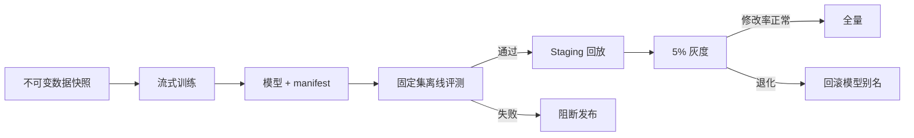
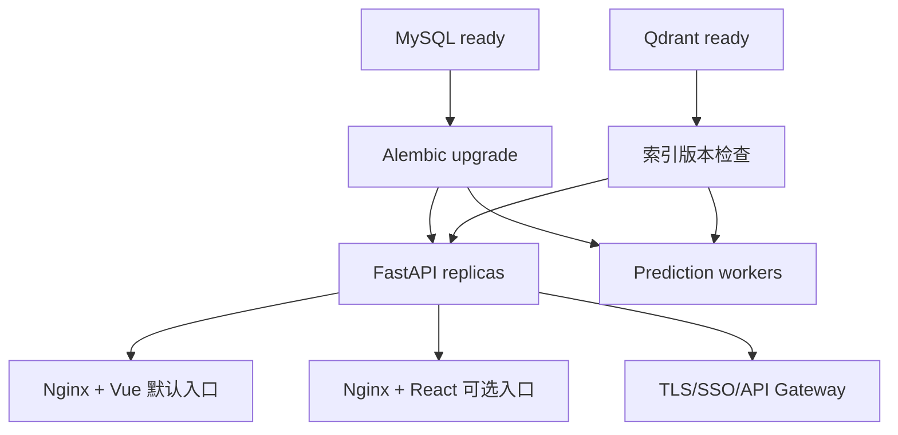

# 生产部署、监控、回滚与安全手册

## 1. 环境分层

| 环境 | 数据库 | 模型 | RAG | 认证 |
| --- | --- | --- | --- | --- |
| local | SQLite | bootstrap 规则 | 内存原创样本 | 调试 Header |
| test | 临时 SQLite/MySQL | Fake 或候选工件 | Fake/Qdrant 测试集合 | 测试 JWT |
| staging | MySQL 副本 | 候选工件 | 版本化 Qdrant 集合 | 企业测试 OIDC |
| production | 托管 MySQL | 评测通过工件 | MySQL + Qdrant | RS256 JWT/SSO |

`Settings.validate()` 会阻止生产使用 SQLite、关闭认证、bootstrap 模型、内存 RAG 或禁用 LLM。

## 2. 发布前准备

1. 创建最小权限 MySQL 用户，只授予业务 Schema 必需权限。
2. 从 `.env.production.example` 建立 Secret Manager 和 ConfigMap。
3. 挂载 JWT **公钥**；私钥只能保留在身份提供方。
4. 训练候选模型并保存 manifest、数据快照 ID 和 Git SHA。
5. 构建新 Qdrant 集合并完成 Recall@K/引用检查。
6. 执行后端单测、前端构建和 Playwright E2E。
7. 对数据库做可恢复备份。
8. 在 staging 验证迁移、Worker 租约和模型降级。

## 3. 数据库迁移

检查 SQL：

```bash
cd backend
DATABASE_URL="$DATABASE_URL" alembic upgrade head --sql > migration.sql
```

应用迁移：

```bash
DATABASE_URL="$DATABASE_URL" alembic upgrade head
```

首版迁移会创建：

- `questions`
- `prediction_jobs`
- `prediction_runs`
- `label_suggestions`
- `human_annotations`
- `audit_events`
- MySQL ngram FULLTEXT 索引

百万数据表新增索引时，应先在同规模 staging 验证锁表时间。大型在线表后续可使用 `ALGORITHM=INPLACE/INSTANT`、在线 Schema 工具或影子表迁移，不应假设所有 DDL 都瞬时完成。

## 4. 模型训练与门禁



模型 manifest 至少保留：

- 数据快照或查询截止时间
- taxonomy 版本
- 训练代码 Git SHA
- 特征参数和正例权重
- train/eval 数量
- micro/macro F1 与 exact match
- 每标签阈值
- 工件 SHA-256

不要覆盖同一个对象存储路径。使用不可变版本，并由部署配置切换别名。

## 5. RAG 索引发布

推荐蓝绿流程：

```text
labeled_questions_v1  当前在线
labeled_questions_v2  后台构建
```

1. 从同一人工标签快照构建 v2。
2. 校验 Point 数、向量维度、payload 和学科分布。
3. 运行固定查询集，比较 Dense、Sparse 和 Hybrid Recall@K/MRR。
4. 抽样检查来源、许可证和引用内容。
5. 切换 `QDRANT_COLLECTION` 或 alias。
6. 观察 RAG 降级、人工修改率和延迟。
7. 稳定后再删除旧集合。

Embedding 模型变化必须新建集合，因为向量维度与空间语义可能不同。

## 6. 服务启动顺序



Compose 用于完整集成验证：

```bash
cp .env.production.example .env.production
# 替换所有 CHANGE_ME，并准备 artifacts/label_model.joblib 与 secrets/jwt_public.pem
docker compose up --build
```

同时比较 React 工作台时启用可选 profile：

```bash
# Vue: http://127.0.0.1:8080
# React: http://127.0.0.1:8081
docker compose --profile react up --build
```

生产高可用建议：

- 托管 MySQL 主从和自动备份
- Qdrant 集群或托管服务
- API 至少两个副本
- Worker 按队列积压水平扩展
- TLS Ingress/API Gateway
- PodDisruptionBudget、反亲和和 HPA
- Secret Manager，不使用仓库 `.env`

## 7. Worker 容量与租约

预测吞吐近似：

$$
throughput \approx \frac{worker\_replicas \times concurrency}{average\_prediction\_seconds}
$$

同步代码当前每个 Worker 串行处理任务，可通过增加 Worker 副本水平扩展。不要在单进程盲目提高线程数：LLM 网关限流、Qdrant、MySQL 连接池和 CPU 分类器都需要共同容量评估。

租约应大于正常 P99 预测时长，并小于可接受恢复时间。任务处理可能超过租约时，应增加 heartbeat/续租；当前实现适合 P99 明显小于 120 秒的预测。

## 8. 健康检查

| Endpoint | 作用 | 是否访问外部依赖 |
| --- | --- | --- |
| `/healthz` | 进程存活 | 否 |
| `/readyz` | 配置装配完成 | 当前只返回模式，生产可扩展依赖探测 |
| `/metrics` | Prometheus 抓取 | 否 |

不要让存活探针依赖 MySQL 或模型网关，否则外部故障会触发所有 API 容器重启。就绪探针可以在有缓存和超时的前提下检查关键依赖。

## 9. Prometheus 指标

| 指标 | 含义 | 推荐告警 |
| --- | --- | --- |
| `question_labeling_http_requests_total` | 路由和状态请求量 | 5xx 比例持续升高 |
| `question_labeling_http_request_duration_seconds` | API 延迟 | P95 超过 SLO |
| `question_labeling_predictions_total` | 预测成功/失败 | 失败率超过阈值 |
| `question_labeling_prediction_duration_seconds` | 模型链延迟 | P95/P99 异常 |
| `question_labeling_degradations_total` | RAG/LLM 降级 | 五分钟内持续增长 |
| `question_labeling_annotations_total` | 人工完成量 | 工作时段吞吐骤降 |
| `question_labeling_annotation_changes_total` | 人工增删标签数 | 新模型发布后显著上升 |

指标 label 只使用 method、模板 route、status、component 和 change_type。禁止使用 question_id、user_id、request_id 或模型自由文本，避免高基数拖垮 Prometheus。

## 10. 建议 SLO

内部补录系统可从以下目标开始，再按业务校准：

- API 可用性：工作时段 99.9%
- 领取已有预测任务 P95：小于 500ms
- 同步新预测 P95：小于 15s
- 人工提交 P95：小于 800ms
- 模型链失败率：低于 1%
- RAG/LLM 降级率：低于 2%
- 人工修改率：候选版本不得显著差于当前生产版本

人工修改率按学科、标签和模型版本分层观察，不能只看总体。

## 11. 结构化日志与审计

HTTP 日志包含：

- request_id
- method
- 模板 path
- status
- latency_ms

业务审计表包含：

- actor_id
- action
- resource_type/resource_id
- 脱敏 payload
- created_at

日志用于运行排错，审计用于回答“谁在何时对哪道题做了什么”。两者不能互相替代。

禁止记录：JWT、API Key、完整个人信息、模型网关凭据和未经必要性评估的原始 Prompt。

## 12. 备份与恢复

### MySQL

- 每日全量备份 + binlog 时间点恢复
- 定期恢复演练，不只检查备份任务成功
- 审计和人工标签设置符合业务要求的保留周期
- 删除请求需要同步到训练快照和向量索引

### Qdrant

- 通过 snapshot 或从 MySQL 权威数据重建
- 保存集合版本、Embedding 模型和向量维度
- Qdrant 丢失不应导致人工最终标签丢失

### 模型工件

- 对象存储版本化和校验和
- 保存最近两个已通过门禁版本
- 禁止从用户上传路径执行 `joblib.load`；pickle/joblib 只能加载可信内部工件

## 13. 回滚

### 应用回滚

部署前保证数据库迁移向后兼容。优先“扩展 -> 双写/回填 -> 切换 -> 收缩”，不要让旧应用无法读取新 Schema。

### 模型回滚

修改 `HISTORICAL_MODEL_PATH` 指向上一工件并滚动重启 API/Worker。预测快照保留模型版本，因此回滚前后效果可比较。

### RAG 回滚

将 Qdrant alias 或 `QDRANT_COLLECTION` 切回上一集合。MySQL FULLTEXT 属于稳定 Sparse 基线，可在 Dense 集合故障时保留关键词证据。

## 14. 安全清单

1. TLS 在 Ingress 或网关终止，内部网络仍按零信任策略隔离。
2. JWT 只允许 `RS256`，验证 issuer、audience、exp 和 sub。
3. 用户身份、租户和角色从可信 Runtime 注入，不进入模型可控参数。
4. Nginx 和 API Gateway 限制请求体、速率和并发。
5. MySQL 用户最小权限，Qdrant 不暴露公网。
6. Prompt 中的题目、答案和网页内容都按不可信数据处理。
7. 模型不能创建标签、改变任务版本或直接提交最终结果。
8. 外部题目保留来源和许可证，敏感数据先脱敏。
9. 工件签名/校验和通过后才加载。
10. 依赖定期执行 `pip check`、漏洞扫描和锁版本升级回归。

## 15. 故障处理

### 大量任务 pending

1. 查看 Worker 副本和 `prediction_jobs` 租约。
2. 检查模型网关 429/5xx 与 Qdrant 延迟。
3. 检查 `question_labeling_predictions_total{status="failed"}`。
4. 按瓶颈扩 Worker，而不是只加 API。
5. 必要时允许人工无模型补录，并明确降级状态。

### 人工修改率突然升高

1. 按 model_version、subject、tag_code 切片。
2. 检查 taxonomy 是否更新但模型未重训。
3. 检查 Qdrant 集合和 Embedding 模型是否匹配。
4. 检查输入题型或来源分布是否漂移。
5. 回滚模型或 RAG alias，并收集难例。

### 同一题多人冲突

系统使用任务租约降低并发概率，使用 `expected_version` 最终阻止覆盖。收到 409 时刷新页面，不要前端自动强制提交。
