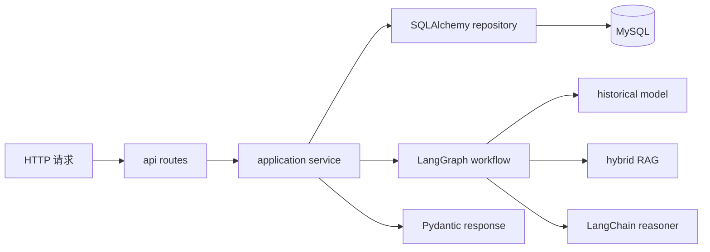

# Python 项目化学习指南

本指南不从孤立语法题开始，而是沿题目标注系统的一次真实请求学习 Python：浏览器调用 FastAPI，路由完成鉴权和 Schema 转换，应用服务协调 SQLAlchemy 仓储与 LangGraph，模型和 RAG 通过 Protocol 适配，最终把可审计结果返回前端。

当前本地虚拟环境实测为 Python 3.9.6，源码通过 `from __future__ import annotations` 等写法保持 Python 3.9 兼容；生产 [Dockerfile](../backend/Dockerfile) 使用 Python 3.11。不要把本地解释器版本、源码最低兼容目标和生产运行版本混为一个概念。

## 1. 从调用链理解目录，而不是背文件名



| 目录 | 职责 | 代表文件 |
| --- | --- | --- |
| `app/api` | HTTP Schema、路由、鉴权入口 | [routes.py](../backend/app/api/routes.py)、[schemas.py](../backend/app/api/schemas.py) |
| `app/domain` | 与框架无关的题目、标签、预测契约 | [models.py](../backend/app/domain/models.py) |
| `app/services` | 应用用例、端口协议、LangGraph | [application.py](../backend/app/services/application.py)、[labeling_workflow.py](../backend/app/services/labeling_workflow.py) |
| `app/db` | ORM、Session、事务仓储 | [models.py](../backend/app/db/models.py)、[repositories.py](../backend/app/db/repositories.py) |
| `app/adapters` | sklearn、Qdrant、MySQL FULLTEXT、LLM 实现 | [adapters](../backend/app/adapters) |
| `app/core` | 配置、认证、指标 | [core](../backend/app/core) |
| `app/training` | 流式训练、索引、SFT 导出 | [training](../backend/app/training) |
| `app/evaluation` | 人工反馈评测与发布门禁 | [evaluation](../backend/app/evaluation) |

依赖方向大体从外层指向内层：路由依赖应用服务，应用服务依赖抽象端口和仓储，适配器实现端口。领域模型不导入 FastAPI。

## 2. 模块、包与 `python -m`

项目在 `backend` 目录以 `app` 作为顶层包，内部统一使用绝对导入：

```py
from app.domain.models import QuestionInput
from app.services.application import LabelingApplicationService
```

开发命令设置 `PYTHONPATH=.`，让当前 `backend` 成为模块搜索根：

```bash
cd question_labeling_system/backend
PYTHONPATH=. ../../.venv/bin/python -m app.training.seed_local
```

`python -m package.module` 以模块方式执行，包内导入更稳定，也便于在不同工作目录和容器中复用。不要通过修改 `sys.path` 或复制文件解决导入问题。

## 3. `from __future__ import annotations`

多数模块第一行启用：

```py
from __future__ import annotations
```

它让类型注解延迟解析，减少前向引用限制，并避免部分注解在模块导入时立刻求值。项目仍使用 `List[str]`、`Optional[T]` 等 Python 3.9 可稳定运行的写法，而不是要求更新版本的语法。

类型注解不会自动执行运行时校验。`def predict(question: QuestionInput) -> PredictionResult` 能帮助编辑器和读者，但真正的外部数据校验由 Pydantic 完成。

## 4. Enum：限制领域取值

[domain/models.py](../backend/app/domain/models.py) 把学科定义为字符串枚举：

```py
class Subject(str, Enum):
    CHINESE = "chinese"
    MATH = "math"
    ENGLISH = "english"
```

继承 `str` 后，枚举可自然序列化成 JSON 字符串；继承 `Enum` 则阻止任意学科值进入核心流程。FastAPI 查询参数使用 `Subject` 时，会自动拒绝非法字符串。

领域中存在有限且稳定的合法集合时优先 Enum；会由数据库频繁增加的标签字典则不应硬编码成 Enum。

## 5. Pydantic：运行时数据合同

题目输入是 Pydantic v2 `BaseModel`：

```py
class QuestionInput(BaseModel):
    model_config = ConfigDict(str_strip_whitespace=True)

    external_id: str = Field(min_length=1, max_length=128)
    subject: Subject
    stem: str = Field(min_length=1, max_length=20_000)
    analysis: str = Field(default="", max_length=20_000)
```

这里同时完成：

- JSON 到 Python 对象的解析。
- 字符串长度和数值范围校验。
- 枚举转换。
- OpenAPI Schema 生成。
- 结构化序列化。

列表默认值使用 `Field(default_factory=list)`，每个实例都会获得自己的列表，避免多个对象共享一个可变默认值。

`TagDefinition` 使用 `ConfigDict(frozen=True)`，防止运行时标签字典被意外修改；“不可变”是领域约束，不只是编码风格。

## 6. Pydantic、dataclass、TypedDict 与 ORM 怎样分工

项目没有用一种类解决所有问题：

| 工具 | 当前用途 | 是否运行时校验 | 是否关联数据库 |
| --- | --- | --- | --- |
| Pydantic `BaseModel` | API 和领域结构化合同 | 是 | 否 |
| `@dataclass(frozen=True)` | 配置、依赖容器、仓储返回快照 | 否 | 否 |
| `TypedDict` | LangGraph 在节点间传递的字典状态 | 否 | 否 |
| SQLAlchemy ORM | 表、关系和持久化映射 | 由数据库与 ORM 约束 | 是 |

[bootstrap.py](../backend/app/bootstrap.py) 的依赖容器是冻结 dataclass：

```py
@dataclass(frozen=True)
class AppContainer:
    settings: Settings
    service: LabelingApplicationService
    metrics: ServiceMetrics
```

它只聚合已经创建好的 Python 对象，不需要 Pydantic 解析。ORM 实例绑定 Session 生命周期，不应直接泄漏给 API；仓储将其转换成冻结 DTO 后再返回。

## 7. Protocol：Python 的结构化接口

[services/contracts.py](../backend/app/services/contracts.py) 定义三个端口：

```py
class EvidenceRetriever(Protocol):
    def retrieve(
        self,
        question: QuestionInput,
        limit: int,
    ) -> Sequence[RetrievedEvidence]:
        ...
```

实现类无需显式继承 `EvidenceRetriever`。只要方法和属性结构兼容，就能作为该依赖使用，这叫结构化子类型或静态 Duck Typing。

接口返回 `Sequence`、`Mapping`，而不是承诺具体 `list`、`dict`，让调用方依赖最小能力。测试中的 Fake 和生产 Qdrant/MySQL 适配器因此可以使用同一工作流。

项目当前没有配置 mypy 或 pyright 命令，所以这些注解主要由编辑器、代码审查和运行测试共同保障；不能把“写了 Protocol”误认为已经执行了静态类型门禁。

## 8. 应用工厂与依赖注入

[main.py](../backend/app/main.py) 不把所有依赖写死在全局路由中：

```py
def create_app(container: Optional[AppContainer] = None) -> FastAPI:
    active_container = container or build_container(Settings.from_env())
    app = FastAPI(...)
    app.state.container = active_container
    app.include_router(router)
    return app


app = create_app()
```

- Uvicorn 使用模块级 `app`。
- 测试可以传入内存数据库和 Fake 依赖组成的 Container。
- `build_container()` 是 Composition Root，集中决定生产或本地适配器。
- 路由只读取容器，不负责加载模型或创建数据库连接池。

当前项目没有 FastAPI lifespan 或 `@app.on_event` 处理器。初始化在容器装配阶段完成，后台预测由独立 Worker 负责。

## 9. FastAPI 路由：薄 HTTP 层

[api/routes.py](../backend/app/api/routes.py) 的路由只做四件事：

1. 让 FastAPI 解析 Path、Query 和请求体。
2. 通过 `Depends(current_user)` 获取可信主体。
3. 检查角色并调用应用服务。
4. 把应用 DTO 转为响应 Schema。

```py
@router.get("/taxonomy", response_model=TaxonomyResponse)
def get_taxonomy(
    subject: Subject,
    principal: UserPrincipal = Depends(current_user),
) -> TaxonomyResponse:
    require_role(principal, "labeler")
    return TaxonomyResponse(subject=subject, tags=tags_for_subject(subject))
```

业务规则不应复制到路由。比如“某标签是否适用数学题”属于领域/服务规则，而不是 HTTP Controller 的 if 分支。

空队列显式返回 204 和 `None`，不会伪造字段为空的任务对象。

## 10. 同步与异步边界

请求中间件是 `async def`，因为它必须 `await call_next(request)`：

```py
@app.middleware("http")
async def request_context(request: Request, call_next):
    response = await call_next(request)
    return response
```

业务路由、SQLAlchemy Session、LangGraph `invoke()`、LangChain `invoke()`、Qdrant 调用和 Worker 循环目前都是同步实现。FastAPI 会把普通 `def` 路由放入线程池执行，因此同步数据库/模型调用不会直接写进事件循环函数。

不要只为追求语法现代化把路由改成 `async def`，然后在里面调用同步 SQLAlchemy 或模型推理；那会阻塞事件循环。若未来切换 `AsyncSession` 和异步客户端，应沿整条调用链设计并发、超时和连接池，而不是只改函数关键字。

## 11. 中间件、请求 ID 与异常映射

[main.py](../backend/app/main.py) 的中间件为每个请求：

- 复用上游 `X-Request-ID` 或生成 UUID。
- 使用 `time.perf_counter()` 计算单调时钟耗时。
- 给响应写回追踪 Header。
- 使用路由模板记录低基数 Prometheus 标签。
- 输出 JSON 请求日志。

异常处理器把 Python 异常转换为稳定 HTTP 语义：

| Python 异常 | HTTP | 业务含义 |
| --- | ---: | --- |
| `KeyError` | 404 | 资源不存在 |
| `LookupError` | 409 | 预测尚未准备 |
| `ConcurrentUpdateError` | 409 | 页面版本过期 |
| `ValueError` | 422 | 领域输入非法 |
| `PermissionError` | 403 | 当前操作不允许 |

异常类型在这里是层间协议。不要用裸 `except Exception: return 200` 吞掉错误；未处理异常应保留堆栈并由统一边界返回失败。

## 12. Composition Root 与依赖倒置

[bootstrap.py](../backend/app/bootstrap.py) 根据配置组装对象图：

```py
historical_model = (
    SklearnHistoricalLabelModel(settings.historical_model_path)
    if settings.historical_model_mode == "artifact"
    else BootstrapHistoricalModel()
)

retriever = (
    ReciprocalRankFusionRetriever(sparse, dense)
    if settings.rag_mode == "hybrid"
    else InMemoryEvidenceRetriever(local_evidence())
)
```

业务工作流只认识 `HistoricalLabelModel`、`EvidenceRetriever` 和 `LabelReasoner` Protocol，不认识环境变量和具体客户端。这样本地模式可以零外部依赖运行，生产模式则替换为模型工件、MySQL、Qdrant 和 OpenAI-compatible 服务。

延迟导入 `OpenAIEmbeddings` 只发生在 Hybrid 模式，避免本地启动无意初始化外部客户端。

## 13. SQLAlchemy Engine、Session 与事务

[db/session.py](../backend/app/db/session.py) 创建 Engine 和 Session Factory；[db/repositories.py](../backend/app/db/repositories.py) 为每个操作创建短生命周期 Session：

```py
with self._session_factory() as session:
    with session.begin():
        # 查询、校验和写入
        ...
```

两个 Context Manager 分别负责：

- Session 使用结束后关闭资源。
- 事务块成功时 Commit，异常时 Rollback。

不要把一个 Session 保存为全局单例跨请求共享。Session 包含工作单元和对象状态，不是线程安全的连接池替代品。

本地 SQLite 测试使用 `StaticPool` 和 `check_same_thread=False` 共享内存数据库；生产使用 MySQL 和正常连接池。数据库方言差异仍需通过迁移和集成环境验证。

## 14. ORM 与不可变仓储 DTO

ORM 模型描述表结构、索引和关系；仓储 DTO 描述事务结束后允许外层读取的稳定快照。例如 `StoredTask`、`StoredAnnotation` 和 `StoredPredictionJob` 使用冻结 dataclass。

这样做避免：

- API 层在 Session 关闭后触发懒加载。
- 路由无意修改 ORM 实例。
- 数据库字段名直接污染业务合同。
- 测试必须构造完整 ORM 生命周期。

仓储是事务边界，不只是 CRUD 文件。`create_question()` 会在一个事务中同时创建题目和预测任务；`submit_annotation()` 会原子完成校验、人工标签、任务状态和审计事件。

## 15. 并发：悲观领取、乐观提交与幂等

不同冲突使用不同策略：

| 场景 | 策略 | 原因 |
| --- | --- | --- |
| 多 Worker 领取预测任务 | `FOR UPDATE SKIP LOCKED` + 租约 | 避免等待同一队首任务 |
| 多人工领取题目 | `FOR UPDATE SKIP LOCKED` + 租约 | 每题同一时刻只给一个操作员 |
| 人工提交旧页面 | `expected_version` 乐观锁 | 防止覆盖更新后的任务 |
| 网络超时后重试提交 | `idempotency_key` | 同一操作只创建一条事实 |

租约允许进程崩溃后任务重新被领取；版本号在状态变化时递增；幂等键必须在前端不确定失败后复用。

这些保证必须位于数据库事务中。Python 里的 `if task.status == ...` 若不配合锁和事务，多个进程仍可能同时通过检查。

## 16. 应用服务：组织用例，不绑定 HTTP

[services/application.py](../backend/app/services/application.py) 协调仓储、工作流和指标。路由传入操作员与 Request ID，服务决定：

- 创建题目后同步预测还是进入任务队列。
- 领取时是否已有预测快照。
- 强制刷新是否创建新 Prediction Run。
- 人工提交如何计算新增和移除标签。

服务返回 `TaskBundle` 等 Python DTO，不返回 `JSONResponse`。因此同一用例可被 HTTP 路由、Worker 或未来命令行入口调用。

## 17. LangGraph：用 TypedDict 传递显式状态

[services/labeling_workflow.py](../backend/app/services/labeling_workflow.py) 定义 `LabelingState(TypedDict, total=False)`，再编译固定有向图：

```text
START
  -> normalize
  -> rules
  -> retrieve
  -> historical_model
  -> reason
  -> ensemble
  -> END
```

每个节点读取状态的一部分并返回更新字段。`predict()` 使用同步 `graph.invoke()`，最终转换为 `PredictionResult`。

TypedDict 让字典键对编辑器可见，但不会像 Pydantic 一样执行运行时校验。因此工作流边界仍会验证分数、未知标签和最终模型结构。

LangGraph 的价值不是把顺序函数变复杂，而是让节点、状态和未来的条件分支可观察、可测试。当前流程固定时，也应保持每个节点职责单一。

## 18. 可降级错误与不可降级错误

外部依赖失败不总是同一种处理：

- RAG 异常：记录警告，使用空证据继续。
- LLM 异常：记录警告，保留规则和历史模型信号。
- 历史主模型异常：默认让 Worker 重试，不静默伪造成零分。
- NaN、无穷分数和未知标签：校验或过滤，不能污染融合结果。
- 数据库事务失败：回滚并返回错误，不能假装提交成功。

`except Exception` 只有在明确降级边界或统一记录后重新抛出时才合理。捕获范围越宽，越需要清楚说明哪些正确性仍被保留。

## 19. 配置与安全门禁

[core/config.py](../backend/app/core/config.py) 的冻结 `Settings` 从环境读取并集中验证。生产模式会拒绝：

- 关闭认证。
- 使用 SQLite。
- 使用 Bootstrap 历史模型。
- 使用内存 RAG。
- 禁用 LLM。
- 缺少 JWT 或模型服务必要配置。

[core/auth.py](../backend/app/core/auth.py) 校验 RS256 JWT 的签名、Issuer、Audience、过期时间和 Subject。开发调试 Header 只在 `AUTH_DISABLED=true` 时生效。

环境变量是配置输入，不应散落在每个模块用 `os.getenv()` 临时读取。Secret 也不应进入日志、异常文本或 Git。

## 20. Generator 与百万数据流式读取

[training/train_historical_model.py](../backend/app/training/train_historical_model.py) 的读取器返回 Iterator：

```py
def iter_database_examples(
    database_url: str,
    batch_size: int,
    limit: int = 0,
) -> Iterator[TrainingExample]:
    ...
    yield TrainingExample(...)
```

Generator 每次 `yield` 一个样本，不把百万行一次性放入列表。数据库查询还使用 `stream_results=True` 和 Batch，峰值内存由批大小控制。

Generator 是一次性迭代器。多个 Epoch 不能重复消费同一个已耗尽对象，因此代码保存 `factory`，每轮重新创建 Iterator。

稳定业务 ID 用于哈希划分训练集/评测集，使重复运行不会随机漂移，也减少近重复样本跨集合泄漏。

## 21. 增量训练与原子发布

历史模型使用：

- 字符 2-5 gram `HashingVectorizer`。
- 每标签一个 `SGDClassifier`。
- `partial_fit` 分批增量训练。
- 正例权重处理稀有标签。

HashingVectorizer 不维护随数据增长的词表，适合中文、英文、数字和数学符号混合输入。代价是哈希冲突与较弱可解释性，需要用真实评测对比更复杂模型。

模型先写临时文件，再通过文件重命名发布，避免 Worker 读到半写入工件。模型文件和 Manifest 应视为同一个可审计版本。

## 22. `argparse` 与可执行模块

训练、索引、导出、评测和 Worker 都是模块 CLI：

```bash
PYTHONPATH=. ../../.venv/bin/python -m app.training.train_historical_model --help
PYTHONPATH=. ../../.venv/bin/python -m app.training.index_rag --help
PYTHONPATH=. ../../.venv/bin/python -m app.evaluation.evaluate_feedback --help
PYTHONPATH=. ../../.venv/bin/python -m app.worker --help
```

`argparse` 提供类型转换、默认值、帮助文本和非零退出码。评测门禁失败使用退出码 2，CI 可以据此阻断发布。

CLI 的 `main()` 应接收参数、调用可测试函数并返回退出码；不要把所有逻辑堆进 `if __name__ == "__main__"`。

## 23. `unittest`、Fake 与测试金字塔

项目使用标准库 `unittest`，没有 pytest Fixture 或 `MagicMock`。

[test_labeling_workflow.py](../backend/tests/test_labeling_workflow.py) 定义手写 Fake：

- `FakeHistoricalModel` 返回固定标签分数。
- `FakeRetriever` 返回固定证据或抛出异常。
- `FakeReasoner` 返回结构化 LLM 结果或抛出异常。

Fake 实现真实 Protocol，通常比对内部方法做大量 Patch 更能表达业务场景。

[test_api.py](../backend/tests/test_api.py) 使用真实 FastAPI `TestClient`、真实应用服务和内存 SQLite，验证完整导入、领取、复核、JWT 与指标路径。[test_repository.py](../backend/tests/test_repository.py) 专门验证事务、租约、幂等和版本冲突。

测试命名描述业务结果，例如 `test_stale_version_is_rejected`，而不是 `test_method_1`。

## 24. 日志、指标与审计不是一回事

| 信号 | 用途 | 当前实现 |
| --- | --- | --- |
| 日志 | 排查单次请求和异常堆栈 | 标准库 `logging` + JSON 请求事件 |
| 指标 | 聚合延迟、吞吐和降级率 | Prometheus Counter/Histogram |
| 审计 | 证明谁在何时改变业务事实 | 与人工提交同事务写数据库 |

指标标签使用路由模板而不是具体题目 ID，避免高基数耗尽 Prometheus。Request ID 同时进入响应、日志和应用调用，便于跨层关联。

日志不能替代审计：日志可能轮转或采样，而人工最终标签、模型版本和操作员必须作为持久业务事实保存。

## 25. 运行、验证与推荐阅读顺序

安装依赖并运行测试：

```bash
cd /Users/zhaoyonggng/work/llm-day1
source .venv/bin/activate
pip install -r question_labeling_system/backend/requirements.txt

cd question_labeling_system/backend
PYTHONPATH=. ../../.venv/bin/python -m unittest discover -s tests -v
```

启动本地 API：

```bash
PYTHONPATH=. ../../.venv/bin/python -m uvicorn app.main:app \
  --host 127.0.0.1 \
  --port 8010
```

当前仓库没有后端 Ruff、Black、mypy 或 Pyright 命令，不能声称这些门禁已经通过。可执行验证以 `unittest`、API E2E 和实际启动为准。

推荐阅读顺序：

1. [domain/models.py](../backend/app/domain/models.py)：理解数据合同和 Pydantic。
2. [api/routes.py](../backend/app/api/routes.py)：从 HTTP 入口跟踪一次请求。
3. [services/application.py](../backend/app/services/application.py)：理解用例协调。
4. [services/contracts.py](../backend/app/services/contracts.py)：理解 Protocol 和依赖倒置。
5. [services/labeling_workflow.py](../backend/app/services/labeling_workflow.py)：理解 TypedDict 与 LangGraph。
6. [db/repositories.py](../backend/app/db/repositories.py)：理解 Session、事务和并发。
7. [bootstrap.py](../backend/app/bootstrap.py)：理解对象如何最终装配。
8. [tests](../backend/tests)：从可执行场景反向验证理解。

学习时可以尝试三个小练习：给新领域输入增加 Pydantic 边界并补测试；给工作流 Fake 增加一种降级场景；给仓储并发规则先写失败测试再修改实现。每次都从可观察行为开始，不只练习语法。