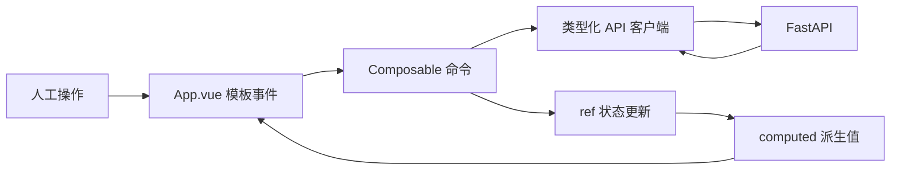

# Vue 3 对应用法学习指南

本项目不是单独展示 Vue 语法，而是把每个用法放进真实补录流程。

## 1. 先建立后端开发者的心智模型

Vue 页面可以理解为“响应式状态 + 派生值 + 模板”的组合：

$$
UI = render(reactive\ state, computed\ values)
$$

模板读取过的 `ref` 或 `computed` 发生变化后，Vue 会调度组件更新，并只修改必要 DOM。与后端请求对象不同，Composable 中的响应式值会跨多次页面更新持续存在。

| Vue 概念 | 后端类比 | 关键区别 |
| --- | --- | --- |
| Props | 只读 DTO 或方法参数 | 父组件更新后会形成新的响应式输入 |
| `ref/reactive` | 当前聚合状态 | 修改后会通知依赖它的视图或计算属性 |
| `computed` | 只读派生属性 | 自动跟踪依赖并缓存结果 |
| Composable | 可组合应用服务 | 每次调用创建独立状态，不是默认单例 |
| 生命周期钩子 | 资源建立与释放 | 跟随组件挂载、卸载，而非 HTTP 请求 |
| `watch` | 状态变化订阅 | 适合外部副作用，不应用来复制派生状态 |

本项目的页面数据流是单向的：



## 2. 单文件组件 SFC

根组件是 `frontend/src/App.vue`：

```vue
<script setup lang="ts">
// TypeScript 状态和函数
</script>

<template>
  <!-- 响应式页面结构 -->
</template>
```

样式集中在 `src/style.css`，避免初学阶段同时处理 Scoped CSS 穿透和多组件主题变量。

## 3. `<script setup>`

`<script setup>` 是 Composition API 的编译期语法：

- 顶层变量可直接在模板使用。
- 导入的 Vue 组件无需手动放入 `components`。
- TypeScript 类型能直接约束状态和函数参数。
- 比 Options API 的 `data/methods/computed` 分区更适合按业务能力组合逻辑。

例如：

```ts
const selectedCount = computed(() => selectedTags.value.length)
```

模板可直接使用 `selectedCount`，模板会自动解包 Ref，不需要写 `.value`。

## 4. `ref`：保存可变化状态

`useLabelingWorkbench.ts` 中：

```ts
const subject = ref<Subject>('chinese')
const bundle = ref<TaskBundleResponse | null>(null)
const selectedTags = ref<string[]>([])
const loading = ref(false)
```

脚本中读写要用 `.value`：

```ts
loading.value = true
bundle.value = taskResult
```

模板中自动解包：

```vue
<section v-if="loading">...</section>
```

`ref` 不要求内部值是基础类型，数组和对象也可以。Vue 会让其内部对象具备深层响应性；本项目仍倾向替换数组，而不是到处原地修改，以便状态变化更容易审查和测试。

不要在脚本中忘记 `.value`，也不要随意把 `const { value } = someRef` 解构出来。后者只复制当前普通值，后续通常不会继续响应更新。

## 5. `computed`：只保存派生逻辑

模型建议映射和人工修改数量不需要手动同步：

```ts
const suggestionByCode = computed(() =>
  Object.fromEntries(
    (bundle.value?.prediction.suggestions ?? [])
      .map((item) => [item.code, item]),
  ),
)
```

只要 `bundle` 更新，映射自动重新计算。

不要把可计算数据再复制到另一个 `ref`，否则容易出现“任务已切换，但统计还是上一题”的双状态问题。

`computed` 默认只读，并按响应式依赖缓存。模板多次读取 `changedCount` 时，只要 `bundle` 和 `selectedTags` 没变，就不需要重复执行集合差计算。它与普通方法的区别是依赖未变时不会重新计算。

## 6. Composable：按业务能力复用状态

`useLabelingWorkbench()` 把下面逻辑从页面结构中抽离：

- 当前学科
- 标签字典
- 当前任务
- 默认选中标签
- 加载、刷新和提交状态
- API 错误与成功消息
- 切换学科、切换标签、刷新预测、提交人工结果

组件负责“怎么展示”，Composable 负责“页面业务状态怎样变化”。它不是全局状态库；当前只有一个补录页面，没有必要为了框架完整引入 Pinia。

当系统增加任务统计、管理后台和跨页面筛选时，再考虑 Pinia 保存真正跨页面的状态。

一次领取请求会并行加载三类数据：

```ts
const [taxonomyResult, taskResult, principalResult] = await Promise.all([
  fetchTaxonomy(subject.value, activeController.signal),
  claimNextTask(subject.value, activeController.signal),
  principal.value ? Promise.resolve(principal.value) : fetchCurrentUser(activeController.signal),
])
```

Composable 负责协调请求和状态，但不负责拼接认证 Header；这个边界属于 `api.ts`。模板也不直接调用 Fetch，因此视图结构不会和协议细节耦合。

## 7. 条件渲染 `v-if`

页面状态互斥：

```vue
<section v-if="loading">加载中</section>
<section v-else-if="successMessage && !bundle">提交成功</section>
<section v-else-if="!bundle">队列为空</section>
<template v-else>任务工作区</template>
```

`v-if` 会创建和销毁 DOM，适合加载、空状态和任务主体。若只是频繁显示/隐藏且内容很重，可评估 `v-show`。

## 8. 列表渲染 `v-for` 与 `key`

标签列表：

```vue
<button
  v-for="row in labelRows"
  :key="row.definition.code"
>
```

`key` 必须使用稳定标签编码，不能用数组索引。模型分数变化后，Vue 才能复用正确 DOM，不会把某一行的状态错配到另一行。

证据列表使用 `evidence_id`，学科导航使用 `subject code`，都遵循同一原则。

## 9. 属性绑定 `:` 和事件绑定 `@`

```vue
:class="{ selected: row.selected }"
:aria-pressed="row.selected"
@click="toggleTag(row.definition.code)"
```

- `:` 是 `v-bind:` 的简写，将 JavaScript 值绑定到属性。
- `@` 是 `v-on:` 的简写，绑定事件处理函数。
- `aria-pressed` 让自定义复选按钮对辅助技术表达真实状态。

模板事件应该表达用户意图，例如 `toggleTag(code)`，而不是在模板里塞入很长的数组更新表达式。复杂业务动作留在 Composable，便于捕获错误、复用和测试。

## 10. `v-model` 双向绑定

人工备注：

```vue
<textarea v-model="note"></textarea>
```

它等价于绑定 `value` 并在输入事件中更新 `note`。标签选择没有使用 `v-model`，因为需要同时计算人工与模型差异，所以通过 `toggleTag` 显式更新数组。

对原生 textarea，下面两种写法语义接近：

```vue
<textarea v-model="note" />
<textarea :value="note" @input="note = ($event.target as HTMLTextAreaElement).value" />
```

组件拆分后，自定义组件可使用 `defineModel()` 或 `modelValue` + `update:modelValue`。对于提交、刷新等命令，仍应使用显式事件，不应把所有交互都包装成双向绑定。

## 11. 动态组件 `<component :is>`

三个学科共用一套导航模板，只替换 Lucide 图标：

```vue
<component :is="item.icon" :size="20" />
```

`item.icon` 保存 Vue 组件对象。这样不需要为每个学科复制三段按钮 DOM。

## 12. TypeScript `satisfies`

学科配置使用：

```ts
const subjects = [...] satisfies Array<{
  code: Subject
  label: string
  caption: string
  icon: typeof BookOpenCheck
}>
```

`satisfies` 会检查对象满足目标结构，又保留具体字面量信息。把 `math` 拼成 `matn` 会在构建时发现。

`frontend/src/types.ts` 还把学科定义为字面量联合：

```ts
export type Subject = 'chinese' | 'math' | 'english'
```

它只能提供编译期保护。浏览器收到的 JSON 仍是运行时数据；若 API 来自不受控第三方，应再使用运行时 Schema 校验。

## 13. API 客户端

`src/api.ts` 统一处理：

- `VITE_API_BASE_URL`
- JSON Header
- Bearer Token 或开发身份
- HttpOnly Cookie 模式的 `credentials: include`
- HTTP 204 空队列
- 后端错误码和 `X-Request-ID`
- 类型化响应

页面不应在多个组件中重复写 `fetch`，否则认证、错误和请求 ID 行为会逐渐不一致。

### 为什么令牌只放内存

`setAccessToken()` 不写 `localStorage`，减少 XSS 后长期令牌泄露风险。生产可使用：

- 企业 OIDC SDK + 内存 access token
- 同域 BFF + HttpOnly/SameSite Cookie

开发调试 Header 被 `import.meta.env.DEV` 限制，生产构建不会发送。

`requestJson<T>()` 的泛型描述成功响应类型，`T | null` 则明确表达 204 空队列。组件不应把 204 当异常，也不应制造一个字段为空的伪任务。

## 14. `AbortController`

用户快速切换学科时，上一请求可能晚于下一请求返回。Composable 在每次 `loadNext` 前：

```ts
activeController?.abort()
activeController = new AbortController()
```

然后把 `signal` 交给 Fetch。旧请求被取消，不会覆盖新学科状态。组件卸载时也会取消请求。

主动取消产生的 `AbortError` 是正常控制流，Composable 会直接返回；网络失败和业务错误才进入页面错误状态。

## 15. 不参与渲染的闭包状态与幂等键

Composable 内还有不需要触发页面更新的普通变量：

```ts
let activeController: AbortController | null = null
let submitIdempotencyKey: string | null = null
```

提交幂等键在第一次点击时创建，服务端明确成功后清空；网络超时等不确定失败后继续复用。这样重试仍代表同一次人工操作，后端可以返回原结果而不是重复写入。

它不展示在模板中，因此不需要 `ref`。React 函数组件每次渲染会重新执行，等价值必须改用 `useRef` 保存，这是两种框架生命周期模型的一个关键差异。

## 16. 错误状态与并发冲突

`ApiRequestError` 保留：

- HTTP status
- 业务错误码
- request ID

后端返回 `STALE_TASK_VERSION` 时，页面展示请求 ID，业务人员可刷新任务，而不是静默覆盖别人已经提交的标签。

提交按钮的 `disabled` 只能减少重复点击，真正的一致性仍由后端的幂等键、任务租约和 `expected_version` 保证。前端永远不是权限或并发安全边界。

## 17. CSS 响应式设计

桌面：

```text
顶栏
├── 学科侧栏
└── 题目/标签主区 + RAG 证据区
    └── 固定人工提交栏
```

小于 1080px：证据区移到标签区下方。

小于 760px：学科导航变为顶部三段工具栏，标签置信度移到第二行，提交栏改为单列并适配安全区域。

固定尺寸用于复选框、图标、进度条和按钮，避免置信度或加载图标改变布局。

## 18. Vite 开发代理

`vite.config.ts` 将 `/api` 转发到 `127.0.0.1:8010`：

```text
Browser -> 5173/api/... -> Vite Proxy -> FastAPI 8010
```

生产由 Nginx 执行同域反向代理，浏览器不需要知道 API 容器地址，也减少 CORS 配置复杂度。

## 19. 构建与 E2E

```bash
npm run typecheck
npm run build
npm run test:e2e
```

Playwright 用例会：

1. 通过真实 API 创建唯一待办。
2. 打开 Vue 页面领取任务。
3. 检查题干、标签、AI 建议、RAG 证据和提交栏。
4. 人工增加一个标签并提交。
5. 分别检查 1440px 桌面和 390px 移动视口无水平溢出。
6. 输出桌面与移动截图到 `docs/screenshots/`。

测试使用单 Worker，因为多个浏览器并发领取同一个 FIFO 队列会相互影响。E2E 重点验证用户可观察行为，而不是断言 Composable 内部调用次数。

## 20. 为什么没有过度拆组件

当前根页面结构较长，是为了让初学者在一个文件中看清完整模板。进入团队开发后，推荐按稳定职责拆为：

- `SubjectNavigation.vue`
- `QuestionDetail.vue`
- `LabelReviewList.vue`
- `EvidencePanel.vue`
- `SubmissionBar.vue`

不要按每个 `<div>` 拆组件。只有具备独立输入输出、复用价值或复杂测试边界时才拆。

同一业务在 React 中的逐项写法和选型建议见 [Vue 3 与 React 19 对照及选型](VUE_VS_REACT.md)。

## 21. `ref` 与 `reactive` 怎样选择

当前 Composable 主要使用 `ref`，因为任务、标签数组和加载状态经常需要整体替换：

```ts
const bundle = ref<TaskBundleResponse | null>(null)
const selectedTags = ref<string[]>([])
```

`reactive` 更适合长期保持同一个对象身份、按字段更新的对象：

```ts
const form = reactive({ note: '', selectedTags: [] as string[] })
```

项目没有把全部状态塞进一个巨大 `reactive` 对象，因为加载、任务、身份和备注具有不同更新节奏。选择标准不是“对象就用 reactive”，而是更新方式和解构需求。

若必须从响应式对象解构字段，应使用 `toRefs()` 保留响应连接；普通 JavaScript 解构可能让字段失去响应性。

## 22. 生命周期、`watch` 与 `watchEffect`

Composable 使用明确生命周期：

```ts
onMounted(() => {
  void loadNext()
})

onBeforeUnmount(() => {
  activeController?.abort()
})
```

当前不使用 `watch` 切换学科，而是让点击事件直接调用 `changeSubject(nextSubject)`。这样“谁触发请求”很清楚，也不会出现初始化 Watch 和用户事件重复请求。

- `watch(source, callback)` 适合只在指定响应式值变化时执行外部副作用，并能拿到新旧值。
- `watchEffect(callback)` 自动跟踪同步执行期间读取的依赖，适合依赖关系简单的副作用。
- `computed` 适合纯派生值，不执行网络、日志或状态写入。

不要用 Watch 把 `bundle` 的字段复制到许多 Ref。优先直接计算，只有用户可独立编辑的草稿才需要单独状态。

## 23. Props、Emits 与 Slots

当前 Vue 根页面为了教学集中展示完整模板。拆分 `SubmissionBar.vue` 时可以定义最小合同：

```vue
<script setup lang="ts">
const props = defineProps<{
  note: string
  refreshing: boolean
  submitting: boolean
}>()

const emit = defineEmits<{
  'update:note': [value: string]
  refresh: []
  submit: []
}>()
</script>
```

- Props 向下传递只读状态。
- Emits 向上报告用户意图。
- Slots 让父组件提供一段结构，适合通用面板或布局组件。
- provide/inject 适合跨较深组件树共享稳定依赖，不应代替所有业务状态。

组件边界应保持领域含义，如“证据面板”和“提交栏”，而不是“左边 Div”和“绿色按钮”。

## 24. 可访问性与真实 DOM

模板已经使用：

- 原生 `button` 和 `textarea`，保留键盘能力。
- `aria-pressed` 表达标签开关状态。
- `aria-current="page"` 表达当前学科。
- `role="alert"` 及时播报错误。
- `label` 包裹备注输入。
- 装饰图标设置 `aria-hidden="true"`。
- 原生 `progress` 表达模型置信度。

只有必须聚焦、测量或接入第三方 DOM 库时才使用模板 Ref 和 `nextTick()`。本项目的业务状态都能声明式渲染，因此没有直接 `document.querySelector` 操作。

## 25. 为什么没有 Router、Pinia 和更多插件

当前只有一个工作台路由，状态也不跨页面，因此没有引入 Vue Router 和 Pinia。额外依赖会增加概念和升级成本，却不会改善当前业务正确性。

推荐阅读顺序：

1. `frontend/src/types.ts`：理解前后端合同。
2. `frontend/src/api.ts`：理解认证、204 和错误转换。
3. `frontend/src/composables/useLabelingWorkbench.ts`：理解状态和异步动作。
4. `frontend/src/App.vue` 的 `<script setup>`：理解派生展示逻辑。
5. `frontend/src/App.vue` 的 `<template>`：把指令映射到状态。
6. `frontend/e2e/labeling-workbench.spec.ts`：看用户行为怎样成为验收标准。

增加第二个独立页面、跨页面筛选或共享登录状态后，再基于真实需求引入 Router/Pinia。不要为了“像完整 Vue 项目”而预装暂时没有用途的库。
