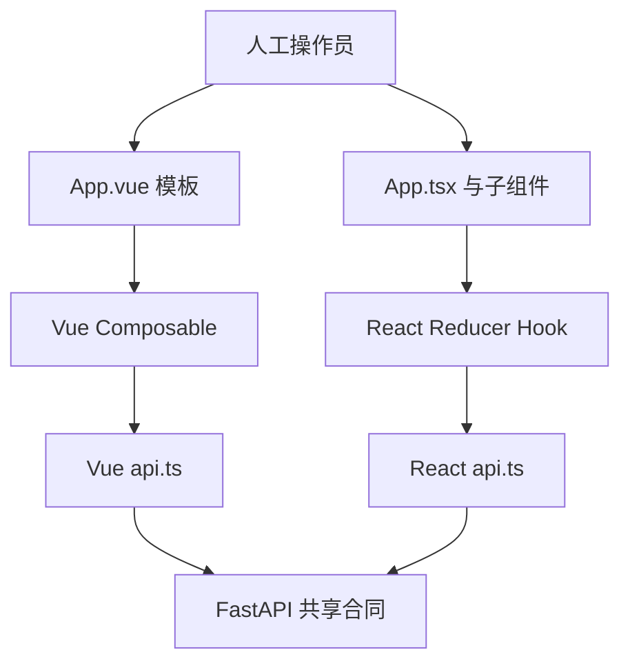

# Vue 3 与 React 19 对照及选型

本项目提供两个功能等价的前端：

- Vue 3.5 + TypeScript：`frontend/`
- React 19.2 + TypeScript：`frontend-react/`

两者共享 FastAPI 8010、API 路径、类型结构、标签业务规则、响应式视觉规范和 Playwright 验收目标。因此下面比较的是框架表达方式，而不是不同产品功能。

## 1. 先说结论

Vue 和 React 都能可靠实现这类企业补录工作台。选择主要取决于团队和未来生态，不取决于“哪个框架能显示表单”。

| 条件 | 更倾向 Vue | 更倾向 React |
| --- | --- | --- |
| 小团队快速开发内部运营后台 | 模板、指令和官方方案上手快 | 可行，但组合选择更多 |
| 后端开发者首次做管理页面 | SFC 边界直观，模板接近 HTML | 状态快照和纯函数思想更显式 |
| 公司已有统一前端技术栈 | 已有 Vue 组件库和工程体系 | 已有 React 组件库和工程体系 |
| 需要 Next.js/React Native 生态 | 不是首选理由 | 通常更匹配 |
| 希望路由和状态方案更集中 | Vue Router + Pinia 官方路线清晰 | 社区方案丰富，需要团队标准化 |
| 招聘和跨团队共享组件 | 取决于地区与组织 | React 人才和生态通常更广 |

对本项目的实际建议：生产长期只保留一个主前端，避免相同需求、测试和安全补丁维护两遍。当前双实现适合学习、迁移验证和团队选型。

## 2. 同一业务架构



框架只负责浏览器呈现和交互。幂等、租约、乐观锁、受控标签和权限必须由后端保证，两套前端都不能绕过。

## 3. 文件组织

| 关注点 | Vue 实现 | React 实现 |
| --- | --- | --- |
| 应用入口 | `src/main.ts` | `src/main.tsx` |
| 根视图 | `src/App.vue` | `src/App.tsx` |
| 页面状态 | `src/composables/useLabelingWorkbench.ts` | `src/hooks/useLabelingWorkbench.ts` |
| HTTP | `src/api.ts` | `src/api.ts` |
| 合同 | `src/types.ts` | `src/types.ts` |
| 样式 | `src/style.css` | `src/index.css` |
| E2E | `e2e/labeling-workbench.spec.ts` | `e2e/react-workbench.spec.ts` |

Vue 的 Single File Component 可以在一个 `.vue` 文件中放脚本、模板和局部样式。React 的 `.tsx` 直接用 JavaScript/TypeScript 组合标签和逻辑，样式方案由团队选择。

本仓库的 Vue 页面刻意较集中，方便学习完整 SFC；React 页面按五个职责拆分。这个差异是本项目的教学选择，不是“Vue 不能拆组件”或“React 必须很多文件”。

## 4. 模板与 JSX

Vue 使用 HTML 模板和框架指令：

```vue
<button
  v-for="row in labelRows"
  :key="row.definition.code"
  :class="{ selected: row.selected }"
  @click="toggleTag(row.definition.code)"
>
  {{ row.definition.name }}
</button>
```

React 使用 JavaScript 的 `map`、表达式和事件属性：

```tsx
{rows.map((row) => (
  <button
    key={row.definition.code}
    className={row.selected ? 'selected' : ''}
    onClick={() => onToggle(row.definition.code)}
  >
    {row.definition.name}
  </button>
))}
```

Vue 模板更接近 HTML，常见结构噪声较少；JSX 不需要学习 `v-if/v-for/v-bind/v-on` 指令，所有组合都使用 JavaScript。复杂动态 UI 中 JSX 很灵活，但团队需要主动控制表达式复杂度。

## 5. 响应式状态的根本差异

Vue 保存可变响应式容器：

```ts
const selectedTags = ref<string[]>([])
selectedTags.value = [...selectedTags.value, code]
```

React 保存不可变渲染快照：

```ts
const [state, dispatch] = useReducer(reducer, initialState)
dispatch({ type: 'tagToggled', code })
```

| 维度 | Vue | React |
| --- | --- | --- |
| 更新触发 | Ref/Proxy 跟踪被读取的响应式依赖 | State 更新后重新调用组件函数 |
| 脚本读取 | `ref.value` | 直接读取当前渲染的 State |
| 模板读取 | 自动解包 Ref | JSX 直接读取值 |
| 对象更新 | 可使用响应式对象变更，也可替换 | 应创建新对象/数组 |
| 异步心智模型 | Ref 在异步回调中读取当前值 | 闭包读取发起该渲染的快照 |

React 的快照和不可变更新更显式，适合用 Reducer 表达状态机；Vue 的细粒度依赖跟踪通常让业务表单代码更短。

## 6. 派生数据

Vue 用 `computed` 声明缓存的响应式派生值：

```ts
const suggestedCount = computed(() =>
  (bundle.value?.prediction.suggestions ?? [])
    .filter((item) => item.selected_by_default).length,
)
```

React 当前直接在渲染中计算：

```ts
const suggestedCount = (state.bundle?.prediction.suggestions ?? [])
  .filter((item) => item.selected_by_default).length
```

Vue `computed` 根据响应式依赖缓存。React 每次渲染都会执行普通计算；只有计算昂贵或引用稳定有实际价值时才使用 `useMemo`。不要把 React 的 `useMemo` 当成 Vue `computed` 的机械翻译。

共同原则是：能从源状态计算的值不要再保存一份，避免双状态不一致。

## 7. 生命周期与外部系统

Vue：

```ts
onMounted(() => void loadNext())
onBeforeUnmount(() => activeController?.abort())
```

React：

```tsx
useEffect(() => {
  loadInitialTask()
  return () => activeControllerRef.current?.abort()
}, [])
```

Vue 生命周期钩子名称直接对应挂载和卸载。React 把建立与清理放在同一个 Effect 中，并要求显式声明依赖。React Strict Mode 开发检查会额外执行一次建立和清理，因此副作用必须可重复、可取消。

两套实现都使用 `AbortController`，防止快速切换学科时旧请求覆盖新页面。

## 8. 普通变量、Ref 与页面状态

两套实现都需要保存“不会展示，但必须跨调用存在”的值：取消控制器和提交幂等键。

Vue Composable 闭包中的普通变量可以跨响应式更新保留：

```ts
let activeController: AbortController | null = null
let submitIdempotencyKey: string | null = null
```

React 函数组件会重新执行，因此使用 Ref：

```ts
const activeControllerRef = useRef<AbortController | null>(null)
const submitKeyRef = useRef<string | null>(null)
```

它们都不应进入可见 State，否则每次更新句柄或 UUID 都会触发无意义渲染。

## 9. 表单绑定

Vue 用 `v-model`：

```vue
<textarea v-model="note" />
```

React 显式组合 `value` 和 `onChange`：

```tsx
<textarea
  value={note}
  onChange={(event) => onNoteChange(event.target.value)}
/>
```

两者都能形成受控数据流。Vue 语法更短；React 展开后的读写方向更明显。复杂表单中，两边都可以引入表单库，但当前页面没有必要。

## 10. 父子组件通信

| 方向 | Vue | React |
| --- | --- | --- |
| 父传子 | Props | Props |
| 子通知父 | `defineEmits` / 回调 Prop | 回调 Prop |
| 插槽内容 | `<slot>` | `children` 或 Render Prop |
| 跨树共享 | provide/inject | Context |

无论框架，子组件都不应偷偷复制一份业务 State。当前 React 子组件通过 `onToggle` 等回调上报意图；Vue 当前主页面集中，未来拆分时也应使用同样边界。

## 11. 条件和列表

| 需求 | Vue | React |
| --- | --- | --- |
| 条件创建 DOM | `v-if/v-else-if/v-else` | 三元表达式或 `&&` |
| 频繁显隐但保留 DOM | `v-show` | CSS 或显式保留组件 |
| 列表 | `v-for` | `array.map` |
| 稳定身份 | `:key` | `key` |
| 动态组件 | `<component :is="Icon">` | `<Icon />` |

两边的 `key` 都应来自业务稳定 ID，而不是数组索引。

## 12. 状态组织与生态选择

当前页面不需要全局状态库。增加多页面后可按数据类型选工具：

| 问题 | Vue 常见方案 | React 常见方案 |
| --- | --- | --- |
| 页面局部状态 | `ref/reactive/computed` | `useState/useReducer` |
| 可复用页面逻辑 | Composable | Custom Hook |
| 跨页面客户端状态 | Pinia | Redux Toolkit、Zustand、Context |
| 服务端缓存和后台刷新 | TanStack Query for Vue | TanStack Query |
| 路由 | Vue Router | React Router、TanStack Router |
| 全栈/SSR | Nuxt | Next.js、Remix 等 |

“React 选择多”既是生态优势，也是治理成本。团队应统一路由、请求缓存、表单、状态和组件库，而不是让每个页面自行选型。

## 13. TypeScript 体验

两套工程共享相同的接口思想，但编译链不同：

- Vue 使用 `vue-tsc` 检查模板和脚本。
- React 使用 `tsc -b` 检查 TSX。
- Vue Props/Emits 常用 `defineProps/defineEmits` 泛型。
- React Props 是普通 TypeScript 接口和函数参数。
- 两边的类型都在浏览器运行时被擦除，不能替代 API Schema 校验。

React 的 TSX 完全处于 TypeScript 表达式系统中，复杂泛型组件通常更直接；Vue 3 的模板类型检查已经成熟，常规运营页面差距很小。

## 14. 并发与优先级

React 版使用 `startTransition` 将大型任务视图替换标记为非紧急更新，并用 `useEffectEvent` 组织初始 Effect。Vue 版无需直接对应这些 API，响应式调度器会批量处理更新。

这不代表 React 请求更快。网络正确性仍由以下共同机制保证：

- `AbortController` 取消过期请求。
- API 快照保存 prediction ID 和任务版本。
- 提交重试复用同一个幂等键。
- FastAPI 校验租约、角色和乐观锁。

框架调度优化不能替代协议级并发控制。

## 15. 性能与包体积应实测

当前生产构建的本地结果：

| 产物 | Vue | React |
| --- | ---: | ---: |
| JavaScript 原始大小 | 80.63 kB | 210.13 kB |
| JavaScript gzip | 31.66 kB | 66.63 kB |
| CSS 原始大小 | 12.86 kB | 12.86 kB |

这些数字只对应当前依赖版本和实现，不能推广为所有 Vue/React 项目。React 页面还拆分了更多组件，但包体差异主要来自运行时和依赖构成，不是文件数量。

对内部运营工作台，正确性、可维护性和交互延迟通常比几十 KB 更重要。面向弱网公开页面时，应继续做路由分包、依赖分析和真实设备性能测试。

## 16. 测试方式

两套页面都使用 Playwright 和真实 FastAPI：

```bash
# Vue
cd frontend
npm run test:e2e

# React
cd ../frontend-react
npm run test:e2e
```

共同验收：

- 服务端身份显示正确。
- 能领取题目并展示标签。
- 能看到模型告警和 RAG 证据。
- 人工修改后可以真实提交。
- 桌面和 390px 移动页面无水平溢出。

这类用户行为测试比断言内部 Hook 调用次数更抗重构。

## 17. 适用场景

### 更适合优先考虑 Vue

- 团队以 Java/Python/Go 后端开发者为主，需要快速交付运营后台。
- 已有 Vue 组件库、Vue Router、Pinia 和工程规范。
- 页面以表单、列表、审批和配置为主。
- 希望官方推荐路径集中，减少基础库选型会议。

### 更适合优先考虑 React

- 公司已有 React 平台、设计系统和测试工具链。
- 需要共享 React Web/React Native 思维或人才体系。
- 计划采用 Next.js 等 React 全栈生态。
- UI 高度动态，团队偏好 JavaScript 函数组合和显式状态机。

### 不应成为决定因素

- “Vue 只能做小项目”不成立。
- “React 一定性能更高”不成立。
- “React 必须 Redux”不成立。
- “Vue 不需要理解状态流”不成立。
- 简单基准或招聘热度不能替代现有团队能力和维护成本。

## 18. 本项目的选型建议

若这是新建的内部补录系统：

1. 团队已有主框架时直接沿用，收益通常高于重选框架。
2. 团队主要是后端且没有前端平台时，Vue 能更快形成稳定表单工作流。
3. 组织已有 React 设计系统或后续要进入 Next.js/React Native 时，选择 React。
4. 无论选择哪一个，都保留共享 OpenAPI/TypeScript 合同和框架无关 E2E 场景。
5. 上线前删除另一套生产入口或明确维护责任，不长期让业务行为悄悄分叉。

当前代码尤其适合学习迁移：先在 Vue 完成一个行为，再到 React 找同一 API、同一状态和同一 DOM 语义，最后用 E2E 证明两边结果一致。

## 19. 面试式检查问题

**为什么 React 选择 Reducer，而 Vue 使用多个 Ref？**

React 工作台的异步阶段和状态字段相关，Reducer 能集中描述状态转换。Vue 的 Ref/Computed 细粒度响应式已经让这些更新保持简洁。两种写法都不是强制规则。

**为什么幂等键不放在可见 State？**

它不影响 UI，但必须跨重试保留。Vue 用 Composable 闭包变量，React 用 Ref；成功后清除，失败后复用。

**为什么不能只靠禁用提交按钮防重复？**

双击、超时重试、刷新和网关重放都可能绕过 UI。真正保证来自服务端幂等键、唯一约束和事务。

**为什么 React 没给每个派生值加 `useMemo`？**

数组很小，普通计算更简单。记忆化本身也有比较、缓存和理解成本，应由性能证据驱动。

**为什么两套前端共享后端比复制后端更重要？**

只有共享业务事实和协议，E2E 才是在比较前端表达方式；复制后端会引入无法归因的行为差异。

继续阅读：[Vue 3 对应用法学习指南](VUE_LEARNING_GUIDE.md) 和 [React 19 对应用法学习指南](REACT_LEARNING_GUIDE.md)。