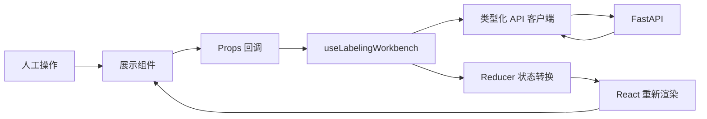

# 题审台 React 19 前端

这是题目标注补录系统的 React 19 + TypeScript 实现。它和 `../frontend` 中的 Vue 3 页面使用同一个 FastAPI、标签字典、任务租约、预测快照和人工提交合同，适合在相同业务条件下学习两种框架。

页面不是静态演示：领取任务、切换学科、刷新模型建议、提交人工标签和查看 Hybrid RAG 证据都调用真实后端。

## 本地运行

要求：

- Node.js 22
- npm 10 或更高版本
- 后端默认位于 `http://127.0.0.1:8010`

安装并启动：

```bash
cd question_labeling_system/frontend-react
npm install
npm run dev -- --host 127.0.0.1
```

当前工作区的 Node 22 安装在用户目录时：

```bash
PATH="$HOME/.local/node/bin:$PATH" npm run dev -- --host 127.0.0.1
```

打开 <http://127.0.0.1:5174/>。Vite 会把 `/api`、`/healthz`、`/readyz` 和 `/metrics` 代理到 FastAPI。

如需连接独立 API 域名，可在构建或启动前设置：

```bash
VITE_API_BASE_URL=https://api.example.com npm run build
```

## 代码结构

```text
frontend-react/
├── src/
│   ├── components/                 # 只通过 Props/回调通信的展示组件
│   │   ├── SubjectSidebar.tsx      # 学科导航
│   │   ├── QuestionDetail.tsx      # 题目、答案、来源
│   │   ├── LabelReviewList.tsx     # 标签与四路模型分数
│   │   ├── EvidencePanel.tsx       # Hybrid RAG 相似题
│   │   └── SubmissionBar.tsx       # 受控备注和提交命令
│   ├── hooks/
│   │   └── useLabelingWorkbench.ts # Reducer、Effect 和业务动作
│   ├── api.ts                      # 类型化 Fetch、认证和错误转换
│   ├── subjects.ts                 # 学科名称、图标和导航配置
│   ├── types.ts                    # 与 FastAPI 对齐的前端合同
│   ├── presentation.ts             # 无副作用展示格式化函数
│   ├── App.tsx                     # 页面状态分支与组件编排
│   ├── main.tsx                    # StrictMode 和 React 根节点
│   └── index.css                   # 桌面、平板、移动响应式样式
├── e2e/react-workbench.spec.ts     # 真实 API 的 Playwright 测试
├── .dockerignore                   # 排除依赖、产物和测试结果
├── Dockerfile                      # Node 构建 + Nginx 运行
├── nginx.conf                      # SPA 回退、安全头和 API 代理
└── vite.config.ts                  # 5174 开发服务器与 API 代理
```

## 页面数据流



关键约束：

- `App.tsx` 和子组件不直接发送 HTTP 请求。
- `api.ts` 不保存页面加载状态。
- Reducer 是纯函数，不在里面调用 API 或生成 UUID。
- `useRef` 保存取消句柄和提交幂等键，因为它们变化时不应触发渲染。
- 提交失败会保留标签、备注和同一个幂等键，用户可以安全重试。

## 常用命令

```bash
# 快速语法和 React Hooks 规则检查
npm run lint

# 只执行 TypeScript 项目引用检查
npm run typecheck

# 类型检查并生成 dist 生产产物
npm run build

# 自动启动或复用 FastAPI 与 Vite，运行桌面和移动真实 E2E
npm run test:e2e

# 本地预览已经构建的 dist
npm run preview
```

Playwright 固定为单 Worker，因为并行测试会竞争同一个 FIFO 人工任务队列。桌面测试验证真实提交；移动测试验证 390px 视口没有横向溢出。

## 认证边界

- 生产令牌仅保存在模块内存，通过 `setAccessToken()` 注入，不写 `localStorage`。
- 正式部署也可由同域 BFF 使用 HttpOnly/SameSite Cookie。
- `X-Debug-User: react-reviewer` 只在 Vite 开发模式发送。
- 生产构建不会发送调试身份，后端也会在生产配置下拒绝 `AUTH_DISABLED=true`。

## 容器运行

React 镜像使用 Node 22 构建 Vite 产物，再由 Nginx 监听容器内 8080。项目根目录可只启动 React 及其依赖：

```bash
docker compose --profile react up --build frontend-react
```

访问 <http://127.0.0.1:8081/>。不指定目标服务而启用 profile 时，Vue 也会在 8080 启动，便于并排比较。

## 深入阅读

- [React 19 对应用法学习指南](../docs/REACT_LEARNING_GUIDE.md)
- [Vue 3 与 React 19 对照及选型](../docs/VUE_VS_REACT.md)
- [系统架构与业务时序](../docs/ARCHITECTURE.md)

源代码保留了密集中文注释，目的是让后端开发者能沿着“事件 -> 状态转换 -> API -> 新状态 -> 渲染”逐步阅读。JSON 配置文件不能写注释，其字段在本说明和专题指南中解释。
