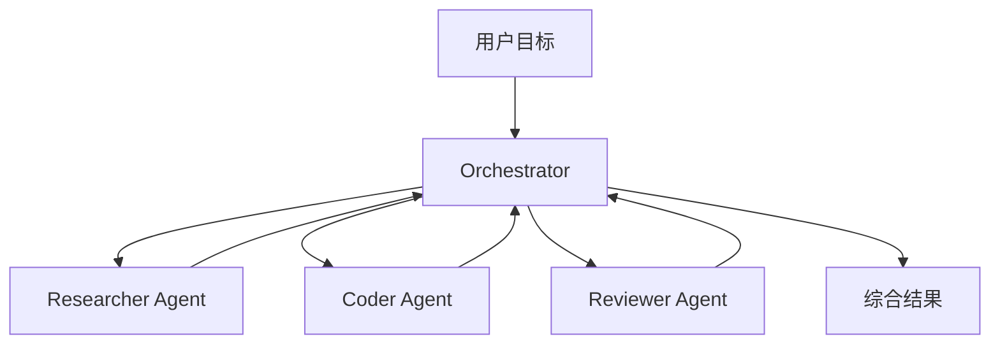
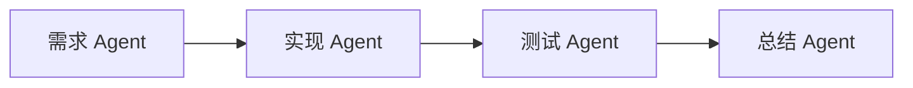
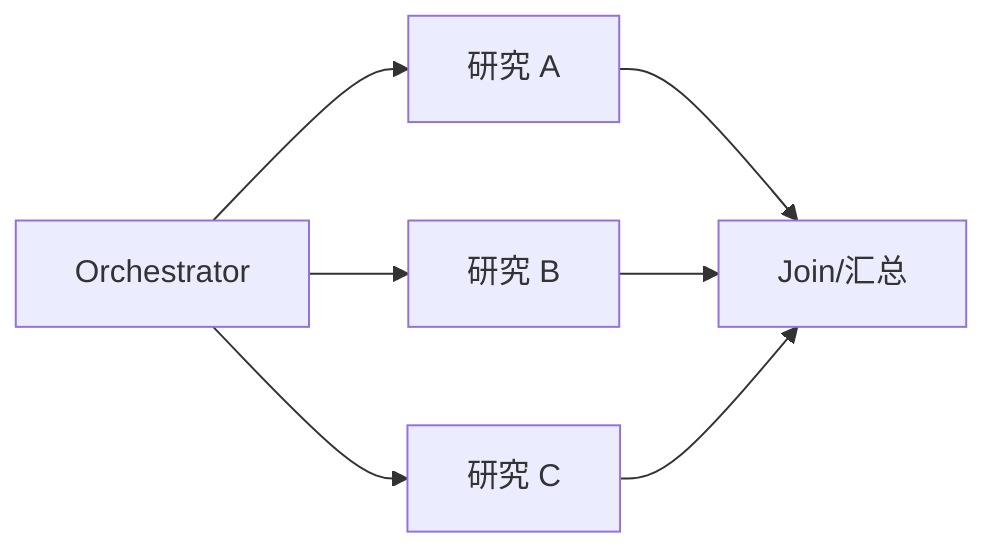
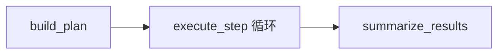

# 10. 什么是 Multi-Agent：分工、隔离与协作模式

> 原文：[什么是 Multi-Agent？](https://xiaolinnote.com/ai/agent/10_multiagent.html)
>
> 一句话结论：Multi-Agent 不是把代码拆成多个函数，而是多个拥有独立角色、上下文和决策边界的 Agent，通过协议协作完成共同目标。

## 1. 为什么需要 Multi-Agent

单 Agent 的典型边界：

- 所有资料、工具结果和任务状态挤在同一 context；
- 搜索、编码、评审等不同角色互相干扰；
- 独立子任务仍然串行执行；
- 单个决策链失败可能阻塞整个任务。

Multi-Agent 通过专业分工、上下文隔离和并行执行扩大任务容量，但也引入通信、状态一致性、路由和成本问题。



## 2. 三种协作模式

### 2.1 顺序流水线



适合前后依赖明确的流程。优点是可预测，缺点是延迟累加且前序错误会传播。

### 2.2 并行扇出/汇聚



适合无依赖子任务。必须定义超时、部分失败和结果合并策略。

### 2.3 辩论或评审

多个 Agent 对同一问题提出方案，Critic 或 Judge 依据标准选择或合并。适合高质量决策，但调用成本和结果方差较高。

## 3. 中心化与去中心化

| 维度 | 中心化 Orchestrator | 去中心化 P2P |
|---|---|---|
| 任务分配 | 中央统一决定 | Agent 自行协商 |
| 全局状态 | 易维护 | 难保持一致 |
| 故障感知 | 集中、清晰 | 需分布式协议 |
| 可观测性 | 调度链可追踪 | 因果链复杂 |
| 适用性 | 大多数生产系统 | 研究或特殊自治场景 |

生产环境通常先选中心化方案，因为行为更容易约束和回放。

## 4. 什么才算一个独立 Agent

至少要能回答：

1. 它的角色和目标是什么？
2. 它拥有哪组工具和权限？
3. 它维护独立上下文还是共享全部历史？
4. 输入输出协议是什么？
5. 谁决定调用它，失败后谁处理？

如果 Planner、Executor、Summarizer 只是同一 Python 流程中的三个函数，它们是模块或阶段，不会自动成为三个 Agent。

## 5. 当前项目代码映射

### 5.1 Day22 是 Single-Agent 工具循环

[run_day22_function_calling_basics.py](../run_day22_function_calling_basics.py) 只有一份 system prompt、一份 `messages` 和一个模型决策循环。多个工具不是多个 Agent。

### 5.2 Day25 是中心化编排雏形，不是 Multi-Agent

[run_day25_task_orchestration.py](../run_day25_task_orchestration.py) 有 `build_plan()`、`execute_step()`、`summarize_results()`：



它与 Orchestrator 的形状相似，但执行者是确定性的工具函数，不是拥有独立 prompt、上下文和工具集的 Worker Agent。

### 5.3 Day25-Day28 LangChain Demo 仍是单编排器

[run_day25_day28_langchain_demo.py](../run_day25_day28_langchain_demo.py) 提供 Pydantic `Plan`、`TOOL_MAP`、重试和审计。它是演进 Multi-Agent 的良好控制面基础，但目前没有 Worker 注册表、路由协议、共享状态 schema 或并行执行。

准确的能力边界：

| 能力 | 状态 |
|---|---|
| 单 Agent 工具调用 | 已实现 |
| Planner → 工具 → Summary | 已实现 |
| 统一审计和 trace | 已实现 |
| 专业 Worker Agent | 原 Demo 未实现；参考层提供 Worker 注册表 |
| Agent 间通信协议 | 原 Demo 未实现；参考层提供共享事件 schema |
| 并行扇出/汇聚 | 原 Demo 未实现；参考层提供 DAG ready batch |
| Critic/Judge | 原 Demo 未实现；参考层提供 Reflection evaluator |

具体代码见 [agent_capabilities_reference.py](examples/agent_capabilities_reference.py)：`WorkerRegistry` 约束可调用角色，`SharedState` 通过 append-only `StateEvent` 记录协作，`DAGOrchestrator` 并行执行同一批无依赖步骤，`ReflectionEngine` 接受独立 evaluator/improver。它们是单进程、可注入 Worker 的控制面参考，不等同于已经拥有独立 LLM prompt、进程隔离和消息中间件的生产 Multi-Agent 系统。

## 6. 最小演进方案

```python
AGENTS = {
    "researcher": {"prompt": "...", "tools": ["search_memory"]},
    "integrator": {"prompt": "...", "tools": ["http_get"]},
    "reviewer": {"prompt": "...", "tools": []},
}
```

建议按以下顺序演进：

1. 定义统一 `TaskEnvelope`：任务 ID、目标、输入、依赖、预算和截止时间。
2. 为每个 Worker 配置独立 prompt、工具白名单和输出 schema。
3. Orchestrator 只传递必要上下文，不复制完整历史。
4. 先实现顺序路由，再增加无依赖步骤的受控并行。
5. 用 `trace_id + agent_id + task_id` 记录调度、输入摘要和结果。
6. 定义失败、超时、部分成功和人工接管策略。

## 7. 工程风险

- **通信放大**：Agent 之间反复传递长文本，token 成本可能超过单 Agent。
- **错误传播**：上游 Worker 的错误被下游当成事实。
- **重复劳动**：任务边界不清导致多个 Worker 做相同工作。
- **权限扩散**：所有 Agent 共享全部工具会扩大风险面。
- **结束困难**：没有中央完成条件时可能循环交接。

## 8. 面试问答

### Q1：Multi-Agent 的核心价值是什么？

**答：** 专业分工、上下文隔离和可并行执行；不是单纯“多个模型更强”。

### Q2：多个工具是否等于多个 Agent？

**答：** 不等于。工具是被调用的能力，Agent 需要角色、决策边界、上下文和协作协议。

### Q3：Multi-Agent 为什么不一定更快？

**答：** 有依赖的步骤不能并行，且路由、通信、汇总、重试都会增加开销。只有独立子任务的关键路径缩短时才可能更快。

### Q4：中心化方案为什么常用于生产？

**答：** 任务分配、状态、错误和完成条件集中管理，便于审计、限制预算和故障恢复。

### Q5：当前 Day25 是否为 Multi-Agent？

**答：** 不是。它是单进程的 Planner/Executor/Summarizer 模块编排，Executor 调用工具而非独立 Worker Agent。

## 9. 复习结论

引入 Multi-Agent 前先证明单 Agent 的 context、专业度或并行性确实成为瓶颈。当前项目适合在 Day25 的中心化控制面上渐进增加 Worker，而不是直接引入去中心化协商。