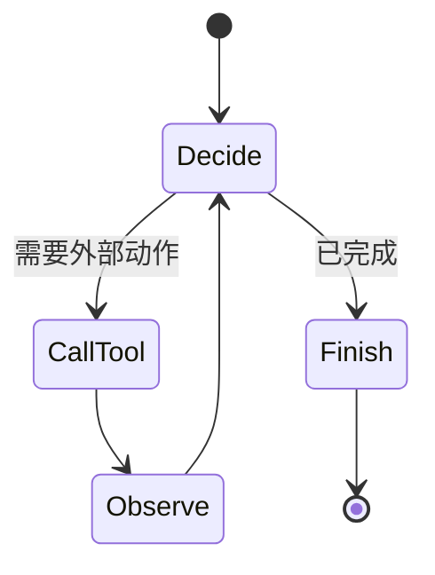
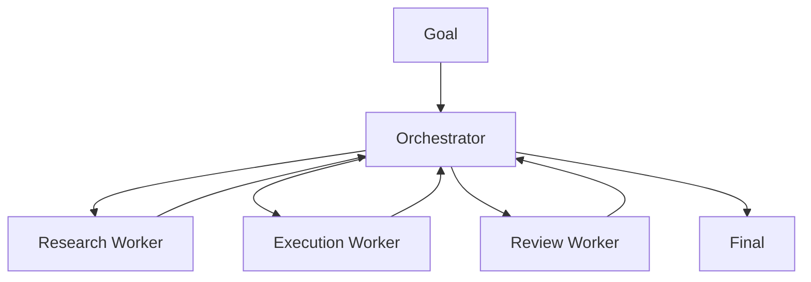
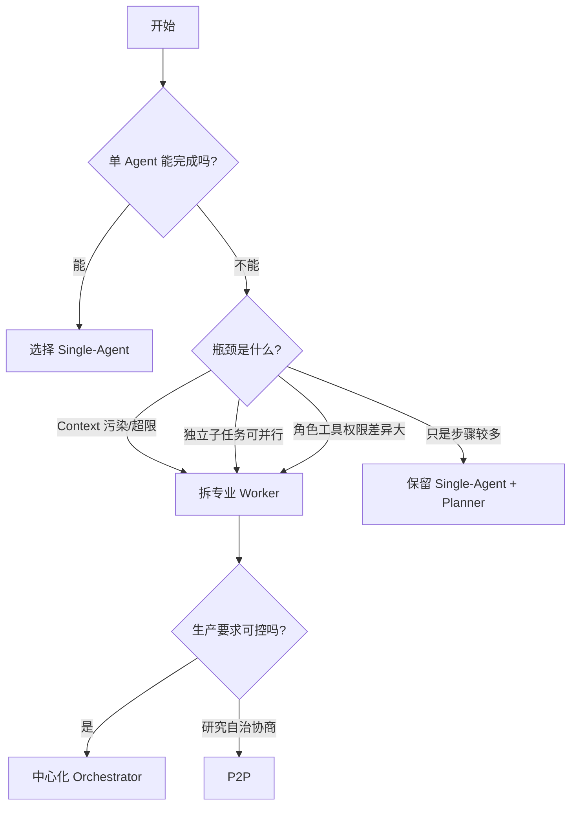
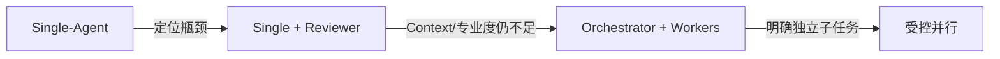

# 11. Single-Agent 与 Multi-Agent 设计和选型

> 原文：[说说 Single-Agent 和 Multi-Agent 的设计方案？](https://xiaolinnote.com/ai/agent/11_single_multi.html)
>
> 一句话结论：默认从 Single-Agent 开始；只有 context 隔离、专业分工或并行收益能抵消通信与调度成本时，才渐进演进到中心化 Multi-Agent。

## 1. Single-Agent 设计

一个 LLM 共享一份任务上下文，通过循环选择工具。优点：

- 代码和状态链路短；
- 没有 Agent 间通信成本；
- 结束条件、权限和预算易控制；
- 更容易复现和调试。

适用：流程明确、信息量可控、工具虽多但角色差异不大的任务。

## 2. Multi-Agent 的两种拓扑

### 2.1 中心化 Orchestrator

Orchestrator 负责拆分、路由、收集和完成判断，Worker 只处理专业子任务。

可按复杂度分为静态路由、动态规划、自适应编排。越动态，能力越强，但成本和不可预测性越高。

### 2.2 去中心化 P2P

Agent 通过消息队列或共享空间自行协商。它需要解决重复工作、完成检测、分布式失败感知、循环和一致性，工程门槛远高于示意图表现出来的程度。

## 3. 选型决策树

“任务复杂”不是充分标准。步骤多可以由 Single-Agent 的 Plan-and-Execute 处理，并不必然需要多个 Agent。

## 4. 方案对比

| 维度 | Single | 中心化 Multi | 去中心化 Multi |
|---|---|---|---|
| 架构复杂度 | 低 | 中 | 高 |
| Context | 单份共享 | Worker 隔离 | 隔离 + 协调状态 |
| 并行 | 有限 | 易受控实现 | 支持但难协调 |
| 可控性 | 高 | 较高 | 低 |
| 调试 | 最容易 | 按调度链定位 | 因果链复杂 |
| 通信成本 | 无 | 中 | 高 |
| 生产适用性 | 高 | 高 | 需谨慎 |

## 5. 当前项目属于哪一类

### Day22：典型 Single-Agent

[run_day22_function_calling_basics.py](../run_day22_function_calling_basics.py) 中模型在一份 `messages` 上重复决策，工具通过 `TOOL_IMPLS` 执行。这是 Single-Agent + Tools。

### Day25-Day28：Single-Agent 风格 Plan-and-Execute

[run_day25_day28_langchain_demo.py](../run_day25_day28_langchain_demo.py) 中：

- `build_plan()` 产生结构化 `Plan`；
- 主流程顺序遍历步骤；
- `execute_step()` 从 `TOOL_MAP` 选择工具；
- `summarize_once()` 汇总结果；
- `AuditCallbackHandler` 记录链路。

这些是中心化 Orchestrator 所需的基础能力，但当前每个“角色”没有独立 Agent 上下文，因此仍应归为单编排流程。

## 6. 渐进式演进策略

1. 保留当前单 Agent 基线，记录成功率、成本、延迟和失败类型。
2. 找到明确瓶颈，例如总结质量差，而不是主观认为“任务复杂”。
3. 只把瓶颈环节拆成一个 Worker，例如 Reviewer。
4. 定义 Worker 的输入输出 schema 和工具最小权限。
5. 比较拆分前后的质量收益与额外成本。
6. 只有存在独立任务时再增加并行。

## 7. 面试问答

### Q1：什么时候必须考虑 Multi-Agent？

**答：** 当单 Agent 的 context 经常超限或污染、任务需要显著不同的专业角色/权限，或存在足够大的独立并行子任务时。

### Q2：步骤多为什么不等于 Multi-Agent？

**答：** 单 Agent 可以先规划再逐步调用多个工具。是否多 Agent 取决于是否需要独立角色、上下文和决策边界。

### Q3：中心化 Orchestrator 做什么？

**答：** 理解目标、拆分任务、选择 Worker、维护高层状态、处理失败、收集结果并判断整体完成。

### Q4：去中心化的主要难点？

**答：** 任务分配冲突、重复执行、顺序与依赖、失败传播、全局完成检测、循环和一致性。

### Q5：项目应该如何从当前代码演进？

**答：** 先保持 Day25 控制面，把质量瓶颈环节拆成独立 Worker，并用现有 `trace_id` 审计；验证收益后再扩展，而不是一次引入多个 Agent。

## 8. 常见误区与结论

- 误区：复杂任务必须 Multi-Agent。
- 误区：Multi-Agent 一定更快、更准。
- 误区：中心化和去中心化在生产中同样成熟。
- 误区：几个不同函数就是几个 Agent。

最稳健的架构原则是：**用能满足需求的最小自治单元，从 Single-Agent 渐进演进。**