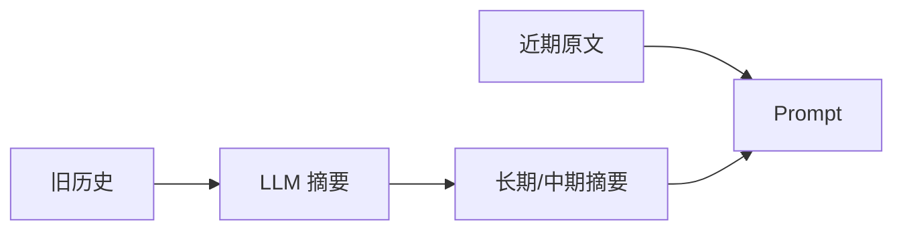
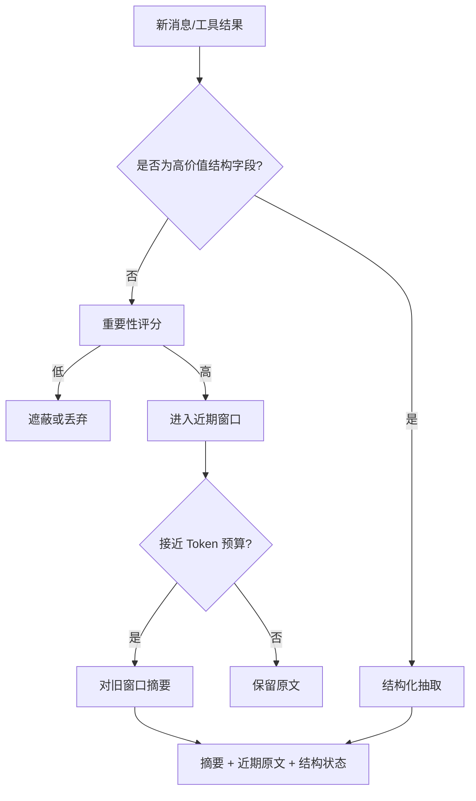

# 12. Agent 记忆压缩方法与工程组合

> 原文：[Agent 记忆压缩通常有哪些方法？](https://xiaolinnote.com/ai/agent/12_memcompress.html)
>
> 一句话结论：滑动窗口控制长度，摘要保留脉络，重要性过滤选择价值，结构化抽取提升密度；生产系统通常组合使用，并把 Prompt Caching 视为计算优化而非记忆压缩。

## 1. 为什么要压缩

LLM 每次调用依赖传入的上下文。历史持续增长会带来：

- 超过 context window 后早期内容被截断；
- 输入 token、延迟和成本持续上升；
- 无关历史干扰当前决策；
- 冗长工具结果挤压真正重要的信息。

压缩目标不是最短，而是在 token 预算内最大化任务相关信息。

## 2. 四种方法

### 2.1 滑动窗口

只保留最近 N 轮或最近 M tokens。

```python
visible_messages = messages[-max_messages:]
```

优点是零额外 LLM 成本；缺点是按时间硬截断，可能丢掉早期关键决策。

### 2.2 摘要压缩

把较老历史总结后替换原文，近期对话保持完整。



可做层级摘要：远期只保留关键决策，中期保留进展，近期保留原文。风险是摘要不可逆地丢失细节或引入错误。

### 2.3 重要性过滤

按价值而不是时间筛选。可以使用规则、LLM 打分或组合排序。

$$
importance=w_1\cdot decision+w_2\cdot reference+w_3\cdot recency-w_4\cdot noise
$$

“观察遮蔽”不删除历史，而是按当前阶段隐藏不相关条目；比永久删除更容易恢复。

### 2.4 结构化抽取

把对话转成高密度字段：

```json
{
  "goal": "完成接口联调",
  "constraints": ["仅允许 httpbin.org", "超时 15 秒"],
  "confirmed": ["order_id=1001"],
  "failed_steps": ["POST returned 503"]
}
```

它最适合业务字段明确的场景，信息精确，但 schema 设计和更新规则成本最高。

## 3. 四种方法如何组合



常用组合：结构化状态始终保留；近期消息用滑动窗口；被移出窗口前摘要；低价值工具原文主动压缩或外置。

## 4. Prompt Caching 不是记忆压缩

| 技术 | 作用层 | 解决问题 |
|---|---|---|
| 记忆压缩 | 信息层 | 哪些信息进入 prompt，以什么形式进入 |
| Prompt Caching | 计算层 | 相同前缀是否重复 prefill |

缓存命中可以降低重复计算成本，但 prompt 的 token 内容仍然存在，也不会帮你选择该忘掉什么。价格和缓存有效期属于供应商时效信息，应以当前官方文档为准，不把文章数字写成固定事实。

## 5. 当前项目代码映射

### 5.1 Day22 尚未实现压缩

[run_day22_function_calling_basics.py](../run_day22_function_calling_basics.py) 每轮传入完整 `messages`，仅通过 `max_tool_rounds` 限制轮数。轮数上限限制执行次数，不等于 token 预算或记忆压缩。

### 5.2 `trim_text()` 是工具输出截断，不是完整摘要

[run_day25_day28_langchain_demo.py](../run_day25_day28_langchain_demo.py) 的 `trim_text()` 对 HTTP body 和审计预览做字符截断：

```python
def trim_text(text: str, max_len: int = 1200) -> str:
    if len(text) <= max_len:
        return text
    return text[:max_len] + "...<truncated>"
```

它能阻止单个工具结果无限膨胀，属于最粗粒度的主动截断。但它：

- 按字符而不是 token 控制；
- 不判断重要性；
- 不生成摘要；
- 可能截断 JSON 或关键尾部信息。

因此只能称为输出大小保护，不是完整 Agent 记忆压缩。

### 5.3 `summarize_once()` 不等于对话记忆摘要

该函数汇总计划和执行结果，目的是生成最终答案。它没有把摘要替换进后续 `messages`，因此不是会话压缩机制。不过可以复用其调用模式，增加专门的 `compress_history()`。

### 5.4 可运行的短期压缩实现

[agent_capabilities_reference.py](examples/agent_capabilities_reference.py) 中的 `ShortTermMemory` 将上下文明确分为三层：始终保留的 `working_state`、可替换的历史 `summary`、固定长度的近期 `messages`。`compress()` 只摘要移出窗口的旧消息，并在后续压缩时把旧摘要一同传给可注入的 summarizer；`build_context()` 再按“结构化状态 → 历史摘要 → 近期原文”重建 prompt。

示例中的 `deterministic_summary()` 只为离线演示，不代表高质量语义摘要。接入真实 LLM 时应让 summarizer 输出结构化事实、决策、未决问题和错误，同时保留原始日志以便审计。压缩后状态和近期窗口的测试见 [test_agent_capabilities_reference.py](../tests/test_agent_capabilities_reference.py)。

## 6. 建议实现

```python
def build_context(messages, working_state, token_budget):
    recent = take_recent_by_tokens(messages, token_budget // 2)
    older = messages[: len(messages) - len(recent)]
    summary = load_or_refresh_summary(older)
    return [
        {"role": "system", "content": render_state(working_state)},
        {"role": "system", "content": f"历史摘要：{summary}"},
        *recent,
    ]
```

实现时要加入：

- 用 tokenizer 估算 token，而不是字符数；
- 摘要中固定保留目标、约束、决策、未完成项和错误；
- 原始历史外置保存，摘要错误时可回溯；
- 每次压缩记录版本、覆盖范围和输入哈希；
- 用“关键事实保留率”而不只是压缩比评估。

## 7. 评测指标

- 压缩率：$1-\frac{tokens_{compressed}}{tokens_{original}}$；
- 关键事实保留率；
- 压缩前后任务成功率差；
- 摘要幻觉率和状态冲突率；
- 平均输入 token、P95 延迟和成本；
- 被遮蔽信息的后续恢复成功率。

## 8. 面试问答

### Q1：四种记忆压缩方法是什么？

**答：** 滑动窗口、摘要压缩、重要性过滤、结构化抽取。它们分别从时间截断、内容提炼、价值选择和载体转换解决问题。

### Q2：为什么滑动窗口通常要配摘要？

**答：** 窗口能稳定控制长度，但会硬丢旧信息；摘要在旧内容移出前保留目标、决策和进展。

### Q3：摘要压缩的风险？

**答：** 不可逆细节丢失、摘要幻觉、连续多次摘要导致误差累积。因此应保存原始记录、限定摘要 schema 并评测关键事实保留率。

### Q4：Prompt Caching 与压缩的区别？

**答：** 压缩决定传什么，Caching 优化相同 prompt 前缀的重复计算，二者互补。

### Q5：项目中 `trim_text()` 算记忆压缩吗？

**答：** 只算低层的大小保护或硬截断。它不管理对话历史、不评估价值，也不保留语义摘要。

## 9. 常见误区与结论

- 把扩大 context window 当作无需压缩。
- 只按时间丢弃，不保护关键约束。
- 把最终报告总结当作会话摘要。
- 压缩后删除原文，导致无法审计和纠错。

当前项目最适合先增加 token 预算、结构化工作状态和“旧摘要 + 近期原文”，再逐步加入重要性过滤。