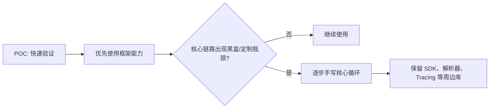
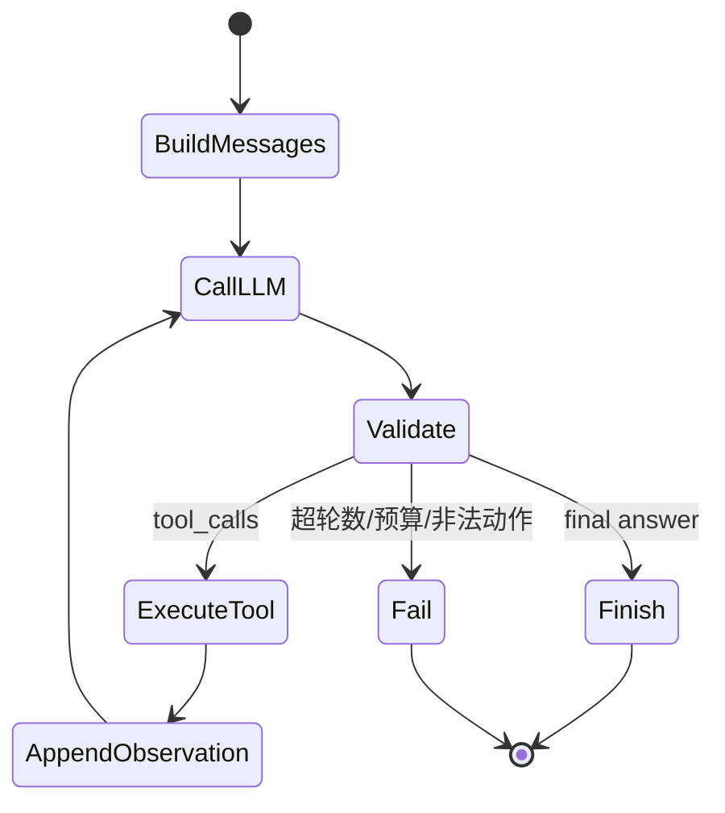
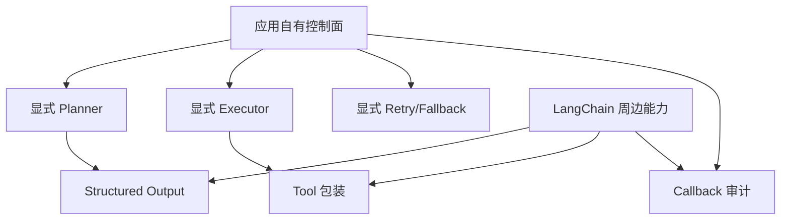

# 13. 为什么在工程中手写 Agent 核心闭环

> 原文：[在工程实践中，为什么有时候选择「手搓」Agent，而不是直接用成熟框架？](https://xiaolinnote.com/ai/agent/13_handcode.html)
>
> 一句话结论：框架适合快速验证，手写适合需要透明控制、稳定接口和精确优化的核心链路；务实方案通常是核心循环手写、周边能力复用成熟库。

## 1. 框架和手写分别解决什么问题

框架提供工具注册、消息适配、状态编排、回调和集成生态，能显著降低 POC 成本。随着系统进入生产，团队会更关心：

- 模型到底收到了哪些消息；
- 为什么选择这个工具；
- 哪个阶段失败、重试了几次；
- 如何限制轮数、预算、URL 和工具权限；
- 依赖升级是否改变核心行为；
- 框架额外序列化和 callback 是否影响延迟。



## 2. 手写 Agent 的最小组成



核心不是“完全不用第三方包”，而是让应用自己拥有以下控制权：

1. 消息顺序和上下文构造；
2. 工具 schema、实现注册和权限；
3. 参数校验和执行隔离；
4. 停止条件、预算和超时；
5. Retry、Replan、Reflection 的触发边界；
6. 审计事件和错误语义。

## 3. 当前项目的手写实现

### 3.1 Day22：透明的 Function Calling Loop

[run_day22_function_calling_basics.py](../run_day22_function_calling_basics.py) 展示了手写核心闭环：

```python
for round_idx in range(1, args.max_tool_rounds + 1):
    message, usage = chat_once_with_tools(messages=messages, tools=TOOL_SPECS, ...)
    tool_calls = message.get("tool_calls") or []
    if not tool_calls:
        final_answer = (message.get("content") or "").strip()
        break
    messages.append(assistant_entry)
    for item in tool_calls:
        result_payload = execute_tool_call(item)
        messages.append({"role": "tool", "content": json.dumps(result_payload)})
```

这里每个控制点都可直接定位：

- `TOOL_SPECS` 是模型可见契约；
- `TOOL_IMPLS` 是真实执行白名单；
- `execute_tool_call()` 处理 JSON 参数、未知工具和异常；
- `max_tool_rounds` 是硬停止条件；
- `append_jsonl()` 记录每步。

这比把循环隐藏在通用 Executor 中更适合学习、调试和定制。

### 3.2 Day25：手写 Plan-and-Execute

[run_day25_task_orchestration.py](../run_day25_task_orchestration.py) 手写 `build_plan()`、`execute_step()` 和 `summarize_results()`，并加入：

- URL scheme/host allowlist；
- HTTP timeout；
- 工具参数修正；
- 未知工具错误；
- 总结失败的本地 fallback。

它证明“手写”可以只依赖底层 HTTP/LLM SDK，而无需手写网络协议或 JSON 解析器。

## 4. 当前项目的框架实现

[run_day25_day28_langchain_demo.py](../run_day25_day28_langchain_demo.py) 使用：

- `ChatOpenAI` 统一模型接口；
- Pydantic `Plan/PlanStep`；
- `with_structured_output()`；
- `@tool`；
- `BaseCallbackHandler`。

但它没有把整个 Agent loop 交给黑盒 Executor，而是仍然显式调用 `build_plan()`、`execute_step()`、`summarize_once()`。这是“核心控制手写、周边复用框架”的折中方案。



## 5. 如何选

| 场景 | 更合适的选择 |
|---|---|
| 两天内验证 Agent 想法 | 框架优先 |
| 标准 RAG、文档解析、模型适配 | 复用成熟组件 |
| 核心循环高度定制 | 手写控制面 |
| 生产要求严格审计和稳定接口 | 手写或薄封装 |
| 图状态、持久化、人工中断很复杂 | 评估 LangGraph 等框架 |

不要用代码行数作为唯一标准。三行框架调用可能隐藏大量行为，二十行显式循环可能更容易维护；反过来，自己重造持久化状态机也可能比成熟框架更危险。

## 6. 手写不等于缺少工程能力

生产版还应补齐：

- Tool 输入的严格 schema 校验；
- 每工具权限、超时、并发和幂等策略；
- Token、费用和总耗时预算；
- 可恢复 checkpoint；
- 敏感字段脱敏；
- 单元测试、契约测试和轨迹回归测试；
- 依赖锁定和升级测试。

## 7. 面试问答

### Q1：为什么不全部使用成熟 Agent 框架？

**答：** 框架在 POC 很高效，但核心链路若需要严格可观测、定制停止条件、稳定行为或性能优化，过多抽象会增加调试和升级风险。

### Q2：手写的核心价值是什么？

**答：** 明确拥有消息、工具、状态、失败和停止条件的控制权，而不是“少依赖”本身。

### Q3：当前项目采用了什么策略？

**答：** Day22/Day25 是手写闭环；LangChain Demo 复用 structured output、tool 和 callback，但保留显式 Planner/Executor/Retry，属于折中方案。

### Q4：什么时候不应该手写？

**答：** 当需求是成熟框架已经稳定解决的复杂状态持久化、图编排或生态集成，而团队没有足够测试和维护能力时，不应为控制感重复造轮子。

### Q5：如何降低框架升级风险？

**答：** 锁版本、用适配层隔离框架类型、建立轨迹回归测试、先在非生产环境升级，并让业务状态模型归应用所有。

## 8. 常见误区与结论

- 误区：框架一定慢、手写一定快。
- 误区：手写意味着所有组件从零实现。
- 误区：POC 的短代码天然适合生产。
- 误区：用了 tracing 就消除了框架黑盒。

最佳边界不是教条式二选一，而是让决定系统行为的控制面保持透明，同时复用可靠的底层和周边组件。