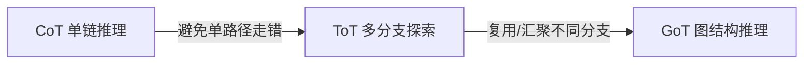
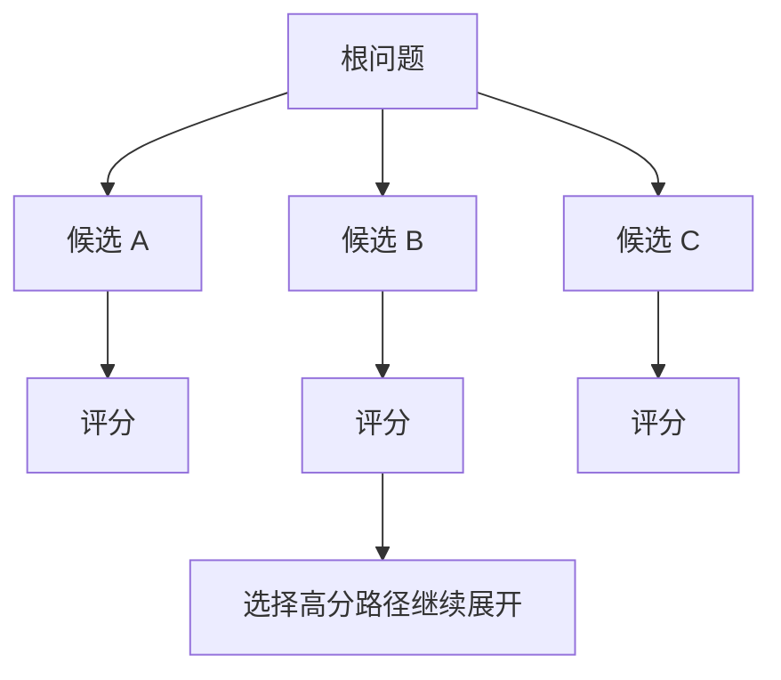
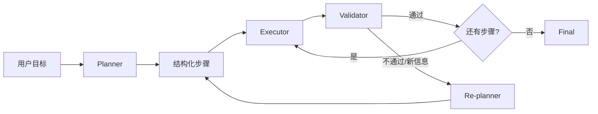
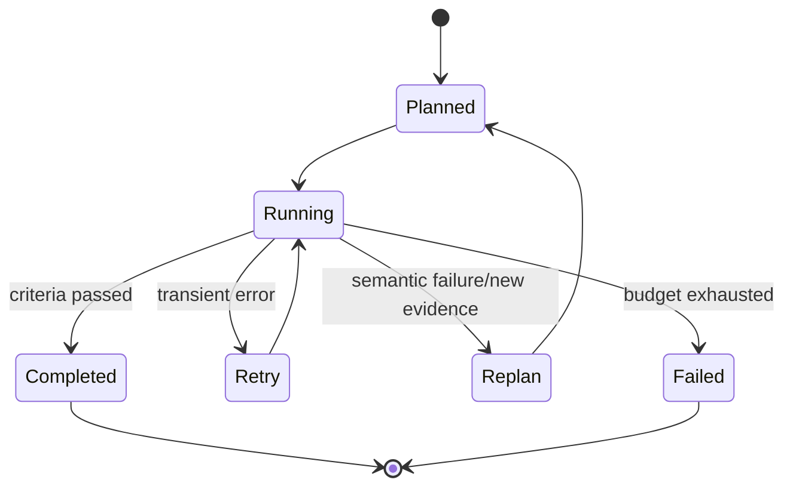

# 14. 如何赋予 LLM 规划能力

> 原文：[如何赋予 LLM 规划能力？](https://xiaolinnote.com/ai/agent/14_planning.html)
>
> 一句话结论：CoT、ToT、GoT 描述推理搜索结构，工程 Agent 更常使用结构化 Plan-and-Execute；成熟规划还需要依赖、验收、状态和 Re-planner，而不只是生成一次步骤列表。

## 1. CoT、ToT、GoT 的演进



### 1.1 CoT

让模型逐步推理，降低跳步风险。它仍是单路径，一开始方向错误时缺少回退。工程上不应要求模型暴露私有思维链；更实用的是让模型输出简洁的计划、依据和可验证中间结果。

### 1.2 ToT

对每层生成多个候选，评估后剪枝：



调用量由分支数、深度和评估次数共同决定，文章中的倍数是典型估计，不是固定成本。

### 1.3 GoT

允许节点拥有多个前驱，适合并行研究后汇总。它表达力强，但节点调度、合并和终止复杂；不能因为使用了普通 DAG 编排就声称实现了论文意义上的 GoT。

## 2. 工程常用的 Plan-and-Execute



Planner 应输出的不只是描述文本：

```json
{
  "id": "step_2",
  "goal": "请求订单接口",
  "tool": "http_get",
  "args": {"order_id": 1001},
  "depends_on": ["step_1"],
  "success_criteria": "HTTP 2xx 且响应包含 order_id",
  "on_failure": "replan"
}
```

依赖决定可执行顺序，验收标准决定是否完成，失败策略决定 Retry 还是 Replan。

## 3. 当前项目已经实现什么

### 3.1 手写 Planner

[run_day25_task_orchestration.py](../run_day25_task_orchestration.py) 的 `build_plan()` 要求模型输出 JSON，随后 `execute_step()` 映射到 `TOOL_IMPLS`，最后 `summarize_results()` 汇总。

### 3.2 LangChain 结构化 Planner

[run_day25_day28_langchain_demo.py](../run_day25_day28_langchain_demo.py) 使用 Pydantic：

```python
class PlanStep(BaseModel):
    step: str
    tool: str
    args: Dict[str, Any]
    why: str

class Plan(BaseModel):
    plan: List[PlanStep]

planner = llm.with_structured_output(Plan)
```

收益：输出可校验、字段清楚，小模型返回空计划时可检测并转入 `build_default_plan()`。

### 3.3 当前能力边界

| 能力 | 当前状态 |
|---|---|
| 任务前生成步骤列表 | 已实现 |
| 结构化 schema | LangChain 版已实现 |
| 工具白名单与参数修正 | 已实现 |
| 最大步骤数、重试、fallback | 已实现 |
| 步骤依赖/DAG 调度 | 原 Demo 未实现；参考实现已提供 |
| 每步成功标准 | 原 Demo 未实现；参考实现已提供 |
| 运行中 Re-planner | 原 Demo 未实现；参考实现已提供 |
| 计划版本和 checkpoint | checkpoint 已提供；完整版本迁移未实现 |

`retry_call()` 对同一调用做瞬时故障恢复，不会调整目标、工具或后续步骤，因此不是 Re-planning。

[agent_capabilities_reference.py](examples/agent_capabilities_reference.py) 中的 `PlanStep` 增加 `depends_on`、`success_criteria` 和 `on_failure`；`DAGOrchestrator` 只调度依赖已验收通过的步骤，并将 checkpoint 原子写入 JSON。验收失败只有在策略为 `replan`、提供 Replanner 且未超过 `max_replans` 时才接受新的未执行步骤补丁。原 Day Demo 仍保持一次规划和串行执行，参考层没有反向改变其行为。

## 4. 如何增加 Re-planner

Re-planner 输入至少包括：原始目标、当前计划、已完成结果、失败原因、剩余预算。输出应是“保留已完成步骤后的计划补丁”，而不是每次重写全部历史。

触发条件可以是：

- 工具返回业务失败或前置假设不成立；
- Validator 判定步骤不满足成功标准；
- 发现新信息导致后续步骤不再需要；
- 重试耗尽；
- 预算不足，需要缩短计划。



## 5. 规划质量如何评估

- 计划可执行率：工具和参数是否真实可用；
- 依赖正确率：是否在前置条件满足后执行；
- 覆盖率：计划是否覆盖用户验收目标；
- 冗余率：是否包含无价值步骤；
- Replan 有效率：调整后是否解决原失败；
- 最终任务成功率、总 token、关键路径延迟。

## 6. 面试问答

### Q1：CoT 是否等于规划能力？

**答：** 不等于。CoT 是单链推理提示方法；工程规划还需要显式步骤、工具、依赖、验收、状态和动态调整。

### Q2：ToT 的核心流程？

**答：** 生成多个候选、评估、剪枝，再继续展开，而不是生成多条完整答案后才挑选。

### Q3：Plan-and-Execute 和 ReAct 的关系？

**答：** Plan-and-Execute 管全局步骤；ReAct 可用于某个步骤内的即时“决策-动作-观察”。二者可以组合。

### Q4：Retry 和 Replan 有什么区别？

**答：** Retry 用相同策略重做同一动作，适合瞬时故障；Replan 根据失败证据改变后续步骤、工具或目标分解。

### Q5：当前项目规划成熟度如何？

**答：** 已有结构化一次性计划、执行和 fallback，但没有步骤依赖、验收 Validator 和运行中 Re-planner，因此是 Plan-and-Execute 原型。

## 7. 常见误区与结论

- 把“请一步步思考”当作完整 Planner。
- 把一次步骤列表称为动态规划。
- 把 Retry 称为 Replan。
- 计划有步骤描述，却无成功标准和状态。

当前项目下一步最有价值的增强不是实现昂贵的 ToT，而是为 `PlanStep` 增加 ID、依赖、成功标准和失败策略，再加入受控 Re-planner。