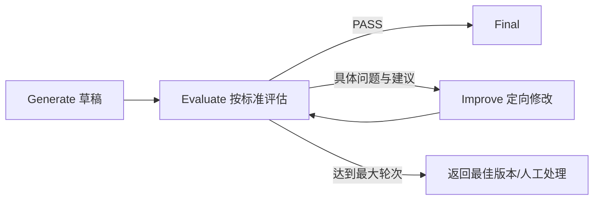
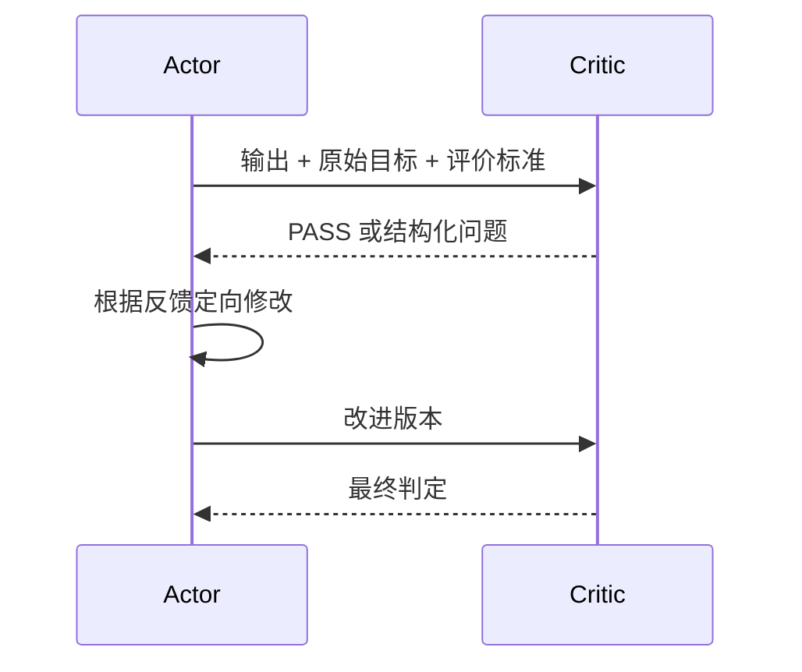
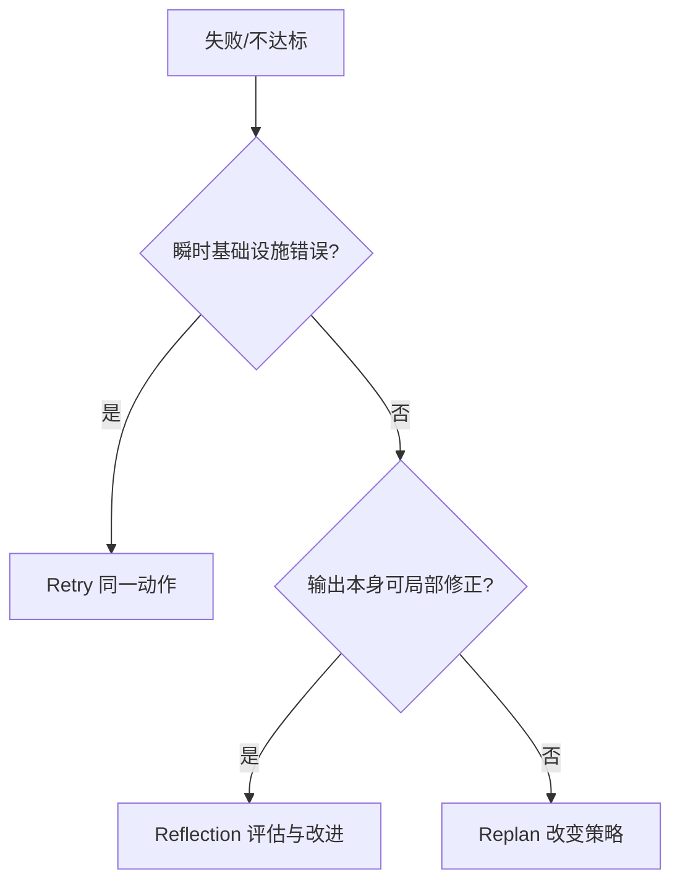

# 15. Agent 反思机制：生成、评估与改进

> 原文：[讲讲 Agent 的反思机制？为什么要用反思？具体怎么实现？](https://xiaolinnote.com/ai/agent/15_reflection.html)
>
> 一句话结论：Reflection 是有评价标准和反馈的“生成 → 评估 → 定向改进”闭环；没有评估反馈的重复调用只是 Retry 或重新采样。

## 1. 核心闭环



评估 Prompt 必须有：

- 明确维度：事实、逻辑、覆盖、格式、安全或业务规则；
- 可操作反馈：指出位置、问题和修改建议；
- `PASS` 出口；
- 结构化结果，避免靠模糊文本判断；
- 最大轮数，不能只依赖模型自觉停止。

```json
{
  "passed": false,
  "score": 0.72,
  "issues": [
    {"criterion": "completeness", "problem": "缺少失败策略", "suggestion": "补充 Retry/Replan 边界"}
  ]
}
```

## 2. 步骤级与任务级

| 粒度 | 优点 | 代价 | 适合场景 |
|---|---|---|---|
| 步骤级 | 早发现错误，避免传播 | 每步增加评估调用 | 强依赖、多步工具任务 |
| 任务级 | 成本较低，能看整体一致性 | 发现错误较晚 | 报告、代码包、最终答案 |

可只在高风险步骤反思，而不是每步固定反思。

## 3. Self-Reflection 与 Critic Agent



同一模型自评成本较低，但可能延续生成时的偏见。独立 Critic 可以使用不同 prompt、模型或确定性测试，视角更独立，但这只有在 Critic 是独立自治角色时才构成 Multi-Agent 互评。

最可靠的评价通常不是纯 LLM 判断，而是混合验证：

- 代码：编译、类型检查、单元测试；
- 数据：schema、约束和统计规则；
- RAG：引用存在性、来源支持度；
- LLM：表达、覆盖和开放式质量维度。

## 4. Reflection、Retry、Replan 的区别

| 机制 | 输入是否增加新反馈 | 动作是否改变 | 典型触发 |
|---|---|---|---|
| Retry | 通常没有 | 同动作重做 | 超时、连接重置、5xx |
| Reflection | 有评价意见 | 修改当前输出 | 质量不达标 |
| Replan | 有执行证据 | 改变后续计划 | 假设失效、策略错误 |



## 5. 当前项目代码映射

### 5.1 `retry_call()` 不是反思

[run_day25_day28_langchain_demo.py](../run_day25_day28_langchain_demo.py) 的 `retry_call()` 捕获 timeout、connection error、502/503/504，退避后重新执行同一个 `fn()`。它没有生成质量评价，也没有把反馈传给下一次调用。

因此它是基础设施 Retry，不能描述为 Reflection。

### 5.2 Fallback 也不是反思

空计划时切换 `build_default_plan()`、总结失败时使用本地 fallback，是确定性降级策略。它提高可用性，但没有“评估 → 修改”的循环。

### 5.3 当前未实现的部分

原 Day22-Day28 运行代码中没有 Critic、评价 schema、PASS 判定、改进 prompt 或反思轮次。第 6 篇文档讨论了 Reflection 理论，但这些 Demo 尚未实现。

### 5.4 可运行的 Reflection 参考实现

[agent_capabilities_reference.py](examples/agent_capabilities_reference.py) 提供 `Evaluation`、`ReflectionRound`、`ReflectionResult` 和 `ReflectionEngine`。调用方注入 evaluator 与 improver；引擎负责 PASS 停止、最大轮数、最低提升阈值、每轮输出与评价留痕，并返回评估过的最佳输出。这样可把“质量判断”与“循环控制”分开，也能用确定性 evaluator 离线测试。

它不会伪造通用 Critic：rubric、业务事实检查和 LLM 提示词必须由具体任务提供。测试覆盖了“失败后改进并通过”和“轮次耗尽后不再执行未验收改写”，见 [test_agent_capabilities_reference.py](../tests/test_agent_capabilities_reference.py)。

## 6. 建议的最小实现

```python
for round_index in range(max_reflection_rounds):
    evaluation = evaluate(task, current_output, rubric)
    if evaluation.passed:
        break
    current_output = improve(
        task=task,
        current_output=current_output,
        issues=evaluation.issues,
    )
```

建议先在 `summarize_once()` 后增加任务级 Reflection：

1. Rubric 固定检查是否覆盖目标、关键请求、响应、失败和下一步。
2. 优先执行确定性检查，例如状态码、必需字段和引用。
3. 只有确定性检查无法判断的维度才调用 LLM Critic。
4. 最多 2 轮，并保存每轮分数、反馈和输出哈希。
5. 连续无提升时提前停止，而不是机械跑满轮数。

## 7. Reflexion 与 LATS

- **Self-Refine**：当前任务内反复评估和修改。
- **Reflexion**：进一步把失败教训保存为经验，在后续任务中使用。
- **LATS**：将树搜索、路径评价和反思结合，成本远高于线性改进。

若没有跨任务经验写入与检索，就不应把普通 Self-Reflection 称为 Reflexion。

## 8. 面试问答

### Q1：Reflection 和“再生成一次”有什么区别？

**答：** Reflection 先依据明确标准输出问题和建议，再把反馈用于定向修改；随机重新生成没有诊断反馈。

### Q2：评估 Prompt 最关键的设计？

**答：** 明确评价维度、结构化问题、PASS 出口和最大轮数。

### Q3：步骤级和任务级如何选？

**答：** 前序错误会放大时在高风险步骤做步骤级；主要关心整体质量时做任务级。按风险选择，不要每步无差别调用。

### Q4：为什么 Critic 可能优于自评？

**答：** 独立上下文和职责减少对原生成逻辑的自洽偏见；若再结合不同模型或确定性测试，评价信号更独立。

### Q5：项目当前是否有 Reflection？

**答：** 没有。当前有 Retry、fallback 和最终总结，但缺少评价标准、反馈和定向改进循环。

## 9. 常见误区与结论

- 把 Retry、fallback、重新采样称为 Reflection。
- 评估只说“检查一下”，没有 rubric。
- 没有 PASS 和硬轮次上限。
- 全部依赖同一 LLM 自评，不运行可执行测试。

当前项目最适合从最终总结的任务级 Reflection 开始，并以确定性验证为主、LLM Critic 为辅。