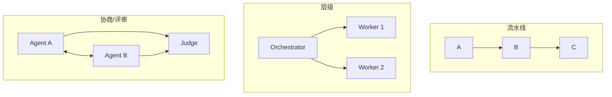
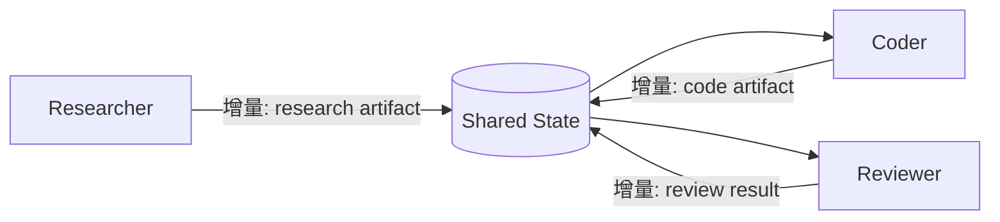
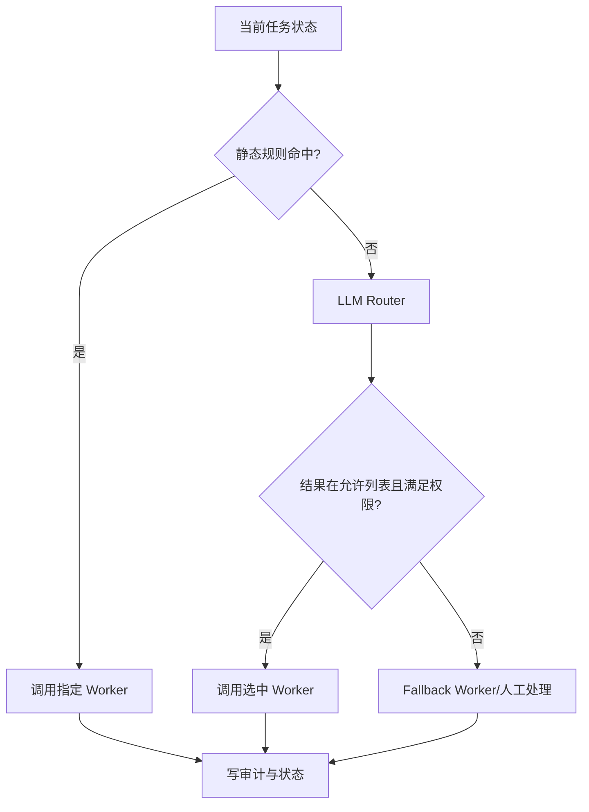
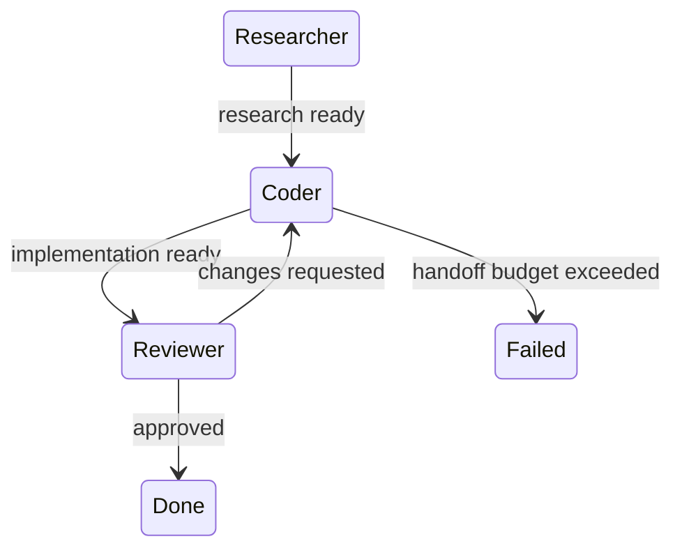

# 16. 多 Agent 协作、共享状态与动态切换

> 原文：[如何设计多 Agent 的协作与动态切换机制？](https://xiaolinnote.com/ai/agent/16_collab.html)
>
> 一句话结论：协作需要消息传递或共享状态，切换需要可审计路由；稳健方案通常是确定性主流程使用静态路由，只有规则无法覆盖的边缘情况才使用 LLM 动态路由。

## 1. 三种协作组织方式



复杂系统可以混用，但每种模式都必须有任务 ID、输入输出契约、失败语义和完成条件。

## 2. 消息传递与共享状态

### 2.1 消息传递

Worker 发布事件，下游订阅处理。优势是解耦和独立扩缩容，代价是需要消息中间件、幂等消费、重试队列和最终一致性。

```json
{
  "event_id": "evt_9",
  "task_id": "task_1",
  "producer": "researcher",
  "type": "research.completed",
  "payload_ref": "artifact://report/17",
  "attempt": 1
}
```

### 2.2 共享状态

所有节点读写同一个 schema，适合强依赖工作流。

```python
class AgentState(TypedDict):
    goal: str
    plan: list[dict]
    artifacts: dict[str, str]
    completed_steps: list[str]
    errors: list[dict]
    route_history: list[str]
```

建议分全局状态和 Worker 局部状态；共享更新优先追加事件或返回增量，避免任意覆盖。



## 3. 静态、动态与混合路由

| 路由 | 优点 | 缺点 | 适合 |
|---|---|---|---|
| 静态规则 | 快、便宜、可预测 | 难覆盖未知路径 | 主流程、合规步骤 |
| LLM 动态 | 语义灵活 | 多一次调用，可能选错 | 边缘和开放任务 |
| 混合 | 稳定与灵活平衡 | 需定义清晰兜底 | 大多数生产系统 |



动态路由输出必须校验：Agent 名称在白名单、输入满足 schema、权限允许、预算未耗尽。模型不能通过返回任意字符串获得未授权能力。

## 4. Handoff 模式

当前 Agent 自己决定下一个 Agent，适合职责边界明确的少量 Agent。风险是来回转交和缺少全局视角。

防循环至少需要：

- `route_history`；
- 最大 handoff 次数；
- 同一 Agent/状态组合去重；
- 中央预算和终止条件；
- 无进展检测。



## 5. 当前项目代码映射

### 5.1 当前只有顺序结果传递

[run_day25_task_orchestration.py](../run_day25_task_orchestration.py) 将 `execution_results` 列表传给 `summarize_results()`。这是单进程中的数据传递，不是 Agent 消息协议。

### 5.2 审计日志可扩展为协作可观测性

[run_day25_day28_langchain_demo.py](../run_day25_day28_langchain_demo.py) 已用 `trace_id` 记录 plan、tool、LLM 和 retry 事件。扩展 Multi-Agent 时可增加：

```json
{
  "trace_id": "...",
  "task_id": "step_2",
  "agent_id": "integrator",
  "event": "handoff_completed",
  "from": "orchestrator",
  "to": "integrator"
}
```

### 5.3 当前缺失能力

- 原 Day Demo 无 Worker Agent 注册表；
- 原 Day Demo 无共享 State schema 或消息队列；
- 原 Day Demo 无静态/动态 Router；
- 原 Day Demo 无 Handoff；
- 原 Day Demo 无并行控制和 Join；
- 无 Agent 级权限和预算。

因此不能把 Planner、工具和 Summarizer 的顺序执行描述为多 Agent 协作。

### 5.4 可运行的协作控制面参考

[agent_capabilities_reference.py](examples/agent_capabilities_reference.py) 已提供以下最小实现：

- `WorkerRegistry`：注册和白名单校验，拒绝未知 Worker；
- `SharedState`：线程安全结果表和 append-only `StateEvent`；
- `HybridRouter`：静态规则优先，动态结果必须在允许列表，否则走 fallback；
- `HandoffGuard`：目标白名单、route history、最大次数和重复路由检测；
- `DAGOrchestrator`：无依赖 Worker 并行和依赖 Join。

测试验证了动态路由越权回退和 handoff 预算。此实现仍是单进程教学控制面，没有消息队列、分布式锁、Agent 级凭据、全局 token/时间预算和独立 LLM Worker；这些生产能力仍属于后续演进。

## 6. 基于现有项目的演进设计

```python
def route(state: AgentState) -> str:
    if state["errors"]:
        return "reviewer"
    next_step = find_ready_step(state["plan"], state["completed_steps"])
    if next_step and next_step["tool"].startswith("http_"):
        return "integrator"
    return validated_llm_route(state, allowed={"planner", "integrator", "reviewer"})
```

推荐顺序：

1. 先定义共享状态和 append-only 事件。
2. 把现有步骤映射为静态 Worker 路由。
3. 为每个 Worker 增加独立 prompt、工具白名单和输出 schema。
4. 增加失败写回、最大路由次数和 fallback。
5. 只对未命中规则的任务启用 LLM Router。
6. 最后才增加并行扇出和消息队列。

## 7. 并发和状态一致性风险

- 多 Worker 同时覆盖字段：使用版本号、增量更新或 reducer。
- 重复消息：事件 ID + 幂等键。
- 部分失败：定义是否等待全部、允许部分汇总或取消其他任务。
- 大对象传递：状态中保存 artifact reference，而不是反复复制全文。
- 错误被吞：错误也必须是显式状态事件。
- 动态路由漂移：记录路由理由、候选和最终校验结果。

## 8. 面试问答

### Q1：消息传递和共享状态如何选择？

**答：** 强依赖流水线用共享状态更直接；需要解耦、独立扩缩容或异步并行时用消息传递，但要承担幂等和一致性成本。

### Q2：为什么不全部使用 LLM 动态路由？

**答：** 每次增加成本和延迟，选择可能不稳定，还可能越权。确定性主流程应使用规则，边缘情况再由 LLM 决策并校验。

### Q3：共享状态最重要的设计原则？

**答：** 明确 schema、区分全局和局部状态、增量更新或只追加、错误显式写入，并处理版本和并发冲突。

### Q4：Handoff 如何防死循环？

**答：** 记录路由历史、限制次数、检测重复 Agent/状态、设置无进展和总预算终止条件。

### Q5：当前项目是否实现多 Agent 协作？

**答：** 没有。已有顺序数据传递和 trace 审计，可作为控制面基础，但缺少独立 Worker、通信协议、共享状态和 Router。

## 9. 常见误区与结论

- 把函数参数传递称为 Agent 通信。
- 让多个 Agent 任意覆盖共享字典。
- 动态 Router 输出不做白名单和权限校验。
- Handoff 没有历史、预算和完成条件。

最稳健的落地路径是：共享状态 + 静态主路由 + 动态兜底 + 全链路审计，然后再根据真实并行收益引入消息队列。