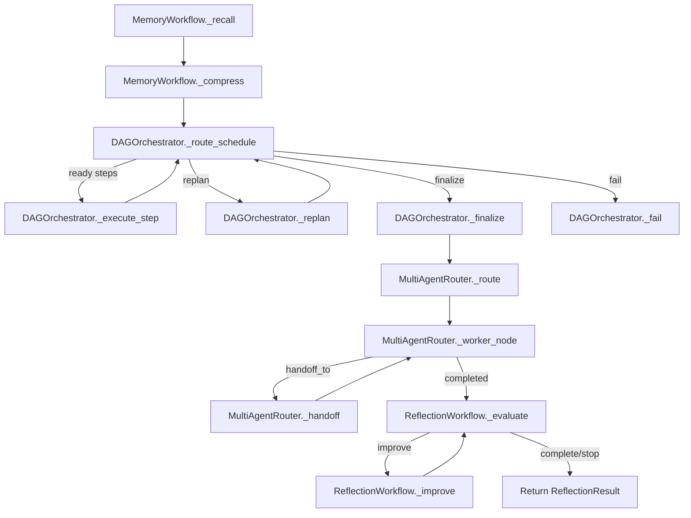
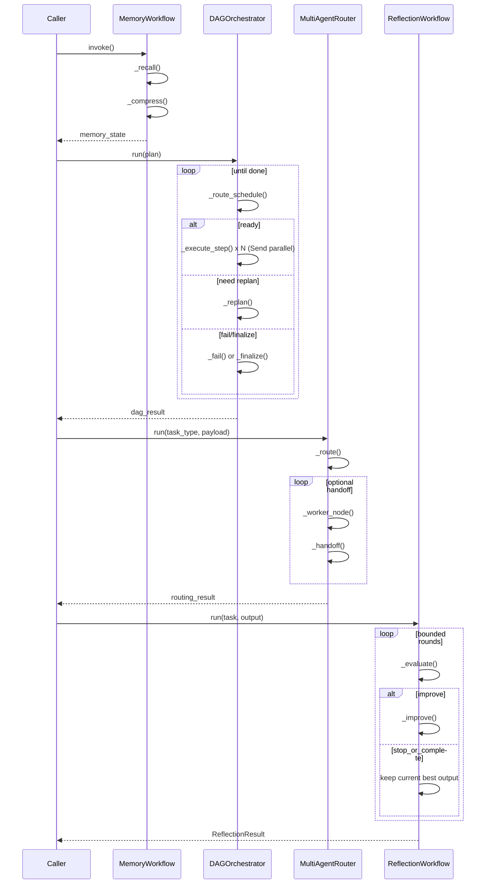

# LangGraph 版高级能力实现：方法级注释与图解

对应脚本：`xiaolinnote_agent_analysis/examples/agent_capabilities_langgraph.py`

## 方法级职责说明

- `LangGraphMemoryWorkflow._recall`
  - 职责：按 `tenant_id + user_id` 范围检索长期记忆。
  - 输出：`recalled_memories`，作为后续上下文拼装输入。

- `LangGraphMemoryWorkflow._compress`
  - 职责：执行短期记忆压缩，把历史浓缩到摘要并保留近期窗口。
  - 输出：`messages/summary/working_state/context`。

- `LangGraphDAGOrchestrator._route_schedule`
  - 职责：从当前图状态判断是 `replan / fail / finalize / send-ready-steps`。
  - 关键点：利用 `Send` 并发下发所有 ready 节点。

- `LangGraphDAGOrchestrator._execute_step`
  - 职责：先做 payload binding，再执行 worker，再执行验收。
  - 关键点：技术成功(`ok`)与业务验收(`accepted`)分离。

- `LangGraphDAGOrchestrator._replan`
  - 职责：在预算内追加“未执行的新步骤”，并记录 `plan.revised` 事件。
  - 约束：不允许复用已执行 step_id。

- `LangGraphMultiAgentRouter._route`
  - 职责：静态规则/动态路由选 worker，并通过 guard 校验。
  - 关键点：白名单和 handoff 次数预算控制。

- `LangGraphMultiAgentRouter._worker_node`
  - 职责：执行 worker；若返回 `handoff_to`，则切到 `handoff` 节点。

- `LangGraphReflectionWorkflow._evaluate/_improve/_route_evaluation`
  - 职责：执行 “评估 -> 决策 -> 改进” 的有界循环。
  - 关键点：最后结果必须经过 evaluator 验证，避免“未验证改写”泄漏。

## 流程图（方法级）

## 时序图（方法级）

## 设计备注

- LangGraph 负责控制面：状态机、循环、并发扇出、路由、检查点。
- 业务逻辑仍通过 worker/replanner/evaluator 注入，便于离线测试与替换。
