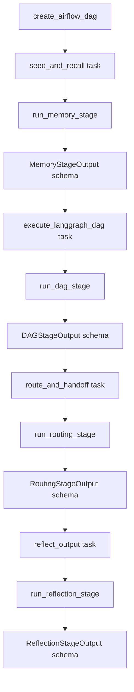
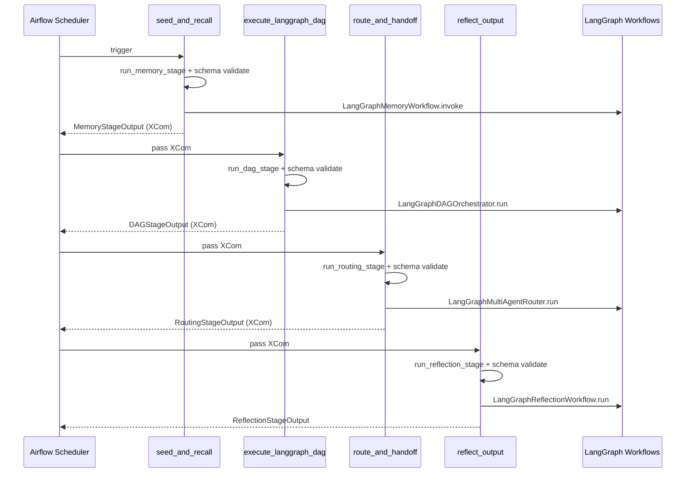

# Airflow+LangGraph 版高级能力实现：方法级注释与图解

对应脚本：`xiaolinnote_agent_analysis/examples/agent_capabilities_airflow_langgraph.py`

## 方法级职责说明

- `_validate_or_raise`
  - 职责：统一执行 Pydantic schema 校验。
  - 价值：让 Airflow task 在边界处 fail-fast，避免脏 XCom 向下游扩散。

- `run_memory_stage`
  - 输入：`MemoryStageInput`。
  - 输出：`MemoryStageOutput`。
  - 行为：seed + 召回 + 压缩，输出标准化上下文。

- `run_dag_stage`
  - 输入：`DAGStageInput`（包含 memory_state）。
  - 输出：`DAGStageOutput`。
  - 行为：执行 LangGraph DAG，返回步骤结果和事件审计。

- `run_routing_stage`
  - 输入：`RoutingStageInput`。
  - 输出：`RoutingStageOutput`。
  - 行为：运行路由与 handoff，并导出 route history。

- `run_reflection_stage`
  - 输入：`ReflectionStageInput`。
  - 输出：`ReflectionStageOutput`。
  - 行为：运行 evaluator-optimizer 循环并保证最终输出可追溯。

- `run_local_demo_pipeline`
  - 职责：无 Airflow 环境下串行跑通四阶段，方便本地调试。

- `create_airflow_dag`
  - 职责：声明生产 DAG，绑定重试、调度、任务链。
  - 任务链：`seed_and_recall -> execute_langgraph_dag -> route_and_handoff -> reflect_output`。

## 流程图（方法级）

## 时序图（方法级）

## 生产化建议

- DAG 文件保持薄封装（仅导入并暴露 dag 对象）。
- 复杂对象跨 task 时，始终以 schema 化 dict 传输。
- task 重试与图内 replan 要分层治理：
  - Airflow retry 处理基础设施抖动；
  - LangGraph replan 处理业务路径失败。
