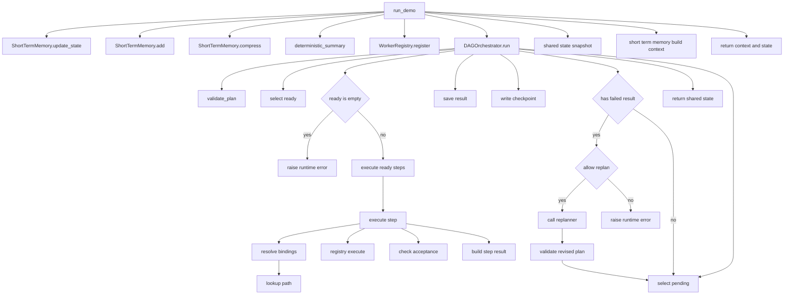
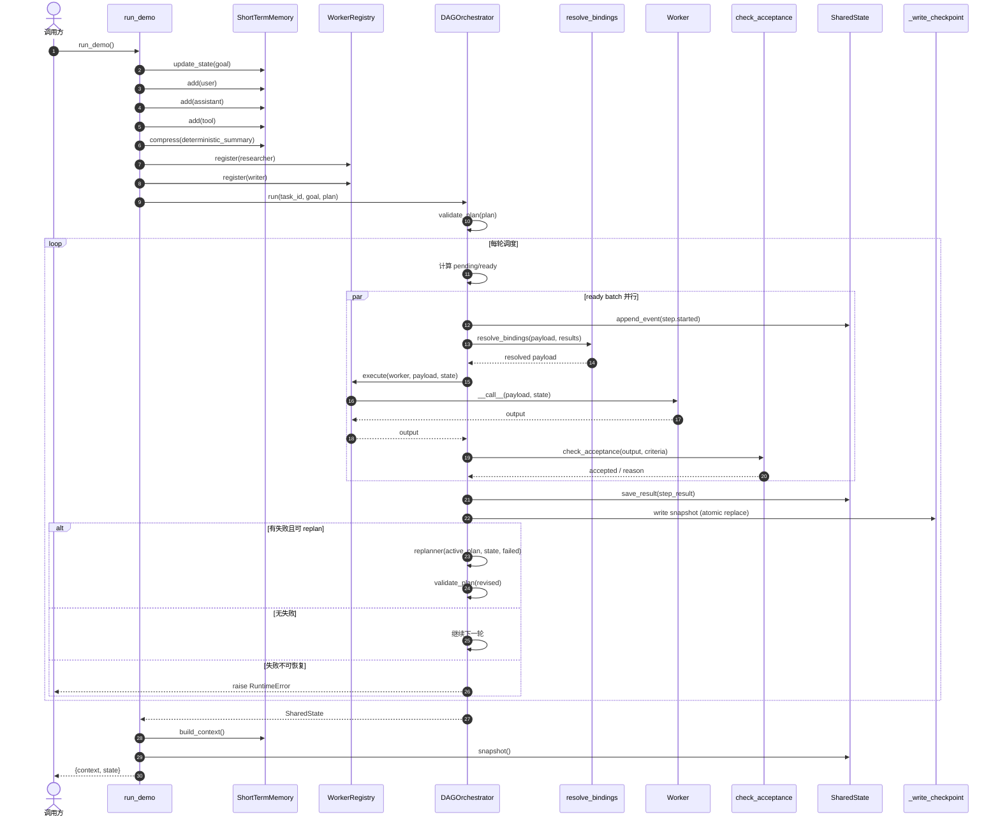
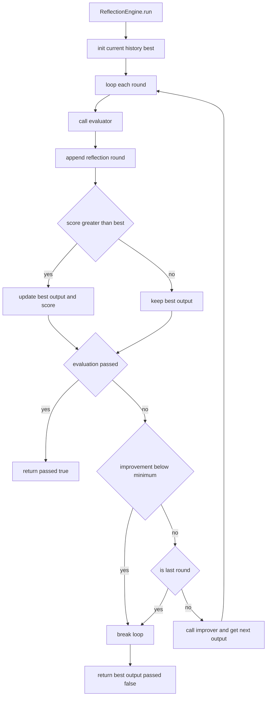

# Agent Capabilities Reference 语法与控制面指南

本文档对应文件：
- `xiaolinnote_agent_analysis/examples/agent_capabilities_reference.py`

目标：
1. 系统整理该文件使用到的 Python 语法点。
2. 系统整理该文件涉及的 LLM/Agent 控制面知识点。
3. 提供该文件专属、方法粒度的 Mermaid 流程图和时序图。

## 一、Python 语法点系统清单

### 1) 模块与注解
- `from __future__ import annotations`：延迟解析类型注解，便于前向引用和降低运行时耦合。
- 模块级 docstring：作为文件级设计契约，明确“能力边界”和“非生产承诺”。

### 2) 类型系统与类型别名
- `JsonObject = dict[str, Any]`：统一 JSON 对象表达。
- 现代泛型：`list[T]`、`dict[K, V]`、`tuple[T, ...]`。
- 联合类型：`str | None`。
- 可调用类型：`Callable[[...], ...]`。
- 协议类型：`Protocol` 定义结构化接口（鸭子类型）。

### 3) dataclass 模型
- `@dataclass(frozen=True)`：不可变数据结构，适合事件和结果快照。
- `field(default_factory=...)`：安全创建可变默认值（如 `dict/list`）。

### 4) 函数签名与参数约束
- 关键字专用参数：函数参数列表中的 `*`，强制调用方用命名参数。
- 返回值注解：提高可读性与静态检查能力。

### 5) 异常与失败语义
- `ValueError`：输入/配置错误。
- `RuntimeError`：运行期状态冲突或无法恢复错误。
- `KeyError`：路径解析/绑定失败。
- “抛异常”和“结构化失败结果”并用：编排层可做统一策略处理。

### 6) 上下文管理与资源生命周期
- `__enter__ / __exit__`：支持 `with SQLiteMemoryStore() as store` 自动释放连接。
- `with self.connection:`：SQLite 事务语义，减少手动提交出错概率。

### 7) 并发语法与线程安全
- `ThreadPoolExecutor` + `as_completed`：ready 批并行执行。
- `threading.RLock`：可重入锁，支持锁内方法互调。
- 并发场景中的共享可变状态通过锁保护。

### 8) 生成式与推导式
- 列表推导、字典推导、集合运算：用于过滤、转换和排序输入。
- 生成器表达式用于拼接 SQL 占位符和条件判断。

### 9) 正则与字符串处理
- `re.compile`、`pattern.match`：解析绑定表达式模板。
- `re.findall`：词法分词。
- f-string：结构化日志与错误信息输出。

### 10) SQLite 访问模式
- 参数化 SQL（`?` 占位）避免注入。
- UPSERT：`ON CONFLICT ... DO UPDATE`。
- `row_factory = sqlite3.Row`：按列名读取结果。

### 11) 文件原子写
- 先写 `.tmp`，再 `replace`：减少中断造成的 checkpoint 损坏。

### 12) 递归与图算法
- 递归解析嵌套绑定（`resolve_bindings`）。
- DFS + `visiting/visited` 检测依赖环。

## 二、LLM/Agent 控制面知识点系统清单

### 1) 控制面与模型面解耦
- 该文件把“状态管理、编排、验收、反思”作为控制面。
- LLM、摘要器、评价器都通过可注入回调隔离，支持离线测试。

### 2) 记忆分层与作用域隔离
- 长期记忆：SQLite（实体/情节/语义/程序）。
- 短期记忆：最近消息 + 历史摘要 + 结构化工作状态。
- 作用域隔离：`tenant_id + user_id`，防止跨用户数据泄漏。

### 3) 记忆检索打分
- 相关度（词法） + 重要度 + 新鲜度（时间衰减）加权。
- 这是“可解释排序”形态，便于教学和审计。

### 4) 计划-执行分层
- `PlanStep` 描述意图与依赖。
- `WorkerRegistry` 限制可调用执行体。
- `DAGOrchestrator` 负责调度与失败处理策略。

### 5) 绑定与数据流
- `${steps.<id>.output.<path>}` 实现显式跨步骤数据依赖。
- 使 DAG 步骤间数据流透明、可追踪。

### 6) 验收门（Acceptance Gate）
- 执行成功不等于业务成功。
- `check_acceptance` 提供结构化业务门控，避免“技术通过但语义失败”。

### 7) Replan 边界
- 只有失败策略允许且预算充足才触发 Replan。
- Replanner 只能追加未执行步骤，不能覆盖已执行副作用。

### 8) 并行调度与阻塞检测
- 同一轮只并发执行所有 ready 步骤。
- 若无 ready 且有 pending，判定为阻塞失败。

### 9) 审计与可恢复性
- `StateEvent` 追加式事件流支持回放。
- checkpoint 原子落盘支持故障恢复。

### 10) 路由与协作护栏
- `HybridRouter`：静态规则优先，动态结果越权回退。
- `HandoffGuard`：白名单、预算、环路检测。

### 11) Reflection 闭环
- 结构：生成候选 -> evaluator 打分 -> improver 改进。
- 退出条件：通过、轮次耗尽、提升不足。
- 仅“被评价过”的候选可成为最终输出，防止最后一轮未验证漂移。

## 三、方法粒度流程图（Mermaid）

## 四、方法粒度时序图（Mermaid）

## 五、Reflection 方法粒度补充图（Mermaid）

