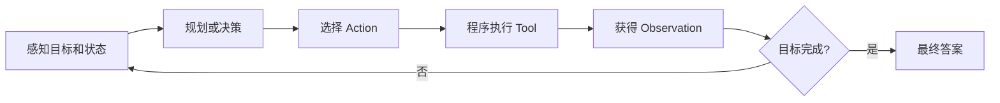
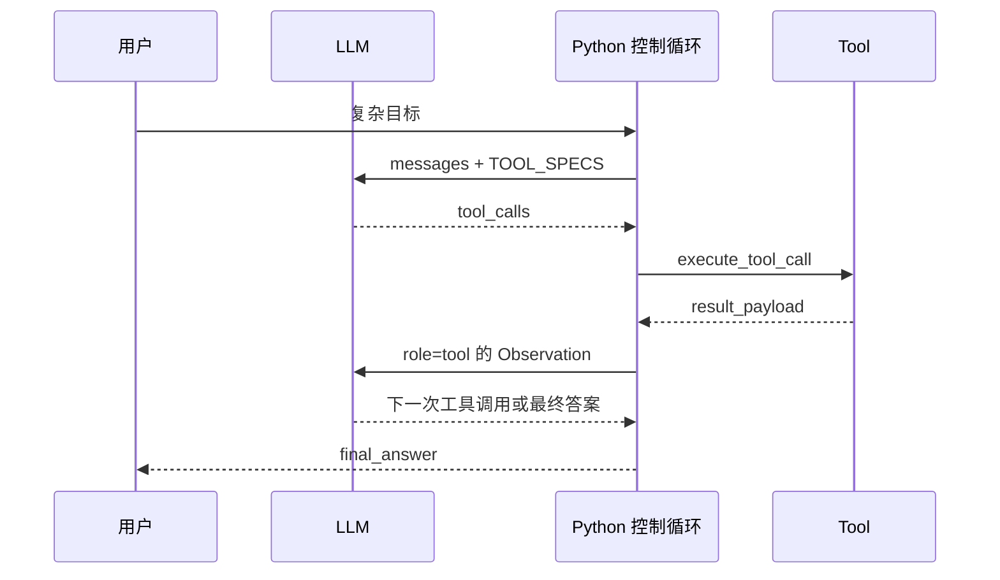
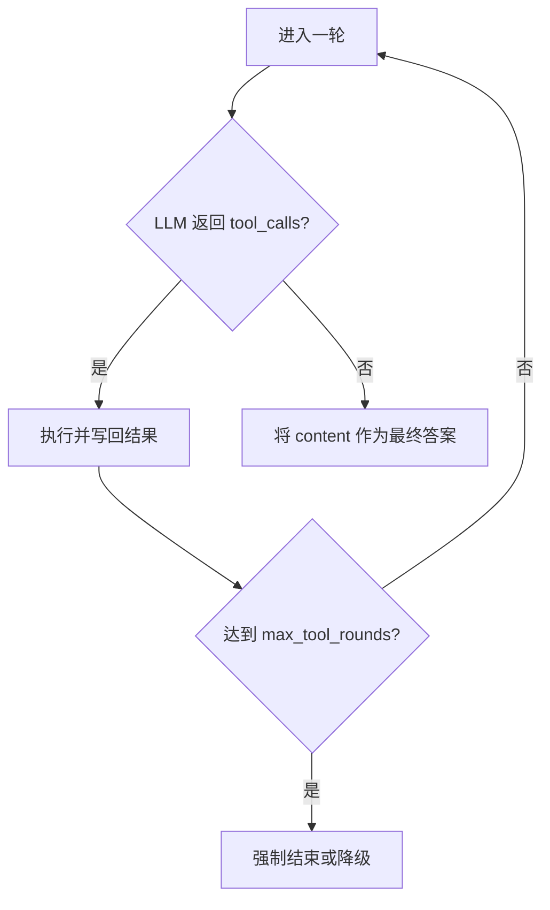
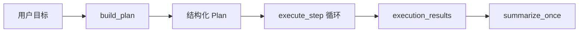

# 1. 什么是 Agent：自主执行闭环与项目代码

> 原文：[什么是 Agent？与大模型有什么本质不同？](https://xiaolinnote.com/ai/agent/1_whatisagent.html)
>
> 功能定位：解释 Agent 的自主性、行动能力和反馈闭环，并映射到本项目 Day22-Day28 实现。

---

## 1. 一句话结论

普通 LLM 完成的是一次映射：

$$
answer = LLM(prompt)
$$

Agent 完成的是受程序约束的循环：

$$
state_{t+1}=Update(state_t, Tool(LLM(state_t)))
$$

关键不只是“能调用工具”，而是系统能围绕目标反复完成：



## 2. 普通 LLM 与 Agent 的本质差异

| 维度 | 普通 LLM 调用 | Agent 系统 |
|---|---|---|
| 输入 | prompt | 目标、历史、工具结果、约束 |
| 输出 | 文本或结构化内容 | 动作决策或最终答案 |
| 外部行动 | 默认没有 | 由程序执行工具 |
| 状态 | 单次请求内上下文 | 多轮执行状态 |
| 控制循环 | 一次调用结束 | 决策、执行、反馈、再决策 |
| 停止条件 | 模型完成生成 | 完成信号、轮数、时间或预算上限 |

因此，以下代码仍只是 LLM 应用：

```python
answer = chat_once(question)
return answer
```

而以下结构才具有 Agent 闭环：

```python
for _ in range(max_rounds):
    decision = call_llm(messages, tools)
    if not decision.tool_calls:
        return decision.content
    results = execute_allowed_tools(decision.tool_calls)
    messages.extend(results)
```

## 3. 项目中的实际闭环

Day22 的 [`main()`](../run_day22_function_calling_basics.py#L300) 实现了最直接的现代工具循环：

```python
for round_idx in range(1, args.max_tool_rounds + 1):
    message, usage = chat_once_with_tools(...)
    tool_calls = message.get("tool_calls") or []

    if tool_calls:
        messages.append(assistant_entry)
        for item in tool_calls:
            result_payload = execute_tool_call(item)
            messages.append({"role": "tool", "content": json.dumps(result_payload)})
        continue

    final_answer = content.strip()
    break
```

对应关系：



### 3.1 决策与执行分离

[`TOOL_SPECS`](../run_day22_function_calling_basics.py#L102) 是给模型看的能力说明；[`TOOL_IMPLS`](../run_day22_function_calling_basics.py#L161) 才是真实函数注册表。

```python
TOOL_IMPLS = {
    "add_numbers": add_numbers,
    "lookup_service_owner": lookup_service_owner,
    "search_incident_playbook": search_incident_playbook,
}
```

模型只产生：

```json
{"name": "lookup_service_owner", "arguments": {"service": "payment"}}
```

程序负责解析参数、检查白名单并调用函数。这条安全边界意味着模型不能因为“说要执行某函数”就获得任意代码执行权限。

### 3.2 状态来自哪里

Day22 的短期状态是 `messages`：

```text
system -> user -> assistant(tool_calls) -> tool(result) -> assistant(...)
```

工具结果重新进入消息历史，下一轮决策才能看到 Observation。它是任务内工作记忆，不是跨任务长期记忆。

### 3.3 停止条件

代码使用 `max_tool_rounds` 限制循环，并在模型不再返回 `tool_calls` 时结束：



生产环境通常还应同时限制：

- 总 token 数
- 总运行时间
- 单工具 timeout
- 总工具调用数
- 单工具重复调用次数
- 成本预算

## 4. Day25-Day28 比 Day22 多了什么

Day22 是边执行边决定的工具循环。Day25-Day28 进一步增加了显式 Planner：



- [`build_plan()`](../run_day25_day28_langchain_demo.py#L369)：生成结构化计划。
- [`execute_step()`](../run_day25_day28_langchain_demo.py#L398)：通过 `TOOL_MAP` 安全执行。
- [`summarize_once()`](../run_day25_day28_langchain_demo.py#L416)：基于计划和结果生成结论。

这属于轻量 Plan-and-Execute，但当前计划生成后不会根据每步结果动态修改，因此还不是完整的自适应 Agent。

## 5. 不要混淆的概念

### 5.1 有工具不等于 Agent

固定调用工具：

```python
weather = get_weather("北京")
return llm.generate(weather)
```

这是 Workflow。只有模型在运行时根据状态决定是否调用、调用哪个工具，并将结果反馈到下一轮决策，才体现 Agent 自主性。

### 5.2 多轮聊天不等于 Agent

多轮聊天只是保存对话；如果系统始终只生成文本，没有目标驱动的行动和反馈闭环，它仍是聊天应用。

### 5.3 Retry 不等于自我纠错

当前项目的 Retry 是程序对超时等瞬时错误重复同一操作。真正的自我纠错需要模型读取错误，修改参数或策略，再产生不同 Action。

## 6. 当前实现边界

| 能力 | 项目状态 |
|---|---|
| 结构化工具说明 | 已实现 |
| 工具白名单执行 | 已实现 |
| 工具结果写回上下文 | Day22-Day24 已实现 |
| 最大循环轮数 | 已实现 |
| 显式全局规划 | Day25-Day28 已实现 |
| 跨任务长期记忆 | 原 Day Demo 未实现；高级参考实现已提供 |
| 动态 Replan | 原 Day Demo 未实现；高级参考实现已提供 |
| 业务验收驱动停止 | 原 Day Demo 未实现；高级参考实现已提供 |
| 模型根据错误改策略 | 部分场景可发生，但无强约束 |

可运行代码见 [高级 Agent 能力参考实现](examples/agent_capabilities_reference.py)：`SQLiteMemoryStore` 实现跨任务持久化边界，`DAGOrchestrator` 用 `success_criteria` 决定步骤是否真正完成，并只在 `on_failure="replan"`、存在 Replanner 且预算未耗尽时重规划。原 Day22-Day28 脚本没有自动接入这些能力，因此两者的状态不能混写。

## 7. 面试问答

### Q1：什么是 AI Agent？

**参考回答：** Agent 是围绕目标自主运行的 AI 系统。LLM 负责理解和决策，程序提供工具、状态和控制循环。系统会感知当前状态、决定下一步行动、执行工具、读取结果并继续决策，直到满足完成条件。关键是“自主闭环”，不是简单给 LLM 加几个函数。

### Q2：Agent 与普通 LLM 的本质区别是什么？

**参考回答：** 普通 LLM 通常是一次输入到一次输出；Agent 将 LLM 放进有状态的执行循环，让模型能根据 Observation 动态决定下一步，并通过工具影响外部世界。模型仍只负责生成决策，真实执行由受控代码完成。

### Q3：模型自己会执行工具吗？

**参考回答：** 不会。模型输出工具名和参数，应用在白名单中查找实现、校验参数、执行函数，再把结果作为 tool message 返回模型。本项目的 `TOOL_SPECS` 与 `TOOL_IMPLS` 就体现了说明和执行分离。

### Q4：如何防止 Agent 无限循环？

**参考回答：** 同时设置模型完成信号和硬限制，包括最大轮数、总 timeout、token/成本预算、工具调用次数及重复动作检测。Day22 已有 `max_tool_rounds`，但还可补全总时间和 token 预算。

### Q5：当前项目能称为完整 Agent 吗？

**参考回答：** Day22 已具备工具决策和 Observation 回传的轻量闭环，Day25-Day28 具备显式规划和执行。但缺少长期记忆、验收驱动停止、动态 Replan 和系统化反思，因此更准确地说是 Agent 学习 Demo，而非完整生产 Agent。

## 8. 复习结论

```text
LLM 是决策模型；Tool 是行动能力；状态连接多轮；控制循环构成自主闭环。
```

判断一个系统是否更接近 Agent，可以连续问四个问题：谁决定下一步、谁真正执行、结果是否反馈、何时停止。四个问题都能落到代码上，才不是停留在概念层。