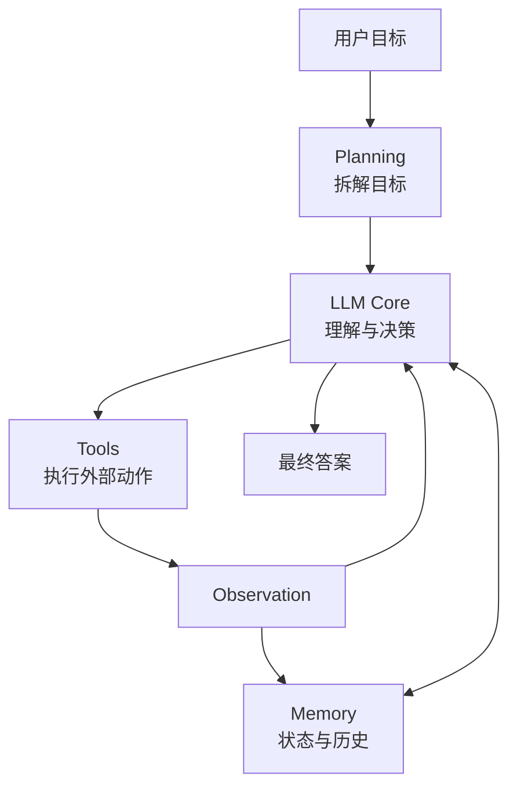
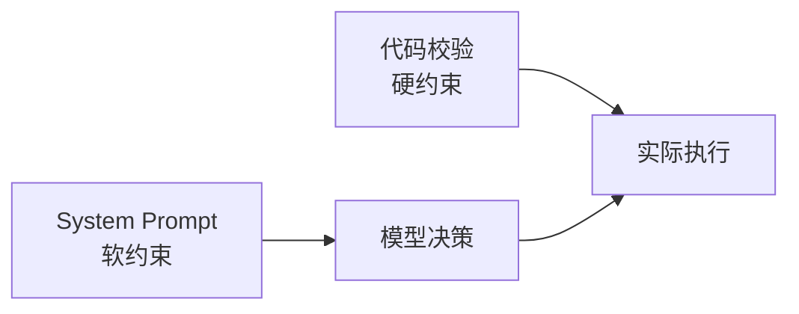
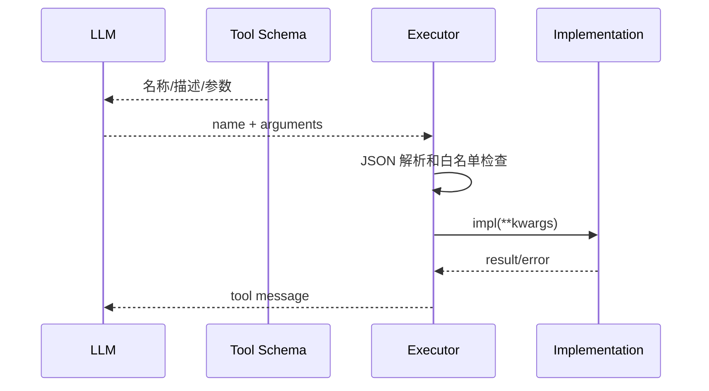
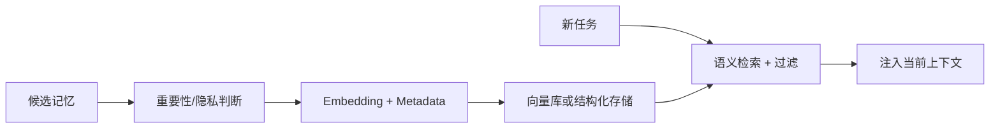
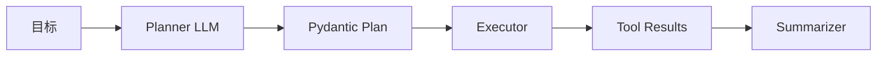
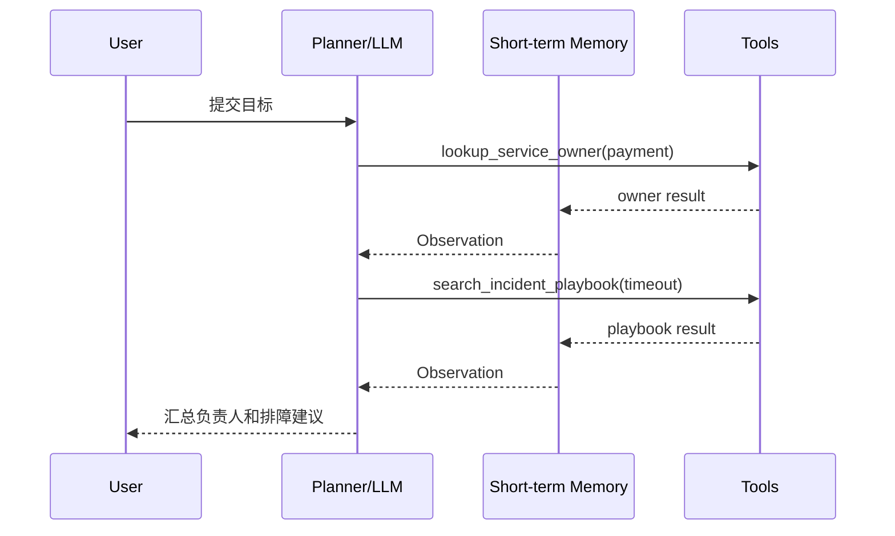

# 2. Agent 核心组件：LLM、Tools、Memory 与 Planning

> 原文：[Agent 的基本架构由哪些核心组件构成？](https://xiaolinnote.com/ai/agent/2_components.html)
>
> 功能定位：拆解四个核心组件，并用 Day22-Day28 代码说明它们如何协作、当前覆盖到什么程度。

---

## 1. 四组件总览



| 组件 | 核心职责 | 项目对应 |
|---|---|---|
| LLM Core | 理解、选择、生成 | `ChatOpenAI` / `chat_once_with_tools` |
| Tools | 与外部系统交互 | `TOOL_SPECS`、`TOOL_IMPLS`、`@tool` |
| Memory | 保存任务状态和历史 | `messages`、`execution_results`、JSONL |
| Planning | 将目标拆成步骤 | `PlanStep`、`Plan`、`build_plan()` |

四者不是四个必须独立部署的服务，而是四类职责。小系统可以在一个 Python 文件中实现，生产系统再按复杂度拆分。

## 2. LLM Core：决策中心

LLM 接收的不只是用户问题，还包括：

```text
System Prompt + 用户目标 + 工具 schema + 历史消息 + 工具结果 + 约束
```

Day25-Day28 的 [`build_llm()`](../run_day25_day28_langchain_demo.py#L280) 将 OpenAI-compatible 服务包装为 `ChatOpenAI`；[`build_plan()`](../run_day25_day28_langchain_demo.py#L369) 又通过：

```python
planner = llm.with_structured_output(Plan)
```

限制规划输出符合 Pydantic schema。

### 2.1 System Prompt 的作用

System Prompt 定义角色、可用工具、输出格式和边界。它不是权限系统：真正的权限仍要由代码中的白名单、URL allowlist、timeout 等实现。



### 2.2 模型选型

不同环节可以使用不同模型：

- 规划：更强调推理和结构化输出稳定性。
- 简单路由：强调低延迟、低成本。
- 总结：强调长上下文和表达质量。
- 工具参数抽取：强调 schema 遵循。

当前 Demo 共用同一个模型，代码结构已把 Planner 和 Summarizer 分开，因此未来可以分别注入不同模型。

## 3. Tools：行动系统

Day22 将工具拆成“说明书”和“实现”两部分：

- [`TOOL_SPECS`](../run_day22_function_calling_basics.py#L102)：名称、描述、JSON Schema。
- [`TOOL_IMPLS`](../run_day22_function_calling_basics.py#L161)：真实 Python 函数白名单。
- [`execute_tool_call()`](../run_day22_function_calling_basics.py#L201)：解析、查找、执行、包装错误。



### 3.1 好工具的四条标准

1. 单一职责：`add_numbers` 只计算，不顺便查询服务。
2. 描述具体：明确适用范围和返回内容。
3. 参数少且有类型：降低模型填参错误率。
4. 错误可行动：返回“unknown tool”或“invalid arguments”，而不是只有模糊状态码。

### 3.2 工具安全

Day25 的 [`ensure_allowed_url()`](../run_day25_task_orchestration.py#L76) 要求 HTTPS 且 host 在 allowlist 中。这说明工具层必须防御模型产生的不可信参数。

生产工具还应考虑：

- 用户级授权
- 幂等键
- dry-run 与确认机制
- 输入长度和类型限制
- 敏感字段脱敏
- 审计与追踪

## 4. Memory：状态系统

### 4.1 短期记忆

Day22 的 `messages` 是典型短期记忆：

```python
messages = [system_message, user_message]
messages.append(assistant_tool_call)
messages.append(tool_result)
```

它让下一轮模型看到前面的 Action 和 Observation。

Day25 的 `execution_results` 也保存任务内状态，但当前只在最终 Summarizer 使用，后续 Executor 不能消费前序结果。这是“保存了状态”与“状态进入决策”之间的重要区别。

### 4.2 长期记忆

长期记忆需要跨任务持久化和检索，一般包括：



项目 Day8-Day21 的 RAG 能力可作为长期知识检索基础，但 Day22-Day28 Agent 尚未把它接成跨任务记忆模块。因此不能把 JSONL 审计日志直接称为长期记忆：日志可持久化，但没有记忆筛选、检索和注入流程。

### 4.3 Memory 与日志的区别

| 项目 | Memory | Audit Log |
|---|---|---|
| 服务对象 | Agent 下一次决策 | 开发者审计和排障 |
| 是否回注模型 | 是 | 默认否 |
| 内容 | 相关事实、状态、经验 | 完整事件轨迹 |
| 写入策略 | 选择性 | 尽量完整 |
| 读取策略 | 检索和排序 | 按 trace/time 查询 |

## 5. Planning：规划系统

Day25-Day28 定义：

```python
class PlanStep(BaseModel):
    step: str
    tool: str
    args: dict[str, Any]
    why: str

class Plan(BaseModel):
    plan: list[PlanStep]
```

Planner 只生成计划，Executor 再执行：



这种职责分离带来：

- 执行前可检查计划。
- Planner 与 Executor 可用不同模型。
- 失败可定位到步骤。
- 可增加依赖、并行、验收与 Replan。

当前 schema 没有 `id`、`depends_on`、`input_bindings` 和 `acceptance_criteria`，因此仍是串行步骤表，不是完整任务图。

## 6. 四组件如何协作

以“查询 payment 服务负责人并给 timeout 建议”为例：



如果加入显式 Planning，调用前还会先生成两步计划；如果加入长期 Memory，则可检索过去相似故障经验。

## 7. 当前项目成熟度

| 组件 | 已实现 | 缺口 |
|---|---|---|
| LLM | 调用、structured output、prompt | 分层模型路由、预算控制 |
| Tools | schema、白名单、URL 限制、错误包装 | 权限、幂等、人工确认 |
| Memory | messages、结果列表、日志 | 跨任务记忆、检索回注、衰减 |
| Planning | 动态计划、静态 fallback | 依赖、验收、Replan、DAG |

## 8. 面试问答

### Q1：Agent 的四个核心组件是什么？

**参考回答：** LLM 是理解和决策中心；Tools 提供外部行动能力；Memory 保存任务内状态和跨任务经验；Planning 将复杂目标拆成可执行步骤。四者通过“规划、决策、执行、结果写入记忆、再决策”的循环协作。

### Q2：短期记忆和长期记忆有什么区别？

**参考回答：** 短期记忆服务当前任务，通常是 context/messages 或执行状态；长期记忆跨任务持久化，通常要经过筛选、embedding、metadata 存储和语义检索。日志虽然持久化，但若不检索并回注决策，就不是 Agent 可用的长期记忆。

### Q3：工具描述为什么重要？

**参考回答：** 模型主要依据名称、description 和参数 schema 选择工具。描述模糊会造成误选，参数过多会增加填参失败。工具说明属于模型决策界面，真实执行仍需代码白名单和输入校验。

### Q4：Pydantic 结构化计划能保证计划正确吗？

**参考回答：** 不能。它只能保证形状和字段类型，无法保证工具存在、步骤完备、依赖无环或业务目标被覆盖，所以还需要 Plan Validator 和步骤验收。

### Q5：项目中的记忆模块完整吗？

**参考回答：** 当前有任务内消息历史、执行结果和审计日志，但没有跨任务的选择性存储、检索和回注。因此短期状态已具备，长期 Agent Memory 尚未实现。

## 9. 复习结论

```text
LLM 决策，Tools 行动，Memory 保持连续性，Planning 提供全局结构。
```

架构评审时不要只检查“有没有这四个名词”，要检查信息是否真的在组件间流动，尤其是工具结果是否进入下一次决策、长期记忆是否真正被检索回注。