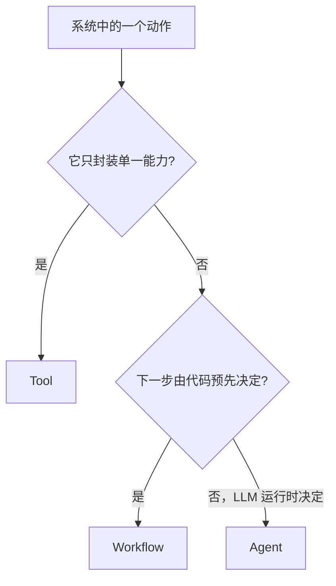
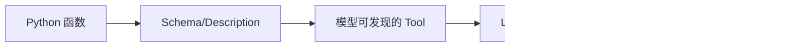
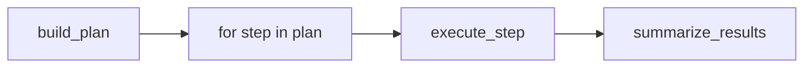
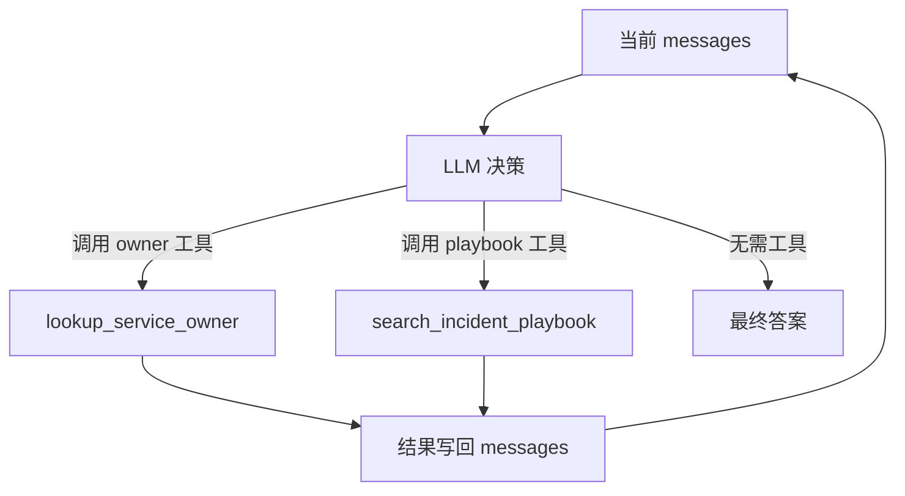
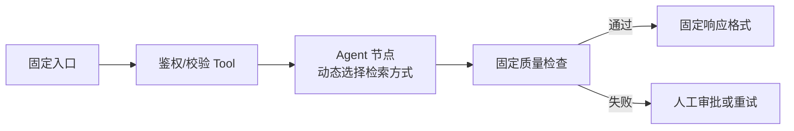
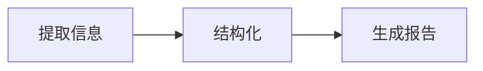
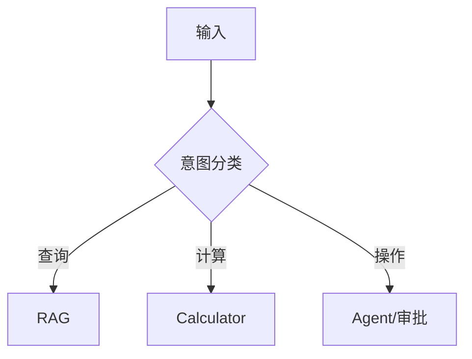
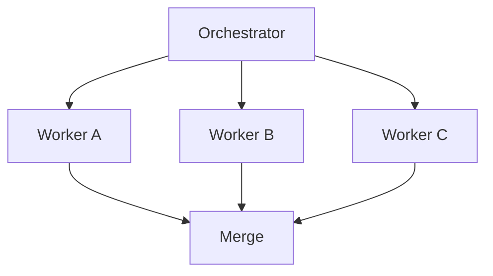
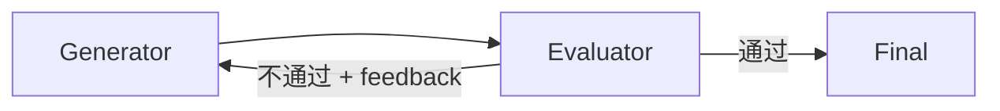
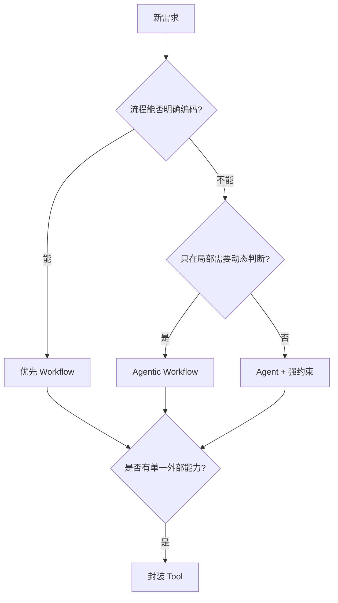

# 3. Workflow、Agent、Tools：控制权边界与组合方式

> 原文：[Workflow，Agent，Tools 这三个的概念和区别介绍一下？](https://xiaolinnote.com/ai/agent/3_workflow_tools.html)
>
> 功能定位：从“谁决定下一步”出发，结合本项目代码区分三者及 Agentic Workflow。

---

## 1. 核心判断法



一句话：

- Tool 不决策，只执行。
- Agent 由 LLM 在运行时决策下一步。
- Workflow 由开发者预先写定控制流。

它们不是三选一，而是不同粒度、可以嵌套的职责。

## 2. Tools：最小能力单元

本项目 Day22 的普通函数：

```python
def lookup_service_owner(service: str) -> dict[str, Any]:
    ...
```

加上 [`TOOL_SPECS`](../run_day22_function_calling_basics.py#L102) 后，模型才能理解工具名称、用途和参数；加入 [`TOOL_IMPLS`](../run_day22_function_calling_basics.py#L161) 后，程序才能安全找到实现。



Tool 不知道：

- 当前是否应该被调用。
- 调用前后还有哪些步骤。
- 任务何时完成。
- 失败后是否重试或换策略。

这些都属于编排或决策层。

## 3. Workflow：代码掌握控制流

Day25 主流程是 Workflow 骨架：

```python
plan = build_plan(...)
execution_results = []
for step in plan[:max_steps]:
    execution_results.append(execute_step(step))
summary = summarize_results(...)
```

尽管 `build_plan()` 使用 LLM 动态生成步骤，但“先规划、再串行执行、最后总结”的阶段顺序由 Python 固定。因此整体更准确地称为 Agentic Workflow 或 Plan-and-Execute Workflow。



Workflow 的优势：

- 路径清晰，易测试和回放。
- 每个节点可独立设置 timeout、retry、模型和成本。
- 生产事故更容易定位。
- 可以在关键操作前插入审批。

局限：未编码的场景难以处理，分支增多后维护成本上升。

## 4. Agent：LLM 掌握局部控制权

Day22 工具循环中，Python 只提供循环骨架；每一轮是否调用工具、调用哪个工具，由模型返回的 `tool_calls` 决定：

```python
message = chat_once_with_tools(...)
tool_calls = message.get("tool_calls") or []
if tool_calls:
    ...
    continue
return message.get("content")
```



代码仍控制安全边界和硬停止条件，模型只在允许范围内获得“下一步选哪个动作”的决策权。

## 5. 谁做决策：分层看

真实系统不是只有一个决策者：

| 决策 | 决策者 | 项目代码 |
|---|---|---|
| 哪些工具可用 | 开发者 | `TOOL_IMPLS` / `TOOL_MAP` |
| 当前调用哪个工具 | LLM | `tool_calls` / `PlanStep.tool` |
| 参数是否合法 | 程序 | JSON 解析、allowlist |
| 阶段执行顺序 | 开发者 | plan -> execute -> summarize |
| 何时硬停止 | 程序 | `max_tool_rounds` / `max_steps` |
| 是否自然结束 | LLM | 不返回 tool call / 输出最终答案 |

因此“Agent 自主”不等于模型拥有无限权限，而是模型在程序定义的动作空间中动态决策。

## 6. Agentic Workflow：生产中的组合



主干使用 Workflow 保证确定性，局部节点使用 Agent 处理难以穷举的判断。

本项目的 Day25-Day28 已经体现这种组合：

- 固定骨架：Planner -> Executor -> Summarizer。
- 动态节点：Planner 由 LLM 生成 `PlanStep`。
- 硬边界：工具白名单、HTTPS host allowlist、最大步数。
- 稳定降级：默认计划和本地 fallback summary。

## 7. 常见 Workflow 模式

### 7.1 Prompt Chaining



前一步输出明确传给后一步。当前 Day25 的 Plan/Execute/Summary 是阶段链，但单个执行步骤之间尚无结果绑定。

### 7.2 Routing



适用于类别稳定、每类处理方式差异明显的业务。

### 7.3 Parallelization

无依赖任务并行后，延迟近似由最慢分支决定：

$$
T_{parallel}\approx\max(T_1,T_2,\ldots,T_n)+T_{merge}
$$

当前 Day25-Day28 仍为串行 `for`，未实现 DAG 并行。独立的 [高级 Agent 能力参考实现](examples/agent_capabilities_reference.py) 已给出 `validate_plan()` 环检测、ready-step 选择、`ThreadPoolExecutor` 并行执行和依赖汇聚；对应测试验证了环拒绝、结果绑定与 checkpoint。该调度器是演进参考，尚未替换原 Demo 的串行流程。

### 7.4 Orchestrator-Workers



Planner 类似 Orchestrator，但当前 Executor 不是多个独立 Worker，也没有并行调度。

### 7.5 Evaluator-Optimizer



项目目前没有独立 Evaluator，因此 Retry 和 fallback 不能称为 Reflection。

## 8. 选型方法



先采用最简单、可测试的控制方式；只有路径确实无法预先枚举时，才将对应节点升级为 Agent。

## 9. 面试问答

### Q1：Workflow、Agent、Tools 的核心区别是什么？

**参考回答：** 核心看谁决定下一步。Tool 只封装能力，不做决策；Workflow 的控制流由开发者预先编码；Agent 的下一步动作由 LLM 根据运行时状态动态决定。三者可以嵌套，不是三选一。

### Q2：Workflow 的节点必须是 Agent 吗？

**参考回答：** 不需要。节点可以是普通函数、Tool、一次 LLM 调用、Agent 或人工审批。Workflow 的定义取决于控制流由开发者管理，而不是节点类型。

### Q3：为什么生产环境常用 Agentic Workflow？

**参考回答：** 纯 Workflow 可控但难覆盖未知情况，纯 Agent 灵活但路径不确定、成本和调试风险高。固定主干加局部 Agent，能把不确定性限制在少数节点，同时保留审计、重试和审批能力。

### Q4：当前 Day25 为什么不是纯 Agent？

**参考回答：** Planner 虽由 LLM 动态生成计划，但 Planner、串行 Executor、Summarizer 的阶段顺序由 Python 固定，工具又受白名单控制，因此整体是带动态规划节点的 Agentic Workflow。

### Q5：Retry 是 Evaluator-Optimizer 吗？

**参考回答：** 不是。Retry 通常在瞬时错误时重复原操作；Evaluator-Optimizer 会按明确质量标准评价输出，并把具体 feedback 交给生成器修改。后者改变内容或策略，前者可能只重复请求。

## 10. 复习结论

```text
Tool 回答“能做什么”；Agent 回答“现在做什么”；Workflow 回答“整体按什么顺序做”。
```

工程上最重要的不是贴标签，而是明确每一层的控制权、权限边界、停止条件和可观测性。