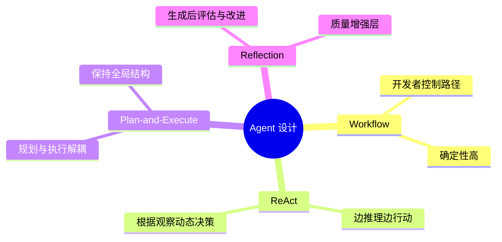
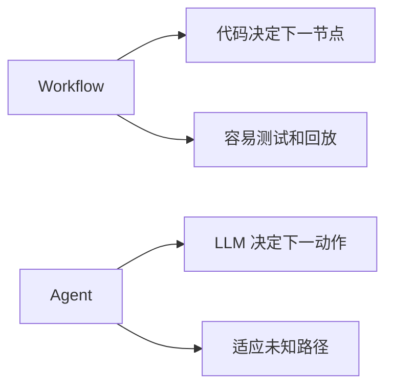
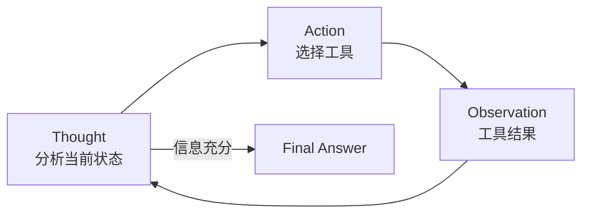
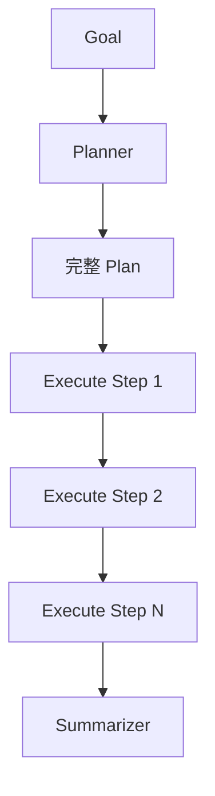
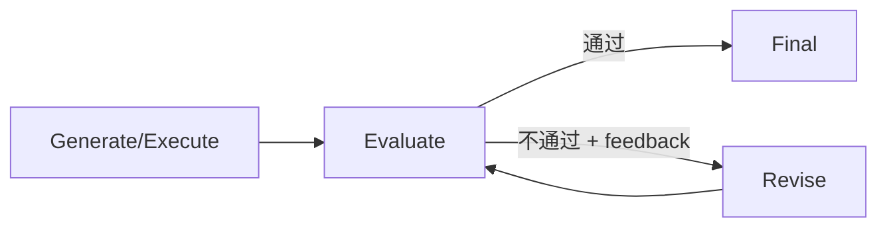
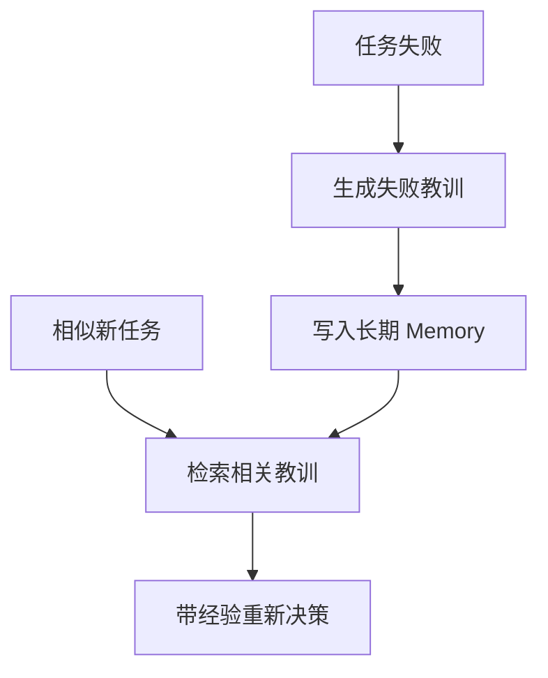
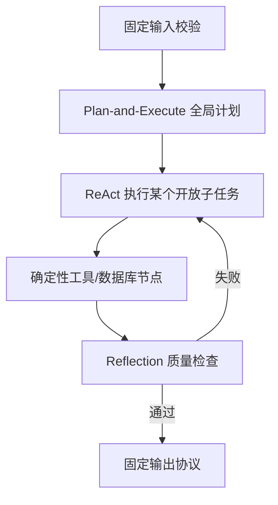
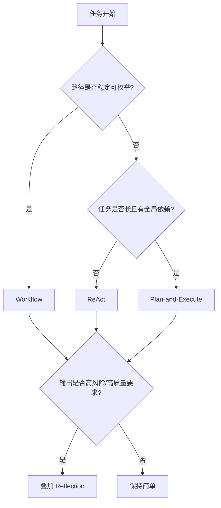

# 4. Agent 设计范式：Workflow、ReAct、Plan-and-Execute 与 Reflection

> 原文：[了解哪些其他的 Agent 设计范式？Agent 和 Workflow 的区别是什么？](https://xiaolinnote.com/ai/agent/4_patterns.html)
>
> 功能定位：从工程控制流解释常见范式，并对照本项目实现判断适用场景与缺口。

---

## 1. 设计范式解决什么问题

设计范式描述系统“从目标到结果如何组织控制流”，不是某个库的 API。



## 2. Workflow 与 Agent

### 2.1 Workflow

```python
def workflow(question):
    docs = retrieve(question)
    ranked = rerank(question, docs)
    return generate(question, ranked)
```

每一步都由开发者决定。输入不同可能让节点输出不同，但控制路径稳定。

### 2.2 Agent

```python
def agent(goal):
    while within_budget():
        action = llm.decide(goal, state, tools)
        if action.is_final:
            return action.answer
        state.add(execute(action))
```

开发者定义动作空间和安全限制，LLM 在运行时选择路径。



## 3. ReAct：单步动态决策

ReAct 的基本循环：



适合：

- 开放式搜索
- 工具数量有限
- 路径难以提前确定
- 中短任务

风险：

- 局部决策导致目标漂移
- 历史不断增长造成 token 成本上升
- 早期错误 Observation 向后传播
- 重复动作或循环

Day22 的工具循环与现代 ReAct 高度相似：模型每轮基于 `messages` 输出结构化 `tool_calls`，程序执行后写回 `role=tool`。但项目没有公开显式 Thought，也没有独立的业务验收器，因此更准确地称为 Function Calling 驱动的工具迭代 Agent。

## 4. Plan-and-Execute：规划执行解耦



当前项目的对应代码：

- [`PlanStep` / `Plan`](../run_day25_day28_langchain_demo.py#L72)
- [`build_plan()`](../run_day25_day28_langchain_demo.py#L369)
- [`execute_step()`](../run_day25_day28_langchain_demo.py#L398)
- [`summarize_once()`](../run_day25_day28_langchain_demo.py#L416)

优点：

- 执行前可审查计划。
- 长任务不容易忘记全局目标。
- Planner 与 Executor 可选不同模型。
- 易于增加依赖、并行和步骤级指标。

局限：

- 初始计划可能错误。
- 环境变化后计划会过期。
- 简单任务多一次规划成本。
- 若不做结果绑定，后续步骤无法消费前序事实。

当前实现的关键边界：计划只生成一次，步骤串行执行，且 `execute_step()` 不接收前序 `execution_results`，所以尚无动态 Replan 和真正的数据依赖。

## 5. Reflection：质量增强层

Reflection 不负责定义完整任务路径，而是在已有生成/执行流程上增加评估与改进：



一个可靠 Reflection 需要：

```python
for attempt in range(max_reflections + 1):
    candidate = generate(context, feedback)
    evaluation = evaluate(candidate, rubric)
    if evaluation.passed:
        return candidate
    feedback = evaluation.feedback
```

核心不是“再问一次模型”，而是：

1. 有明确 rubric 或可执行测试。
2. Evaluator 输出结构化通过状态和反馈。
3. 反馈进入下一轮修改。
4. 有最大轮次和成本预算。

当前项目中的重试、fallback summary 和 audit log 都不是 Reflection：重试处理瞬时错误，fallback 是降级，audit 只记录事件，没有评价并反馈改写。

## 6. Reflexion 与 Reflection

Reflection 通常只在当前任务内修正；Reflexion 还会把失败原因形成可复用经验并写入长期记忆：



要避免把所有失败文本直接存储，否则会产生噪声和错误经验。应验证教训、设置作用域、版本和过期策略。

## 7. Agentic Workflow：混合范式

实际系统常组合：



设计原则：

- 能确定编码的路径先用 Workflow。
- 只有未知判断节点使用 Agent。
- 长任务先规划，单步探索可用 ReAct。
- 高风险输出再增加 Reflection。
- 每增加一层都要有指标证明收益。

## 8. 范式对照

| 维度 | Workflow | ReAct | Plan-and-Execute | Reflection |
|---|---|---|---|---|
| 控制流 | 代码固定 | LLM 单步决定 | 先全局计划再执行 | 叠加评价循环 |
| 灵活性 | 低 | 高 | 中 | 取决于基础范式 |
| 全局视野 | 代码提供 | 较弱 | 强 | 不直接解决 |
| 质量检查 | 自定义 | 默认无 | 默认无 | 核心能力 |
| 成本 | 较可控 | 多轮累积 | 多一次规划/总结 | 至少增加评价调用 |
| 项目状态 | 大量使用 | Day22 近似 | Day25-Day28 已实现基础版 | 未实现 |

## 9. 选型流程



## 10. 面试问答

### Q1：Agent 与 Workflow 最核心的区别是什么？

**参考回答：** 谁掌握运行时控制流。Workflow 由开发者在代码中预定义下一节点；Agent 由 LLM 根据当前状态动态选择动作。节点是否包含 LLM 不能决定它是不是 Agent。

### Q2：ReAct 和 Plan-and-Execute 如何选择？

**参考回答：** 路径未知、中短、需要随观察调整的任务适合 ReAct；步骤多、有依赖、需要全局结构的任务适合 Plan-and-Execute。实际常用后者做全局规划、前者执行开放子步骤。

### Q3：Reflection 是独立 Agent 范式吗？

**参考回答：** 更准确地说它是质量增强机制，可叠加在 ReAct、Plan-and-Execute 或普通生成流程上。它增加“评估、反馈、修改”闭环，解决的是做得好不好，而非主要解决先做什么。

### Q4：项目中的 Retry 为什么不是 Reflection？

**参考回答：** Retry 对瞬时错误重复同一操作，没有依据质量标准给出 feedback 并修改候选结果。Reflection 必须有评价结果回流到下一次生成或策略调整。

### Q5：为什么生产系统通常不是纯 Agent？

**参考回答：** 纯 Agent 路径不确定、难测试、成本和权限风险更高。Agentic Workflow 用固定骨架限制不确定性，只在无法枚举的节点让 LLM 决策，通常更容易上线和治理。

## 11. 复习结论

```text
Workflow 保证可控，ReAct 保证局部适应，Plan-and-Execute 保证全局结构，Reflection 保证质量改进。
```

范式没有绝对优劣，正确做法是从最简单方案开始，用失败类型、任务长度、质量门槛和成本数据决定是否升级。