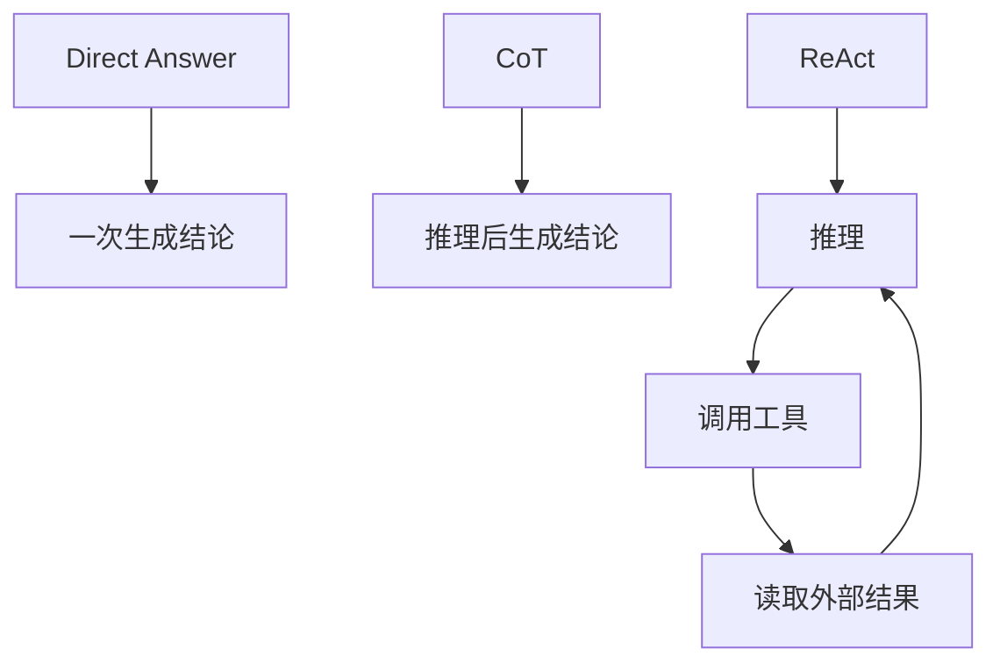
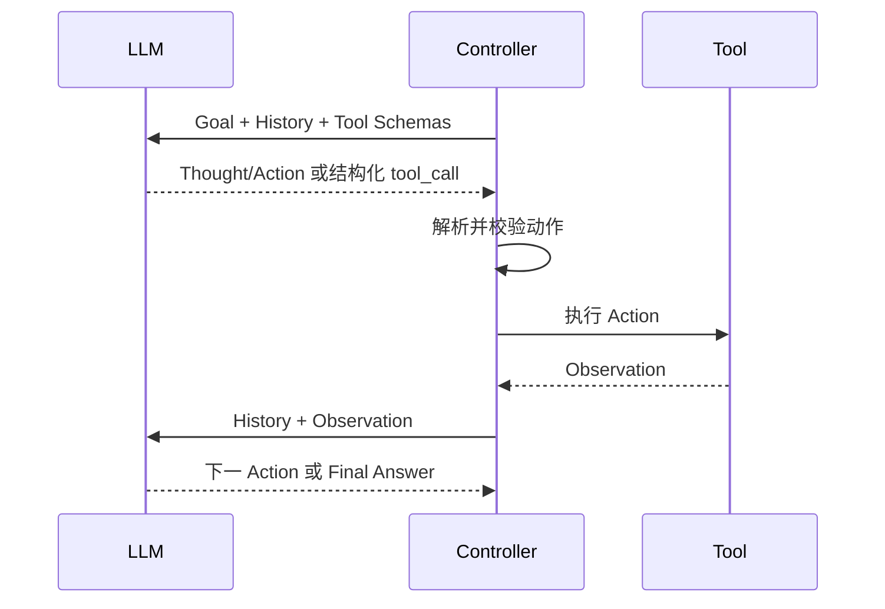
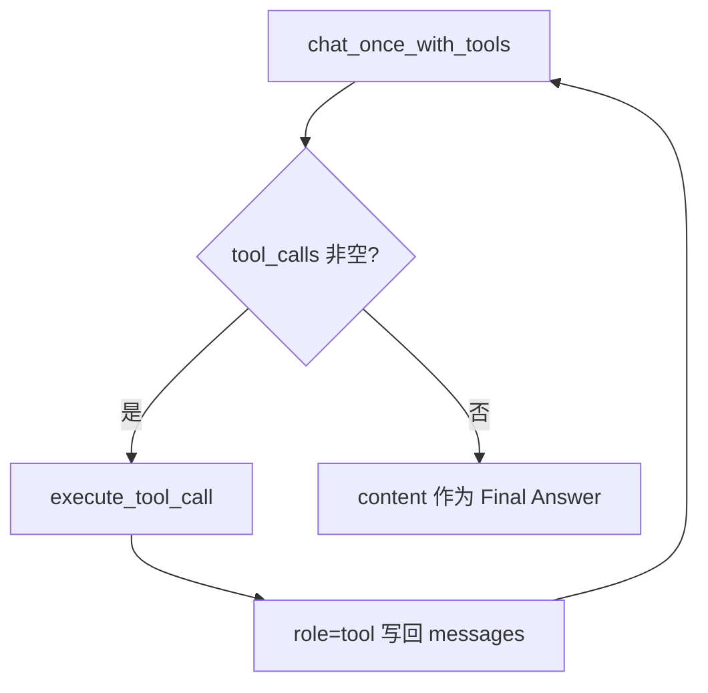
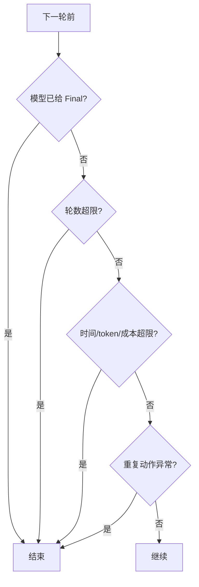
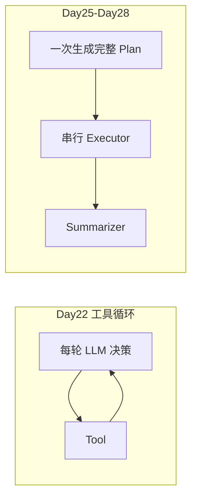

# 5. ReAct：Reasoning、Action、Observation 工具循环

> 原文：[Agent 推理模式有哪些？ReAct 是啥？具体是怎么实现的？](https://xiaolinnote.com/ai/agent/5_react.html)
>
> 功能定位：从 CoT 到 ReAct，解释代码如何驱动循环，并映射 Day22 Function Calling 实现。

---

## 1. 从直接回答到 ReAct



| 模式 | 外部工具 | 多轮反馈 | 典型用途 |
|---|---:|---:|---|
| Direct | 否 | 否 | 简单问答、改写 |
| CoT | 默认否 | 否 | 多步内部推理 |
| Act-only | 是 | 是 | 路径简单的工具动作 |
| ReAct | 是 | 是 | 需要边取事实边调整的任务 |

CoT 改善内部推理组织，但不能自然获得实时事实；ReAct 将推理与外部行动交替，使 Observation 成为下一轮决策依据。

## 2. ReAct 核心循环



重要结论：模型不会自己持续运行。每次模型调用只产生一次响应，循环由应用或框架驱动。

## 3. 经典文本 ReAct

经典 prompt 要求模型输出：

```text
Thought: 当前缺什么信息
Action: search
Action Input: 查询内容
Observation: 由程序填入
...
Final Answer: 最终答案
```

控制器需要解析文本：

```python
for _ in range(max_steps):
    response = llm.generate(history)
    if has_final_answer(response):
        return parse_final_answer(response)
    action = parse_action(response)
    observation = tools[action.name](action.input)
    history.extend([response, observation])
```

风险是模型格式稍有偏差，`parse_action()` 就可能失败。

## 4. 现代 Function Calling ReAct

现代模型直接返回结构化 `tool_calls`，不再依赖脆弱的 `Action:` 文本解析：

```json
{
  "tool_calls": [
    {
      "id": "call_1",
      "function": {
        "name": "lookup_service_owner",
        "arguments": "{\"service\":\"payment\"}"
      }
    }
  ]
}
```

Day22 的 [`main()`](../run_day22_function_calling_basics.py#L300) 正是这种循环；[`execute_tool_call()`](../run_day22_function_calling_basics.py#L201) 负责：

1. 读取函数名和 arguments。
2. `json.loads()` 解析参数。
3. 在 `TOOL_IMPLS` 中查找白名单。
4. 执行并包装 `ok/result/error`。
5. 作为 `role=tool` 消息写回历史。



### 4.1 Thought 去哪里了

Function Calling 保留 Action 和 Observation 的结构，但不一定公开显式 Thought。模型可以在内部完成决策或输出简短说明。

所以不能把“看不到 Thought 文本”误判为“不是 ReAct 思路”；工程核心仍是工具行动与结果反馈循环。但也不应声称当前项目完整记录了可审计的推理链，audit 应记录动作和结果，而非依赖隐藏推理。

## 5. Observation 为什么关键

如果只执行工具却不把结果写回模型：

```python
execute_tool_call(call)
# 没有 messages.append(tool_result)
```

下一轮模型不知道动作结果，循环就断了。正确消息顺序为：

```text
assistant(tool_call id=call_1)
tool(tool_call_id=call_1, content=result)
assistant(next decision)
```

`tool_call_id` 将 Observation 精确绑定到对应 Action，尤其在一轮并行多个工具时很重要。

## 6. 停止条件与预算

Day22 使用两类停止：

- 自然停止：模型不再返回 `tool_calls`。
- 硬停止：循环最多 `max_tool_rounds` 轮。

成熟实现还应增加：

```python
if elapsed_seconds > max_seconds:
    stop("timeout")
if total_tokens > token_budget:
    stop("token_budget")
if repeated_action_count > repeat_limit:
    stop("loop_detected")
```



## 7. ReAct 的两类典型失败

### 7.1 循环漂移

每轮只看局部 Observation，容易追逐新信息而忘记原目标。治理方式：

- 每轮保留简短目标声明。
- 对长任务先生成全局计划。
- 每隔若干轮检查 goal coverage。
- 限制工具和最大轮数。

### 7.2 错误传播

后续决策默认相信前序 Observation。治理方式：

- 工具返回来源、时间和置信度。
- 关键事实交叉验证。
- 增加步骤验收或 Evaluator。
- 将工具失败与空结果结构化区分。

例如 `ok=True` 只说明函数正常返回，不说明业务目标达成；空查询结果仍需业务校验。

## 8. 与当前 Plan-and-Execute 的区别



| 维度 | Day22 | Day25-Day28 |
|---|---|---|
| 下一动作 | 每轮模型决定 | 初始计划决定 |
| 全局计划 | 无 | 有 |
| Observation 回到下一次动作决策 | 有 | 当前没有 |
| 长任务方向 | 易漂移 | 较清晰 |
| 动态适应 | 较强 | 较弱 |

最常见的生产组合是全局 Plan-and-Execute，每个复杂 Step 内部使用 ReAct。

## 9. 面试问答

### Q1：ReAct 是什么？

**参考回答：** ReAct 是 Reasoning and Acting，将推理、工具行动和外部观察交替组织。模型根据当前历史选择 Action，程序执行工具并将 Observation 写回历史，模型再决定下一步，直到输出最终答案。

### Q2：ReAct 循环是谁驱动的？

**参考回答：** 应用代码或 Agent 框架。模型每次调用只返回一个响应，不会自己循环。控制器负责解析动作、校验工具、执行、写回 Observation 和检查停止条件。

### Q3：Function Calling 和经典 ReAct 有什么关系？

**参考回答：** 经典 ReAct 常用 `Action:` 文本格式并手工解析；Function Calling 用结构化 tool call 表达 Action，可靠性更高。Thought-Action-Observation 的闭环思想不变，变化的是动作协议。

### Q4：ReAct 的主要问题是什么？

**参考回答：** 长任务容易循环漂移，错误 Observation 会向后传播，完整历史重复发送还会抬高 token 和延迟。可通过全局计划、验收、摘要、预算和重复动作检测治理。

### Q5：Day22 是完整 ReAct 吗？

**参考回答：** 它实现了现代 Function Calling 的 Action/Observation 反馈循环和最大轮数，符合 ReAct 的核心执行思想；但没有显式 Thought、业务验收和系统化反思，因此应描述为轻量工具迭代 Agent，而不是过度宣称完整生产 ReAct。

## 10. 复习结论

```text
模型负责决定 Action；程序负责执行和循环；Observation 必须回到下一轮上下文。
```

理解 ReAct 时，最值得盯住的不是 prompt 中有没有 `Thought:` 字样，而是 Action 是否结构化、工具是否受控、Observation 是否正确回流、循环是否有硬边界。