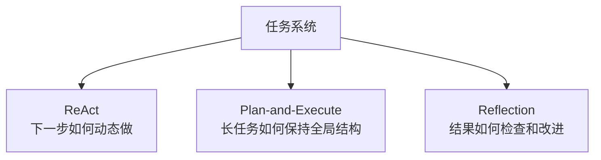
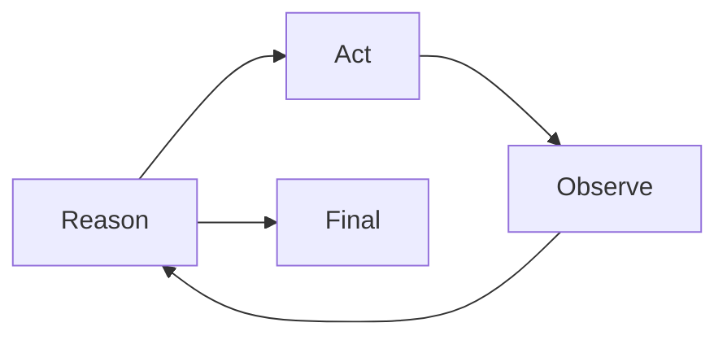
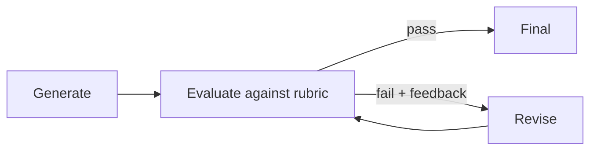
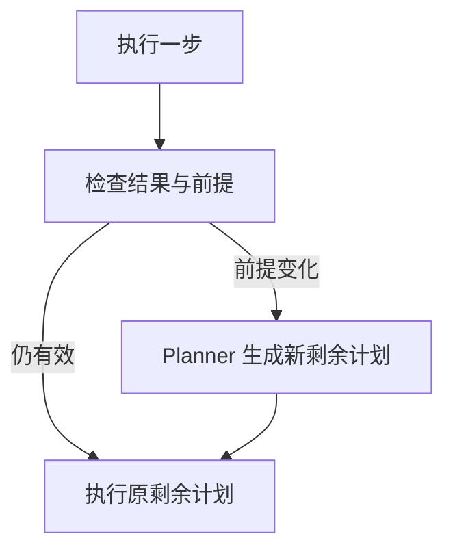
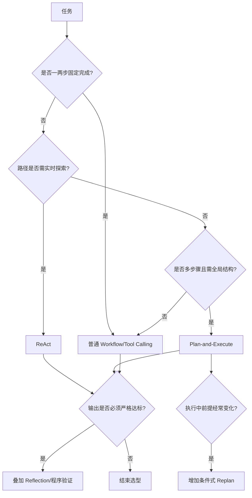
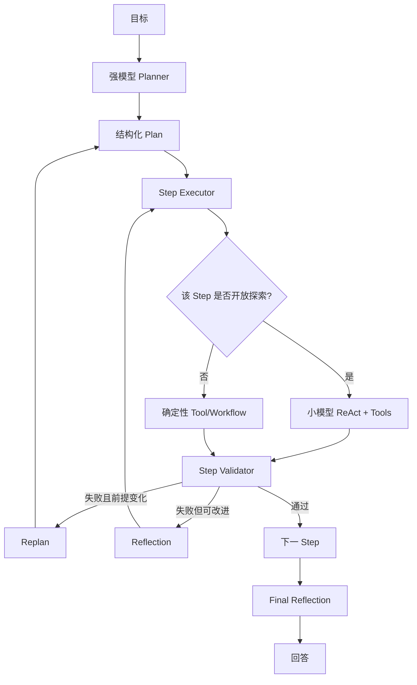

# 6. ReAct、Plan-and-Execute、Reflection：核心区别与选型

> 原文：[ReAct、Plan-and-Execute、Reflection 三种范式有什么核心区别？实际项目中该如何选型？](https://xiaolinnote.com/ai/agent/6_three_patterns.html)
>
> 功能定位：建立三种范式的统一比较框架，结合本项目说明选型、成本与演进顺序。

---

## 1. 三者解决不同问题



- ReAct：边想边做，解决局部适应性。
- Plan-and-Execute：先规划再执行，解决长任务方向和结构。
- Reflection：生成后评估再修改，解决质量问题。

Reflection 更像可叠加的质量层，不必与前两者三选一。

## 2. ReAct



特点：

- 每轮根据最新 Observation 动态选择动作。
- 不要求预先给出完整计划。
- 适合开放探索和中短任务。
- 长流程可能漂移或循环。

项目映射：Day22 [`main()`](../run_day22_function_calling_basics.py#L300) 的 Function Calling 循环。

## 3. Plan-and-Execute


特点：

- Planner 与 Executor 解耦。
- 执行前有完整步骤列表。
- 适合多步骤、依赖清晰的任务。
- 初始计划可能失效，需要条件式 Replan。

项目映射：Day25-Day28 [`build_plan()`](../run_day25_day28_langchain_demo.py#L369)、[`execute_step()`](../run_day25_day28_langchain_demo.py#L398)、[`summarize_once()`](../run_day25_day28_langchain_demo.py#L416)。

当前缺口：

- 后续步骤不读取前序执行结果。
- 没有步骤依赖和 DAG。
- 没有业务验收标准。
- 没有 Replan。

## 4. Reflection



特点：

- 可加在一次生成、ReAct 或 Plan-and-Execute 后。
- 依赖明确的质量标准。
- 提升质量但增加调用、延迟和成本。
- 必须限制反思轮数，避免“为了修改而修改”。

项目当前没有 Reflection。以下能力不能替代它：

| 当前能力 | 为什么不是 Reflection |
|---|---|
| Retry | 主要重复瞬时失败操作，没有质量 feedback |
| Fallback plan | Planner 失败时走固定计划，不评价候选计划 |
| Fallback summary | 生成失败时本地降级，不迭代改进 |
| Audit log | 记录事件，不参与质量决策 |

## 5. 动态 Replan 与 Reflexion

### 5.1 Replan

Replan 修改的是“剩余计划”：



适合 API 下线、数据缺失、必要前提被否定等情况。不要每步无条件 Replan，否则成本过高；应由验收失败、绑定失败或关键前提变化触发。

### 5.2 Reflexion

Reflexion 修改的是“未来决策经验”：


它要求跨任务 Memory，项目当前没有实现。

## 6. 成本模型

设任务有 $n$ 轮，每轮新增上下文约 $h$ token。

ReAct 若每轮发送完整历史，输入量近似：

$$
C_{react,input}\approx\sum_{i=1}^{n} i\cdot h
=\frac{n(n+1)}{2}h
$$

因此相对步骤数呈二次累计趋势，不应笼统描述为“总 token 线性增长”。

Plan-and-Execute 的粗略成本：

$$
C_{plan}=C_{planner}+\sum_{i=1}^{n}C_{step_i}+C_{summary}
$$

若每个步骤只携带必要上下文或摘要，通常更容易控制，但不保证一定比 ReAct 便宜。

Reflection 成本取决于评价和修改轮数 $r$：

$$
C_{reflection}\approx C_{base}+\sum_{j=1}^{r}(C_{evaluate_j}+C_{revise_j})
$$

所以选型要看真实 token、延迟和成功率，而不是套用固定节省比例。

## 7. 统一选型矩阵

| 维度 | ReAct | Plan-and-Execute | Reflection |
|---|---|---|---|
| 主要目标 | 灵活行动 | 全局规划 | 质量改进 |
| 路径确定性 | 低 | 中 | 继承基础范式 |
| 任务长度 | 短到中 | 中到长 | 任意 |
| 变化适应 | 强 | 基础版弱，Replan 后增强 | 主要修质量 |
| 首次实现成本 | 低到中 | 中 | 中 |
| 调用成本 | 历史累积 | 规划+步骤+总结 | 基础上额外增加 |
| 项目状态 | Day22 近似 | Day25-Day28 基础版 | 未实现 |

## 8. 选型决策树



## 9. 推荐的项目演进

当前代码最合理的演进顺序：


原因：

1. 没有结果绑定，Replan 缺少可靠事实。
2. 没有验收，系统不知道何时需要修正。
3. 没有硬评价标准，Reflection 可能只是主观改写。
4. 在数据流正确前增加并行，只会更快放大错误。

## 10. 一个混合架构示例



这不是默认起点，而是复杂度确有证据时的目标架构。

## 11. 面试问答

### Q1：三种范式的核心区别是什么？

**参考回答：** ReAct 解决边执行边适应，Plan-and-Execute 解决长任务的全局规划，Reflection 解决输出质量评价和修改。Reflection 可叠加在前两者上，并非必须独立运行。

### Q2：什么任务适合 ReAct？

**参考回答：** 路径难预先确定、需要实时工具反馈、中短步骤的探索任务。若任务很长，应增加全局计划或阶段目标，防止漂移和上下文膨胀。

### Q3：Plan-and-Execute 如何处理计划失效？

**参考回答：** 在步骤验收或关键前提变化时触发条件式 Replan，将原目标、已完成结果和剩余计划交给 Planner，替换后续步骤。每步无条件 Replan 会造成不必要成本。

### Q4：Reflection 和 Reflexion 有什么区别？

**参考回答：** Reflection 在当前任务中评价并修改候选结果；Reflexion 进一步提炼失败教训并写入长期记忆，让后续相似任务检索使用。后者需要可靠的长期记忆治理。

### Q5：为什么不能一开始把三种范式全加上？

**参考回答：** 每层都会增加状态、调用、延迟和故障面。应先用最简单方案建立基线，再根据漂移、计划失效或质量不达标等具体失败类型增加对应机制，并用成功率和成本证明收益。

### Q6：当前项目应该优先补什么？

**参考回答：** 先补前序结果绑定和步骤验收，再做 Replan。当前已经有 Planner/Executor，但后续步骤看不到前序结果，系统也无法区分工具调用成功和业务任务成功，这比直接增加 Reflection 或并行更基础。

## 12. 复习结论

```text
ReAct 管局部适应，Plan-and-Execute 管全局结构，Reflection 管质量闭环。
```

选型不是背诵“任务简单/复杂”，而是识别主要失败类型：路径未知选 ReAct，长程漂移选规划，计划过期选 Replan，输出不达标选 Reflection。