# Day25-Day28 Agent 任务拆分：理论、代码与图解

> 参考文章：[复杂任务怎么做任务拆分？为什么要拆分？效果如何提升？](https://xiaolinnote.com/ai/agent/7_tasksplit.html)
>
> 本文结合当前 `llm-day1` 项目的 Day25-Day28 代码，解释任务拆分、Plan-and-Execute、DAG 并行、自适应拆分和 Replan。文中的代码判断以当前仓库实现为准。

---

## 1. 先给结论

复杂任务拆分不是简单地“列一个待办清单”，而是把大目标转换为一组满足以下条件的执行单元：

1. 每一步只承担一个清晰职责。
2. 每一步有明确输入和结构化输出。
3. 步骤之间的数据依赖可以表达。
4. 每一步完成后可以独立验收。
5. 失败时可以只重试、重拆或重规划局部任务。
6. 无依赖的步骤可以并发执行。

一个较完整的任务拆分系统应具备：

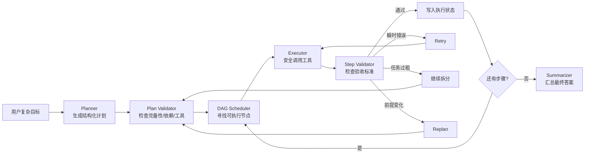

当前项目已经实现基础骨架：

```text
动态规划 + 静态兜底计划 + 串行工具执行 + 步骤重试 + 审计日志 + 最终总结
```

尚未实现的关键能力是：

```text
前序结果绑定 + DAG 调度 + 步骤验收标准 + 自适应继续拆分 + 条件式 Replan
```

---

## 2. 为什么复杂任务需要拆分

### 2.1 一次性完成复杂任务的问题

假设要求 Agent：

> 识别订单接口，查询订单 1001，检查状态，分析失败原因并生成联调报告。

如果让模型一次完成，它需要同时管理：

- 可用工具和接口地址
- order ID
- HTTP 请求参数
- 上一步返回的数据
- 错误状态
- 最终报告格式

这些中间状态都进入 context，模型容易发生：

- 在还没拿到工具事实前提前下结论
- 忘记原始目标中的某个要求
- 使用不存在的 endpoint
- 混淆规划和执行
- 某一步失败后仍基于虚假结果继续推理

### 2.2 拆分后的收益

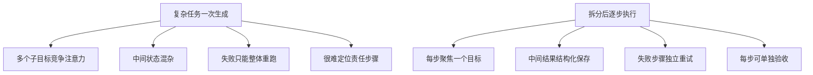

任务拆分改善的不只是模型“思考能力”，更重要的是系统工程能力：

| 能力 | 不拆分 | 拆分后 |
|---|---|---|
| 错误定位 | 只能看最终回答 | 可定位具体步骤 |
| 重试范围 | 整体重跑 | 只重试失败节点 |
| 可观测性 | 一段文本 | plan、step、result、summary |
| 并发 | 难以分析 | 可按依赖并行 |
| 成本控制 | 难分阶段统计 | 可按步骤计 token/耗时 |
| 安全控制 | 模型自由发挥 | 工具层白名单执行 |

---

## 3. 静态拆分与动态拆分

## 3.1 静态拆分：固定 Workflow

静态拆分由开发者提前定义步骤：


优点：

- 执行路径稳定
- 容易测试
- 成本与延迟可预测
- 安全边界清晰

缺点：

- 无法灵活适配新目标
- 未覆盖的场景容易卡住
- 流程变更需要改代码

当前项目中的对应实现是 `build_default_plan()`：

[查看当前静态兜底计划](../run_day25_day28_langchain_demo.py#L309)

```python
def build_default_plan(question: str) -> Plan:
    return Plan(
        plan=[
            PlanStep(
                step="识别可用 endpoint",
                tool="list_mock_endpoints",
                args={},
                why="首先需要确认有哪些可联调的 endpoint。",
            ),
            PlanStep(
                step="请求 order_id=1001",
                tool="http_get",
                args={"order_id": 1001},
                why="使用 order_id=1001 读取查询接口结果。",
            ),
        ]
    )
```

它不是主要规划路径，而是动态计划为空或失败时的稳定降级方案。

## 3.2 动态拆分：Plan-and-Execute

动态拆分将“如何拆任务”交给模型：

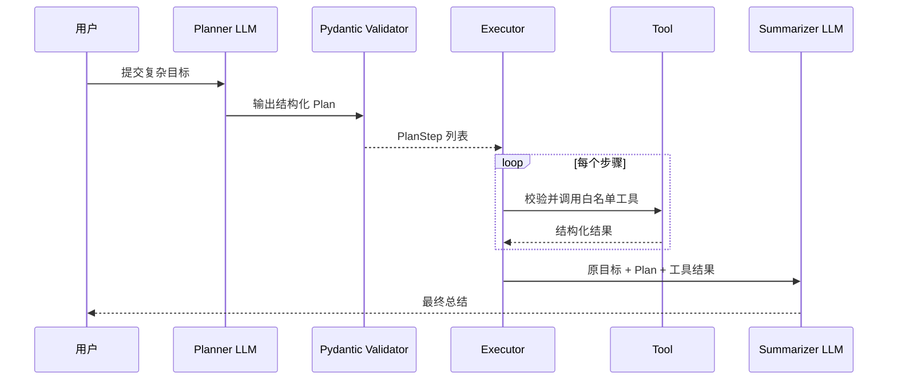

当前 LangChain 版本使用：

```python
planner = llm.with_structured_output(Plan)
plan = planner.invoke(
    [
        SystemMessage(content=system_prompt),
        HumanMessage(content=f"请根据用户目标生成计划：{question}"),
    ]
)
```

对应代码：

- [`PlanStep` / `Plan` schema](../run_day25_day28_langchain_demo.py#L72)
- [`build_plan()` 动态规划](../run_day25_day28_langchain_demo.py#L369)

当前项目实际采用混合策略：

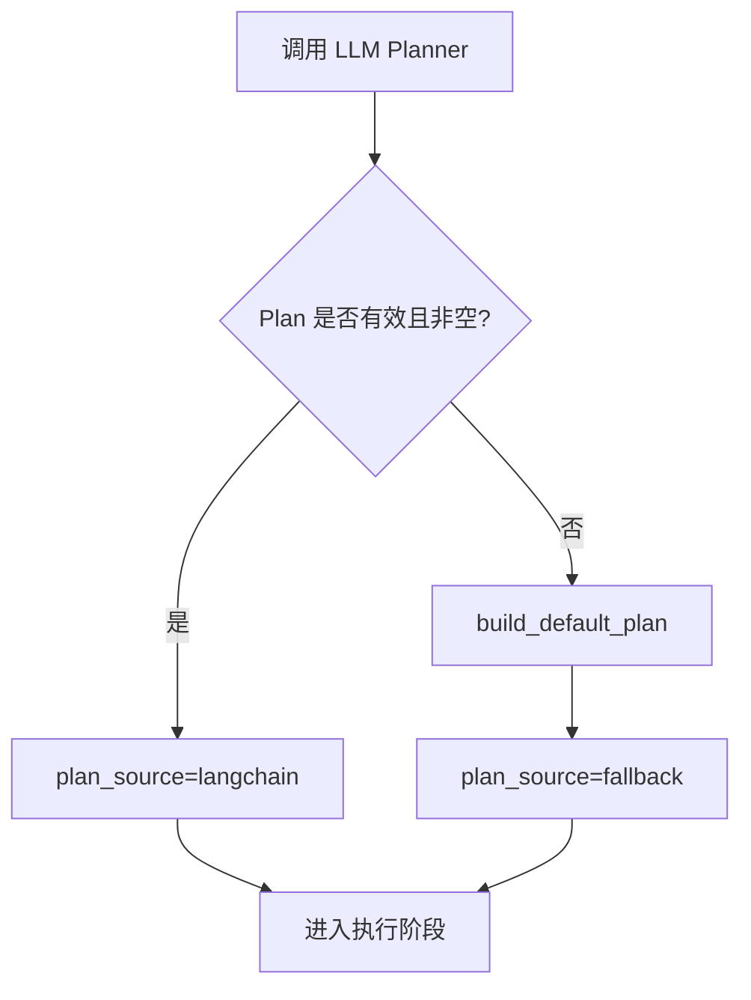

这种模式兼顾动态性和演示稳定性。

---

## 4. 当前项目的 Plan-and-Execute 代码链

### 4.1 Plan schema

```python
class PlanStep(BaseModel):
    step: str
    tool: str
    args: dict[str, Any]
    why: str


class Plan(BaseModel):
    plan: list[PlanStep]
```

字段含义：

| 字段 | 作用 | 当前能否强校验业务正确性 |
|---|---|---:|
| `step` | 描述当前任务 | 否，只校验字符串 |
| `tool` | 指定工具名称 | 部分，执行时查白名单 |
| `args` | 提供工具参数 | 部分，执行前归一化 |
| `why` | 解释步骤目的 | 否，只用于解释和报告 |

Pydantic 能保证输出形状，但不能保证计划合理。例如模型可以生成结构合法、工具不存在的步骤，最终仍需要 Executor 检查。

### 4.2 Planner

当前 `build_plan()` 的职责：

```text
读取 planner prompt
-> 使用 structured output 调 LLM
-> 重试可恢复异常
-> 检查 plan 是否为空
-> 必要时返回默认计划
```

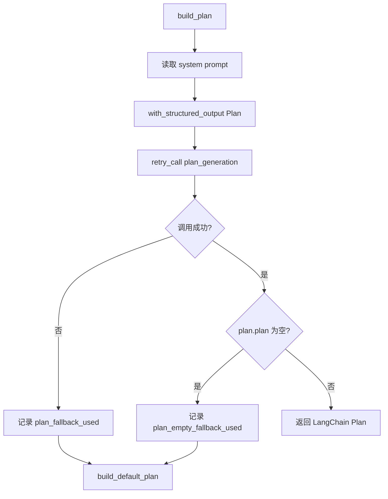

### 4.3 Executor

当前 `execute_step()` 的职责：

```text
读取 step.tool
-> normalize_step_args
-> TOOL_MAP 白名单查找
-> retry_call 包装 tool.invoke
-> 返回统一结果结构
```

对应代码：[`execute_step()`](../run_day25_day28_langchain_demo.py#L398)

```python
{
    "tool_name": step.tool,
    "ok": True,
    "arguments": args,
    "result": result_text,
}
```

安全边界：

- 模型只决定建议调用哪个工具。
- 应用通过 `TOOL_MAP` 决定是否允许执行。
- 未知工具不会动态 import 或 `eval()`。
- HTTP 工具还要经过 URL 白名单和 timeout。

### 4.4 Retry

当前重试包装器：[`retry_call()`](../run_day25_day28_langchain_demo.py#L342)

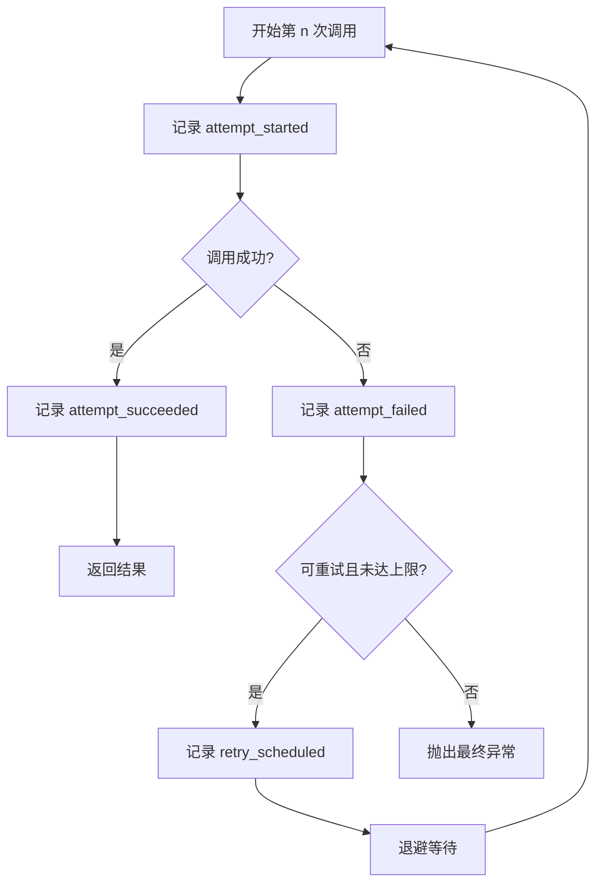

当前退避为线性增长：

$$
Delay_n = backoff\_seconds \times n
$$

注意：它与 Day36-Day38 服务中的指数退避不同。后者为：

$$
Delay_n = base \times 2^{n-1}
$$

### 4.5 Summarizer

当前 `summarize_once()` 的输入是：

```text
原始用户目标 + 完整计划 + 所有工具执行结果
```

对应代码：[`summarize_once()`](../run_day25_day28_langchain_demo.py#L416)

若模型失败，则调用 [`build_fallback_summary()`](../run_day25_day28_langchain_demo.py#L446)，直接根据结构化工具结果生成本地报告。

### 4.6 主流程

当前非 LangChain Agent Demo 的完整执行链：

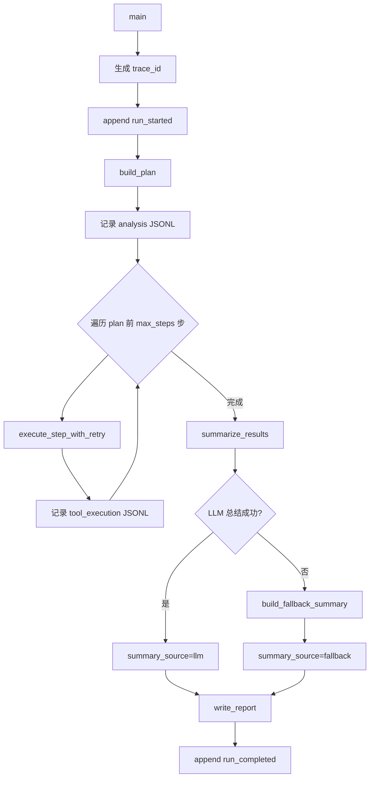

对应代码：[`run_day26_day28_agent_demo.py` 的 `main()`](../run_day26_day28_agent_demo.py#L767)

---

## 5. 当前实现的核心缺口：步骤结果没有向后传递

文章中的执行阶段强调：后续步骤要使用前序步骤产生的新信息。

理想数据流：

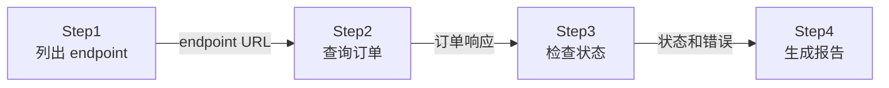

当前代码实际是：

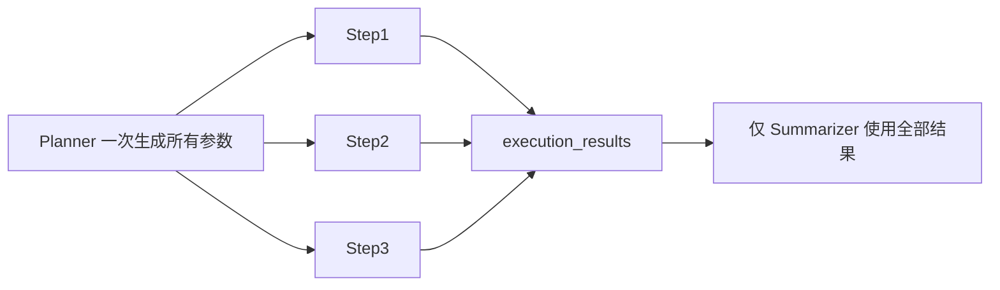

主循环大致为：

```python
execution_results = []
for step in plan:
    result = execute_step(step)
    execution_results.append(result)
```

`execute_step()` 只接收当前 step，没有接收前序 `execution_results`。因此：

- Step2 不能直接引用 Step1 发现的 URL。
- Step3 不能基于 Step2 的响应动态决定参数。
- Planner 必须在执行开始前猜出全部参数。
- 只有最终总结阶段能看到全部结果。

### 5.1 改进：输入绑定

建议扩展 schema：

```python
class PlanStep(BaseModel):
    id: str
    description: str
    tool: str
    args: dict[str, Any]
    depends_on: list[str] = []
    input_bindings: dict[str, str] = {}
```

计划示例：

```json
{
  "id": "query_order",
  "description": "查询订单 1001",
  "tool": "http_get",
  "args": {
    "params": {"order_id": 1001}
  },
  "depends_on": ["discover_endpoint"],
  "input_bindings": {
    "url": "steps.discover_endpoint.result.order_query_url"
  }
}
```

执行前解析：

```python
resolved_args = resolve_bindings(
    step.args,
    step.input_bindings,
    execution_state,
)
```

这样才真正建立：

```text
Step1 输出 -> Step2 输入
```

---

## 6. DAG 依赖与并行执行

### 6.1 为什么需要 DAG

以下任务中，三项查询相互独立：

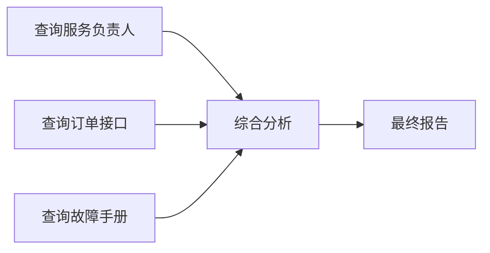

A、B、C 可以同时执行，D 必须等待它们全部完成。

全串行耗时：

$$
T_{serial}=T_A+T_B+T_C+T_D+T_E
$$

并行后近似为：

$$
T_{parallel}=\max(T_A,T_B,T_C)+T_D+T_E
$$

优化的是关键路径，不是每个工具本身的执行时间。

### 6.2 DAG 调度示意

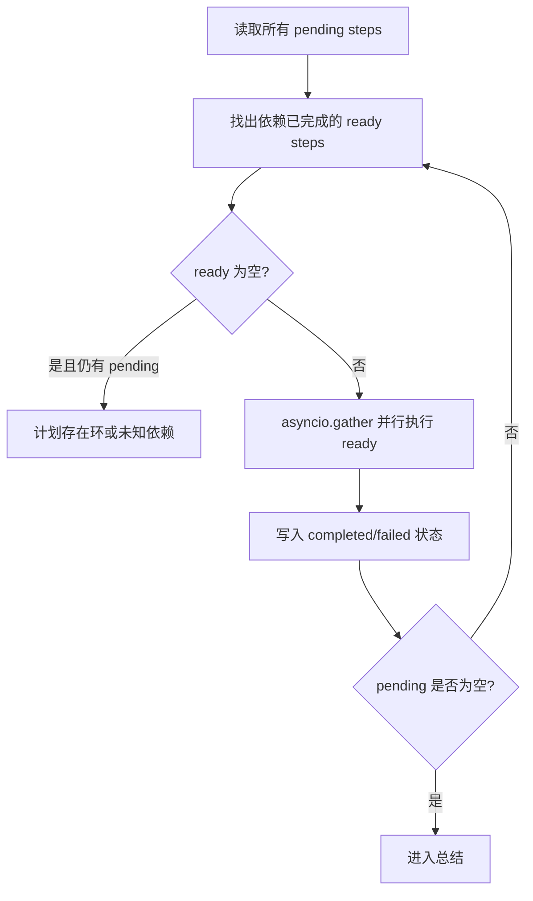

伪代码：

```python
completed = {}
pending = {step.id: step for step in plan}

while pending:
    ready = [
        step
        for step in pending.values()
        if all(dep in completed for dep in step.depends_on)
    ]
    if not ready:
        raise ValueError("plan contains a cycle or unknown dependency")

    results = await asyncio.gather(
        *[execute_step_async(step, completed) for step in ready]
    )

    for step, result in zip(ready, results):
        completed[step.id] = result
        del pending[step.id]
```

### 6.3 并行不是必然更快

并行收益需要满足：

- 步骤之间确实无依赖。
- 工具主要为网络、数据库等 I/O。
- 上游允许并发。
- 本地连接池和线程池足够。
- 操作没有冲突副作用。

以下场景不适合盲目并行：

- 所有步骤严格依赖前一步。
- 多个步骤修改同一资源。
- 本地 CPU 模型已经占满计算资源。
- 上游有严格 QPS 限制。
- 工具调用顺序本身具有业务语义。

文章中提到的 40%-60% 降低是有条件的经验值，不是所有任务都能达到的承诺。

---

## 7. 拆分粒度：以“原子步骤”为标准

### 7.1 太粗与太细

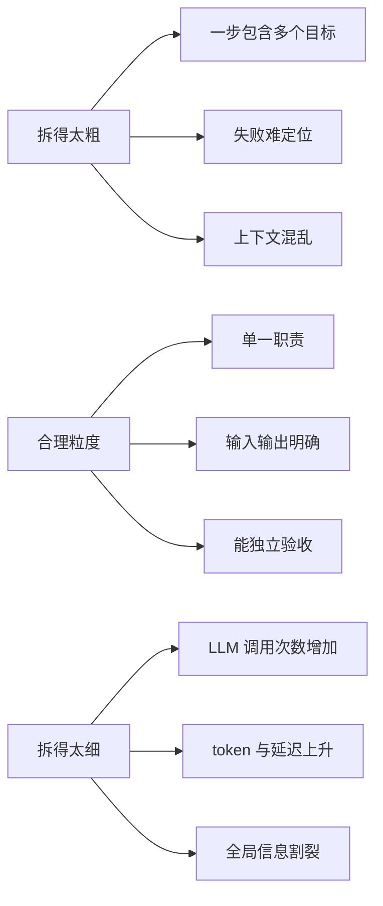

判断步骤是否原子的实用方法：

> 能否为这个步骤写出清晰、单一职责的函数签名？

较好的步骤：

```python
def query_order(order_id: int) -> OrderResult:
    ...
```

过粗的步骤：

```python
def investigate_and_fix_and_report_incident(context: str) -> str:
    ...
```

### 7.2 当前代码中的原子性

当前工具层相对原子：

- `list_mock_endpoints()`：只列出 endpoint。
- `http_get()`：只发起 GET。
- `http_post()`：只发起 POST。

但当前默认计划中的“总结联调结果”被映射成 `http_post`，语义边界不够准确。总结本应属于 Summarizer，而不是 HTTP 工具。更合理的计划是：

```text
发现 endpoint -> 发起请求 -> 验证响应
```

总结由固定的总结阶段完成，不需要 Planner 再生成一个“总结工具步骤”。

---

## 8. 步骤验收：工具成功不等于任务成功

当前 `execute_step()` 主要判断工具是否抛异常：

```python
{
    "ok": True,
    "result": result_text,
}
```

但是以下请求虽然 HTTP 调用成功，业务任务仍然失败：

```json
{
  "status_code": 200,
  "body": {
    "orders": []
  }
}
```

如果目标是“查询订单 1001”，没有订单数据就不应视为步骤完成。

### 8.1 两层成功语义

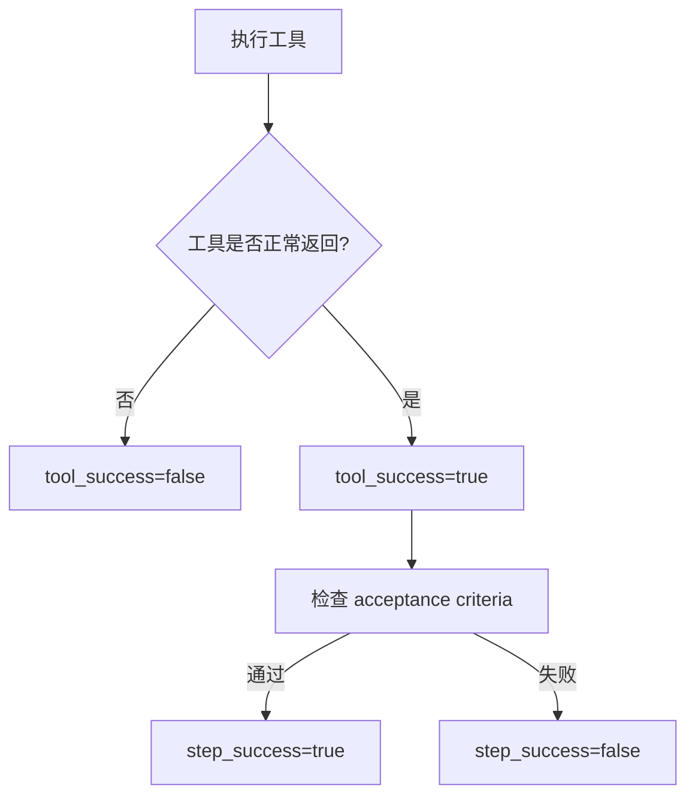

建议结果结构：

```python
class StepResult(BaseModel):
    step_id: str
    tool_success: bool
    step_success: bool
    result: Any = None
    validation_errors: list[str] = []
    retryable: bool = False
```

### 8.2 验收标准 schema

```python
class AcceptanceCriterion(BaseModel):
    json_path: str
    operator: Literal["exists", "equals", "contains", "gte"]
    expected: Any = None
```

计划示例：

```json
{
  "id": "query_order",
  "acceptance_criteria": [
    {
      "json_path": "$.status_code",
      "operator": "equals",
      "expected": 200
    },
    {
      "json_path": "$.body.args.order_id",
      "operator": "equals",
      "expected": "1001"
    }
  ]
}
```

好的验收标准应：

- 可以由程序检查。
- 与原始目标直接相关。
- 不只检查格式。
- 不依赖模型主观判断。

---

## 9. 自适应拆分：做不好时继续拆

### 9.1 与 Retry 的区别

| 机制 | 触发原因 | 操作 |
|---|---|---|
| Retry | 网络抖动、临时 5xx | 原参数重复同一步骤 |
| Re-split | 当前步骤本身太复杂 | 将该步骤替换成多个子步骤 |
| Replan | 新事实使后续计划失效 | 修改剩余计划 |

### 9.2 自适应拆分过程

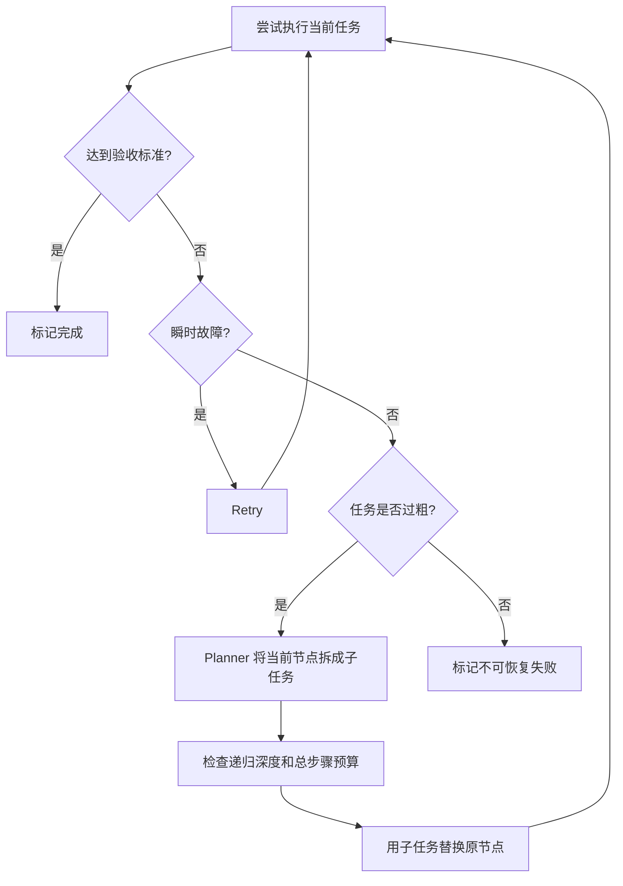

示例：

```text
原任务：完成所有竞品数据调研
    |
    +-- 执行质量不合格
    v
拆成：调研竞品 A / 调研竞品 B / 调研竞品 C
```

必须限制：

- 最大递归深度
- 最大总步骤数
- 最大 LLM 调用次数
- 最大 token 预算
- 最大端到端时间

否则模型可能无限拆分。

---

## 10. Replan：执行结果改变前提时重规划

### 10.1 为什么初始计划会过期

原始计划：

```text
1. 查询竞品 A 定价
2. 查询竞品 B 定价
3. 对比 A 和 B
```

Step1 发现竞品 A 已停止运营，Step3 的原始对比目标可能已经没有意义。继续机械执行旧计划会浪费成本或生成错误结论。

### 10.2 条件式 Replan

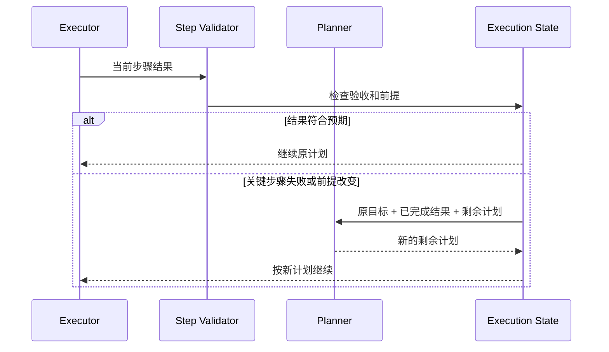

推荐触发条件：

- 关键工具最终失败。
- 步骤验收失败。
- 后续参数无法从前序结果解析。
- 新结果否定原计划前提。
- 发现新的必要子目标。
- 预算或时间即将超限。

不建议每一步都 Replan，因为每次都需要额外 LLM 调用。条件式触发能在适应性和成本之间取得平衡。

---

## 11. 如何验证任务拆分质量

文章提出三个主要标准：完备性、独立性、可验证性。

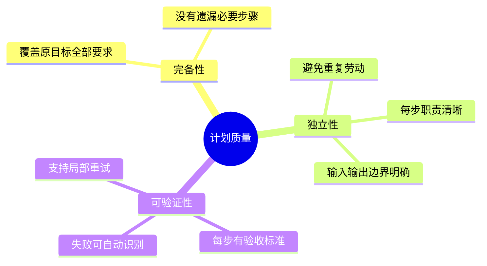

### 11.1 完备性

检查原始目标的每个要求是否有负责步骤。

例如原目标要求：

```text
查询订单 + 检查状态 + 输出建议
```

计划至少要有查询和状态验证。最终建议可由固定 Summarizer 负责，不一定需要成为工具步骤。

### 11.2 独立性

反例：

```text
Step2：搜索服务功能
Step3：分析服务核心功能
```

边界模糊、内容重叠。更合理的是：

```text
Step2：收集原始服务资料
Step3：基于 Step2 输出功能对比表
```

### 11.3 可验证性

反例：

```text
Step：把接口问题分析清楚
```

“清楚”无法自动判断。更合理的验收标准：

```text
- 响应必须包含 status_code
- 必须包含 order_id=1001
- 失败时必须包含错误类型
```

### 11.4 建议增加的 Plan Validator

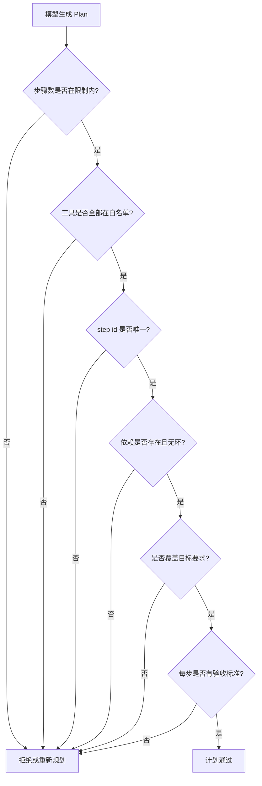

---

## 12. 当前能力与文章理论对照

| 任务拆分能力 | 当前项目 | 代码依据 | 下一步 |
|---|---:|---|---|
| Planner 与 Executor 分离 | 已实现 | `build_plan()` / `execute_step()` | 保持 |
| 动态结构化计划 | 已实现 | `with_structured_output(Plan)` | 增加业务校验 |
| 静态 fallback plan | 已实现 | `build_default_plan()` | 按场景提供模板 |
| 工具白名单 | 已实现 | `TOOL_MAP.get()` | 增加用户权限 |
| 步骤级重试 | 已实现 | `retry_call()` | 增加 jitter/总预算 |
| 审计日志 | 已实现 | `append_audit_event()` | 日志脱敏/持久化 |
| 总结 fallback | 已实现 | `build_fallback_summary()` | 明确降级标记 |
| 前序输出传入后续步骤 | 参考实现已提供 | 原 Executor 只接收当前 step | `resolve_bindings()` |
| 步骤依赖表达 | 参考实现已提供 | 原 schema 无 `depends_on` | `PlanStep.depends_on` |
| DAG 校验 | 参考实现已提供 | 原 Demo 使用普通 list | `validate_plan()` |
| 无依赖步骤并行 | 参考实现已提供 | 原 Demo 使用 `for` 串行 | `DAGOrchestrator` |
| 步骤验收标准 | 参考实现已提供 | 原 Demo 主要检查异常 | `success_criteria` |
| 自适应继续拆分 | 未实现 | 失败只重试/记录 | decompose failed step |
| 条件式 Replan | 参考实现已提供 | 原 Demo 计划生成一次后固定 | `on_failure` + Replanner |
| 全局 token/时间预算 | 部分实现 | 步数、单次 timeout、重试上限 | ExecutionBudget |

准确的项目描述：

> 当前项目实现了具备动态初始规划、静态兜底、串行白名单工具执行、步骤级重试、审计和总结降级的轻量 Plan-and-Execute Agent。

不应夸大为：

> 已支持 DAG、自适应递归拆分和动态重规划的完整调度器。

表中的“参考实现”位于 [agent_capabilities_reference.py](examples/agent_capabilities_reference.py)，测试位于 [test_agent_capabilities_reference.py](../tests/test_agent_capabilities_reference.py)。它具体演示 `${steps.<id>.output.<path>}` 结果绑定、依赖环检测、并行 ready batch、结构化验收、原子 checkpoint 和有上限的计划补丁；自适应递归拆分及全局 token/时间预算仍未实现。

---

## 13. 推荐的生产化数据模型

```python
class AcceptanceCriterion(BaseModel):
    json_path: str
    operator: Literal["exists", "equals", "contains", "gte"]
    expected: Any = None


class PlanStep(BaseModel):
    id: str
    description: str
    tool: str
    args: dict[str, Any]
    depends_on: list[str] = []
    input_bindings: dict[str, str] = {}
    acceptance_criteria: list[AcceptanceCriterion] = []
    max_attempts: int = 2
    on_failure: Literal["stop", "continue", "replan", "decompose"] = "stop"


class StepResult(BaseModel):
    step_id: str
    tool_success: bool
    step_success: bool
    result: Any = None
    validation_errors: list[str] = []
    attempts_used: int = 0
    latency_ms: float = 0.0


class ExecutionState(BaseModel):
    goal: str
    plan_version: int = 1
    completed: dict[str, StepResult] = {}
    failed: dict[str, StepResult] = {}
    total_tokens: int = 0
    elapsed_ms: float = 0.0
```

完整状态流：

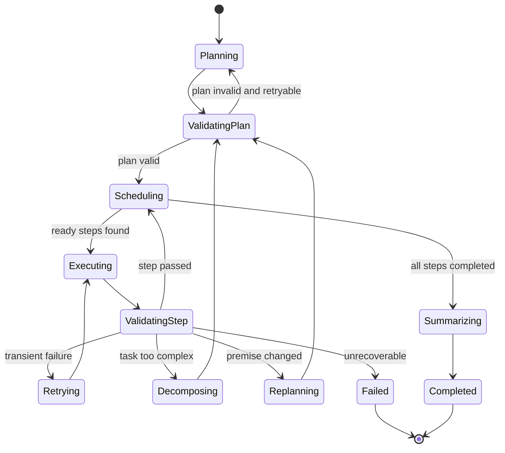

---

## 14. 指标：如何证明拆分有效

不能只说“拆分后准确率更高”，应收集可验证指标。

### 14.1 质量指标

- `task_success_rate`：最终任务成功率。
- `step_success_rate`：步骤验收通过率。
- `plan_validation_pass_rate`：初始计划一次通过率。
- `replan_success_rate`：重规划后恢复比例。
- `fallback_rate`：使用默认计划或本地总结的比例。

### 14.2 性能指标

- `end_to_end_ms`：端到端耗时。
- `critical_path_ms`：DAG 关键路径耗时。
- `parallelism`：同时执行步骤峰值/平均值。
- `tool_latency_ms`：每种工具耗时。
- P50/P95/P99 延迟。

### 14.3 成本指标

- Planner token。
- Executor 中 LLM token（若工具步骤包含模型）。
- Replan token。
- Summarizer token。
- 单次成功任务总 token。

### 14.4 稳定性指标

- 每步平均 attempt。
- 超时率。
- 工具失败率。
- DAG 死锁/环检测次数。
- 预算超限次数。

### 14.5 A/B 对比设计

固定同一批复杂任务，比较：

| 模式 | 描述 |
|---|---|
| One-shot | 一次模型调用完成全部任务 |
| Static Workflow | 固定步骤串行执行 |
| Dynamic Serial | 动态计划，串行执行 |
| Dynamic DAG | 动态计划，依赖并行 |
| Adaptive | DAG + 验收 + Replan/继续拆分 |

公平比较需要固定：

- 模型和版本
- temperature
- 工具 mock 数据
- timeout 和重试规则
- 任务集
- 成功判定标准

---

## 15. 面试问答

### 15.1 为什么复杂任务拆分后质量会提升？

**参考回答：**

复杂任务会产生大量中间状态和子目标，受到 context window 和注意力分配限制，一次生成容易混淆阶段职责。拆分后每一步只处理一个原子目标，输入输出可以结构化保存，并且能独立验收和重试。当前项目将流程拆成 Planner、Executor 和 Summarizer，并通过 JSONL 与 audit log 保存每个阶段，因此失败时可以定位到具体工具步骤，而不是整体重跑。

### 15.2 静态拆分和动态拆分怎么选？

**参考回答：**

固定、强合规、低变化流程优先静态 Workflow，因为可预测、易测试；开放目标和任务类型变化较大时可用动态规划，但必须增加 schema、工具白名单、计划验证和 fallback。当前代码采用混合策略：优先 LangChain structured output 动态规划，失败时回退 `build_default_plan()`。

### 15.3 CoT 和任务拆分有什么区别？

**参考回答：**

CoT 更接近一次模型生成中的内部推理组织；Agent 任务拆分是系统级的多个独立执行步骤，每一步可能调用工具、有持久化结果、验收、重试和权限边界。不能因为 prompt 中写了“请逐步思考”，就认为已经实现了可执行 Workflow。

### 15.4 如何确定拆分粒度？

**参考回答：**

以原子操作为标准：单一职责、输入输出明确、可以写出清晰函数签名、完成后能自动验收。过粗会导致上下文混乱和错误难定位；过细会增加调用次数、token 和协调成本。应通过任务成功率、步骤重试率和总成本共同调优。

### 15.5 为什么不能直接并行所有步骤？

**参考回答：**

步骤可能存在数据依赖或副作用冲突。必须先用 `depends_on` 建立 DAG，只有依赖都完成的节点才能执行。并行优化的是关键路径，对严格串行任务没有收益；并发还可能触发上游限流和本地资源竞争，因此必须用真实 P95 和成功率验证。

### 15.6 Retry、继续拆分和 Replan 有什么区别？

**参考回答：**

Retry 用于同一步骤的瞬时故障；继续拆分用于当前任务本身过粗、一次无法完成；Replan 用于执行结果改变了剩余计划前提。三者触发条件不同，不能对所有失败都原样重试，否则只会重复确定性错误。

### 15.7 当前项目实现到什么程度？

**参考回答：**

当前实现了动态结构化计划、静态 fallback、白名单工具串行执行、步骤级重试、trace/audit 和总结 fallback。尚未实现前序结果绑定、DAG 并行、步骤验收、自适应继续拆分和条件式 Replan。因此它是轻量 Plan-and-Execute Demo，而不是完整生产调度器。

---

## 16. 推荐学习和实现顺序

不要直接先做并行。合理顺序是：


原因：

1. 没有稳定 step ID，无法可靠引用依赖。
2. 没有依赖，无法正确传递结果或并行。
3. 没有验收，系统不知道什么时候需要 Replan。
4. 没有正确数据流时直接并行，只会更快地产生错误结果。

---

## 17. 本项目相关代码索引

- [Day25 手写任务编排](../run_day25_task_orchestration.py)
- [Day26-Day28 重试、审计与 Demo](../run_day26_day28_agent_demo.py)
- [Day25-Day28 LangChain 版本](../run_day25_day28_langchain_demo.py)
- [Day25 实验报告](../experiments/day25_task_orchestration.md)
- [Day26-Day28 实验报告](../experiments/day26_day28_agent_demo.md)
- [LangChain Agent 实验报告](../experiments/day25_day28_langchain_demo.md)
- [Day1-Day42 总结工具书](../Day1_42_学习总结与工具手册.md)

---

## 18. 最终总结

任务拆分的完整工程含义是：

```text
把复杂目标转换为可执行、可依赖、可验收、可恢复、可观测的步骤图。
```

当前项目已经有可靠的基础骨架：

```text
Planner -> Executor -> Retry/Audit -> Summarizer
```

最有价值的下一步不是立刻增加更多框架，而是补齐：

```text
Step ID -> Dependencies -> Input Binding -> Acceptance Criteria -> Replan
```

完成这些之后，再做 DAG 并行和自适应递归拆分，系统才会从“能生成计划的 Demo”真正升级成“能根据执行事实调整计划的 Agent 调度器”。
