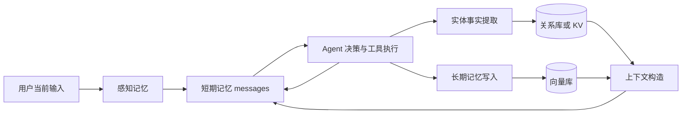
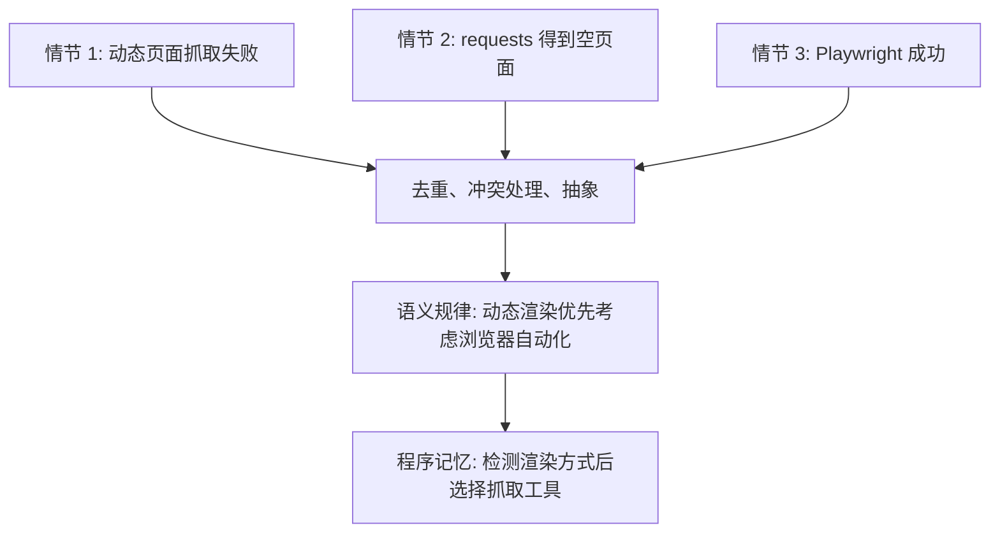
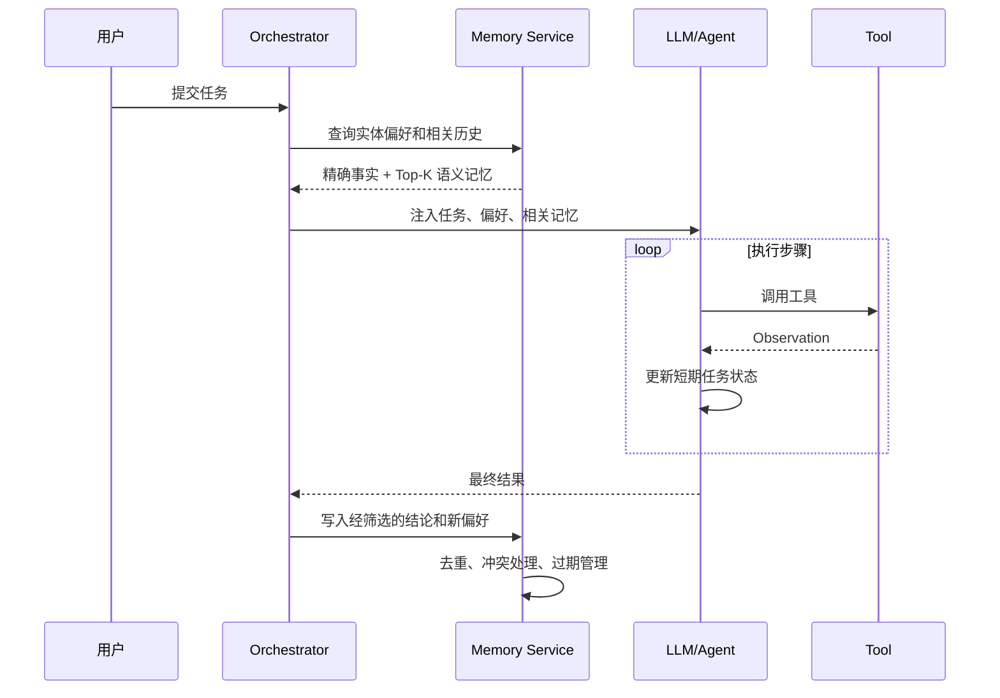

# 8. Agent 记忆机制与记忆模块设计

> 原文：[请你介绍一下 AI Agent 的记忆机制，并说明在实际开发中应该如何设计记忆模块？](https://xiaolinnote.com/ai/agent/8_memory.html)
>
> 一句话结论：Agent 记忆不是“保存聊天记录”这么简单，而是围绕 **存什么、怎么存、何时取**，建立任务前读取、任务中使用、任务后写回的闭环。

## 1. 为什么 Agent 需要记忆

普通 LLM API 本身是无状态的。每次请求能“记住”之前的内容，是因为应用把历史消息重新传给模型，而不是模型内部永久保存了对话。

Agent 需要记忆解决两类问题：

1. **任务内连续性**：知道已经执行了哪些步骤、工具返回了什么、下一步该做什么。
2. **跨任务积累**：记住用户偏好、历史决策、成功经验和可复用流程。



## 2. 四层记忆模型

| 类型 | 保存内容 | 生命周期 | 典型实现 | 访问方式 |
|---|---|---|---|---|
| 感知记忆 | 当前文本、图片、文件等原始输入 | 单次调用 | 请求对象 | 直接读取 |
| 短期记忆 | 对话、工具结果、当前任务状态 | 一次任务 | `messages`、状态对象 | 每轮直接注入 |
| 长期记忆 | 历史经验、知识、任务结论 | 跨任务 | 向量库、关系库 | 语义或条件检索 |
| 实体记忆 | 用户偏好、项目配置、截止日期等事实 | 跨任务 | 表、KV、知识图谱 | 精确查询或关系查询 |

这里的分类是工程抽象，不是严格的认知科学分类。实体记忆也可以被视为长期记忆的一种结构化形态。

### 2.1 长期记忆的三种内容

- **情节记忆**：某次任务发生了什么，包含上下文、过程和结果。
- **语义记忆**：从多次经历中提炼出的通用事实和规律。
- **程序记忆**：完成某类任务的 SOP、策略或操作步骤。



## 3. 设计记忆模块的三个核心问题

### 3.1 存什么

判断标准是：**下次任务开始时知道这条信息，是否能明显改善决策或输出？**

适合长期保存：

- 稳定的用户偏好和约束；
- 已确认的业务事实、关键决策和最终结论；
- 可复用的故障经验和操作流程；
- 有来源、时间戳和权限边界的外部知识。

通常不应直接保存：

- 冗长的中间推理；
- 可随时重新获取的原始工具输出；
- 没有后续价值的闲聊；
- 未验证、可能含有幻觉的临时结论。

### 3.2 怎么存

不同信息需要不同介质：

| 信息 | 推荐介质 | 原因 |
|---|---|---|
| 用户语言、技术栈、权限 | 关系库或 KV | 字段稳定，需要精确查询 |
| 文档、任务摘要、历史案例 | 向量库 | 表述不固定，需要语义召回 |
| 实体关系和时间演化 | 图数据库 | 支持关系遍历和多跳查询 |
| 原始审计记录 | 对象存储或 JSONL | 便于回放，不直接作为 prompt |

因此，生产系统通常使用混合存储，而不是把所有信息都塞进向量库。

### 3.3 什么时候取

1. **主动检索**：任务开始前，用当前目标检索用户偏好和相关历史，注入 system context。
2. **按需检索**：把 `search_memory` 暴露为工具，由 Agent 在执行到特定步骤时调用。

前者稳定，适合必需背景；后者灵活，适合不一定会用到的专业知识。常见方案是二者结合。

## 4. 完整的读、用、写闭环



记忆写入必须有治理规则：

- 带上 `user_id`、`tenant_id`，避免用户间串数据；
- 保存来源、时间戳、重要度和有效期；
- 新事实与旧事实冲突时，不应静默追加；
- 敏感信息要经过脱敏、授权和删除策略；
- 检索结果属于不可信上下文，不能覆盖系统安全规则。

## 5. 结合当前项目代码理解

### 5.1 Day22 已实现任务内短期记忆

项目代码：[run_day22_function_calling_basics.py](../run_day22_function_calling_basics.py)

```python
messages = [
    {"role": "system", "content": system_prompt},
    {"role": "user", "content": args.question},
]

messages.append(assistant_entry)
messages.append({
    "role": "tool",
    "tool_call_id": item.get("id"),
    "name": tool_name,
    "content": json.dumps(result_payload, ensure_ascii=False),
})
```

这段代码具备短期记忆的关键性质：

- 每轮模型调用都携带完整 `messages`；
- assistant 的工具决策会进入历史；
- 工具结果以 `role="tool"` 回填，下一轮模型可以读取；
- `max_tool_rounds` 限制闭环长度。

但它没有滑动窗口、摘要压缩、结构化任务状态，也不会跨进程恢复，因此不能称为完整记忆系统。

### 5.2 Day9 是长期记忆的检索底座，不是完整长期记忆

项目代码：[run_day9_local_vector_search.py](../run_day9_local_vector_search.py)

```python
matrix = l2_normalize(np.asarray(chunk_vectors, dtype=np.float32))
index = faiss.IndexFlatIP(matrix.shape[1])
index.add(matrix)
faiss.write_index(index, str(index_file))

q_matrix = l2_normalize(np.asarray([q_vec], dtype=np.float32))
scores, ids = index.search(q_matrix, args.top_k)
```

它已经实现：文本切块、Embedding、FAISS 持久化、Top-K 语义检索和元数据落盘。这些能力可以复用于长期记忆检索。

它尚未实现：

- 按用户或租户隔离；
- 任务结束后的自动记忆筛选与写入；
- 重要度、新鲜度、有效期和权限过滤；
- 去重、冲突消解和情节到语义的提炼；
- 把检索结果自动注入 Agent 上下文。

因此准确说法是：**项目有长期记忆所需的向量检索基础设施，但没有完整的 Agent Memory Service。**

### 5.3 可运行的 Memory Service 参考实现

[agent_capabilities_reference.py](examples/agent_capabilities_reference.py) 中的 `SQLiteMemoryStore` 已具体实现：

- SQLite 持久化 schema，以及 `tenant_id + user_id` 强制隔离；
- `upsert_fact()` 实体事实更新和 episodic/semantic/procedural 追加写入；
- 查询相关度、重要度和新鲜度的混合排序；
- `valid_until` 有效期过滤、来源和 metadata 保存；
- `forget()` 软删除，并防止跨用户删除。

当前检索器使用离线可测的词法相似度，不冒充 Day9 的 Embedding 检索。生产演进时可把评分函数替换为 FAISS/向量数据库 adapter，并在写入前增加隐私过滤、事实抽取、去重和冲突消解。隔离、生命周期和接口测试见 [test_agent_capabilities_reference.py](../tests/test_agent_capabilities_reference.py)。

### 5.4 JSONL 日志为什么不是记忆

Day22 和 Day25-Day28 会把步骤或审计事件写入 JSONL。日志可以作为情节记忆的候选数据源，但只有完成以下链路后才成为可用记忆：


仅仅“写了日志”不能保证 Agent 会检索、理解和使用它。

## 6. 建议的最小 Memory Service

可以基于现有 Day9 能力演进出以下接口：

```python
class MemoryStore:
    def search(self, user_id: str, query: str, top_k: int = 5) -> list[dict]: ...
    def upsert_fact(self, user_id: str, key: str, value: str, source: str) -> None: ...
    def add_episode(self, user_id: str, summary: str, metadata: dict) -> None: ...
    def forget(self, user_id: str, memory_id: str) -> None: ...
```

最小演进顺序：

1. 用 SQLite 保存结构化偏好、时间戳和有效状态。
2. 复用 Day9 FAISS 保存任务摘要，并在元数据中增加 `user_id` 和 `memory_type`。
3. 任务开始前主动检索，明确标记为“历史参考信息”。
4. 任务结束后只写入通过规则筛选的摘要。
5. 增加召回准确率、记忆采用率、错误记忆率和跨用户泄漏测试。

## 7. 工程风险与改进建议

- **错误记忆固化**：写入前做事实验证，保留来源和置信度。
- **检索污染**：同时考虑相似度、重要度、新鲜度和权限，而不是只看 Top-K。
- **提示注入**：历史文本不能拥有 system 指令级优先级。
- **隐私泄漏**：所有查询必须先做租户过滤，再做向量搜索。
- **无限增长**：定期去重、过期、合并和抽象提炼。
- **无法遗忘**：提供可审计的删除接口，并同步删除向量和原文。

一个更合理的排序分数可以写成：

$$
S(m, q)=\alpha \cdot \operatorname{sim}(m,q)
+\beta \cdot \operatorname{importance}(m)
+\gamma \cdot \operatorname{freshness}(m)
$$

其中权重需通过真实任务评测确定，不能凭感觉固定。

## 8. 面试问答

### Q1：Agent 的四层记忆分别是什么？

**答：** 感知记忆保存当次原始输入；短期记忆保存当前任务的 messages 和状态；长期记忆把跨任务有价值的信息持久化并按需检索；实体记忆把用户、项目、日期等关键事实结构化保存。实体记忆可视为长期记忆的高密度结构化形式。

### Q2：记忆系统最难的地方是什么？

**答：** 不是选择某个向量数据库，而是决定存什么、如何按信息类型存、何时检索使用，并处理隔离、冲突、过期、删除和安全注入。

### Q3：为什么不能把所有聊天记录都存入向量库？

**答：** 原始历史包含大量重复、噪声、临时推理和错误内容，会降低召回信噪比、增加成本，还可能固化幻觉和泄漏敏感数据。应先筛选、摘要、结构化并保留来源。

### Q4：向量数据库和知识图谱如何分工？

**答：** 向量库擅长语义相似召回，知识图谱擅长明确关系和多跳查询。常见做法是向量库找候选，再用图关系补全相关实体。

### Q5：当前项目是否已经实现长期记忆？

**答：** 尚未完整实现。Day9 提供了 Embedding、FAISS 索引和 Top-K 检索底座，Day22 提供任务内 messages；但缺少任务前读取、任务后筛选写入、用户隔离、冲突消解和生命周期管理。

### Q6：记忆和 RAG 有什么区别？

**答：** RAG 通常从相对稳定的外部知识库检索事实；Agent 记忆还包含用户偏好、任务经历和动态状态，并要求持续写入、更新、过期和遗忘。两者可共享检索技术，但数据来源和生命周期不同。

### Q7：如何评估记忆模块？

**答：** 除召回率外，还要测记忆精确率、任务收益、错误记忆率、新鲜度、采用率、跨租户泄漏率、删除一致性以及额外 token 和延迟。

## 9. 常见误区

1. 把 `messages` 等同于完整记忆系统。
2. 把 JSONL 日志等同于长期记忆。
3. 认为向量相似度高就一定值得注入。
4. 只设计 `add/search`，不设计更新、冲突、过期和删除。
5. 忽略用户隔离和记忆中的提示注入风险。

## 10. 复习结论

记忆系统应被看成受治理的数据闭环：**任务前读、任务中用、任务后写**。当前项目已经分别具备 Day22 的短期消息循环和 Day9 的向量检索基础，但二者尚未连接成完整的 Agent 记忆模块。