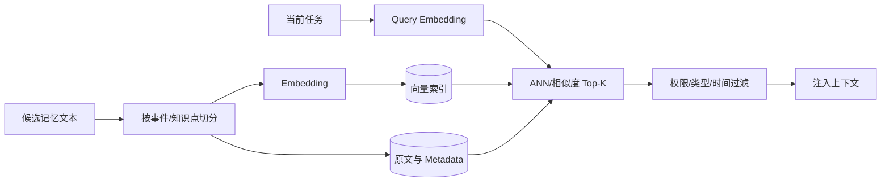

# 9. Agent 长短期记忆、存储粒度与使用方式

> 原文：[Agent 的长短期记忆系统怎么做的？记忆是怎么存的？粒度是多少？怎么用的？](https://xiaolinnote.com/ai/agent/9_memory_storage.html)
>
> 一句话结论：短期记忆维持当前任务状态，长期记忆支持跨任务积累；长期记忆的效果不仅取决于向量库，还取决于切分粒度、元数据、排序和写入策略。

## 1. 两层记忆的职责


| 维度 | 短期记忆 | 长期记忆 |
|---|---|---|
| 目标 | 保持当前任务连续 | 跨任务复用知识和偏好 |
| 载体 | `messages`、结构化 State | 向量库、关系库、KV、图 |
| 生命周期 | 一次任务或会话 | 持久化 |
| 使用时机 | 每个决策步骤 | 任务前主动取、执行中按需取、任务后写 |
| 主要风险 | Token 超限、旧状态污染 | 错误固化、过时、越权召回 |

短期记忆最好不只是消息列表，还应有结构化工作区：

```python
working_state = {
    "goal": "完成接口联调",
    "completed_steps": [],
    "confirmed_facts": {},
    "open_questions": [],
    "errors": [],
}
```

结构化状态可以更新旧值，避免模型每轮从冗长对话中重新推断“当前做到哪里”。

## 2. 长期记忆怎么存与取

存储链路：



对归一化向量，余弦相似度为：

$$
\operatorname{cos}(q,m)=\frac{q\cdot m}{\lVert q\rVert\lVert m\rVert}
$$

实际排序不应只看相似度，可以组合语义、新鲜度和重要度：

$$
score=\alpha s_{semantic}+\beta s_{freshness}+\gamma s_{importance}
$$

## 3. 记忆粒度为什么关键

| 粒度 | 优点 | 问题 |
|---|---|---|
| 每句话一条 | 命中定位细 | 上下文碎片化、重复多 |
| 整场对话一条 | 事件完整 | 无关内容多、命中后 Token 大 |
| 一次完整交互 | 目标和结果成对 | 需抽取稳定边界 |
| 一个独立知识点/事件 | 语义内聚，便于复用 | 需要切分和质量规则 |

推荐把“用户请求 + 最终结果 + 关键约束”作为情节记忆，把“可独立复用的事实或规律”作为语义记忆。不要保存每个临时工具结果。

## 4. 当前项目代码映射

### 4.1 Day22：短期消息记忆

[run_day22_function_calling_basics.py](../run_day22_function_calling_basics.py) 在每次模型调用之间维护同一份 `messages`，并追加 assistant tool call 与 tool result。这是完整工具闭环所需的任务内短期记忆。

```python
for round_idx in range(1, args.max_tool_rounds + 1):
    message, usage = chat_once_with_tools(messages=messages, ...)
    messages.append(assistant_entry)
    messages.append({"role": "tool", "content": json.dumps(result_payload)})
```

当前限制：会话结束即消失、没有 token 预算、没有摘要、没有结构化状态恢复。

### 4.2 Day9：向量存储和检索底座

[run_day9_local_vector_search.py](../run_day9_local_vector_search.py) 实现了：

1. `chunk_text()` 按 `chunk_size/overlap` 切分；
2. `embedding_vector()` 生成向量；
3. `l2_normalize()` 后使用 `IndexFlatIP`；
4. FAISS 索引和 JSON 元数据落盘；
5. Query 向量化后返回 Top-K。

这准确对应长期记忆的“怎么存、怎么取、粒度多大”三个基础问题。但语料是静态知识，不是 Agent 任务结束后自动沉淀的个人记忆。

### 4.3 Day12：粒度实验可直接复用

[run_day12_chunking_strategy_tuning.py](../run_day12_chunking_strategy_tuning.py) 比较不同 chunk 参数。它提醒我们：记忆粒度不是固定常数，应通过召回质量和上下文成本评测。

### 4.4 SQLite 长期记忆参考实现

[agent_capabilities_reference.py](examples/agent_capabilities_reference.py) 的 `SQLiteMemoryStore` 把数据模型变成了可运行代码：实体事实按 key 更新，情节/语义/程序记忆追加保存；所有读取、更新和遗忘操作都要求租户与用户作用域；检索综合相关度、重要度和新鲜度，并过滤过期或已遗忘记录。

这个实现负责 Memory Service 的存储与生命周期边界，但不会自动决定“本轮内容是否值得记忆”。写入策略仍应由任务结束后的过滤/抽取阶段负责。离线测试见 [test_agent_capabilities_reference.py](../tests/test_agent_capabilities_reference.py)。

## 5. 一个可落地的数据模型

```json
{
  "memory_id": "mem_123",
  "tenant_id": "tenant_a",
  "user_id": "user_7",
  "memory_type": "episodic",
  "content": "用户完成 Day22 工具调用实验，偏好中文解释",
  "source": "task:day22",
  "importance": 0.8,
  "created_at": "2026-07-24T10:00:00Z",
  "valid_until": null,
  "status": "active"
}
```

原文、向量和 metadata 应一起管理；更新或删除时三者必须保持一致。

## 6. 工程检查清单

- 存储和查询使用同一个 Embedding 模型与归一化方式。
- 先按租户、用户、权限、类型过滤，再做语义排序。
- Top-K 不是越大越好，要控制注入 token 和噪声。
- 记忆带来源、时间、状态和置信度。
- 对旧偏好做衰减或显式失效，不直接物理覆盖历史证据。
- 建立 Recall@K、Precision@K、任务成功率和错误记忆率评测。

## 7. 面试问答

### Q1：短期记忆和长期记忆分别什么时候使用？

**答：** 短期记忆贯穿任务执行，每轮携带当前状态；长期记忆通常在任务前检索背景、执行中按需检索、任务后筛选写入。

### Q2：为什么不能每句话都存一条？

**答：** 会造成语义碎片化和重复，检索可能只命中完整偏好的一部分。更合适的是一次完整交互或一个独立事件/知识点。

### Q3：FAISS 索引为什么还要保存原文和元数据？

**答：** 向量只负责定位相似项，LLM 最终需要原文；metadata 用于租户、时间、类型、权限和状态过滤。

### Q4：当前 Day9 是否等于 Agent 长期记忆？

**答：** 不等于。它是静态语料的向量检索底座，尚无任务后的记忆筛选写入、用户隔离、更新、冲突和过期机制。

### Q5：怎么处理旧记忆？

**答：** 结合新鲜度衰减、有效期和显式状态；冲突时保留来源与时间线，把旧记录标为失效，再让最新可信事实参与召回。

## 8. 常见误区与结论

- 误区：数据库持久化就等于长期记忆。
- 误区：切得越细，召回越准。
- 误区：向量 Top-K 可以跳过权限过滤。
- 误区：审计日志能自动被 Agent 使用。

当前项目可将 Day22 的 `messages` 与 Day9 的 FAISS 视为两层原型，但还需要 Memory Service 把任务前检索和任务后写入连接起来。