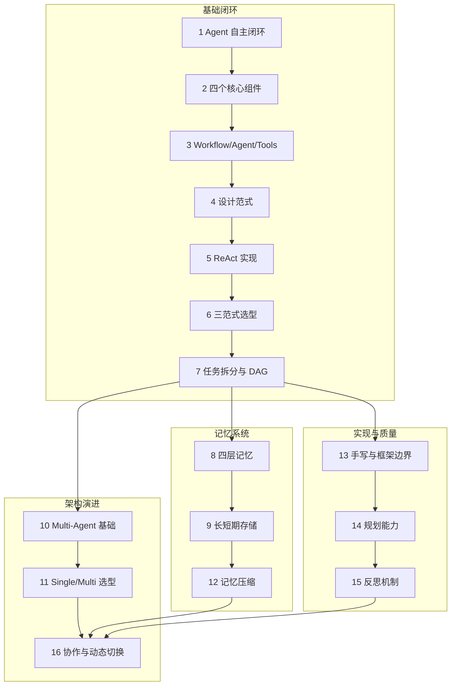

# Xiaolinnote Agent 系列分析索引

本目录专门保存 [xiaolinnote Agent 面试题系列](https://xiaolinnote.com/ai/agent/) 的理论结合项目代码分析。

## 命名规则

```text
<网页编号>_<网页标题关键词>_<文档功能>.md
```

例如：

```text
5_react_reasoning_action_observation_loop.md
```

- `5_react`：对应原网页 `5_react.html`。
- `reasoning_action_observation_loop`：说明文档聚焦 ReAct 工具循环实现。

## 文档目录

| 编号 | 原网页主题 | 分析文档 | 核心项目代码 |
|---:|---|---|---|
| 1 | 什么是 Agent | [自主执行闭环](1_whatisagent_autonomous_execution_loop.md) | Day22 工具循环、Day25 Planner |
| 2 | Agent 核心组件 | [LLM、Tools、Memory、Planning](2_components_agent_architecture.md) | Tool schema、messages、Plan |
| 3 | Workflow、Agent、Tools | [控制权边界](3_workflow_agent_tools_control_boundaries.md) | `TOOL_IMPLS`、固定主流程 |
| 4 | Agent 设计范式 | [Agentic Workflow 设计](4_patterns_agentic_workflow_design.md) | Day22 与 Day25-Day28 对照 |
| 5 | ReAct 推理模式 | [Reasoning-Action-Observation 循环](5_react_reasoning_action_observation_loop.md) | Day22 Function Calling loop |
| 6 | 三种范式选型 | [ReAct、Plan-and-Execute、Reflection](6_three_patterns_architecture_selection.md) | 范式成本和演进顺序 |
| 7 | 复杂任务拆分 | [Agent 任务拆分](7_tasksplit_agent_task_decomposition.md) | Day25-Day28 Planner/Executor |
| 8 | Agent 记忆机制 | [四层记忆与 Memory Service](8_memory_agent_memory_module_design.md) | Day22 messages、Day9 FAISS |
| 9 | 长短期记忆存储 | [存储、粒度与使用时机](9_memory_storage_short_long_term_memory.md) | Day9 向量检索、Day12 切分实验 |
| 10 | 什么是 Multi-Agent | [分工、隔离与协作模式](10_multiagent_multi_agent_collaboration_basics.md) | Day25 编排边界 |
| 11 | Single/Multi-Agent 方案 | [架构选型与渐进演进](11_single_multi_agent_architecture_selection.md) | Day22、Day25-Day28 |
| 12 | Agent 记忆压缩 | [四种压缩方法](12_memcompress_agent_memory_compression.md) | messages、`trim_text()` 边界 |
| 13 | 为什么手写 Agent | [手写核心与框架周边](13_handcode_handwritten_agent_engineering.md) | Day22/Day25 手写、LangChain 折中 |
| 14 | LLM 规划能力 | [CoT/ToT/GoT 与 Plan-and-Execute](14_planning_llm_planning_and_execution.md) | Pydantic Plan、Retry/Replan 边界 |
| 15 | Agent 反思机制 | [生成、评估与改进](15_reflection_agent_self_reflection_loop.md) | Retry/Fallback 与 Reflection 边界 |
| 16 | 多 Agent 协作切换 | [共享状态、路由与 Handoff](16_collab_multi_agent_collaboration_routing.md) | trace 审计与建议演进 |

## 推荐阅读顺序



## 项目代码入口

- [Day9 本地向量检索](../run_day9_local_vector_search.py)
- [Day12 切分策略调优](../run_day12_chunking_strategy_tuning.py)
- [Day22 Function Calling](../run_day22_function_calling_basics.py)
- [Day23 数据库查询助手](../run_day23_database_query_assistant.py)
- [Day24 HTTP 联调助手](../run_day24_http_integration_assistant.py)
- [Day25 手写任务编排](../run_day25_task_orchestration.py)
- [Day26-Day28 Agent Demo](../run_day26_day28_agent_demo.py)
- [Day25-Day28 LangChain Demo](../run_day25_day28_langchain_demo.py)
- [高级 Agent 能力参考实现](examples/agent_capabilities_reference.py)
- [高级能力离线测试](../tests/test_agent_capabilities_reference.py)
- [Day1-Day42 总结工具书](../Day1_42_学习总结与工具手册.md)

其中 `run_day*` 文件保留学习过程中的渐进实现和真实能力边界；高级参考实现集中补齐 SQLite 长期记忆、上下文压缩、DAG 调度、结果绑定、步骤验收、Replan、共享状态、混合路由、Handoff 防循环和 Reflection。它采用依赖注入，可在不调用 LLM 和外部服务的情况下测试控制逻辑。

## 阅读时的统一判断框架

每个概念都从以下五个问题落到代码：

1. 谁决定下一步？
2. 谁真正执行动作？
3. 执行结果保存在哪里，是否进入下一次决策？
4. 失败后是 Retry、Replan 还是 Reflection？
5. 系统通过什么条件停止？

系列文档会明确区分“文章理论”“当前项目已实现能力”和“建议演进”，避免把工具调用、重试或日志误称为完整 Agent 能力。
