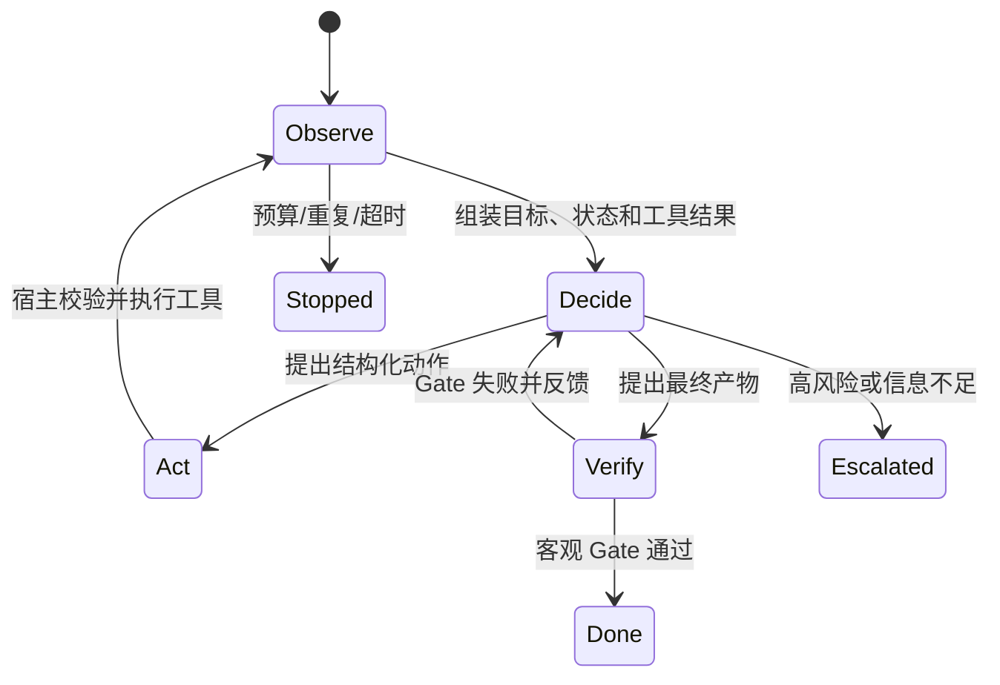
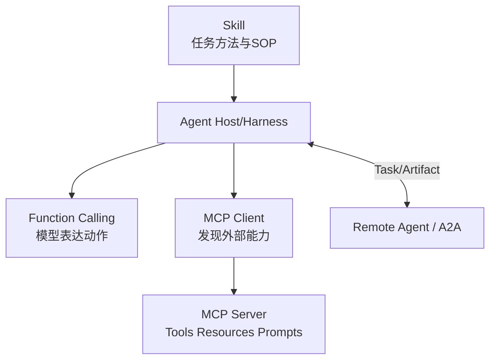

# 1. AI Agent：决策循环、Workflow、工具与协议分层

- 原文：[AI Agent 是什么？Agent 面试题万字图解](https://xiaolinnote.com/agent/concept/agent.html)
- 一句话结论：Agent 不是“更会聊天的 LLM”，而是由模型参与决策、由宿主控制工具和状态、围绕目标反复执行并接受环境反馈的系统；自主程度是连续谱，生产系统通常将确定性 Workflow 与局部 Agent 结合。

## 1. LLM 与 Agent 的责任边界

网页用“LLM 有嘴没手，Agent 能做事”建立直觉是有效的。工程上更准确的定义是：

$$
Agent = Model\ Policy + State + Tools + Control\ Loop + Verifier + Safety\ Policy
$$

模型产生候选决策；宿主程序负责权限、参数校验、执行、状态持久化、预算、停止和审计。模型本身通常不会直接访问文件、网络或凭证。

网页说 LLM “没有记忆、不会规划、不会用工具”也需要限定：基础模型调用通常无持久状态，但聊天产品可保存历史；LLM 可以生成计划，但缺少执行环境和确定性状态机；部分模型 API 原生支持 Tool Calling。Agent 的价值不是让模型突然拥有这些能力，而是把它们组织为受控系统。

## 2. Agent 与 Workflow 不是二选一

| 维度 | 确定性 Workflow | Agentic 控制 |
| --- | --- | --- |
| 下一步来源 | 代码/状态机预定义 | 模型根据观察动态选择 |
| 可预测性 | 高 | 相对低 |
| 未知情况适应 | 需提前编码分支 | 可探索新路径 |
| 验证与权限 | 仍必须由代码执行 | 更必须由代码执行 |
| 典型场景 | 支付、审批、固定 ETL | 调研、排障、开放式代码任务 |

生产常见做法是外层 Workflow 管风险、预算与阶段，某个开放节点内部允许 Agent 探索。例如退款流程的身份验证、金额上限和真正打款固定在代码中，Agent 只负责收集证据、查政策与形成建议。

网页中的“Workflow Token 约为 Agent 四分之一”“Plan-and-Execute 约为 ReAct 五分之一”不是通用定律。成本取决于模型、上下文、工具结果、重试、计划长度和缓存，必须用本项目 Trace 实测。

## 3. 四种工作模式

### ReAct

观察后选择一个动作，再读取结果。适合路径未知、环境反馈强的任务；风险是重复动作、上下文膨胀和成本失控。生产日志可以记录动作摘要与证据，不必暴露完整私有 CoT。

### Plan-and-Execute

先生成计划，再由执行器逐步运行。适合依赖明确的长任务；环境变化时要设置 Replan Checkpoint，而不是盲目执行过期计划。

### Reflection / Evaluator-Optimizer

生成器产出，独立评价器按 Rubric 或真实测试检查，再有限修复。同一个模型的自评容易共享盲点；真正可靠的 Gate 应尽量连接单测、编译器、数据库约束或人工审批。

### Multi-Agent

按角色或可并行子任务拆分，增加专业上下文隔离，也增加通信、路由、状态一致性和成本。不是任务复杂就必然需要多个 Agent。

## 4. Function Calling、MCP、Skill 与 A2A

- Function Calling：模型 API 表达 `name + arguments`，宿主执行。
- MCP：Host/Client 与 Server 的能力发现和调用协议；常被转换为模型 Tool Schema，但协议本身不依赖某厂商 Function Calling。
- Skill：按需加载的工作流知识和资源，不自行获得权限。
- A2A：Agent Card、Task、Message、Artifact 等跨 Agent 协作抽象。

网页把 Function Calling 称为 Agent 的基石是主流实现直觉，不是协议必要条件。规则引擎、人类 UI 或其他结构化控制器也能发起工具调用。

## 5. 当前项目代码映射

[run_day22_function_calling_basics.py](../run_day22_function_calling_basics.py) 展示工具 Schema、白名单、模型 `tool_calls`、宿主执行和结果回灌；它是单次/多轮工具原子机制。

[run_day25_task_orchestration.py](../run_day25_task_orchestration.py) 由 `build_plan` 生成 JSON 计划，`execute_step` 按工具白名单执行，`summarize_results` 汇总，外层代码用 `max_steps` 控制，属于 Agentic Workflow。

[run_day26_day28_agent_demo.py](../run_day26_day28_agent_demo.py) 才是仓库的 LangChain Agent 演示入口；它不代表无人值守生产 Agent。

[agent_capabilities_reference.py](../xiaolinnote_agent_analysis/examples/agent_capabilities_reference.py) 的 `DAGOrchestrator`、`HybridRouter`、`HandoffGuard` 和 `ReflectionEngine` 分别补足依赖编排、路由白名单、交接预算和有限反思。

本专题 [agent_engineering_reference.py](examples/agent_engineering_reference.py) 的 `LoopHarness` 又加入 Token/费用/轮数/失败预算、重复动作检测、危险工具审批、幂等 Call ID、独立 Gate 和原子 Checkpoint。它直接体现“模型建议、Harness 决定能否执行与完成”。

## 6. 安全与完成条件

Agent 说“完成了”只是声明。完成应由外部证据决定，例如测试退出码为 0、Schema 合法、数据库事务提交、部署健康检查通过。副作用工具还要有最小权限、参数验证、幂等键、审批、超时、网络出口限制和审计。

循环必须有多重止损：最大轮数、最大失败、Token/费用、墙钟时间、相同动作重复、无进展检测和人工升级。只在 Prompt 写“不要死循环”不是控制。

## 7. 模拟面试

**Q1：Agent 和普通 LLM 调用最本质的差异是什么？**  
A：Agent 将模型放入状态化的观察、决策、行动、验证循环，并连接受控工具；LLM 只是其中的概率决策组件。

**Q2：Agent 和 Workflow 如何选？**  
A：固定、高风险、可枚举路径优先 Workflow；开放、路径未知任务才在受控节点引入 Agent，常采用混合架构。

**Q3：Function Calling 会直接执行函数吗？**  
A：不会，模型只输出调用意图，宿主负责校验、授权、执行和回灌。

**Q4：ReAct 最大的工程风险是什么？**  
A：重复、错误累积、上下文和成本膨胀，因此需要预算、重复检测、Gate 和 Checkpoint。

**Q5：多 Agent 为什么可能比单 Agent 更差？**  
A：角色通信丢失信息，状态冲突、路由错误、重复上下文和调用成本会抵消专业化收益。

**Q6：模型自评通过是否算验收？**  
A：不算可靠证明。优先使用真实测试、规则、环境反馈或独立人工/评价器。

**Q7：当前仓库实现到了哪一层？**  
A：有工具调用、计划式编排、LangChain Agent 演示和离线控制面参考实现；没有无人值守生产 Loop。

## 8. 复习清单

- 能画 Observe-Decide-Act-Verify 状态机。
- 能解释 Workflow/Agent 连续谱和混合架构。
- 能区分 Function Calling、MCP、Skill、A2A。
- 能列出完成证明和六类止损机制。