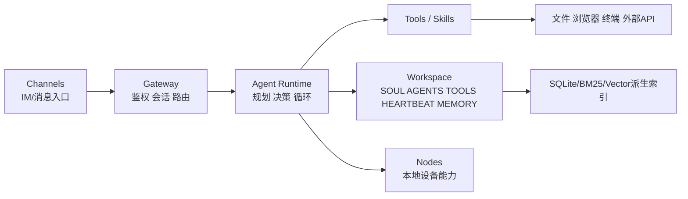
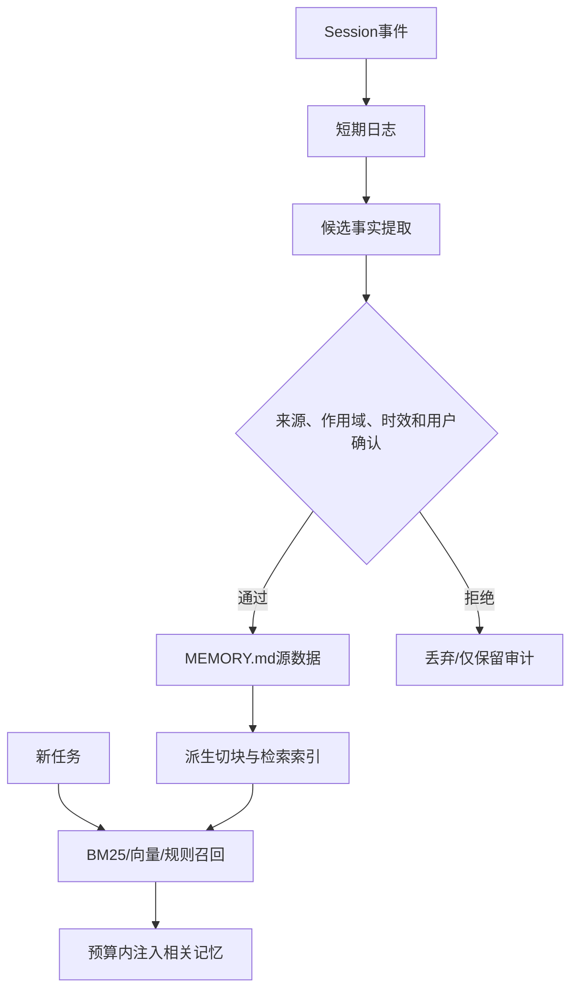

# 2. OpenClaw：本地常驻 Agent、文件工作区、记忆与安全边界

- 原文：[OpenClaw 是什么？OpenClaw 面试题万字图解](https://xiaolinnote.com/agent/concept/openclaw.html)
- 一句话结论：文章将 OpenClaw 描述为运行在个人设备、连接消息通道和本地节点、以 Markdown 工作区与检索索引保存规则/记忆的常驻 Agent；这类架构的核心价值是执行闭环与透明状态，核心风险则是高权限、供应链、Prompt Injection、隐私和无人值守成本。

## 1. 先说明证据边界

当前仓库没有 OpenClaw 依赖、配置、导入、进程或运行日志，不能声称“实际跑过 OpenClaw”。本文分析的是网页描述的架构模式，并用独立教学代码验证其中的文件工作区和 Loop 控制逻辑。

OpenClaw 是快速演进的具体开源产品。网页提到的组件名、文件结构、心跳频率、平台接入、SQLite 扩展和默认行为都具有版本时效性，真实部署应核对对应版本的官方仓库、文档和 Release Notes。

## 2. 网页描述的架构



- Gateway：统一入口、身份、会话和路由。
- Agent Runtime：调用模型、选择工具、跟踪任务。
- Tools/Skills：原子能力与任务方法。
- Channels：适配消息平台输入输出。
- Nodes：手机、电脑等本地感知和操作端点。
- Workspace/Memory：将身份、规则、任务和记忆外化到文件。

网页把“传统 Agent”概括成云端、被动、无本地权限，而 OpenClaw 本地、主动、通用。这不适合作为类型定义：传统 Agent 也可本地常驻、有持久记忆；OpenClaw 也可部署在服务器并受权限限制。真正差异应比较具体产品的运行位置、连接器、权限模型、持久化和调度能力。

## 3. 文件即配置与状态

文章给出典型目录：

```text
workspace/
├── SOUL.md       # 语气、价值与交互边界
├── AGENTS.md     # 操作规范与项目约束
├── TOOLS.md      # 可用能力说明
├── HEARTBEAT.md  # 周期任务与检查条件
├── MEMORY.md     # 提炼后的长期事实/偏好
└── sessions/     # 原始或压缩的会话记录
```

优点是可读、可编辑、可 Diff、可版本化和可恢复。缺点是 Markdown 缺少强 Schema、并发写冲突、容易被恶意内容注入，也可能把密钥和隐私带进 Git。规则文件应作为受审配置，状态文件应使用锁/原子写，敏感信息不能写入普通明文记忆。

网页说“打包文件夹即可分享完整 Agent”过于乐观：模型版本、系统权限、凭证、安装工具、操作系统、索引和运行时状态也属于环境契约，不能只复制 Markdown 就保证复现。

## 4. 记忆流应该如何设计



“永久记忆”不是保证：文件可能被删、磁盘损坏、事实过期或总结错误。长期记忆至少要记录租户/用户、来源、时间、置信、有效期、可删除性和版本。用户编辑 `MEMORY.md` 后，派生索引应增量更新或重建，否则源文件和 SQLite/向量索引会不一致。

网页描述“快压缩时偷偷提炼并写入”也有隐私和正确性风险。更稳做法是：只捕获白名单类型、显示/审计候选记忆、允许用户纠正和遗忘，并防止把外部网页的恶意指令写成长期规则。

## 5. 心跳和 Token 成本

若每次心跳输入固定上下文 $T_f$、动态状态 $T_d$，一天运行 $h$ 次，即使没有动作，最低输入量约为：

$$
Tokens_{idle}\approx h(T_f+T_d)
$$

固定“每 30 分钟运行”不是产品本质，应改成事件触发优先、定时作为兜底，并在调用模型前用廉价规则判断是否有工作。还可使用 Prompt Cache、分层 Skill、增量状态、便宜模型做分诊、指数退避和每日预算。

所谓“越用越聪明”通常是外部规则、记忆和测试在积累，并非基础模型参数在线自我训练。错误经验也会复利，所以写入规则前必须复现、验证和 Review。

## 6. 安全威胁模型

- **本地高权限**：不要默认“系统最高权限”；使用专用低权限账户、容器/沙箱和目录白名单。
- **Prompt Injection**：网页、邮件和文档只能作为不可信数据，不能提升为 System Rule。
- **Skill/插件供应链**：安装前固定版本、Review 源码、扫描依赖和签名，不允许一句话静默安装。
- **凭证外泄**：密钥由 Secret Store 注入，日志脱敏，工具只获得最小作用域短期令牌。
- **副作用**：发消息、删除、支付、部署必须审批、幂等、审计和可回滚。
- **远程通道**：强认证、设备绑定、重放防护、速率限制和紧急停止。
- **无人值守失控**：轮数、费用、失败、重复、墙钟和网络出口均要硬限制。

## 7. 补充实现与运行示例

[agent_engineering_reference.py](examples/agent_engineering_reference.py) 的 `MarkdownAgentWorkspace` 是 OpenClaw **风格**的教学工作区：

```python
workspace = MarkdownAgentWorkspace("demo-workspace")
workspace.bootstrap({"AGENTS.md": "# Rules\nRun tests before completion."})
workspace.remember("User prefers concise Python examples")
workspace.record_session("2026-07-31", "Investigated CI failure")
context = workspace.build_context("Python CI", recent_session_limit=1)
print(context.render())
```

它实现 Bootstrap、安全路径、会话落盘、长期记忆去重、词法相关记忆和最近会话加载，并限制上下文字符数。单元测试验证 `../` 逃逸被拒绝。

它没有 Gateway、Channel、Node、模型调用、SQLite 向量扩展、文件锁、加密或真正 Heartbeat，因此不兼容也不替代 OpenClaw。

同模块 `LoopHarness` 负责预算、重复检测、危险工具审批与 Checkpoint，可作为本地常驻 Agent 的控制面示例。

## 8. 模拟面试

**Q1：OpenClaw 类系统与普通聊天产品的核心差别？**  
A：本地/常驻执行环境、外部通道、工具权限、持久工作区和主动调度，而不是单次文本回答。

**Q2：Markdown 记忆为何还需要 SQLite/向量索引？**  
A：Markdown 是可读源数据；索引用于规模化检索。两者必须有同步和重建机制。

**Q3：本地运行是否天然更安全？**  
A：不天然。数据少出境，但本地文件、凭证和终端权限的爆炸半径更大，需要沙箱和最小权限。

**Q4：什么叫“越用越聪明”？**  
A：通常是规则、记忆、失败案例和测试在外部累积，不是基础模型自动更新权重。

**Q5：为什么心跳会烧 Token，怎样优化？**  
A：每次唤醒都重组上下文并调用模型；可事件触发、规则预筛、缓存、分层加载和预算退避。

**Q6：Skill 最大的供应链风险是什么？**  
A：恶意指令/脚本读取密钥、执行命令或外传数据；必须 Review、固定版本和限制工具/网络。

**Q7：当前仓库实际运行过 OpenClaw 吗？**  
A：没有；只新增了产品无关的 Markdown 工作区与 Harness 教学代码。

## 9. 复习清单

- 能画 Gateway、Agent、Channel、Node、Workspace。
- 能区分源记忆和派生检索索引。
- 不把本地、永久、最高权限和越用越聪明当无条件事实。
- 能列出七类安全控制和成本公式。