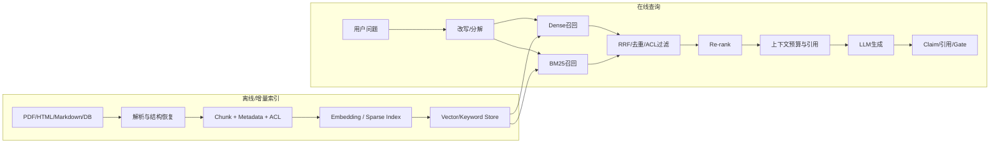

# 3. RAG：索引、混合检索、重排、生成与分层评测

- 原文：[RAG 是什么？RAG 检索增强面试题万字图解](https://xiaolinnote.com/agent/rag/rag.html)
- 一句话结论：RAG 在生成前从可更新、可授权的数据源检索证据，将参数化记忆变成可追溯的开卷回答；质量上限由数据解析、切块、召回、重排、上下文组装、生成和验证共同决定。

## 1. 离线索引和在线查询

原文的“加载 -> 切块 -> Embedding -> 向量库”是 Naive RAG 主线。生产还必须保留文档 ID、版本、来源位置、时间、租户 ACL、删除/更新语义和解析质量。若只保存文本向量而丢掉权限和出处，后面无法安全引用或删除。

## 2. RAG 与微调

- RAG：外部事实可更新、可引用、按请求读取，适合制度、库存、合同、新闻和私有知识。
- 微调：改变参数中的行为分布，适合稳定风格、格式、任务策略和小模型能力迁移。
- 组合：微调模型学习检索/引用行为，RAG 提供当前事实。

“大多数场景优先 RAG”是良好起点，不是定律。数据规模很小、请求极高且事实稳定、端侧离线或检索延迟不可接受时，缓存、专用模型或结构化查询可能更合适。也不要用微调记频繁变化事实。

## 3. Chunking 不是只调一个长度

| 策略 | 优点 | 风险 |
| --- | --- | --- |
| 固定 Token + Overlap | 简单、稳定、易做基线 | 可能切断结构，重复索引 |
| 递归分隔 | 尽量保留段落/句子 | 分隔符不等于语义边界 |
| 文档结构 | 标题、表格、类/函数可追溯 | 依赖解析器质量 |
| 语义切分 | 在主题变化处分段 | Embedding 成本和阈值敏感 |
| Parent-Child | 小块检索、父块返回 | 父块过大或证据稀释 |

原文建议 256-512 Token、10%-20% Overlap 可作实验起点，不能称最佳配置。应按文档类型和问题分布网格测试 Recall、Faithfulness、上下文 Token 与延迟。

## 4. Embedding 与相似度

归一化向量的余弦相似度：

$$
\cos(q,d)=\frac{q\cdot d}{\|q\|\|d\|}
$$

Embedding 模型必须针对检索训练；通用 BERT 的 `[CLS]` 不一定是好句向量，通常还需 Pooling 和对比学习。模型选型不能只看 MTEB 总榜，要测目标语言、领域、长文本、查询/文档非对称指令和业务召回。

向量数据库 HNSW、IVF、PQ 用不同方式换取延迟、内存和召回。百万向量暴力搜索在 FAISS/GPU 或小维度下未必“完全不可接受”；是否引入分布式向量库要以规模、过滤、更新、可用性、现有数据库和运维能力压测，而不是固定“小用 Chroma、大用 Milvus”。

## 5. 混合召回与 RRF

Dense 擅长语义改写，BM25 擅长产品编号、人名、错误码等精确词。RRF 不比较不可校准的原始分数，只融合排名：

$$
RRF(d)=\sum_{r\in routes}\frac{1}{k+rank_r(d)}
$$

$k$ 平滑头部排名。融合后必须按稳定文档/Chunk ID 去重，并在召回阶段执行 ACL，而不是生成后才过滤。

原文给出的“混合检索提升 10%-30%”和重排提升百分比都是特定数据与模型结果，不能直接写入容量规划。某些数据集 Sparse 已足够，加入弱 Dense Route 也可能降噪比。

## 6. Re-rank

Bi-Encoder 将 Query/Document 分别编码，可离线预计算并 ANN 召回；Cross-Encoder 联合编码每个 Query-Document Pair，更能判断细粒度相关，但只能处理小候选集。典型链路是高 Recall 召回 $K_1$，重排到 $K_2$，再按上下文预算选证据。

Re-ranker 不必都是传统 BERT Cross-Encoder，也可能是 ColBERT Late Interaction、LLM Rerank、规则或多信号 Learning-to-Rank。候选数和触发条件应基于 P95 延迟与 Recall 曲线选择。

## 7. RAG 评测要拆层

- 检索：Recall@K、Precision@K、MRR、NDCG、过滤正确性。
- 上下文：相关性、覆盖、冗余、来源和权限。
- 生成：Answer Correctness、Faithfulness、Citation Entailment、拒答。
- 系统：TTFT、总延迟、Token、费用、失败率和用户任务完成。

RAGAS/LLM Judge 可规模化评估，但会有 Judge 偏差；高风险样本需人工校准。引用存在不等于引用支持 Claim。

## 8. 当前项目的完整映射

[run_day14_rag_v1_demo.py](../run_day14_rag_v1_demo.py) 是基础 RAG 可运行链路；[run_day21_rag_v2_release.py](../run_day21_rag_v2_release.py) 将查询改写、多路召回、重排、引用和发布检查组合为 V2。

[run_day16_offline_eval.py](../run_day16_offline_eval.py) 分别统计检索命中、引用正确、引用格式、信息不足拒答和 Token，避免只看最终文本。[run_day11_kb_qa_with_citations.py](../run_day11_kb_qa_with_citations.py) 还验证引用必须来自召回 Chunk 的连续原文。

[rag_capabilities_reference.py](../xiaolinnote_rag_analysis/examples/rag_capabilities_reference.py) 补充了纯标准库 BM25、RRF、语义切分、Parent-Child/Sentence Window、CRAG、Agentic RAG 和图遍历，并有 10 项单测。

这些实现仍未部署生产向量数据库、真实 Cross-Encoder、RAGAS 或多租户 ACL 服务。

## 9. 幻觉与安全

RAG 只能降低部分事实幻觉，不保证正确：召回可能漏、文档可能错、模型可能忽略或曲解证据。检索文档也可能含 Prompt Injection，必须标记为不可信数据。高风险链路需 Claim-Evidence 验证、权威来源、时效版本、拒答和人工审核。

## 10. 模拟面试

**Q1：RAG 的质量上限主要由谁决定？**  
A：解析/数据、召回覆盖和生成模型共同决定；缺失证据时生成器无法凭 Prompt 补回。

**Q2：为什么 Dense + BM25 常组合？**  
A：前者处理语义改写，后者处理精确术语/编号，错误模式互补。

**Q3：RRF 为什么不用原始分数？**  
A：不同检索器的分数尺度难直接比较，RRF 只按名次融合，更稳健。

**Q4：为什么不对全库使用 Cross-Encoder？**  
A：每个 Query-Document Pair 都要联合推理，规模成本过高，所以先高召回再精排。

**Q5：RAG 和微调谁更准确？**  
A：没有无条件排序；可更新事实和引用通常 RAG 更合适，稳定行为/风格微调更合适，常组合。

**Q6：RAG 能消除幻觉吗？**  
A：不能，检索、资料和生成均可能失败；目标是 Grounding、可追溯、可拒答和可测量。

**Q7：当前项目最接近生产门禁的是哪部分？**  
A：Day16 的分层离线评测与 Day11 的引用校验，但仍缺 Claim-level Entailment 和生产 ACL。

## 11. 复习清单

- 能画离线索引与在线查询两条链。
- 能解释 Chunk、混合召回、RRF 和 Re-rank。
- 能拆分检索、上下文、生成与系统指标。
- 不把固定参数、数据库品牌和提升百分比当普遍结论。