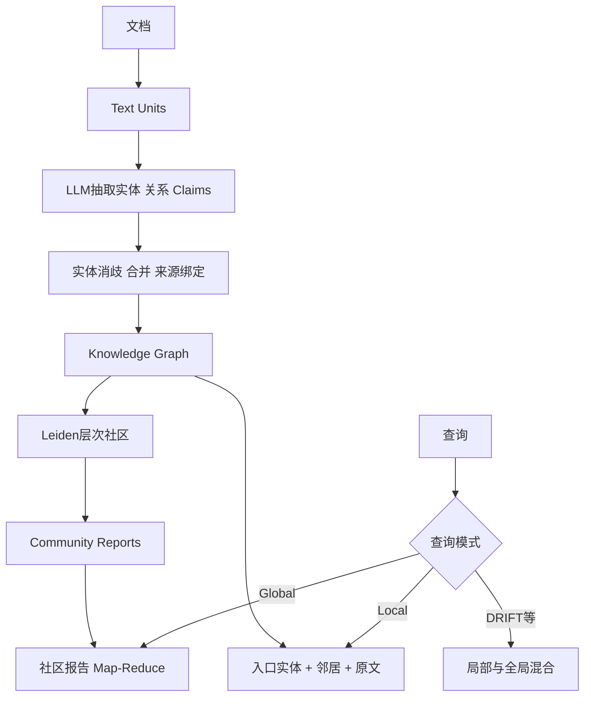
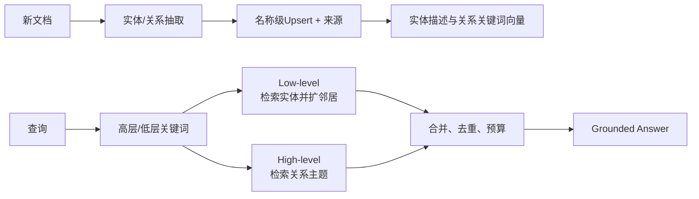

# 4. GraphRAG 与 LightRAG：图索引、双层检索、增量和选型

- 原文：[GraphRAG 和 LightRAG 详解：原理、对比与选型](https://xiaolinnote.com/agent/rag/graphrag-lightrag.html)
- 一句话结论：Microsoft GraphRAG 通过实体关系、层次社区和社区报告预计算全局视角；LightRAG 保留实体关系图，用实体/关系双层检索降低社区预计算与增量维护成本。两者都依赖实体抽取、消歧、来源和评测，不是传统 RAG 的无条件升级。

## 1. 传统 RAG 真的不能多跳吗

原文用“传统 RAG 干不了多跳/全局问题”强调图的动机，但过于绝对。Naive Top-K 单次检索确实容易漏跨文档关系；Query Decomposition、Iterative Retrieval、Multi-Query、Agentic RAG、SQL Join 或结构化 Metadata 也能多跳。图的优势是把实体关系显式化，使遍历、交集和审计更直接，而不是唯一可行方案。

同样，GraphRAG 也不会自动修复切块语义：实体/关系抽取仍在 Text Unit 上运行，跨块共指、否定、时态和因果都可能抽错。错误图会比缺图更具误导性。

## 2. Microsoft GraphRAG 主线



### 索引

1. 文档切成 Text Units 并保留来源。
2. LLM 结构化抽实体、关系和可选 Claim。
3. 合并描述、实体解析和来源证据。
4. 图上做层次社区检测。
5. 为社区生成报告，形成从局部到全局的预计算摘要。

### 查询

Local Search 围绕具体实体扩展关系、文本和社区；Global Search 对某层社区报告做查询聚焦 Map-Reduce。社区报告适合主题归纳，但会把抽取和总结错误固化为二级知识，最终回答仍应回链原文证据。

## 3. LightRAG 主线



- Low-level 关键词命中具体实体，再扩展邻居和来源。
- High-level 关键词命中关系描述/主题，获取更抽象关联。
- Hybrid 合并两路，不预生成层次社区报告。
- 新文档主要做实体/关系 Upsert 与向量更新，增量链更短。

“名称相同就合并”很轻量，也会把同名不同人错误合并；“不同名都靠检索一起召回”则可能漏边。生产仍需 Alias、实体类型、时间、租户、唯一 ID 和人工校正。

## 4. 增量更新不是零成本

| 变化 | GraphRAG 可能影响 | LightRAG 可能影响 |
| --- | --- | --- |
| 新文档 | 抽取、实体合并、社区、报告、向量 | 抽取、Upsert、关系/实体向量 |
| 删除 | 来源计数、孤立节点、社区报告 | 来源回收、节点/边是否仍被支持 |
| 事实更新 | Claim/时间冲突、报告失效 | 新旧关系并存、冲突解析 |
| Alias 修正 | 图结构和社区变化 | 节点/边合并与向量重建 |

LightRAG 避免社区级联，但抽取、Embedding、实体冲突、删除和索引一致性仍有成本，“几乎零额外成本”只表示相对更轻。动态业务必须做 Temporal/Versioned Edge、有效期、Source Count 和 Tombstone。

GraphRAG 可采用增量局部重算 + 周期全量校准、时间分区或 Lazy Graph 思路。局部社区更新会积累全局漂移，需要指标触发重建。

## 5. 成本和效果数字如何看

原文列出的 99% Token 降低、固定美元成本、秒级/分钟级延迟和精度提升都来自特定论文、模型、数据量、Prompt 与价格。它们不能跨项目保证，尤其 API 价格和框架版本持续变化。

应在同一语料与业务问题上记录：索引 LLM/Embedding Token、实体/边精度、Alias 错误、增量延迟、Local/Global 查询 P95、上下文量、Faithfulness 和人工修正成本。若问题主要是单跳 FAQ，先用 Naive/Hybrid RAG 基线。

## 6. 当前项目与新增实现

[rag_capabilities_reference.py](../xiaolinnote_rag_analysis/examples/rag_capabilities_reference.py) 的 `KnowledgeGraph.traverse` 是有界 BFS，可验证多跳路径；它没有 LLM 抽取、实体解析、Leiden、社区报告、Global Map-Reduce，因此不是 GraphRAG。

本专题 [agent_engineering_reference.py](examples/agent_engineering_reference.py) 的 `DualLevelGraphIndex` 补了 LightRAG **形状**：

```python
index.upsert_entity("Vendor A", "European supplier", "vendors.md")
index.upsert_relation(
    "Vendor A", "PII", "processes personal data",
    keywords=("privacy", "data processing"), source_id="contract.md",
)
hits = index.hybrid_search(
    low_level_terms=("Vendor A",),
    high_level_terms=("privacy",),
)
paths = index.multi_hop_paths("Vendor A", max_depth=2)
```

它支持规范化名称 Upsert、来源集合、实体 Local Search、关系 Global Search、Hybrid 去重和有界多跳。测试验证同实体多来源和一跳边界。

它只做词法匹配，没有 Embedding、LLM 关键词/实体抽取、图数据库、并发、删除、时间冲突或官方 LightRAG 存储协议。

## 7. 选型矩阵

- 简单事实、数据小、先做 MVP：传统 Hybrid RAG。
- 关系问题明显、更新频繁、预算敏感：评估 LightRAG/轻量图检索。
- 全局主题/跨文档深度分析、数据相对稳定：评估 GraphRAG 社区报告。
- 已有权威关系数据库：优先直接 Graph/SQL Query + RAG，不必让 LLM 重抽一遍。
- 高风险医疗/法律/金融：图结构不是自动准确，仍需权威 Schema、实体主数据、证据和人工审核。

原文按 10 万/500 万/5000 万 Token 给固定分界只能作启发。选型主变量应是 Query 类型、更新率、关系质量、延迟、预算和可维护性，而不是数据量单指标。

## 8. 模拟面试

**Q1：GraphRAG 的核心为何不只是“有张图”？**  
A：Microsoft GraphRAG 的关键还包括层次社区和社区报告，以及 Local/Global 查询路径。

**Q2：传统 RAG 完全不能多跳吗？**  
A：不是，可通过分解、迭代检索或结构化查询实现；图让关系显式且更易遍历审计。

**Q3：LightRAG 如何避免昂贵社区报告？**  
A：查询时用低层关键词检索实体、高层关键词检索关系，再动态组装上下文。

**Q4：LightRAG 为什么仍有实体消歧问题？**  
A：名称 Upsert 无法可靠处理 Alias、同名异人、跨语言和时间身份变化。

**Q5：GraphRAG 增量为何复杂？**  
A：新边会改变社区，社区变化让报告和向量失效，形成级联依赖。

**Q6：社区报告能作为最终引用吗？**  
A：不宜只引用二级摘要，应保留实体/关系到原始 Text Unit 的 Provenance 并回链原文。

**Q7：当前仓库跑过官方 GraphRAG/LightRAG 吗？**  
A：没有；只有 BFS 和双层词法图索引教学实现。

## 9. 复习清单

- 能画 GraphRAG 索引和 Local/Global 查询。
- 能解释 LightRAG 双层检索与增量优势。
- 能列出实体消歧、来源、删除和时态问题。
- 不死记成本、提升百分比和数据量阈值。