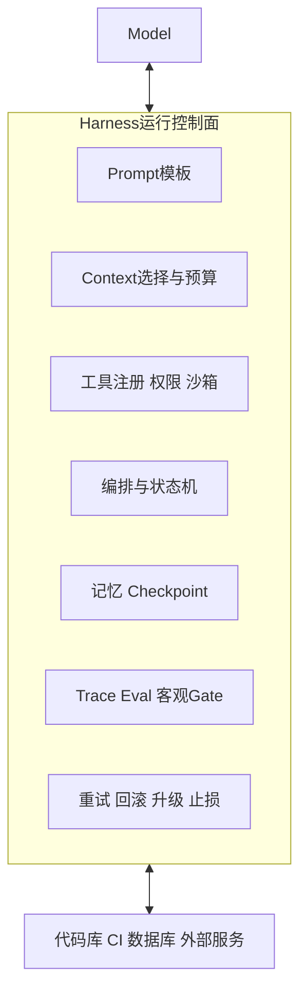
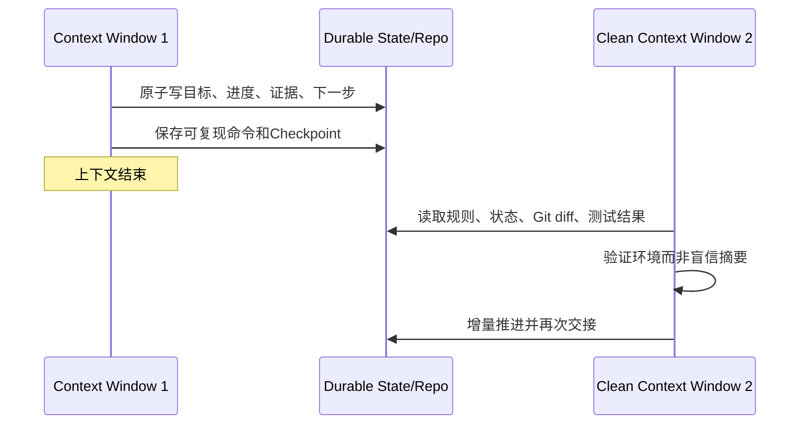

# 5. Harness Engineering：Agent 运行时的可靠性控制面

- 原文：[Harness Engineering 是什么？AI Agent 越用越聪明的秘密](https://xiaolinnote.com/agent/engineering/harness-engineering.html)
- 一句话结论：Harness 是模型外负责上下文、工具、编排、状态、观测、验证、安全和恢复的运行系统；Harness Engineering 的核心不是继续劝模型“仔细一点”，而是把重复失败转成可执行约束、测试和恢复路径。

## 1. Prompt、Context、Harness 的边界

文章给出的三层分类很适合工程沟通：

- Prompt Engineering：这一轮任务和输出要求怎样表达。
- Context Engineering：这一轮模型看到哪些规则、证据、状态和工具结果。
- Harness Engineering：模型如何被调用、允许做什么、如何循环、持久化、验证、止损和恢复。



它们不是正式标准规定的严格包含关系，而是有用的系统分层。`Agent = Model + Harness`、`Harness = Agent - Model` 也是架构启发式，不是数学方程。某些框架会把 Planner/Memory 叫 Agent 内核，另一些归入 Harness，关键是责任清楚而非名词统一。

文章将 Harness Engineering 的流行追溯到 2026 年博客和行业实践；来源、日期和案例数字具有时效性。工程结论可以复用，百万行代码、PR 数量或固定规则文件行数应回到原始文章核验，不作为架构正确性的证明。

## 2. 六层 Harness

| 层 | 核心问题 | 典型机制 | 失败表现 |
| --- | --- | --- | --- |
| 上下文 | 本轮该看到什么 | JIT 检索、压缩、分层规则、证据隔离 | Context Rot、规则遗漏、自我污染 |
| 工具 | 能做什么、怎样安全做 | 白名单、Schema、审批、超时、幂等、沙箱 | 用错工具、越权、副作用重复 |
| 编排 | 下一步是什么 | ReAct、DAG、Plan/Execute、状态机 | 步骤乱、循环、半成品 |
| 状态 | 跨轮怎样接力 | Checkpoint、进度文件、事件日志、版本 | 重复劳动、上下文重置后失忆 |
| 评估观测 | 做得怎样、错在哪 | Trace、Eval Set、Token/费用、真实环境测试 | 只“有输出”却不知道成功率 |
| 约束恢复 | 错了如何止损 | Gate、预算、重试分类、回滚、升级 | 无限重试、账单失控、错误上线 |

上下文管理看“当前空间”，状态管理看“跨时间演进”是很好的区分。状态不应只留在对话历史，因为上下文会压缩、截断或重置；应把目标、已完成步骤、产物、失败和下一步持久化为结构化源数据。

## 3. Context Reset 与外部状态

长任务只压缩聊天历史会丢失精确约束、文件名和失败证据，也可能把错误摘要永久放大。更稳的接力流程：



这不是“重启一定胜过压缩”的绝对定律。短任务压缩即可；长任务在关键里程碑做 Clean Context + Durable Handoff 更可靠。交接文件也可能陈旧或被篡改，所以新上下文要读真实 Git/测试/环境校验状态。

## 4. Maker 与 Checker 分离

生成者共享自己的假设和盲点，自评容易偏乐观。Evaluator 应使用不同上下文、明确 Rubric，并尽量触达真实环境：

- 代码：编译、单测、类型检查、Lint、SAST、运行行为。
- 数据：Schema、约束、样本对账、事务结果。
- UI：浏览器交互、截图、可访问性和关键路径。
- 文档/主观产物：独立 Rubric、事实引用和人工抽查。

“换一个 Agent”不自动产生独立性。如果两个 Agent 使用同一模型、同一上下文和相同提示，错误仍高度相关。客观程序 Gate 比多一个口头评价更重要。

## 5. 错误怎样沉淀为复利

每个错误都立刻加一条自然语言规则会让规范无限膨胀并产生冲突。更可靠的改进流程是：

1. 从 Trace 定位可重复失败，不对偶发噪声过度修复。
2. 写最小 Reproducer 或 Eval Case，使错误先稳定失败。
3. 判断应修 Prompt、Context、Tool、编排、状态还是 Gate。
4. 优先用类型、测试、Lint、Schema、权限等确定性机制。
5. 运行完整回归，确认没有伤害其他任务。
6. 只把仍需模型判断的内容写进简短规则索引，细节按需加载。

文章提到将巨大 `AGENTS.md` 改为目录式入口，这与 Progressive Disclosure 一致，但“控制在约 100 行”不是所有仓库的硬标准。衡量标准是相关性、冲突率、Token 和遵循率。

“老技术 Agent 更会”也只是概率优势：训练数据多、API 稳定通常有帮助，但安全、性能和维护要求仍可能需要新技术。应提供当前文档、类型和测试，而不是刻意停留在旧版本。

## 6. 当前项目已经有哪些 Harness 部件

- [run_day22_function_calling_basics.py](../run_day22_function_calling_basics.py)：工具 Schema、白名单、异常和最大工具轮数。
- [run_day25_task_orchestration.py](../run_day25_task_orchestration.py)：计划 JSON、工具执行、HTTPS Allowlist、超时、最大步骤和日志。
- [run_day26_day28_agent_demo.py](../run_day26_day28_agent_demo.py)：Agent 演示和审计事件。
- [agent_capabilities_reference.py](../xiaolinnote_agent_analysis/examples/agent_capabilities_reference.py)：租户隔离记忆、短期压缩、DAG Checkpoint、Replan、路由/Handoff 预算和 Reflection。
- [tooling_capabilities_reference.py](../xiaolinnote_tools_analysis/examples/tooling_capabilities_reference.py)：Schema、审批、超时、MCP、Skill 和 Gateway 配额。
- `tests/`：可执行 Eval/Gate，而非只靠模型自述。

这些部件分散存在，但项目此前没有统一的 Harness Run State、费用预算、动作重复检测和断点恢复循环。

## 7. 新参考实现

[agent_engineering_reference.py](examples/agent_engineering_reference.py) 的 `LoopHarness` 将控制面聚合起来：

```python
state = harness.run(
    run_id="ci-fix-42",
    goal="tests pass",
    policy=maker_policy,
    verifier=lambda output, state: GateResult(
        passed=run_tests(output),
        evidence=("pytest exit code = 0",),
    ),
)
```

- `LoopLimits`：轮数、失败、Token、费用、重复动作和观察历史上限。
- `ControlledToolRegistry`：工具白名单、危险操作审批、Call ID 幂等。
- `AtomicCheckpointStore`：临时文件写完后原子替换，支持干净上下文恢复。
- `TraceRecorder`：记录提出动作、工具结果、Gate 和停止原因。
- `GateResult`：只有独立评价通过才进入 `completed`。
- `ESCALATE`：高风险或不确定时明确升级，不伪装完成。

12 项测试验证预算、重复检测、Maker/Checker、审批、幂等和 Resume。它仍是单进程同步教学代码，没有分布式锁、真实模型、沙箱、墙钟超时或任务队列。

## 8. 模拟面试

**Q1：Harness Engineering 和 Context Engineering 的差别？**  
A：Context 决定本轮模型看到什么；Harness 还控制工具、状态机、验证、预算、恢复和审计。

**Q2：为什么状态不能只放对话历史？**  
A：历史会截断/压缩/重置且难并发；结构化持久状态可验证、恢复和审计。

**Q3：为什么同一个 Agent 自评容易失真？**  
A：生成与评价共享假设和上下文；应分离角色并引入真实环境的客观 Gate。

**Q4：每次错误都写 AGENTS.md 对吗？**  
A：不对。先复现并加测试/确定性 Guard，只把无法代码化的核心原则放入分层规则。

**Q5：Checkpoint 写了就一定能恢复吗？**  
A：还要绑定代码/模型/工具版本，保证原子性，并在恢复时核对真实环境和幂等副作用。

**Q6：Harness 如何防无限循环？**  
A：轮数、失败、Token、费用、时间、重复/无进展检测和人工升级多层止损。

**Q7：当前参考实现离生产还缺什么？**  
A：真实调度、分布式一致性、沙箱、密钥、墙钟超时、队列、完整权限和线上观测。

## 9. 复习清单

- 能按输入、动作、校验三组讲六层 Harness。
- 能解释 Context Reset、外部状态和恢复验证。
- 能设计 Maker/Checker 与客观 Gate。
- 能把失败从“提示词补丁”迁移为回归测试和环境能力。