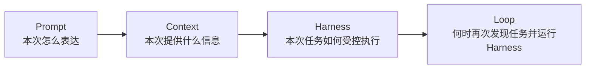
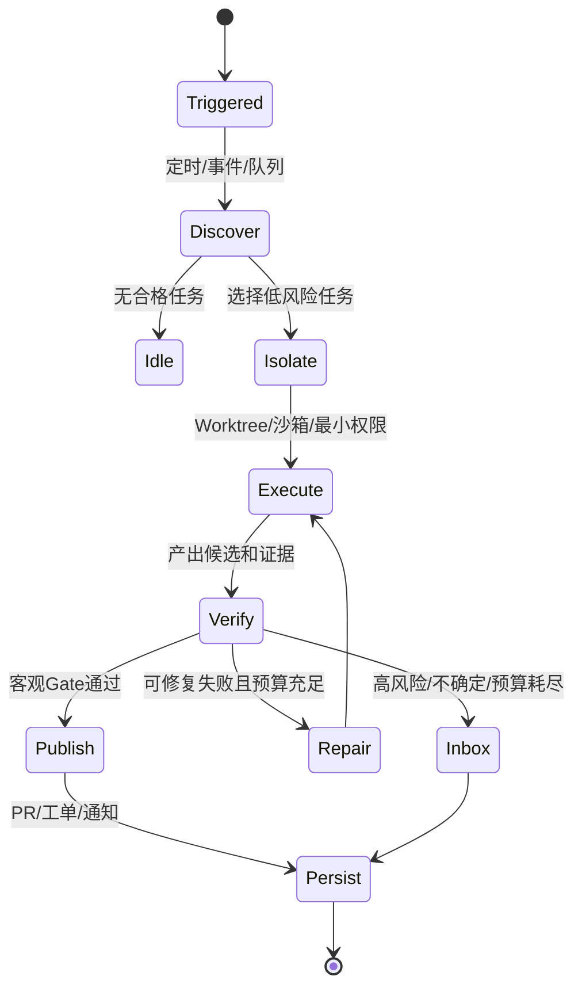

# 6. Loop Engineering：自主触发、执行、验证、状态与升级

- 原文：[Loop Engineering 是什么？AI 编程从 Prompt 到 Loop 的范式转变](https://xiaolinnote.com/agent/engineering/loop-engineering.html)
- 一句话结论：Loop Engineering 将“人手动观察、写下一条 Prompt、检查结果”的重复控制过程系统化，让触发器发现工作、Harness 驱动 Agent、独立 Gate 判断完成、持久状态承接下一周期，并在预算或风险边界升级给人。

## 1. 四种 Engineering 是不同作用域

这是一种便于理解的作用域扩展，不代表技术按 2023/2025/2026 线性替代。Cron、CI/CD、控制循环和自治 Agent 的思想早已存在；“Loop Engineering”是把这些实践重新聚焦到 Agent 驱动的软件工程。Prompt、Context 和 Harness 在 Loop 内仍然存在。

## 2. 一个完整 Loop 的控制流

Loop 至少需要：触发、任务发现/分诊、隔离执行、Actor、Verifier、持久状态、停止/升级和预算。文章所说“自动化是心跳”适用于无人值守 Loop；从算法角度手动启动也可执行循环，但尚未消除人的触发瓶颈。

## 3. 六个部件的工程含义

### Automation

Cron、Webhook、CI Event 或队列触发。触发器应该先用廉价规则/查询判断是否有工作，避免每次心跳都调用昂贵模型。必须有并发锁和去重 Event ID，防止同一事件多次启动。

### Worktree / 隔离工作区

Git Worktree 可隔离分支和文件修改，但不是安全沙箱：进程仍可访问同一主机、网络、凭证和其他目录。高风险命令需要容器、临时凭证、文件/网络白名单和资源限制。多个 Agent 修改共享数据库、Issue 或 CI 仍会冲突，需幂等和乐观锁。

### Skill

将项目方法、约束和验收沉淀为按需加载的文件。Skill 会复利，也会把过期或恶意规则持续放大；需要 Owner、版本、测试和来源审计。

### Connector

MCP、API SDK、CLI 等接入 GitHub、Slack、监控和工单。MCP 是一种标准方式，不是所有 Connector 的必要条件；每个服务端仍需认证授权。

### Maker / Checker

执行与评价分离，Checker 使用干净上下文和客观证据。新增 Checker 会增加 Token/延迟，不应所有步骤都双 Agent；用于高价值、容易自欺或不可逆边界。

### Durable Memory

目标、队列、完成、阻塞、证据、版本和下一步写入 Repo/Issue/数据库。Markdown 适合小团队透明状态，正式系统需要事务、并发、查询和权限。

## 4. Timer Loop 与 Goal Loop

- Timer/Event Loop：每次触发运行一轮，适合巡检、分诊、依赖更新。
- Goal-seeking Loop：围绕一个可验证条件迭代，条件满足即停。
- Inner Loop：修一个任务的执行-验证-修复。
- Outer Improvement Loop：分析多次失败，把有效修复沉淀为 Skill、测试或工具。

产品中的 `/loop`、`/goal`、Schedule/Routine 是具体版本功能，不是 Loop Engineering 标准 API。当前仓库没有这些命令。无论使用哪家产品，都应将 Loop 蓝图、状态 Schema、Gate 和权限视为自己的可迁移资产。

## 5. 完成声明与证明

Agent/Checker 的自然语言 `done` 仍是声明。证明应是：

- 测试/构建/类型检查退出码；
- 关键接口 Contract Test；
- 安全扫描和依赖审计；
- 部署健康与回滚准备；
- Diff 范围和文件所有权规则；
- 人工审批不可逆操作。

Gate 失败应将结构化错误反馈给 Maker，但修复轮数必须受预算约束。不能把 Gate 改松来“让任务通过”。

## 6. 理解债与认知投降

Loop 生成速度超过人的理解速度，会形成 Comprehension Debt：代码可能通过测试，但团队不知道设计理由和边界。控制办法包括小 PR、架构禁区、决策记录、关键路径人工 Review、定期逆向讲解和故障演练。

Loop 是放大器：工程师有清晰判断时放大生产力，没有判断时放大错误。人从每步操作转向定义目标、门禁、风险和例外，并没有从责任中消失。

## 7. 当前项目与参考实现

项目的 [run_day25_task_orchestration.py](../run_day25_task_orchestration.py) 和 [run_day26_day28_agent_demo.py](../run_day26_day28_agent_demo.py) 是**人工启动的一次任务**，没有定时/Event Trigger、Worktree 或 PR 发布器。

[agent_capabilities_reference.py](../xiaolinnote_agent_analysis/examples/agent_capabilities_reference.py) 已有 DAG、Checkpoint、Reflection、Handoff Budget；本专题 `LoopHarness` 将其简化为可恢复的内层 Goal Loop：

- Policy/Maker 提议 Tool、Finish 或 Escalate。
- `ControlledToolRegistry` 执行动作并按 Call ID 去重。
- `GateResult` 由独立 Verifier 返回证据。
- Budget 和重复动作检测阻止空转。
- `AtomicCheckpointStore` 让新上下文继续。

测试中第一个 Harness 只允许一轮，执行 `collect` 后因轮数预算停止；第二个全新 Harness 从同一 JSON Checkpoint 恢复，在第二轮提交结果并通过 Gate。这是“Agent 会忘，持久状态不会”的可执行证明。

参考实现没有 Automation Scheduler 和真实 Worktree，外层触发仍需 Cron/CI/队列。

## 8. 模拟面试

**Q1：Loop Engineering 和 Agent Loop 有什么区别？**  
A：Agent Loop 是单任务内观察-行动循环；Loop Engineering 还设计跨周期触发、任务发现、隔离、发布、状态和人工收件箱。

**Q2：Git Worktree 是否等于沙箱？**  
A：不是，它隔离 Git 工作目录/分支，不隔离主机权限、网络、凭证或外部副作用。

**Q3：为什么 Loop 必须有客观 Gate？**  
A：无人值守时自然语言完成声明不可依赖，Gate 才能自动拒绝坏产物并决定停止。

**Q4：怎样避免心跳空烧 Token？**  
A：事件优先、廉价规则预筛、无工作不调用模型、退避、缓存和日/任务预算。

**Q5：什么时候需要 Checker Agent？**  
A：主观且高价值、Maker 易共享盲点时；若已有编译器/单测，先用确定性 Gate。

**Q6：理解债怎样控制？**  
A：小变更、关键路径人工 Review、架构决策记录、可解释证据和限制 Loop 不碰高风险架构。

**Q7：当前项目实现了外层定时 Loop 吗？**  
A：没有，只实现并测试了有界、可恢复的内层 Harness。

## 9. 复习清单

- 能画 Trigger-Discover-Isolate-Execute-Verify-Persist。
- 能区分 Worktree 与安全沙箱。
- 能区分 Timer、Goal、Inner 和 Outer Loop。
- 能解释客观 Gate、预算、Inbox 和理解债。