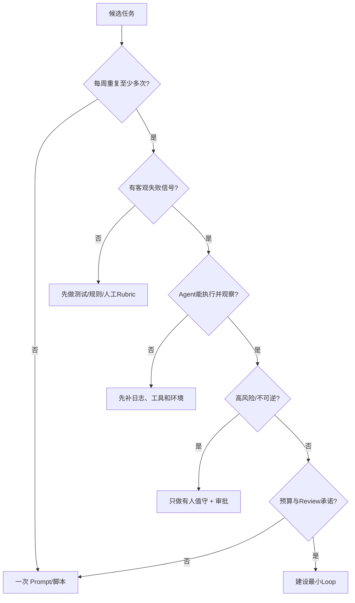

# 7. Loop Engineering 落地手册：从最小闭环到安全运行

- 原文：[Loop Engineering 怎么落地？一条从 0 到 1 的上手路径](https://xiaolinnote.com/agent/engineering/loop_engineering_handbook.html)
- 一句话结论：先证明任务重复、可自动验收、Agent 可观察执行结果且风险可控，再按“手动跑稳 -> 固化 Skill -> 加持久状态和 Gate -> 最后自动调度”的顺序建设；无人值守不是起点，而是验证充分后的结果。

## 1. 先做适用性门禁



原文的四个问题非常实用：重复性、自动裁判、预算、可执行/可观察；再加两项：不可逆动作审批和人是否真的 Review。架构、认证、支付和生产部署不是永远不能用 Agent，而是不适合早期无人值守自动合并，必须提高风险等级和人工门禁。

[agent_engineering_reference.py](examples/agent_engineering_reference.py) 的 `assess_loop_candidate` 将这些条件变成确定性检查。`risk_level=high/critical` 会要求有人值守，而不是让模型自行决定放行。

## 2. 最小 Loop 四件套

1. **Automation**：先手动触发，成熟后接 Cron/Webhook；无任务时不调模型。
2. **Skill/Rules**：只写任务方法、约束、命令和验收，保持短小、可版本化。
3. **Durable State**：记录 Goal、当前项、已完成、阻塞、证据和下一步。
4. **Objective Gate**：测试、类型、Lint、构建或可计算业务规则。

最小状态文件可写为：

```json
{
  "run_id": "dependency-update-2026-07-31",
  "goal": "upgrade one low-risk dependency",
  "status": "running",
  "current_task": "upgrade package-a",
  "completed": [],
  "blocked": [],
  "evidence": [],
  "next_action": "run unit tests"
}
```

目标文件回答“最终去哪”，状态文件回答“现在在哪”。状态最好结构化，Markdown 可作为人类视图；正式多 Worker 系统应使用事务 Store，并从事件生成 Markdown 报告。

## 3. 正确建设顺序


手动都不稳定时就加调度，会把模型问题、环境问题、Trigger 和并发问题混在一起。每级升级都应有通过门槛和回滚方式。

## 4. 使用参考 Harness 搭最小闭环

```python
from collections import deque

tools = ControlledToolRegistry()
tools.register(ToolDefinition("run_tests"), run_tests)

def policy(state):
    if not state.observations:
        return LoopAction.tool("run_tests", {}, call_id="tests-1")
    result = state.observations[-1]
    if result["ok"] and result["value"]["exit_code"] == 0:
        return LoopAction.finish({"commit": current_commit()})
    return LoopAction.escalate("tests failed after bounded attempt")

state = LoopHarness(
    tools,
    limits=LoopLimits(
        max_iterations=4,
        max_failures=2,
        max_tokens=8_000,
        max_cost=1.50,
        max_repeated_action=2,
    ),
    checkpoint=AtomicCheckpointStore(".loop/state.json"),
).run(
    run_id="ci-fix-42",
    goal="all targeted tests pass",
    policy=policy,
    verifier=independent_test_gate,
)
```

这段代码体现五条硬约束：工具白名单、幂等 Call ID、预算、持久状态、独立完成 Gate。实际项目还需墙钟超时、进程沙箱、并发锁、Git Worktree、Secret Store 和 PR 发布器。

## 5. 从 MVP 扩展到完整 Loop

### 并行与 Worktree

每个任务一条分支/Worktree，命名包含 Event ID；同一 Issue 使用租约避免重复领取。Worker 只能修改声明范围，结束后清理目录。数据库、Issue 和远程 API 仍需幂等键。

### Connector

先只读，再加写；每个写操作独立审批和作用域 Token。Connector 返回值裁剪、Schema 化并标记来源，避免把巨量日志和恶意文本直接塞入上下文。

### Checker

先使用现有测试。需要语义 Review 时再加独立 Checker，并要求它输出失败项、证据和复现命令，不接受泛泛评分。

### Human Inbox

收件箱至少含：任务、已做操作、Diff、失败 Gate、剩余风险、Token/费用和建议决策。升级是正常终态，不是失败。

## 6. 经济性：每个被接受改动的真实成本

$$
C_{accepted}=\frac{C_{model}+C_{compute}+\frac{minutes_{review}}{60}\times rate_{reviewer}}{N_{accepted}}
$$

还应比较人工基线的完成时间和机会成本。接受率：

$$
Acceptance=\frac{N_{accepted}}{N_{proposed}}
$$

原文用“低于 50% 就亏”作为红线很直观，但不是通用经济规律。高价值安全修复即使接受率低也可能值得；低价值依赖更新即使 80% 接受也可能因 Review 太贵而亏。阈值应按任务价值、风险和人工基线配置。

`LoopEconomics` 将模型/计算和 Review 时间一起计入，并提供可配置 `meets_threshold()`。测试示例中 10 个提议接受 6 个，总成本 42，单位接受成本 7。

## 7. 安全税必须前置

- 代码 Gate：测试、类型、Lint、SAST、依赖漏洞和 Secret Scan。
- Skill：安装前读源码、固定 Commit/Version、校验来源、限制脚本和网络。
- 凭证：短期最小权限、日志脱敏、禁止写入 Workspace/Trace。
- 权限：默认只读，写权限按任务临时授予，定期复审和自动过期。
- 外部内容：Issue、网页、邮件、日志均是不可信数据，不能覆盖 System Rule。
- 发布：默认开草稿 PR，不自动部署；不可逆动作 Human Approval。
- Kill Switch：费用/错误激增、重复动作、异常写入或监控告警立即停所有 Trigger。
- 审计：记录谁触发、模型/规则/工具版本、动作参数、证据和批准人。

网页引用的 Skill 泄密统计具有样本与时间范围，不能推广为所有生态的固定比例；其核心启示是供应链和日志泄密必须被自动扫描。

## 8. 14 步清单的工程化版本

1. 定义 Loop 要替代的人工控制动作。
2. 证明任务重复且价值足够。
3. 建立失败可自动判定的 Gate。
4. 确保 Agent 能运行并看到真实结果。
5. 划分风险等级与人工审批边界。
6. 设定 Token、费用、轮数、失败、时间预算。
7. 手动跑通一次并保留 Trace。
8. 将稳定方法固化为短 Skill。
9. 定义持久状态 Schema 和幂等 Event/Call ID。
10. 建设单任务、单 Worker 的最小 Loop。
11. 在 Shadow/草稿模式统计成功与经济性。
12. 需要并行时再引入 Worktree/租约。
13. 需要主观检查时再引入独立 Checker。
14. 最后接自动调度、Connector 写权限、Kill Switch 和定期安全/理解债 Review。

## 9. 项目落地边界

本专题参考实现已经通过 12 项测试，包括危险工具、幂等、预算、重复动作、客观 Gate、Checkpoint Resume、Escalation、适用性和成本。它让文章清单成为可执行控制面。

当前仓库仍没有真实 `/loop`/`/goal`、云端 Schedule、Git Worktree 管理、自动开 PR 或 Skill 安装器。建议先将某个低风险重复任务接到 `LoopHarness` 的假 Policy/Tool 上做 Shadow Eval，再考虑接真实模型。

## 10. 模拟面试

**Q1：第一个 Loop 为什么不能先上定时器？**  
A：手动链路未稳定时，调度会叠加触发、并发和恢复变量，故障难定位；先单次跑稳。

**Q2：最小四件套是什么？**  
A：触发/Automation、Skill、持久状态、客观 Gate；还应从第一天加硬预算。

**Q3：STATE 与 VISION/规则文件有何不同？**  
A：STATE 记录可变进度和下一步；VISION/规则记录稳定目标与边界，生命周期不同。

**Q4：接受率低于 50% 一定关 Loop 吗？**  
A：不一定，要结合单位接受成本、任务价值、风险和人工基线；50% 只是示例阈值。

**Q5：为什么 Worktree 之后仍需幂等？**  
A：Worktree 只隔离本地文件，Issue、数据库、消息和部署仍是共享外部副作用。

**Q6：如何阻止 Loop 假装完成？**  
A：完成由独立测试/规则 Gate 判定，失败反馈给 Maker，轮数耗尽则升级而非放松 Gate。

**Q7：哪些任务不应早期无人值守？**  
A：架构、认证、支付、生产部署和不可逆数据操作，应有人值守、审批和更强验证。

## 11. 复习清单

- 能执行“手动 -> Skill -> 状态/Gate -> Loop -> 调度”的顺序。
- 能计算单位接受成本而非只看 Token。
- 能设计状态 Schema、幂等、预算、Inbox 和 Kill Switch。
- 清楚当前仓库参考实现与真实自动化产品的差距。