# Agent、OpenClaw、RAG 与 Harness/Loop 总知识图谱

这是一张用于复习的概念关系图，覆盖 7 篇文章，不是某个产品的实际部署拓扑。整理日期：2026-09-08；产品默认值、命令和性能数据会随版本变化，因此保留技术机制，不把宣传数字当通用规律。

先记住分工：**模型参与决策，工具执行动作，RAG 提供证据，记忆保存可复用信息，Harness 约束运行，Loop 组织持续任务，验证器和人类决定是否接受结果。** OpenClaw 是这些能力的一种具体产品组合。

## 读图约定

- `[01]` 至 `[07]` 对应文末的七篇原文和本地分析。
- 实线表示数据流、运行过程或实施顺序；虚线表示组成、选型、约束或反馈。具体含义以箭头文字为准。
- 连线颜色跟随**同一节点的出边序号**：第 1 条为蓝色，第 2 条为青绿色，第 3 条为绿色，第 4 条为琥珀色，第 5 条为橙色，第 6 条为红色，后续继续使用紫色、靛蓝等颜色循环；这样同一节点发出的不同路线可以直接区分。
- 节点底色仍表示所属分区：蓝色为 Agent，青色为 OpenClaw，绿色为 RAG，橄榄色为 GraphRAG/LightRAG，橙色为 Harness，玫红色为 Loop，灰色为落地治理，金色为总入口。
- 跨分区关系使用更粗的 3px 连线，分区内部关系使用 2px 连线；追踪复杂关系时，先找起点节点颜色，再沿同色箭头和文字阅读。
- **内层循环**是一次任务中的“决策 -> 工具 -> 观察”；**外层循环**是跨任务的“触发 -> 执行 -> 验收 -> 保存 -> 下一次”，还有依据复盘改进 Harness 的反馈循环。
- 分区用于阅读，不代表必须安装七套系统；RAG、工具和状态管理通常作为同一个 Agent 系统的组件。

## 总图

```mermaid
flowchart TB
    ROOT["Agent 工程全景 [01-07]<br/>从完成一次任务，到持续、可验证地交付"]

    subgraph CONCEPTS["A. Agent、Workflow、工具与协议 [01]"]
        AOBJECTIVE["目标与边界<br/>任务 / 成功标准 / 权限 / 停止条件"]
        AWORKFLOW["Workflow<br/>代码预定义顺序、分支和规则<br/>可以嵌入模型判断"]
        AMODEL["LLM<br/>理解、生成、规划候选动作<br/>不直接执行外部系统操作"]
        ADECISION["Agent 内层决策<br/>根据目标、上下文和观察<br/>选择下一动作或提出完成"]
        APATTERNS["可组合的工作模式<br/>ReAct / Plan-and-Execute<br/>Reflection 或 Evaluator-Optimizer<br/>Multi-Agent / Tree of Thoughts"]
        ACALL["Function Calling<br/>name + description + JSON Schema<br/>模型输出 tool_calls 与任务参数"]
        AEXECUTOR["宿主执行器<br/>校验参数、认证授权、批准动作<br/>执行工具，返回带调用 ID 的结果"]
        AOBSERVE["Observation<br/>工具结果 / 日志 / 环境变化<br/>作为下一轮输入而非可信指令"]
        ATOOLS["原子能力<br/>搜索 / 文件 / 浏览器 / 终端<br/>数据库 / HTTP API / 业务服务"]
        AMCP["MCP：工具与上下文接入<br/>Host 内的 Client 连接 Server<br/>发现与调用 Tools / Resources / Prompts<br/>传输和能力协商按协议版本"]
        ASKILLS["Skills：任务方法包<br/>SKILL.md / SOP / 示例 / 脚本<br/>元信息先发现，详细资料按需加载"]
        AA2A["A2A：跨 Agent 协作协议<br/>Agent Card / Task 生命周期<br/>Message / Artifact / 进度与取消"]
        ACOMPOSE["框架与组合<br/>LangChain / LangGraph / CrewAI<br/>OpenAI Agents SDK / AutoGen<br/>确定性外层与局部 Agent 可混合"]

        AOBJECTIVE -->|"固定步骤交给代码"| AWORKFLOW
        AOBJECTIVE -->|"开放步骤允许模型选择"| ADECISION
        AMODEL -->|"提供决策能力"| ADECISION
        AWORKFLOW -->|"需要时调用局部 Agent"| ADECISION
        APATTERNS -.->|"组织规划、执行和反思"| ADECISION
        ACOMPOSE -.->|"提供编排组件"| AWORKFLOW
        ACOMPOSE -.->|"提供循环运行能力"| ADECISION
        ADECISION -->|"请求动作"| ACALL
        ACALL -->|"交给应用处理"| AEXECUTOR
        AEXECUTOR -->|"获准后执行"| ATOOLS
        ATOOLS -->|"返回执行证据"| AOBSERVE
        AOBSERVE -->|"继续或修正计划"| ADECISION
        AEXECUTOR -.->|"可通过 Client 访问服务端能力"| AMCP
        ASKILLS -.->|"指导做法，不自动授予权限"| ADECISION
        AA2A -.->|"委派给独立 Agent，而非必需步骤"| ADECISION
    end

    subgraph OPENCLAW["B. OpenClaw：常驻助手的产品案例 [02]"]
        OCHANNEL["Channels<br/>消息平台输入输出适配<br/>具体平台支持随版本变化"]
        OGATEWAY["Gateway<br/>认证 / 会话 / 路由 / 设备连接"]
        ORUNTIME["Agent Runtime<br/>模型调用、工具调度和状态管理<br/>本地或服务器常驻"]
        ONODES["Nodes 与 Tools<br/>设备能力 / 文件 / 屏幕 / 浏览器<br/>权限来自部署配置，不默认最高权限"]
        OFILES["文中工作区约定<br/>SOUL.md：交互风格<br/>AGENTS.md：操作规范<br/>TOOLS.md：能力使用说明"]
        OTRIGGER["Heartbeat 与定时任务<br/>HEARTBEAT.md 描述巡检事项<br/>事件优先、规则预筛、无事不调模型"]
        OSESSION["会话记录与短期状态<br/>sessions / 日志 / 当前任务进度"]
        OMEMORY["长期记忆<br/>MEMORY.md 中提炼的偏好与事实<br/>来源 / 时间 / 作用域 / 可更正删除"]
        OINDEX["派生记忆索引<br/>文中以 SQLite、BM25、向量为例<br/>源文件变更后同步或重建"]
        OCOST["常驻成本与条件<br/>反复注入上下文、心跳、重试、摘要<br/>需要设备在线、限频、缓存和预算"]
        OSECURITY["本地与供应链风险<br/>Prompt Injection / 恶意 Skill<br/>秘密外泄 / 远程入口 / 权限过大<br/>沙箱、最小权限、审计与紧急停止"]
        OOPTIONS["与 Coze、n8n 等比较<br/>运行位置、接入方式、状态与权限<br/>低代码搭建、工作流自动化、常驻助手<br/>比较具体版本，而非绝对能力高低"]

        OCHANNEL -->|"接收任务"| OGATEWAY
        OGATEWAY -->|"认证后路由"| ORUNTIME
        ORUNTIME -->|"在许可范围内操作"| ONODES
        OFILES -.->|"提供可读配置与约束"| ORUNTIME
        OTRIGGER -->|"有工作时唤醒"| ORUNTIME
        ORUNTIME -->|"记录过程"| OSESSION
        OSESSION -->|"筛选、核实后提炼"| OMEMORY
        OMEMORY -->|"构建可重建索引"| OINDEX
        OINDEX -->|"只召回相关记忆"| ORUNTIME
        OCOST -.->|"限制唤醒频率与调用"| OTRIGGER
        OSECURITY -.->|"限制访问与动作"| ONODES
        OSECURITY -.->|"防止数据变成长期恶意规则"| OMEMORY
        OOPTIONS -.->|"按部署与业务约束选型"| ORUNTIME
    end

    subgraph RETRIEVAL["C. RAG：离线索引与在线知识供给 [03]"]
        RDATA["可授权、可更新的资料<br/>PDF / Office / HTML / Markdown<br/>来源、版本、时间、ACL 与 PII"]
        RCHUNK["解析与 Chunking<br/>固定长度与 Overlap / 递归分隔<br/>结构化 / 语义 / Agent 辅助 / 父子块<br/>按 Token 与语义完整性权衡"]
        REMBED["Embedding 表示与检索训练<br/>Word2Vec、GloVe、FastText<br/>BERT、Sentence Embedding、BGE-M3<br/>OpenAI Embedding、LLM2Vec、Qwen<br/>Pooling、对比学习、模型版本一致"]
        RSTORE["向量索引与存储<br/>ANN：HNSW / IVF；压缩：PQ<br/>Milvus / Pinecone / Weaviate<br/>Chroma / Qdrant / pgvector / ES"]
        RQUERY["查询处理<br/>Query Rewriting / Multi-Query<br/>HyDE / 分解与迭代检索<br/>假设文档不是事实证据"]
        RRECALL["多路召回<br/>Dense：Embedding 语义相似<br/>Sparse：BM25 与关键词<br/>可增加图查询、SQL 和元数据过滤"]
        RFUSE["融合与精排<br/>去重 -> RRF 排名融合<br/>Cross-Encoder Re-rank -> Top-N<br/>例：BGE / Cohere / Jina / MiniLM / BCE"]
        RCONTEXT["证据上下文<br/>相关片段 / 来源引用 / Token 预算<br/>查询与资料分区、权限过滤"]
        RANSWER["基于证据生成与验证<br/>核查 Claim 是否被来源支持<br/>信息不足时澄清、拒答或转人工"]
        REVAL["分层评测<br/>检索：Recall、Precision、Hit@K<br/>排序：NDCG、MRR、MAP<br/>生成：Faithfulness、Relevance、引用<br/>延迟、费用与人工校准"]
        RJUDGE["评测工具与幻觉治理<br/>RAGAS / DeepEval / TruLens / ARES<br/>规则、工具核验、LLM-as-Judge、UQ<br/>Judge 和置信度都需要校准"]
        RFINETUNE["RAG 与微调互补<br/>RAG 改本次输入的外部证据<br/>SFT 改学习目标，Full FT / LoRA 改更新方式<br/>Prompt 可控制表达，均不保证事实正确"]

        RDATA -->|"离线整理"| RCHUNK
        RCHUNK -->|"编码片段"| REMBED
        REMBED -->|"入库并记录模型版本"| RSTORE
        RQUERY -->|"在线发起"| RRECALL
        RSTORE -->|"提供 Dense 候选"| RRECALL
        RCHUNK -->|"也可建立全文索引"| RRECALL
        RRECALL -->|"候选集"| RFUSE
        RFUSE -->|"在预算内选证据"| RCONTEXT
        RCONTEXT -->|"约束生成依据"| RANSWER
        RRECALL -.->|"检测漏召回与噪声"| REVAL
        RANSWER -->|"对照业务黄金集"| REVAL
        RJUDGE -.->|"辅助测量，不代替人工真值"| REVAL
        REVAL -.->|"失败分析指导改写"| RQUERY
        RFINETUNE -.->|"按错误类型组合方案"| RANSWER
    end

    subgraph GRAPHRETRIEVAL["D. GraphRAG 与 LightRAG：显式关系检索 [04]"]
        GREASON["动机与选择条件<br/>单次 Top-K 易漏跨文档关系<br/>多跳、全局归纳、实体与因果上下文<br/>不是所有 RAG 都必须建图"]
        GEXTRACT["共同索引基础<br/>Text Units -> 实体 / 关系 / 可选 Claims<br/>消歧、Alias、类型、唯一 ID 与来源绑定"]
        GGRAPH["知识图谱与可追溯原文<br/>节点、边、描述、来源、时间<br/>图遍历、多跳与结构化条件查询"]
        GCOMMUNITY["Microsoft GraphRAG 索引<br/>实体关系描述聚合<br/>Leiden 层次社区 -> Community Reports"]
        GLOCAL["GraphRAG Local Search<br/>入口实体 -> 邻居、关系、原文<br/>围绕具体对象组装上下文"]
        GGLOBAL["GraphRAG Global Search<br/>相关社区报告 -> Map 中间答案<br/>Reduce 综合；DRIFT 等扩展局部与全局"]
        LINDEX["LightRAG 图增强索引<br/>实体、关系、关键词与描述向量<br/>去重、键值信息与来源 Text Units<br/>不依赖预计算层次社区报告"]
        LKEY["LightRAG Dual-Level Retrieval<br/>从查询抽取 Low / High 关键词"]
        LLOW["Low-level / Local<br/>找具体实体 -> 扩展邻居与来源"]
        LHIGH["High-level / Global<br/>找关系与主题 -> 收集关联实体"]
        LMERGE["LightRAG 上下文合并<br/>Hybrid 合并 Low 与 High<br/>Naive 为文本向量基线<br/>去重、回链原文、控制 Token"]
        GUPDATE["索引更新与一致性<br/>GraphRAG：局部增量、社区报告失效<br/>周期重建、时间分区、Lazy 思路<br/>LightRAG：Upsert 与向量同步"]
        GQUALITY["共同成本与风险<br/>抽取、实体消歧、冲突、删除仍有成本<br/>Source Count / 有效期 / 版本边 / Tombstone<br/>质量、更新率、P95、成本与治理共同选型"]

        GREASON -->|"需要关系时考虑"| GEXTRACT
        GEXTRACT -->|"抽取结果必须校验"| GGRAPH
        GGRAPH -->|"预计算全局结构"| GCOMMUNITY
        GGRAPH -->|"实体中心查询"| GLOCAL
        GCOMMUNITY -->|"主题中心查询"| GGLOBAL
        GGRAPH -->|"另一套设计，不是官方精简开关"| LINDEX
        LINDEX -->|"提供实体和关系检索索引"| LKEY
        LKEY -->|"具体关键词"| LLOW
        LKEY -->|"主题关键词"| LHIGH
        LLOW -->|"实体侧结果"| LMERGE
        LHIGH -->|"关系侧结果"| LMERGE
        GUPDATE -.->|"更新可能触发重算"| GCOMMUNITY
        GUPDATE -.->|"维护图、向量与原文关联"| LINDEX
        GQUALITY -.->|"约束实体合并"| GEXTRACT
        GQUALITY -.->|"处理过期、共享来源和删除"| GUPDATE
    end

    subgraph HARNESS["E. Harness Engineering：模型外的运行系统 [05]"]
        HHARNESS["Harness<br/>上下文、工具、编排、状态、验证与恢复<br/>Agent = Model + Harness 是工程分工示意"]
        HPROMPT["Prompt Engineering<br/>表达角色、目标、约束与输出格式"]
        HCONTEXT["1. Context Engineering<br/>按需召回 -> 压缩 -> 结构化组装<br/>JIT Retrieval / Progressive Disclosure<br/>规则、事实、假设分开，防 Context Rot"]
        HTOOLS["2. 受控工具系统<br/>最小工具集 / 参数 Schema / 白名单<br/>可信身份 / 限权 / 结果裁剪"]
        HORCHESTRATE["3. 全局执行编排<br/>规划与执行分开 / DAG 与状态机<br/>路由、并行、重新规划和停止条件"]
        HSTATE["4. 分层状态与记忆<br/>单轮中间值 / 任务进度 / 长期事实<br/>外部文件或事务数据库、Checkpoint"]
        HEVAL["5. 独立评估与观测<br/>固定 Eval 集 / Trace / 日志 / 指标<br/>LangSmith / Langfuse 等观测系统"]
        HRECOVERY["6. 约束、校验与恢复<br/>Gate / Retry / Backoff / Timeout<br/>幂等 / 补偿 / 保存进度 / Human Review"]
        HRESET["长任务上下文重建<br/>Compaction 与 Context Reset 不同<br/>读取目标、进度、证据和 Git 历史接力<br/>Reset 前须保存可靠交接状态"]
        HROLES["Planner / Generator / Evaluator<br/>规格 -> 实现 -> 独立验收<br/>真实测试与浏览器结果优于口头自评"]
        HLEARNING["失败转成工程资产<br/>复现 -> 分类 -> 补规则、测试、Lint、Hook<br/>Golden Principles / 文档分层 / 技术债治理<br/>回归后生效，不保证永不再错"]

        HHARNESS -.->|"包含输入管理"| HCONTEXT
        HCONTEXT -.->|"包含指令设计"| HPROMPT
        HHARNESS -.->|"包含动作控制"| HTOOLS
        HHARNESS -.->|"包含任务路径"| HORCHESTRATE
        HHARNESS -.->|"包含跨轮状态"| HSTATE
        HHARNESS -.->|"包含质量证据"| HEVAL
        HHARNESS -.->|"包含失败处理"| HRECOVERY
        HSTATE -->|"交接可靠进度"| HRESET
        HRESET -->|"重建本轮需要的信息"| HCONTEXT
        HROLES -->|"分离生成和验收"| HEVAL
        HEVAL -->|"定位重复失败"| HLEARNING
        HLEARNING -.->|"改进环境而非自动改权重"| HHARNESS
    end

    subgraph LOOP["F. Loop Engineering：跨任务持续推进 [06]"]
        LTRIGGER["Automation 与触发<br/>Cron / Webhook / 消息 / CI 事件<br/>Timer Loop 看时机，Goal Loop 看达标<br/>会话轮询不等于持久后台调度"]
        LTRIAGE["Triage：发现并领取有价值任务<br/>Issue / CI 失败 / 告警 / 最近提交<br/>Event ID 去重、租约与并发上限"]
        LWORKTREE["隔离工作区<br/>每任务 Git Worktree / 分支<br/>隔离本地改动，不隔离外部 API 与数据库"]
        LMAKER["Maker 执行一个小任务<br/>加载目标、状态与 Skill<br/>调用 Harness 驱动内层 Agent"]
        LCHECKER["Checker 与 Objective Gate<br/>独立上下文审查 + 可执行测试证据<br/>完成声明不是完成证明"]
        LPASS{"验收是否通过"}
        LREPAIR["有界修复<br/>回传具体失败与复现证据<br/>不能靠放宽 Gate 使结果通过"]
        LSTOP["硬止损与升级<br/>轮数 / Token / 费用 / 墙钟时间<br/>重复动作 / 失败阈值 / 风险 / Kill Switch"]
        LDELIVER["Connector 交付<br/>GitHub / Jira / Linear / Slack<br/>SDK、HTTP 或 MCP 接入<br/>草稿 PR、审批、幂等通知与审计"]
        LINBOX["Human Inbox<br/>Diff / Gate 证据 / 风险 / 成本<br/>人决定批准、修改、停止或接管"]
        LPERSIST["Durable State<br/>目标 / 已完成 / 阻塞 / 下一步<br/>证据、版本和操作 ID 跨运行保存"]
        LREFLECT["外层改进循环<br/>吸收 Review 与线上失败<br/>修改 Skill、工具、Gate 和任务选择<br/>处理理解债，保留人的判断"]

        LTRIGGER -->|"新事件或到期检查"| LTRIAGE
        LTRIAGE -->|"获准任务按需隔离"| LWORKTREE
        LWORKTREE -->|"小范围实施"| LMAKER
        LMAKER -->|"提交可检查产物"| LCHECKER
        LCHECKER -->|"依据证据判断"| LPASS
        LPASS -->|"否且仍在预算内"| LREPAIR
        LREPAIR -->|"修复后再次验证"| LMAKER
        LPASS -->|"是且允许交付"| LDELIVER
        LSTOP -->|"预算耗尽、危险或无法推进"| LINBOX
        LSTOP -.->|"在每轮与动作前检查"| LMAKER
        LDELIVER -->|"需要人审的变更"| LINBOX
        LDELIVER -->|"记录已交付，防止重发"| LPERSIST
        LINBOX -->|"记录人工决定或阻塞"| LPERSIST
        LPERSIST -->|"下一次从可靠进度继续"| LTRIAGE
        LINBOX -->|"人工反馈进入改进循环"| LREFLECT
    end

    subgraph ADOPTION["G. Loop 落地、经济性与安全 [07]"]
        KFIT["是否值得建设<br/>重复、有价值、能自动验收<br/>能执行和观察、有预算、愿意 Review<br/>高风险动作必须提高审批与验证等级"]
        KMANUAL["先让单次手动任务跑稳<br/>固定成功条件、命令和失败复现"]
        KMVP["最小四件套<br/>Automation + Skill + Durable State + Gate<br/>先单任务单 Worker，再逐步扩展"]
        KROLLOUT["分阶段上线<br/>手动 -> Skill -> 状态与 Gate<br/>受控 Loop -> Shadow -> 自动调度<br/>按需增加 Worktree、Connector、Checker"]
        KGOAL["目标与状态分离<br/>VISION / AGENTS：方向与边界<br/>STATE / 任务看板：进度与下一步<br/>数据库存事实，Markdown 可做人类视图"]
        KECON["经济性与持续评测<br/>接受率 / 每个被接受改动的总成本<br/>模型费 + 算力 + Review 时间 + 返工风险<br/>与人工基线比较，不迷信固定接受率"]
        KSEC["发布 Gate 的安全税<br/>测试 / 类型 / Lint / 构建<br/>SAST / 依赖审计 / Secret Scan<br/>Skill 来源审查与版本固定"]
        KACCESS["运行权限治理<br/>短期凭证、日志脱敏、默认只读<br/>写操作审批、审计、权限复审与过期<br/>Issue、网页、邮件不是授权指令"]
        KHUMAN["人的责任<br/>检查 Diff、验收证据与架构影响<br/>警惕 Comprehension Debt / Cognitive Surrender<br/>无人值守不是无人负责"]

        KFIT -->|"条件成立才建设"| KMANUAL
        KMANUAL -->|"把稳定过程沉淀"| KMVP
        KMVP -->|"按阶段放开自动化"| KROLLOUT
        KGOAL -.->|"定义必须保留的状态"| KMVP
        KECON -.->|"决定继续、缩小或停止"| KROLLOUT
        KSEC -.->|"安全与功能一起验收"| KMVP
        KACCESS -.->|"确定自动化权限上限"| KROLLOUT
        KHUMAN -.->|"承担审批与持续理解"| KROLLOUT
    end

    ROOT -->|"先明确系统如何决策和行动"| AOBJECTIVE
    ROOT -.->|"具体常驻助手案例"| OGATEWAY
    ROOT -.->|"知识供给"| RDATA
    ROOT -.->|"运行约束"| HHARNESS
    ROOT -.->|"持续任务组织"| LTRIGGER
    ROOT -.->|"落地前判断"| KFIT
    ORUNTIME -.->|"采用模型与工具的决策循环"| ADECISION
    OFILES -.->|"规则、SOP 按需成为上下文"| HCONTEXT
    OMEMORY -.->|"长期状态的一种介质"| HSTATE
    OTRIGGER -.->|"常驻产品中的触发实例"| LTRIGGER
    OINDEX -.->|"记忆召回也可复用检索机制"| RRECALL
    OSECURITY -.->|"与 Loop 共享信任边界"| KACCESS
    RCHUNK -->|"关系需求才增加图索引"| GEXTRACT
    RQUERY -->|"按问题类型路由"| GREASON
    GLOCAL -->|"实体关系及原文"| RCONTEXT
    GGLOBAL -->|"社区聚合仍须回链来源"| RCONTEXT
    LMERGE -->|"双层检索证据"| RCONTEXT
    RCONTEXT -->|"是上下文的一部分"| HCONTEXT
    RANSWER -.->|"可封装为知识查询工具"| ATOOLS
    REVAL -.->|"提供知识链路的质量证据"| HEVAL
    HCONTEXT -->|"组装本轮输入"| ADECISION
    HTOOLS -.->|"限制宿主可执行能力"| AEXECUTOR
    HORCHESTRATE -.->|"确定外层规则与内层自主范围"| AWORKFLOW
    HRECOVERY -.->|"提供停止与恢复机制"| LSTOP
    LMAKER -->|"调用可控执行系统"| HHARNESS
    ADECISION -->|"提出完成，不能自行免验收"| LCHECKER
    ASKILLS -.->|"持续循环复用做事方法"| LMAKER
    AMCP -.->|"可作为 Connector 的接入方式"| LDELIVER
    LPERSIST -.->|"为上下文重建提供交接"| HRESET
    LREFLECT -.->|"把问题变成回归约束"| HLEARNING
    KSEC -.->|"为验收提供独立证据"| LCHECKER
    KACCESS -.->|"写入前校验与批准"| LDELIVER
    KGOAL -.->|"约束下一轮不偏离目标"| LPERSIST
    KROLLOUT -.->|"验证成熟后接入触发器"| LTRIGGER
    LPERSIST -.->|"记录真实费用与接受结果"| KECON

    %% 同一节点的不同出边使用不同颜色；3px 表示跨分区关系。
    linkStyle 1,6,12,20,26,33,37,45,50,54,56,59,76,78,80,83 stroke:#0f766e,stroke-width:2px;
    linkStyle 47,60 stroke:#16a34a,stroke-width:2px;
    linkStyle 0,2,3,4,5,7,8,9,10,11,13,14,15,16,17,18,19,21,22,23,24,25,27,28,29,30,31,32,34,35,36,38,39,40,41,42,43,44,46,48,49,51,52,53,55,57,58,64,65,66,67,68,69,70,71,72,73,74,75,77,79,81,82,84,85,86,87,88,89,90,91 stroke:#2563eb,stroke-width:2px;
    linkStyle 61 stroke:#ca8a04,stroke-width:2px;
    linkStyle 63 stroke:#dc2626,stroke-width:2px;
    linkStyle 62 stroke:#ea580c,stroke-width:2px;
    linkStyle 93,99,100,101,102,105,109,110,111,112,116,117,118,120,122,123,124 stroke:#0f766e,stroke-width:3px;
    linkStyle 94,98,103,104,126 stroke:#16a34a,stroke-width:3px;
    linkStyle 92,106,107,108,113,114,115,119,121,125 stroke:#2563eb,stroke-width:3px;
    linkStyle 95 stroke:#ca8a04,stroke-width:3px;
    linkStyle 97 stroke:#dc2626,stroke-width:3px;
    linkStyle 96 stroke:#ea580c,stroke-width:3px;

    classDef rootLayer fill:#fff4bf,stroke:#8b7500,color:#302900,stroke-width:2px;
    classDef conceptLayer fill:#eaf3ff,stroke:#34699a,color:#13293d;
    classDef openclawLayer fill:#e9f7f7,stroke:#347d7d,color:#153838;
    classDef ragLayer fill:#eaf8ee,stroke:#3f7d4e,color:#173c22;
    classDef graphRagLayer fill:#f2f6df,stroke:#718238,color:#303b18;
    classDef harnessLayer fill:#fff1e6,stroke:#a65f26,color:#4a2811;
    classDef loopLayer fill:#fcecef,stroke:#a64c62,color:#4a1e2a;
    classDef adoptionLayer fill:#f1f1f1,stroke:#666666,color:#252525;
    class ROOT rootLayer;
    class AOBJECTIVE,AWORKFLOW,AMODEL,ADECISION,APATTERNS,ACALL,AEXECUTOR,AOBSERVE,ATOOLS,AMCP,ASKILLS,AA2A,ACOMPOSE conceptLayer;
    class OCHANNEL,OGATEWAY,ORUNTIME,ONODES,OFILES,OTRIGGER,OSESSION,OMEMORY,OINDEX,OCOST,OSECURITY,OOPTIONS openclawLayer;
    class RDATA,RCHUNK,REMBED,RSTORE,RQUERY,RRECALL,RFUSE,RCONTEXT,RANSWER,REVAL,RJUDGE,RFINETUNE ragLayer;
    class GREASON,GEXTRACT,GGRAPH,GCOMMUNITY,GLOCAL,GGLOBAL,LINDEX,LKEY,LLOW,LHIGH,LMERGE,GUPDATE,GQUALITY graphRagLayer;
    class HHARNESS,HPROMPT,HCONTEXT,HTOOLS,HORCHESTRATE,HSTATE,HEVAL,HRECOVERY,HRESET,HROLES,HLEARNING harnessLayer;
    class LTRIGGER,LTRIAGE,LWORKTREE,LMAKER,LCHECKER,LPASS,LREPAIR,LSTOP,LDELIVER,LINBOX,LPERSIST,LREFLECT loopLayer;
    class KFIT,KMANUAL,KMVP,KROLLOUT,KGOAL,KECON,KSEC,KACCESS,KHUMAN adoptionLayer;
```

## 四条复习路线

1. **动作线**：从 `[01]` 的目标走到 Function Calling、宿主、工具和 Observation，解释为什么“模型输出调用请求”不等于“模型拥有执行权限”。
2. **知识线**：从 `[03]` 的文档走到检索与引用；遇到关系或全局问题，再沿 `[04]` 比较 GraphRAG 的社区报告与 LightRAG 的双层检索，最后回到有来源的上下文。
3. **运行线**：用 `[02]` 的常驻助手理解输入通道、工作区与心跳，再用 `[05]` 的六层 Harness 检查它是否可观察、可约束、可恢复。
4. **闭环线**：沿 `[06]` 走一遍触发、分诊、隔离、执行、验收、交付和保存；用 `[07]` 判断这套自动化是否值得做、何时停、谁来负责。

## 一例贯穿七篇

假设要做“定期检查课程题库的标签质量”的助手：`[01]` Agent 判断该查资料还是调用只读题库工具；`[02]` 式消息入口和工作区保存任务与偏好；`[03]` RAG 找标签定义及人工样例；只有确实需要“知识点 -> 题目 -> 规则”的关系检索或全局归纳时，才评估 `[04]` 图检索。

`[05]` Harness 限制可查询学科、工具权限与调用预算；`[06]` 外层 Loop 定期领取新任务、生成建议并交给独立 Gate，保存处理进度；`[07]` 要求先用固定样本和人工复核跑稳，再接自动调度。模型不能因为“自评通过”就写回题库，最终标签仍以获授权的人工提交或明确批准的业务规则为准。

这是用于串联概念的设计示例，不表示仓库已接入 OpenClaw、官方 GraphRAG/LightRAG 或无人值守调度。

## 容易混淆的关系

| 对比 | 必须保留的边界 |
| --- | --- |
| 模型、Agent、Workflow | 模型提供判断和生成能力；Agent 系统组织行动；Workflow 用代码规定路径。固定流程也可调用模型，二者可以组合。 |
| Function Calling、MCP、Skills、A2A | 分别关注模型提出调用、应用连接工具和数据、可复用任务方法、跨 Agent 委派。MCP 不依赖某一家厂商的 Function Calling，Skill 也可包含脚本；均不自动授予权限。 |
| OpenClaw 与其他助手 | 常驻、文件记忆、本地工具是可比较的产品能力，不是只有 OpenClaw 才具备的 Agent 定义。本地运行也不保证不外传数据。 |
| 工作区文件与真实能力 | 能力说明不是权限配置，复制 Markdown 也不会复制模型、凭证、工具环境或调度服务。文中工作区文件名仅作案例说明。 |
| RAG 与微调 | RAG 在推理时提供外部信息，微调更新参数；可互补，不存在“必须先微调才可 RAG”。输出风格也能通过 Prompt 和示例影响。 |
| Naive RAG 与图检索 | 单次 Top-K 的关系覆盖有限，但分解、迭代检索和 SQL Join 也能支持多跳。图是显式表示关系的方法，不是唯一推理方案。 |
| GraphRAG 与 LightRAG | 狭义 Microsoft GraphRAG 强调社区报告与全局摘要；LightRAG 强调实体/关系双层检索。LightRAG 是独立设计，不是微软产品的精简配置。 |
| 图更新与零成本 | 不做社区报告可减少级联维护，但实体消歧、Embedding、来源回收和时效冲突仍有成本；共享实体不能因为删了一篇文档就直接删除。 |
| Prompt、Context、Harness、Loop | 分别处理任务表达、信息组织、运行系统、持续触发与闭环控制，是不同作用范围，不是后一项让前一项失效。 |
| Agent 内层 Loop 与任务外层 Loop | 内层决定下一动作；外层负责何时运行、验收与跨轮进度。持续改进 Harness 的反馈循环也不等于训练模型权重。 |
| Worktree 与安全沙箱 | Worktree 隔离工作目录，不隔离凭证、网络、数据库和远端副作用；仍需沙箱、租约、审批与幂等。 |
| Maker/Checker 与客观证明 | 不同 Agent 仍可能共享错误偏差。测试、构建、运行证据和独立业务真值是验收依据，且测试通过只覆盖已测范围。 |
| Checkpoint 与 Exactly-Once | 保存状态不保证外部动作只执行一次；恢复、重试、通知和写操作都需要业务幂等与执行记录。 |
| 图谱、记忆与真实业务数据 | 图和索引是派生知识，记忆也会过期或提炼错误；余额、权限、题库最终标签等应查询权威事实源。 |

## 复习时顺手算一笔账

只统计生成速度或 Token 单价，会漏掉拒收产物和人工 Review 成本。可以用下面的近似口径比较同类任务：

$$
C_{\text{每个接受改动}} = \frac{C_{\text{模型}} + C_{\text{算力}} + C_{\text{审查与返工}}}{N_{\text{被接受改动}}}
$$

当没有被接受改动时，这个单位成本无法用有限数值表示，应单独报告已投入成本和零接受产出。接受率、风险损失和人工基线还需一起看；原文中的固定成本、速度提升或“50% 接受率”不是跨项目适用的硬规律。

## 七篇来源与图中位置

| 编号 | 图中重点 | 原文 | 本地分析 |
| --- | --- | --- | --- |
| 01 | Agent 决策、Workflow、工作模式与协议 | [AI Agent](https://xiaolinnote.com/agent/concept/agent.html) | [1_ai_agent_concepts_workflows_tools_protocols.md](1_ai_agent_concepts_workflows_tools_protocols.md) |
| 02 | OpenClaw 通道、网关、设备、工作区与心跳 | [OpenClaw](https://xiaolinnote.com/agent/concept/openclaw.html) | [2_openclaw_local_workspace_memory_security.md](2_openclaw_local_workspace_memory_security.md) |
| 03 | RAG 索引、查询、混合召回、精排与评测 | [RAG](https://xiaolinnote.com/agent/rag/rag.html) | [3_rag_index_retrieval_rerank_evaluation.md](3_rag_index_retrieval_rerank_evaluation.md) |
| 04 | 图索引、社区报告、双层检索、更新与选型 | [GraphRAG 与 LightRAG](https://xiaolinnote.com/agent/rag/graphrag-lightrag.html) | [4_graphrag_lightrag_principles_selection.md](4_graphrag_lightrag_principles_selection.md) |
| 05 | Harness 六层、上下文重建、独立验收与失败沉淀 | [Harness Engineering](https://xiaolinnote.com/agent/engineering/harness-engineering.html) | [5_harness_engineering_agent_runtime_reliability.md](5_harness_engineering_agent_runtime_reliability.md) |
| 06 | 自动化、Worktree、Skills、Connector、Checker、持久状态 | [Loop Engineering](https://xiaolinnote.com/agent/engineering/loop-engineering.html) | [6_loop_engineering_autonomous_iteration.md](6_loop_engineering_autonomous_iteration.md) |
| 07 | 可行性、最小四件套、逐步上线、经济性与安全 | [Loop Engineering 落地手册](https://xiaolinnote.com/agent/engineering/loop_engineering_handbook.html) | [7_loop_engineering_handbook_implementation.md](7_loop_engineering_handbook_implementation.md) |

继续复习：[README.md](README.md)。图中的产品与方法不代表都已在仓库落地，实际代码能力以各专题的“当前项目”和“参考实现”边界为准。