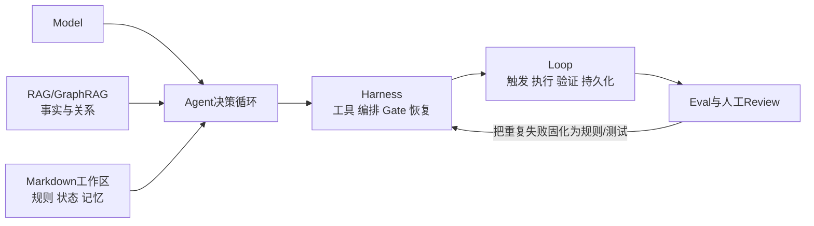

# Xiaolinnote Agent 概念、RAG 与工程方法论专题分析

本目录逐页分析 Xiaolinnote「图解 Agent」中的 7 篇长文。每篇都明确区分：

1. **网页主张**：保留文章的知识主线，但对时效性数据、产品宣传和绝对化结论加上适用条件。
2. **项目事实**：只描述当前仓库中确实存在、可以运行或测试的实现。
3. **补充实现**：对 OpenClaw 风格工作区、LightRAG 双层检索以及 Harness/Loop 控制面提供纯标准库教学代码，不冒充官方协议或产品。

## 总知识图谱

[AGENT_ENGINEERING_KNOWLEDGE_GRAPH.md](AGENT_ENGINEERING_KNOWLEDGE_GRAPH.md) 用一张 Mermaid 图串联七篇文章：Agent 的决策与工具协议、OpenClaw 工作区、RAG/GraphRAG/LightRAG 知识供给、Harness 六层控制和 Loop 的触发、验收、恢复与反馈。附四条复习路线、贯穿案例、易混概念及原文索引。

## 代码入口

- [Day14 RAG V1](../run_day14_rag_v1_demo.py)：基础索引、检索与生成链路。
- [Day16 离线评测](../run_day16_offline_eval.py)：检索命中、引用正确和信息不足拒答。
- [Day21 RAG V2](../run_day21_rag_v2_release.py)：查询改写、多路召回、重排和发布门禁。
- [Day22 Function Calling](../run_day22_function_calling_basics.py)：工具 Schema、宿主执行和结果回灌。
- [Day25 任务编排](../run_day25_task_orchestration.py)：计划、工具白名单、执行和汇总。
- [Day26-Day28 Agent](../run_day26_day28_agent_demo.py)：LangChain Agent 演示、审计与工具调用。
- [Agent 能力参考层](../xiaolinnote_agent_analysis/examples/agent_capabilities_reference.py)：SQLite 记忆、DAG、路由、Handoff 和 Reflection。
- [RAG 能力参考层](../xiaolinnote_rag_analysis/examples/rag_capabilities_reference.py)：BM25、RRF、语义切分、CRAG、图遍历和评测。
- [工具生态参考层](../xiaolinnote_tools_analysis/examples/tooling_capabilities_reference.py)：安全 Tool Runtime、MCP、Skill、A2A 与 Gateway。
- [本专题参考实现](examples/agent_engineering_reference.py)：Markdown 工作区、双层图索引、幂等工具、Loop Harness、Checkpoint、预算和经济性评估。
- [本专题测试](../tests/test_agent_engineering_reference.py)：12 项离线控制面测试。

> 重要边界：仓库没有安装或运行 OpenClaw、Microsoft GraphRAG、HKUDS LightRAG，也没有真正的定时守护进程、Git Worktree 调度器、Slack/GitHub Connector 或无人值守生产 Loop。

## 文档索引

| 编号 | 网页标题与功能 | 分析文档 |
| --- | --- | --- |
| 1 | AI Agent 是什么 | [Agent、Workflow、工具与协议分层](1_ai_agent_concepts_workflows_tools_protocols.md) |
| 2 | OpenClaw 是什么 | [本地工作区、记忆、心跳与安全](2_openclaw_local_workspace_memory_security.md) |
| 3 | RAG 是什么 | [索引、混合检索、重排与评测](3_rag_index_retrieval_rerank_evaluation.md) |
| 4 | GraphRAG 和 LightRAG | [图索引、双层检索、增量与选型](4_graphrag_lightrag_principles_selection.md) |
| 5 | Harness Engineering | [Agent 运行时可靠性控制面](5_harness_engineering_agent_runtime_reliability.md) |
| 6 | Loop Engineering | [自主循环、隔离、验证与止损](6_loop_engineering_autonomous_iteration.md) |
| 7 | Loop Engineering 上手路径 | [最小闭环、经济性与安全清单](7_loop_engineering_handbook_implementation.md) |

推荐先读 1 建立概念分层，再读 3、4 理解知识供给，读 5 理解运行控制，最后用 6、7 把单次 Agent 扩展成可持续循环。第 2 篇适合作为本地常驻 Agent 的架构案例阅读。