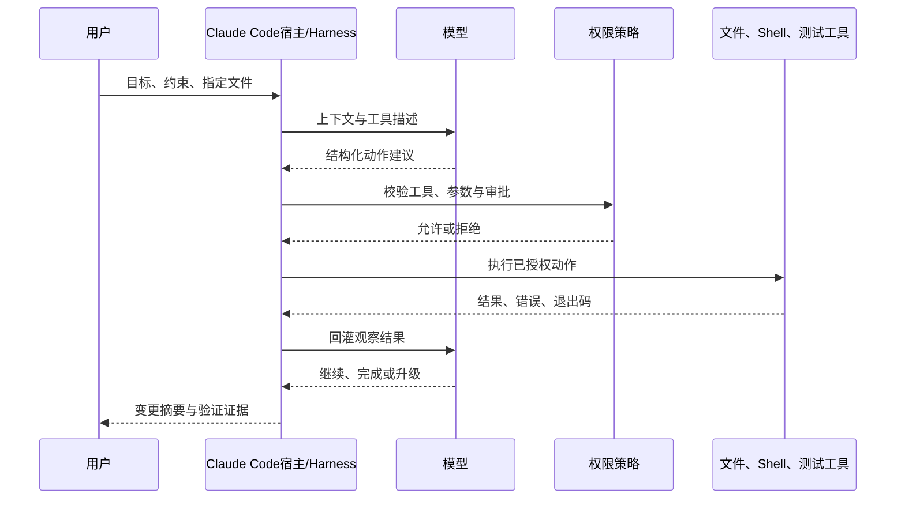
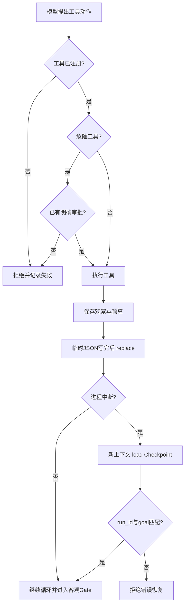

# Claude Code 基础：从会话操作到可恢复 Agent 循环

- 原文：[Claude Code 使用教程：新手入门必学的基础技巧](https://xiaolinnote.com/claudecode/basics/cc_use.html)
- 一句话结论：Claude Code 的价值不只是“模型会写代码”，而是把上下文、受控工具、反馈循环、验证与恢复组织成一套可操作的编程 Agent 工作流。
- 证据/版本边界：产品命令和界面行为按原文页面（2026-09-11 读取）整理，可能随 Claude Code 版本、模型、套餐和配置变化；本仓库没有证明已安装、认证或运行 Claude CLI，本文不声称做过本地产品验证。仓库结论仅来自当前参考实现与测试。

## 1. 先分清四类陈述

同一句“Agent 会执行工具”，可能是在描述产品，也可能是在讲架构。阅读时要分层：

| 层次 | 本文含义 | 证据来源 | 能否直接外推 |
| --- | --- | --- | --- |
| Claude Code 产品行为 | 模式、斜杠命令、快捷键、会话恢复 | 原网页 | 不能，需按实际版本复核 |
| 可迁移原理 | 模型提议动作，宿主授权、执行、观察、验证 | Agent/Harness 通用设计 | 可迁移，但实现细节自定 |
| 当前仓库已实现 | 白名单工具、审批、幂等、预算、Gate、Checkpoint | Python 代码与单测 | 只代表教学参考实现 |
| 当前仓库未实现 | Claude CLI、真实模型、Shell 沙箱、分布式恢复 | 代码中不存在 | 不应凭文档推断已具备 |

概念分层可继续参考 [AI Agent：决策循环、Workflow、工具与协议分层](../xiaolinnote_agent_engineering_analysis/1_ai_agent_concepts_workflows_tools_protocols.md) 和 [Harness Engineering：Agent 运行时的可靠性控制面](../xiaolinnote_agent_engineering_analysis/5_harness_engineering_agent_runtime_reliability.md)。

## 2. Claude Code 的会话与工具循环

按原文，Claude Code 是终端编程 Agent：用户描述目标，它读取项目上下文，提出文件或命令操作，并根据执行结果继续工作。工程上，模型不应直接获得操作系统能力；真正执行动作的是宿主运行时。


可迁移重点不是某个界面，而是 `Observe -> Decide -> Act -> Verify` 闭环。没有权限控制和客观验证，它只是一个能连续调用工具的模型，不是可靠的工程系统。

## 3. 模式、规划与需求澄清

原文把交互概括为 Normal、Auto-accept 和 Plan 三种模式，并称可用 `Shift+Tab` 切换。这里应理解为不同的授权与执行节奏，而不是模型能力发生变化：

- Normal：逐步确认，适合陌生仓库、高风险任务和初次使用。
- Auto-accept：减少人工确认，速度更快，但错误和越权的影响也会放大。
- Plan：先分析和形成方案，再决定是否执行，适合跨文件或需求不清的任务。

Plan 不能替代测试。一个好计划至少写清目标、非目标、允许修改的范围、验收命令和回滚点。需求模糊时，先让 Agent 提问，确认技术栈、边界条件、数据持久化和用户体验，再开始改代码。

## 4. 上下文不是可靠的长期状态

原文介绍了几类上下文操作：用 `@` 指向文件或目录，用 `/context` 查看占用，用 `/compact` 压缩同一任务的历史，用 `/clear` 开始无关任务，并用精简的 `CLAUDE.md` 保存稳定项目约束。

这些是 Claude Code 产品用法，命令是否可用应以当前安装版本为准。可迁移原则则更稳定：

- 只注入本轮需要的文件和规则，减少噪声与上下文成本。
- 稳定规范放版本化文件，临时进度放结构化 Checkpoint，不把聊天记录当唯一事实源。
- 压缩摘要可能遗漏约束；恢复后先核对代码、Git diff 和测试，而不是盲信摘要。
- `CLAUDE.md` 更像启动时加载的项目说明，不等同于数据库式长期记忆。

## 5. 权限控制：`ControlledToolRegistry`

[agent_engineering_reference.py](../xiaolinnote_agent_engineering_analysis/examples/agent_engineering_reference.py) 中的 `ControlledToolRegistry` 是产品权限思想的最小可迁移实现：

1. `register` 建立工具白名单，并拒绝重复名称。
2. `execute` 遇到未知工具返回 `unknown tool`，不会动态执行任意名称。
3. `ToolDefinition(dangerous=True)` 要求工具名出现在 `approved_tools` 中，否则返回 `explicit approval required`。
4. 对 `idempotent=True` 的工具，Registry 按 `call_id` 缓存 `ToolOutcome`；相同 ID 重试直接返回首次结果，避免重复副作用。
5. 工具异常被转换为失败结果，交还循环处理，而不是让异常无边界扩散。

它仍不是完整安全层：没有参数 Schema、进程沙箱、路径/网络隔离、超时、密钥治理和细粒度单次授权。缓存也只按 `call_id` 索引，没有校验重放时参数是否一致，生产实现应绑定调用名与参数摘要。

## 6. 权限拒绝、Checkpoint 与恢复

原文给出 Rewind、`claude --resume` 和 `claude --continue`：前者用于回到较早操作节点，后两者用于恢复历史会话。它还提醒 Rewind 未必能撤销命令产生的全部副作用，因此 Git 仍是重要边界。

仓库没有实现 Claude Code 的对话时间线或 Rewind；它实现的是运行状态恢复，语义不能混用：



`AtomicCheckpointStore.save` 先写同目录 `.tmp` 文件，再用 `Path.replace` 替换目标 JSON，降低半写文件风险；`load` 在文件不存在时返回 `None`。它没有文件锁、`fsync`、Schema 迁移、校验和及代码/工具版本绑定，因此“原子替换”不等于分布式可靠存储。

## 7. 有界执行：`LoopHarness`

`LoopHarness.run` 把 Policy 当 Maker，把 `verifier` 当 Checker。Policy 每轮拿到状态深拷贝，只能返回 `TOOL`、`FINISH` 或 `ESCALATE`；Harness 决定是否执行和何时停止。

- `LoopLimits` 限制迭代、失败、Token、费用、重复动作和观察历史长度。
- 工具动作交给 `ControlledToolRegistry`，结果写入 `observations`，失败会增加计数并形成反馈。
- 完成动作必须通过 `GateResult.passed`；模型说“完成”本身不能把状态设为 `completed`。
- 相同动作指纹连续超过阈值会变为 `blocked`；明确升级会变为 `escalated`。
- 每次工具结果、Gate 失败和停止都会保存 Checkpoint；恢复时校验 `run_id` 与 `goal`。
- `budget_exhausted` 不是终结状态，所以更换为更宽预算的 Harness 后可从原状态续跑。

当前未实现真实模型调用、墙钟超时、并发调度、分布式锁、Shell 沙箱、Git 回滚和外部副作用补偿。它是离线、标准库、单进程同步参考，不是 Claude Code 的复刻。

## 8. 测试证据怎样对应行为

[test_agent_engineering_reference.py](../tests/test_agent_engineering_reference.py) 共有 12 项测试，其中与本主题直接相关的证据如下：

| 测试 | 被证明的行为 | 没有证明什么 |
| --- | --- | --- |
| `test_dangerous_tool_requires_approval_and_call_id_is_idempotent` | 危险工具无审批被拒；同一 Call ID 不重复执行 | 不是参数级授权或跨进程幂等 |
| `test_loop_completes_only_after_independent_gate_passes` | 首次 Gate 失败后继续，第二次通过才完成 | 不代表评价器绝对独立或正确 |
| `test_token_budget_stops_before_unbounded_work` | Token 超预算停止 | 没覆盖墙钟时间与真实账单 |
| `test_repeated_action_detection_blocks_a_stuck_loop` | 第三次相同动作在阈值为 2 时阻断 | 不能发现语义相同但参数不同的循环 |
| `test_checkpoint_can_resume_in_a_fresh_context` | 一轮耗尽后读取观察并在第二轮完成 | 不是 Claude Code 对话恢复 |
| `test_explicit_escalation_stops_without_claiming_completion` | 高风险任务可升级且不伪装完成 | 没有实现真实人工审批队列 |
这就是“证据边界”：测试验证的是输入下的可观察行为，不是对整个产品或生产可靠性的背书。

## 9. 两个可执行参考

下面的 Python 片段只调用当前仓库参考类，不连接模型或 Claude 服务；在仓库根目录运行即可观察一次工具调用、Checkpoint 和客观 Gate：

```python
from pathlib import Path
from tempfile import TemporaryDirectory
from xiaolinnote_agent_engineering_analysis.examples.agent_engineering_reference import (
	AtomicCheckpointStore, ControlledToolRegistry, GateResult,
	LoopAction, LoopHarness, ToolDefinition,
)

tools = ControlledToolRegistry()
tools.register(ToolDefinition("read_value"), lambda: 42)

def policy(state):
	if not state.observations:
		return LoopAction.tool("read_value", {}, call_id="read-1")
	return LoopAction.finish(state.observations[-1]["value"])

with TemporaryDirectory() as directory:
	harness = LoopHarness(tools, checkpoint=AtomicCheckpointStore(Path(directory) / "state.json"))
	result = harness.run(
		run_id="demo-1", goal="return 42", policy=policy,
		verifier=lambda output, _state: GateResult(output == 42, evidence=("value == 42",)),
	)
	assert result.status == "completed"
```
验证参考实现可用下面的 Shell 命令；它不要求也不会启动 Claude CLI：

```bash
cd /Users/zhaoyonggng/work/llm-day1
python -m unittest discover -s tests -p 'test_agent_engineering_reference.py' -v
```

## 10. 常见风险与误区

- **误区：Auto-accept 等于高效率。** 省掉确认只降低交互成本，不降低错误概率；发布、删除、推送和外部写入仍应单独审批。
- **误区：Plan 写得好就能放心执行。** 计划只是待验证假设，代码、测试退出码和运行行为才是完成证据。
- **误区：Rewind 等于完整事务回滚。** 包安装、数据库写入、远端 API 和进程副作用可能留存；应使用 Git、幂等键和补偿动作。
- **误区：Resume 后环境一定一致。** 依赖、分支、工作区和外部资源可能已改变，恢复时必须重新校验。
- **风险：提示注入与越权。** 仓库文本或工具输出都可能携带恶意指令，权限策略不能交给模型自行解释。
- **风险：上下文膨胀与错误摘要。** 优先精确引用、结构化状态和可复现实验，不要靠不断续聊维持正确性。
- **风险：破坏性 Git 命令。** 原文展示的全局丢弃或硬重置命令会删除未提交工作，执行前必须检查 `git status`、`git diff` 并确认恢复路径。

## 11. 一套完整实践流程

1. **建立基线**：确认分支、工作区状态、现有测试和允许修改的文件，保留可恢复的 Git 节点。
2. **澄清目标**：写清目标、非目标、技术约束、风险动作和验收标准；不清楚就先让 Agent 提问。
3. **先读后改**：用精确文件范围提供上下文，要求给出基于现有代码的计划和最小验证方法。
4. **分级授权**：读取可默认允许；写文件需限定路径；Shell、网络、删除、发布和远端写入逐级收紧。
5. **小步执行**：一次只改一个可验证切片，立即运行最窄测试，并记录工具结果与失败原因。
6. **客观验收**：编译、单测、Lint、浏览器行为或数据约束通过后，才接受“完成”。
7. **保存与恢复**：关键节点写 Checkpoint 和 Git 状态；恢复时核对目标、代码版本、环境与未完成副作用。
8. **独立审查**：可用子代理隔离上下文做 Review，但最终仍以真实测试和人工判断为准。

## 12. 面试问答

**Q1：Claude Code 与普通聊天模型的核心差别是什么？**  
A：它有宿主运行时，可读取环境、请求工具并把结果回灌到多轮决策循环；模型仍只是决策组件。

**Q2：Plan 模式解决什么问题？**  
A：提前暴露范围、依赖和假设，降低方向性返工；它不负责证明实现正确。

**Q3：为什么工具权限必须由宿主控制？**  
A：模型输出是非确定性的，且可能受提示注入影响；白名单、参数校验和审批必须是模型外的确定性边界。

**Q4：`ControlledToolRegistry` 怎样实现幂等？**  
A：对幂等工具按 `call_id` 缓存首次 `ToolOutcome`，重试相同 ID 时直接返回缓存，不再次调用函数。

**Q5：`LoopHarness` 为什么不接受模型自报完成？**  
A：`FINISH` 只触发独立 `verifier`，只有 `GateResult.passed=True` 才进入 `completed`。

**Q6：Checkpoint 恢复与 Claude Code Resume 相同吗？**  
A：不同。前者恢复结构化运行状态；后者按原文恢复产品会话。仓库没有实现对话历史选择器。

**Q7：原子替换为什么还不够生产使用？**  
A：它只降低单文件半写风险，还缺锁、刷盘保证、版本绑定、迁移、损坏检测和多进程一致性。

**Q8：自动化程度应怎样选择？**  
A：按可逆性、影响范围和验收强度决定；高风险不可逆动作保持人工审批，低风险且有强 Gate 的任务才逐步放宽。

## 13. 复习清单

- 能画出“模型提议、宿主授权、工具执行、结果回灌、客观 Gate”的循环。
- 能区分产品的 Rewind/Resume、上下文压缩与工程 Checkpoint。
- 能准确说明 `ControlledToolRegistry`、`LoopHarness`、`AtomicCheckpointStore` 的职责和限制。
- 能用六个相关测试说明哪些行为已有证据、哪些仍未覆盖。
- 能给出从基线、规划、授权、执行、验证到恢复和审查的完整流程。
